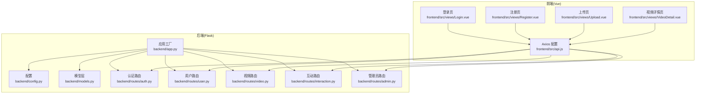
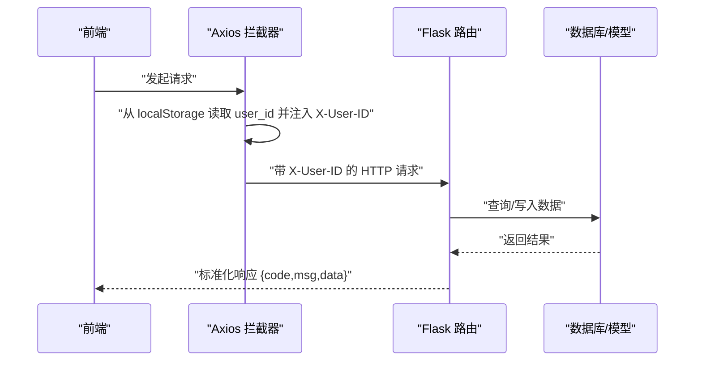
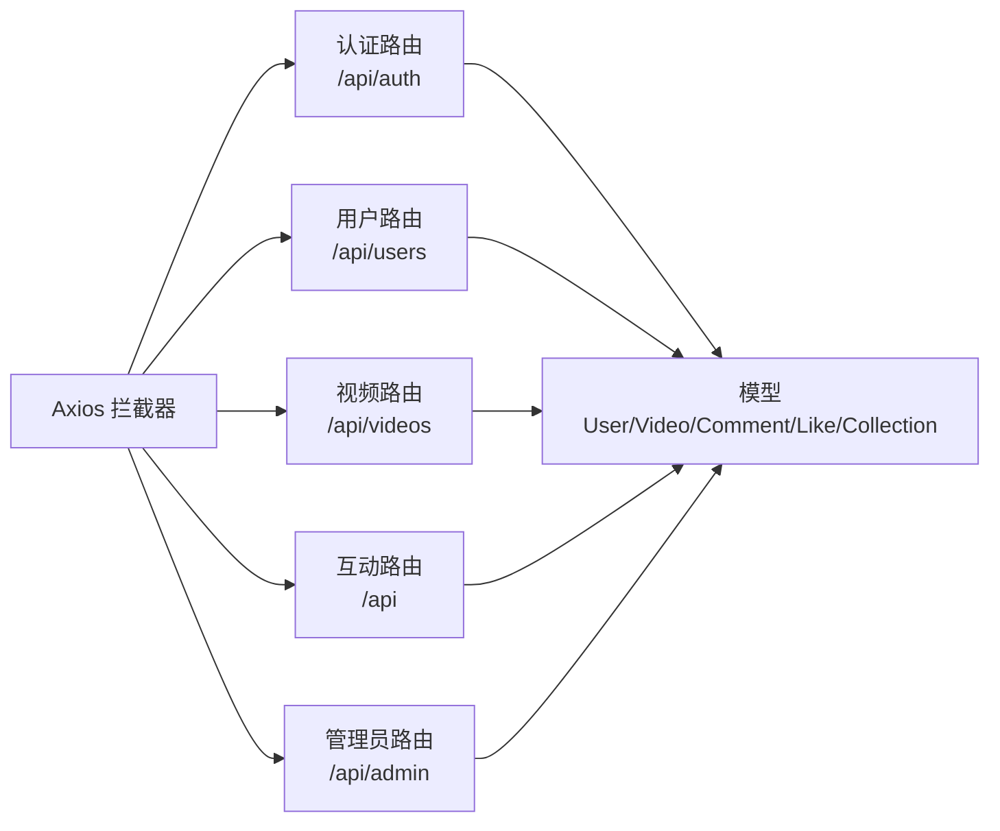

# API文档

<cite>
**本文引用的文件**
- [backend/app.py](file://backend/app.py)
- [backend/config.py](file://backend/config.py)
- [backend/models.py](file://backend/models.py)
- [backend/routes/auth.py](file://backend/routes/auth.py)
- [backend/routes/user.py](file://backend/routes/user.py)
- [backend/routes/video.py](file://backend/routes/video.py)
- [backend/routes/interaction.py](file://backend/routes/interaction.py)
- [backend/routes/admin.py](file://backend/routes/admin.py)
- [frontend/src/api.js](file://frontend/src/api.js)
- [frontend/src/views/Login.vue](file://frontend/src/views/Login.vue)
- [frontend/src/views/Register.vue](file://frontend/src/views/Register.vue)
- [frontend/src/views/Upload.vue](file://frontend/src/views/Upload.vue)
- [frontend/src/views/VideoDetail.vue](file://frontend/src/views/VideoDetail.vue)
</cite>

## 目录
1. [简介](#简介)
2. [项目结构](#项目结构)
3. [核心组件](#核心组件)
4. [架构总览](#架构总览)
5. [详细组件分析](#详细组件分析)
6. [依赖分析](#依赖分析)
7. [性能考虑](#性能考虑)
8. [故障排查指南](#故障排查指南)
9. [结论](#结论)
10. [附录](#附录)

## 简介
本文件为 UniVideo 的完整 RESTful API 文档，覆盖认证、用户管理、视频操作、互动功能与管理员审核五大接口组。文档基于后端 Flask 蓝图路由与前端调用示例，明确每个端点的 HTTP 方法、URL 路径、请求参数、请求体结构、响应格式与状态码含义，并重点说明当前实现的身份认证机制（基于请求头透传用户ID而非 JWT）。同时提供真实请求/响应样例、错误码说明、速率限制策略建议与接口安全性建议。

## 项目结构
后端采用 Flask + SQLAlchemy 架构，通过蓝图组织路由模块，前端使用 Vue 3 + Axios 与后端交互。应用工厂负责初始化数据库、迁移、CORS 与蓝图注册；配置文件集中管理上传目录、文件类型白名单与数据库连接。

图表来源
- [backend/app.py](file://backend/app.py#L1-L101)
- [backend/config.py](file://backend/config.py#L1-L66)
- [backend/models.py](file://backend/models.py#L1-L343)
- [backend/routes/auth.py](file://backend/routes/auth.py#L1-L184)
- [backend/routes/user.py](file://backend/routes/user.py#L1-L271)
- [backend/routes/video.py](file://backend/routes/video.py#L1-L282)
- [backend/routes/interaction.py](file://backend/routes/interaction.py#L1-L408)
- [backend/routes/admin.py](file://backend/routes/admin.py#L1-L245)
- [frontend/src/api.js](file://frontend/src/api.js#L1-L41)
- [frontend/src/views/Login.vue](file://frontend/src/views/Login.vue#L1-L191)
- [frontend/src/views/Register.vue](file://frontend/src/views/Register.vue#L1-L211)
- [frontend/src/views/Upload.vue](file://frontend/src/views/Upload.vue#L1-L575)
- [frontend/src/views/VideoDetail.vue](file://frontend/src/views/VideoDetail.vue#L1-L800)

章节来源
- [backend/app.py](file://backend/app.py#L1-L101)
- [backend/config.py](file://backend/config.py#L1-L66)

## 核心组件
- 应用工厂与蓝图注册：在应用工厂中初始化数据库、迁移、CORS，并注册认证、视频、互动、用户、管理员五个蓝图，分别挂载到不同 URL 前缀。
- 配置与静态资源：统一配置上传目录、最大文件大小、允许的视频/图片扩展名，以及数据库连接信息。
- 模型层：定义用户、分类、视频、评论、点赞、收藏等模型，包含外键关系、联合唯一约束与辅助统计方法（点赞/收藏计数）。
- 前端 Axios：统一设置基础 URL、超时、Content-Type，并在请求拦截器中从本地存储读取用户ID写入 X-User-ID 请求头，实现“轻量身份透传”。

章节来源
- [backend/app.py](file://backend/app.py#L1-L101)
- [backend/config.py](file://backend/config.py#L1-L66)
- [backend/models.py](file://backend/models.py#L1-L343)
- [frontend/src/api.js](file://frontend/src/api.js#L1-L41)

## 架构总览
后端通过蓝图划分职责，前端通过 Axios 统一发起请求并携带用户标识。视频上传采用 multipart/form-data，评论/点赞/收藏采用 JSON；管理员审核与删除涉及物理文件清理与数据库联动。

图表来源
- [frontend/src/api.js](file://frontend/src/api.js#L1-L41)
- [backend/routes/auth.py](file://backend/routes/auth.py#L147-L184)
- [backend/routes/user.py](file://backend/routes/user.py#L30-L61)
- [backend/routes/interaction.py](file://backend/routes/interaction.py#L12-L112)
- [backend/routes/video.py](file://backend/routes/video.py#L37-L171)

## 详细组件分析

### 认证接口组
- 路由前缀：/api/auth
- 说明：当前实现采用“轻量身份透传”，即登录成功后前端将用户ID存入本地存储，后续请求由拦截器自动附加 X-User-ID 请求头；后端路由通过请求头读取用户ID进行业务校验。

接口清单
- POST /api/auth/register
  - 功能：用户注册
  - 请求体(JSON)：{username, nickname, password}
  - 成功响应：{code: 201, msg, data: {id, username, nickname}}
  - 失败响应：{code: 400/409/500, msg}
  - 章节来源
    - [backend/routes/auth.py](file://backend/routes/auth.py#L12-L79)

- POST /api/auth/login
  - 功能：用户登录
  - 请求体(JSON)：{username, password}
  - 成功响应：{code: 200, msg, data: {id, username, nickname, role, avatar}}
  - 失败响应：{code: 400/401/500, msg}
  - 章节来源
    - [backend/routes/auth.py](file://backend/routes/auth.py#L89-L145)

- GET /api/auth/me
  - 功能：获取当前登录用户信息（基于请求头中的 X-User-ID）
  - 请求头：X-User-ID
  - 成功响应：{code: 200, msg, data: 用户信息字典}
  - 失败响应：{code: 401/404/500, msg}
  - 章节来源
    - [backend/routes/auth.py](file://backend/routes/auth.py#L147-L184)

- GET /api/users/me
  - 功能：获取当前登录用户详细信息（基于查询参数 user_id）
  - 查询参数：user_id
  - 成功响应：{code: 200, msg, data: 用户信息字典}
  - 失败响应：{code: 400/404/500, msg}
  - 章节来源
    - [backend/routes/user.py](file://backend/routes/user.py#L30-L61)

- PUT /api/users/me
  - 功能：修改当前用户资料（昵称、密码、头像上传）
  - 表单字段：user_id（必填），nickname（可选），password（可选），avatar（可选，文件）
  - 成功响应：{code: 200, msg, data: 更新后的用户信息}
  - 失败响应：{code: 400/404/500, msg}
  - 章节来源
    - [backend/routes/user.py](file://backend/routes/user.py#L69-L159)

- 前端调用示例
  - 登录页调用 /api/auth/login，成功后将用户ID写入 localStorage，后续请求自动带上 X-User-ID
  - 注册页调用 /api/auth/register
  - 章节来源
    - [frontend/src/views/Login.vue](file://frontend/src/views/Login.vue#L1-L191)
    - [frontend/src/views/Register.vue](file://frontend/src/views/Register.vue#L1-L211)
    - [frontend/src/api.js](file://frontend/src/api.js#L1-L41)

章节来源
- [backend/routes/auth.py](file://backend/routes/auth.py#L1-L184)
- [backend/routes/user.py](file://backend/routes/user.py#L1-L159)
- [frontend/src/views/Login.vue](file://frontend/src/views/Login.vue#L1-L191)
- [frontend/src/views/Register.vue](file://frontend/src/views/Register.vue#L1-L211)
- [frontend/src/api.js](file://frontend/src/api.js#L1-L41)

### 用户管理接口组
- 路由前缀：/api/users
- 说明：提供用户资料修改、个人视频列表、个人收藏列表等能力。

接口清单
- GET /api/users/me
  - 查询参数：user_id
  - 成功响应：{code: 200, msg, data: 用户信息字典}
  - 失败响应：{code: 400/404/500, msg}
  - 章节来源
    - [backend/routes/user.py](file://backend/routes/user.py#L30-L61)

- PUT /api/users/me
  - 表单字段：user_id（必填），nickname（可选），password（可选），avatar（可选，文件）
  - 成功响应：{code: 200, msg, data: 更新后的用户信息}
  - 失败响应：{code: 400/404/500, msg}
  - 章节来源
    - [backend/routes/user.py](file://backend/routes/user.py#L69-L159)

- GET /api/users/me/videos
  - 查询参数：user_id
  - 成功响应：{code: 200, msg, data: {total, list:[视频列表]}}（列表项包含封面与视频 URL）
  - 失败响应：{code: 400/404/500, msg}
  - 章节来源
    - [backend/routes/user.py](file://backend/routes/user.py#L162-L209)

- GET /api/users/me/collections
  - 查询参数：user_id
  - 成功响应：{code: 200, msg, data: {total, list:[收藏视频列表]}}（仅返回已发布视频）
  - 失败响应：{code: 400/404/500, msg}
  - 章节来源
    - [backend/routes/user.py](file://backend/routes/user.py#L217-L271)

- 前端调用示例
  - 上传页在提交前会先获取分类列表（/api/videos/categories），再上传视频（/api/videos/upload）
  - 视频详情页在进入时会获取点赞/收藏状态与评论列表
  - 章节来源
    - [frontend/src/views/Upload.vue](file://frontend/src/views/Upload.vue#L1-L575)
    - [frontend/src/views/VideoDetail.vue](file://frontend/src/views/VideoDetail.vue#L1-L800)

章节来源
- [backend/routes/user.py](file://backend/routes/user.py#L1-L271)
- [frontend/src/views/Upload.vue](file://frontend/src/views/Upload.vue#L1-L575)
- [frontend/src/views/VideoDetail.vue](file://frontend/src/views/VideoDetail.vue#L1-L800)

### 视频操作接口组
- 路由前缀：/api/videos
- 说明：提供分类查询、视频上传、视频列表与详情获取；上传时根据用户角色决定状态（管理员直接发布，普通用户待审核）。

接口清单
- GET /api/videos/categories
  - 功能：获取所有视频分类
  - 成功响应：{code: 200, msg, data: [{id,name},...]}
  - 失败响应：{code: 500, msg}
  - 章节来源
    - [backend/routes/video.py](file://backend/routes/video.py#L15-L35)

- POST /api/videos/upload
  - 功能：视频上传（multipart/form-data）
  - 表单字段：user_id（必填）、title（必填）、description（可选）、category_id（必填）、video_file（必填）、cover_file（必填）
  - 成功响应：{code: 201, msg, data: {id,title,status,is_admin}}
  - 失败响应：{code: 400/404/500, msg}
  - 章节来源
    - [backend/routes/video.py](file://backend/routes/video.py#L37-L171)

- GET /api/videos/list
  - 功能：获取已发布视频列表（仅已发布）
  - 查询参数：keyword（可选，模糊搜索标题）、category_id（可选，'all'表示不过滤）
  - 成功响应：{code: 200, msg, data: [视频列表]}（列表项包含作者、分类、封面与视频 URL）
  - 失败响应：{code: 500, msg}
  - 章节来源
    - [backend/routes/video.py](file://backend/routes/video.py#L173-L226)

- GET /api/videos/<int:id>
  - 功能：获取视频详情（每次访问 view_count+1）
  - 成功响应：{code: 200, msg, data: 视频详情（含作者、分类、封面与视频 URL）}
  - 失败响应：{code: 404/500, msg}
  - 章节来源
    - [backend/routes/video.py](file://backend/routes/video.py#L228-L282)

- 前端调用示例
  - 上传页调用 /api/videos/categories 获取分类，再调用 /api/videos/upload 上传
  - 视频详情页调用 /api/videos/<id> 获取详情
  - 章节来源
    - [frontend/src/views/Upload.vue](file://frontend/src/views/Upload.vue#L1-L575)
    - [frontend/src/views/VideoDetail.vue](file://frontend/src/views/VideoDetail.vue#L1-L800)

章节来源
- [backend/routes/video.py](file://backend/routes/video.py#L1-L282)
- [frontend/src/views/Upload.vue](file://frontend/src/views/Upload.vue#L1-L575)
- [frontend/src/views/VideoDetail.vue](file://frontend/src/views/VideoDetail.vue#L1-L800)

### 互动功能接口组
- 路由前缀：/api
- 说明：提供评论、点赞、收藏、状态查询等互动能力；评论支持父子关系与树形展示。

接口清单
- POST /api/videos/<int:video_id>/comments
  - 功能：发表评论（支持回复）
  - 请求体(JSON)：{user_id（必填）、content（必填）、parent_id（可选）}
  - 成功响应：{code: 201, msg, data: 评论详情（含作者信息）}
  - 失败响应：{code: 400/404/500, msg}
  - 章节来源
    - [backend/routes/interaction.py](file://backend/routes/interaction.py#L12-L112)

- GET /api/videos/<int:video_id>/comments
  - 功能：获取视频评论列表（按创建时间升序）
  - 成功响应：{code: 200, msg, data: {total, list:[评论列表]}}
  - 失败响应：{code: 404/500, msg}
  - 章节来源
    - [backend/routes/interaction.py](file://backend/routes/interaction.py#L287-L327)

- POST /api/videos/<int:video_id>/like
  - 功能：点赞/取消点赞
  - 请求体(JSON)：{user_id（必填）}
  - 成功响应：{code: 200, msg, data: {liked, likes_count}}
  - 失败响应：{code: 400/404/500, msg}
  - 章节来源
    - [backend/routes/interaction.py](file://backend/routes/interaction.py#L329-L408)

- GET /api/videos/<int:video_id>/like/status
  - 功能：获取当前用户对视频的点赞状态
  - 查询参数：user_id
  - 成功响应：{code: 200, msg, data: {liked}}
  - 失败响应：{code: 400/404/500, msg}
  - 章节来源
    - [backend/routes/interaction.py](file://backend/routes/interaction.py#L241-L279)

- POST /api/videos/<int:video_id>/collect
  - 功能：收藏/取消收藏
  - 请求体(JSON)：{user_id（必填）}
  - 成功响应：{code: 200, msg, data: {collected, collections_count}}
  - 失败响应：{code: 400/404/500, msg}
  - 章节来源
    - [backend/routes/interaction.py](file://backend/routes/interaction.py#L114-L193)

- GET /api/videos/<int:video_id>/collect/status
  - 功能：获取当前用户对视频的收藏状态
  - 查询参数：user_id
  - 成功响应：{code: 200, msg, data: {collected}}
  - 失败响应：{code: 400/404/500, msg}
  - 章节来源
    - [backend/routes/interaction.py](file://backend/routes/interaction.py#L195-L239)

- 前端调用示例
  - 视频详情页在进入时调用点赞/收藏状态查询与评论列表获取，并在用户操作时调用点赞/收藏/评论接口
  - 章节来源
    - [frontend/src/views/VideoDetail.vue](file://frontend/src/views/VideoDetail.vue#L1-L800)

章节来源
- [backend/routes/interaction.py](file://backend/routes/interaction.py#L1-L408)
- [frontend/src/views/VideoDetail.vue](file://frontend/src/views/VideoDetail.vue#L1-L800)

### 管理员审核接口组
- 路由前缀：/api/admin
- 说明：提供视频管理列表、待审核列表、审核与删除功能；删除时尝试清理物理文件并删除数据库记录。

接口清单
- GET /api/admin/manage/list
  - 功能：获取视频管理列表（支持按标题模糊搜索与状态筛选）
  - 查询参数：keyword（可选）、status（可选，0=待审核,1=已发布,2=已驳回）
  - 成功响应：{code: 200, msg, data: {total, list:[视频列表]}}
  - 失败响应：{code: 500, msg}
  - 章节来源
    - [backend/routes/admin.py](file://backend/routes/admin.py#L13-L58)

- GET /api/admin/audit/list
  - 功能：获取待审核视频列表（兼容旧接口）
  - 成功响应：{code: 200, msg, data: {total, list:[视频列表]}}
  - 失败响应：{code: 500, msg}
  - 章节来源
    - [backend/routes/admin.py](file://backend/routes/admin.py#L60-L93)

- POST /api/admin/audit/<int:video_id>
  - 功能：视频审核（approve/reject）
  - 请求体(JSON)：{action（必填："approve"|"reject"）}
  - 成功响应：{code: 200, msg, data: {video_id,title,new_status}}
  - 失败响应：{code: 400/404/500, msg}
  - 章节来源
    - [backend/routes/admin.py](file://backend/routes/admin.py#L95-L173)

- DELETE /api/admin/manage/video/<int:video_id>
  - 功能：删除视频（尝试删除物理文件与数据库记录）
  - 成功响应：{code: 200, msg, data: {video_id,title,deleted_files}}
  - 失败响应：{code: 404/500, msg}
  - 章节来源
    - [backend/routes/admin.py](file://backend/routes/admin.py#L175-L245)

章节来源
- [backend/routes/admin.py](file://backend/routes/admin.py#L1-L245)

## 依赖分析
- 蓝图注册顺序与前缀：认证(/api/auth)、视频(/api/videos)、管理员(/api/admin)、互动(/api)、用户(/api/users)。
- 模型间关系：用户与视频（一对多）、视频与评论/点赞/收藏（一对多）、评论自关联（父子关系）。
- 前端拦截器：统一注入 X-User-ID 请求头，简化后端身份识别。

图表来源
- [backend/app.py](file://backend/app.py#L39-L58)
- [backend/models.py](file://backend/models.py#L1-L343)
- [frontend/src/api.js](file://frontend/src/api.js#L1-L41)

章节来源
- [backend/app.py](file://backend/app.py#L39-L58)
- [backend/models.py](file://backend/models.py#L1-L343)
- [frontend/src/api.js](file://frontend/src/api.js#L1-L41)

## 性能考虑
- 文件上传：后端限制最大内容长度与允许的视频/图片扩展名，避免过大文件与非法类型占用带宽与磁盘空间。
- 数据库查询：视频列表与评论列表使用过滤与排序，建议在视频表与评论表上建立必要索引（如视频状态、创建时间、评论视频ID与根ID组合索引）。
- 前端缓存：视频详情页可在首次加载后缓存部分数据，减少重复请求。
- 传输优化：静态资源（视频/图片）建议由反向代理或 CDN 提供，后端仅做简单转发。

章节来源
- [backend/config.py](file://backend/config.py#L1-L66)
- [backend/models.py](file://backend/models.py#L1-L343)

## 故障排查指南
- 通用错误码
  - 400 缺少参数或参数非法
  - 401 未登录或登录失效
  - 404 资源不存在（用户/视频/评论）
  - 409 用户名已存在（注册）
  - 500 服务器内部错误
- 常见问题定位
  - 登录后无法访问受保护接口：确认前端已将 user_id 写入 localStorage，拦截器是否注入 X-User-ID。
  - 上传失败：检查文件类型、大小限制与上传目录权限。
  - 评论/点赞/收藏异常：确认 user_id 与 video_id 是否有效，后端是否抛出异常。
- 日志与监控
  - 健康检查接口：/api/health，用于检测服务与数据库连通性。
  - 章节来源
    - [backend/app.py](file://backend/app.py#L73-L92)

章节来源
- [backend/app.py](file://backend/app.py#L73-L92)

## 结论
本项目采用轻量身份透传机制（X-User-ID）配合蓝图分层设计，实现了从认证到视频上传、互动与管理员审核的完整闭环。建议后续引入 JWT 令牌与更严格的权限控制，完善速率限制与安全防护策略，以提升系统的安全性与可维护性。

## 附录

### 请求/响应样例（基于实际调用）
- 登录
  - 请求：POST /api/auth/login
  - 请求体(JSON)：{"username":"...","password":"..."}
  - 成功响应(JSON)：{"code":200,"msg":"...","data":{"id":...,"username":"...","nickname":"...","role":"...","avatar":"..."}}
  - 章节来源
    - [backend/routes/auth.py](file://backend/routes/auth.py#L89-L145)
    - [frontend/src/views/Login.vue](file://frontend/src/views/Login.vue#L1-L191)

- 注册
  - 请求：POST /api/auth/register
  - 请求体(JSON)：{"username":"...","nickname":"...","password":"..."}
  - 成功响应(JSON)：{"code":201,"msg":"...","data":{"id":...,"username":"...","nickname":"..."}}
  - 章节来源
    - [backend/routes/auth.py](file://backend/routes/auth.py#L12-L79)
    - [frontend/src/views/Register.vue](file://frontend/src/views/Register.vue#L1-L211)

- 上传视频
  - 请求：POST /api/videos/upload
  - 请求体(FormData)：user_id, title, description, category_id, video_file, cover_file
  - 成功响应(JSON)：{"code":201,"msg":"...","data":{"id":...,"title":"...","status":...,"is_admin":true/false}}
  - 章节来源
    - [backend/routes/video.py](file://backend/routes/video.py#L37-L171)
    - [frontend/src/views/Upload.vue](file://frontend/src/views/Upload.vue#L1-L575)

- 获取视频详情
  - 请求：GET /api/videos/<id>
  - 成功响应(JSON)：{"code":200,"msg":"...","data":{...}}
  - 章节来源
    - [backend/routes/video.py](file://backend/routes/video.py#L228-L282)
    - [frontend/src/views/VideoDetail.vue](file://frontend/src/views/VideoDetail.vue#L1-L800)

- 评论
  - 请求：POST /api/videos/<video_id>/comments
  - 请求体(JSON)：{"user_id":...,"content":"...","parent_id":...}
  - 成功响应(JSON)：{"code":201,"msg":"...","data":{...}}
  - 章节来源
    - [backend/routes/interaction.py](file://backend/routes/interaction.py#L12-L112)
    - [frontend/src/views/VideoDetail.vue](file://frontend/src/views/VideoDetail.vue#L1-L800)

- 点赞/收藏
  - 请求：POST /api/videos/<video_id>/like 或 /api/videos/<video_id>/collect
  - 请求体(JSON)：{"user_id":...}
  - 成功响应(JSON)：{"code":200,"msg":"...","data":{"liked"| "collected":true/false,"likes_count"| "collections_count":...}}
  - 章节来源
    - [backend/routes/interaction.py](file://backend/routes/interaction.py#L241-L408)
    - [frontend/src/views/VideoDetail.vue](file://frontend/src/views/VideoDetail.vue#L1-L800)

- 管理员审核
  - 请求：POST /api/admin/audit/<video_id>
  - 请求体(JSON)：{"action":"approve"|"reject"}
  - 成功响应(JSON)：{"code":200,"msg":"...","data":{"video_id":...,"title":"...","new_status":...}}
  - 章节来源
    - [backend/routes/admin.py](file://backend/routes/admin.py#L95-L173)

### 安全性与速率限制建议
- 身份认证
  - 当前实现：X-User-ID 请求头透传用户ID。建议引入 JWT 令牌，后端校验签名与有效期，前端持久化 token 并在拦截器中自动附加 Authorization。
- 速率限制
  - 对登录、注册、上传等高风险接口实施限流（如每IP每分钟次数限制），防止暴力破解与滥用。
- 输入校验
  - 对所有接口参数进行严格校验（长度、类型、范围），并对富文本内容进行二次过滤。
- 文件安全
  - 上传文件仅允许白名单扩展名，限制大小，存储于独立目录并设置访问权限；删除视频时确保物理文件清理与数据库一致性。
- 日志审计
  - 记录关键操作（登录、上传、审核、删除）与异常事件，便于追踪与溯源。

[本节为通用指导，无需列出具体文件来源]