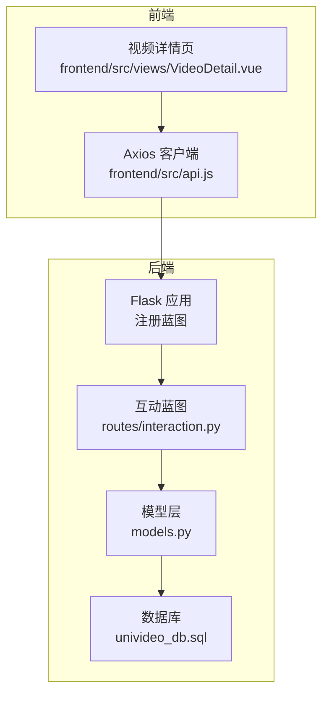
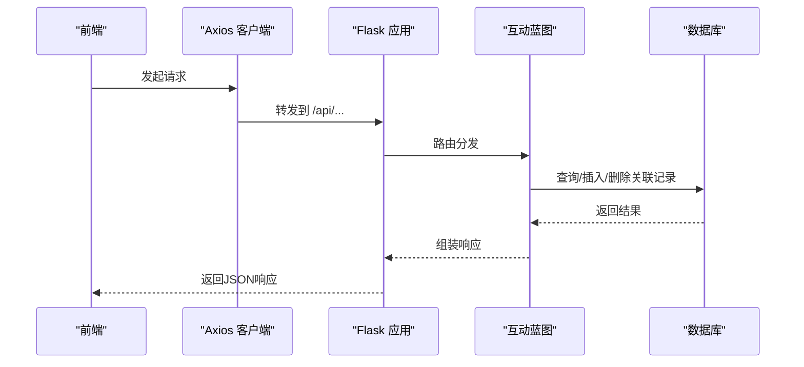
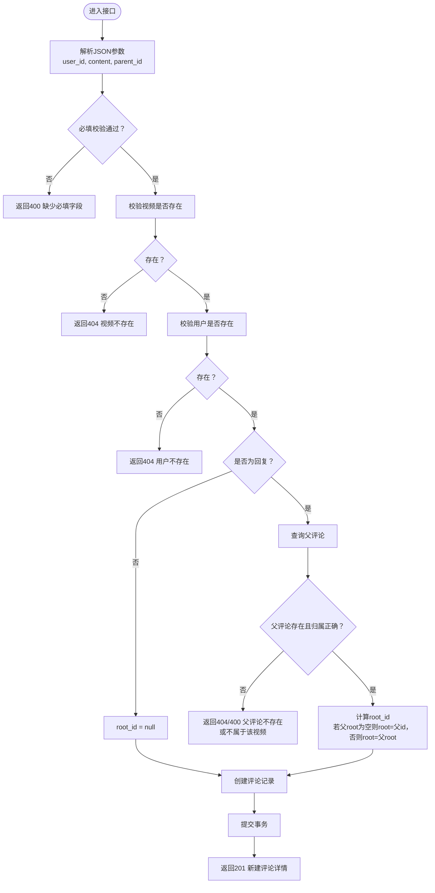
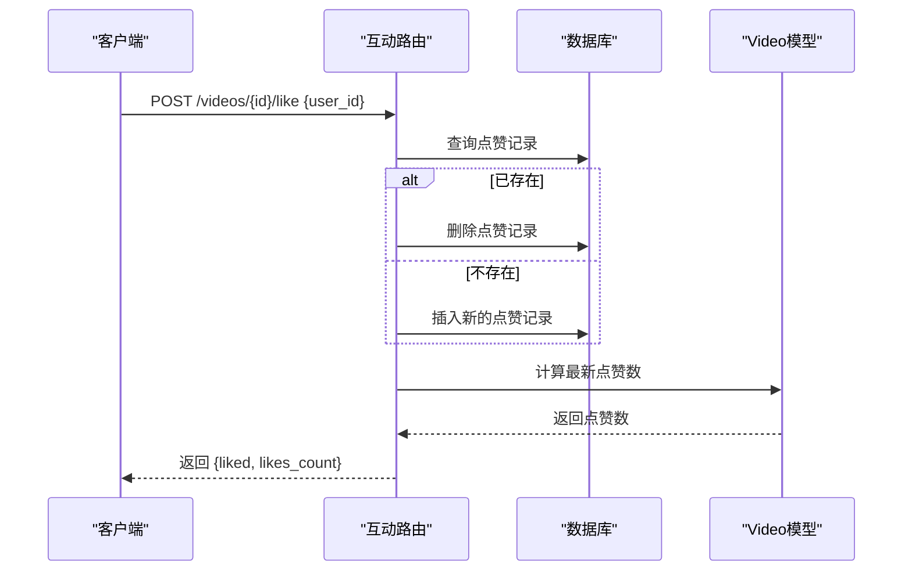
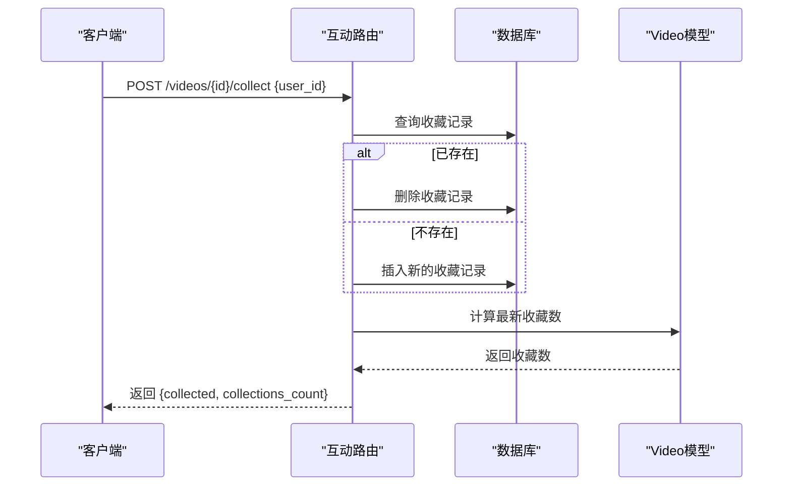
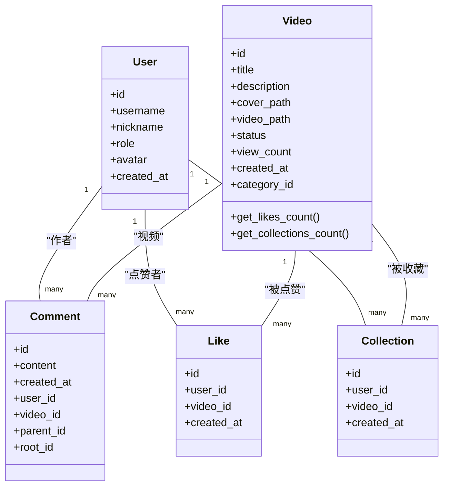

# 互动功能接口

<cite>
**本文引用的文件**
- [backend/app.py](file://backend/app.py)
- [backend/routes/interaction.py](file://backend/routes/interaction.py)
- [backend/models.py](file://backend/models.py)
- [univideo_db.sql](file://univideo_db.sql)
- [frontend/src/api.js](file://frontend/src/api.js)
- [frontend/src/views/VideoDetail.vue](file://frontend/src/views/VideoDetail.vue)
</cite>

## 目录
1. [简介](#简介)
2. [项目结构](#项目结构)
3. [核心组件](#核心组件)
4. [架构总览](#架构总览)
5. [详细组件分析](#详细组件分析)
6. [依赖分析](#依赖分析)
7. [性能考虑](#性能考虑)
8. [故障排查指南](#故障排查指南)
9. [结论](#结论)

## 简介
本文件面向UniVideo的用户互动功能，聚焦评论、点赞与收藏三大能力，系统化梳理以下接口的语义、行为与数据流：
- POST /api/interaction/videos/<id>/comments：发表一级评论与回复评论，并基于parent_id自动计算root_id构建评论树
- POST /api/interaction/videos/<id>/like：点赞/取消点赞“开关”逻辑，返回当前状态与最新点赞数
- POST /api/interaction/videos/<id>/collect：收藏/取消收藏“开关”逻辑，返回当前状态与最新收藏数
- GET /api/interaction/videos/<id>/comments：按时间升序返回完整评论列表
- GET /api/interaction/videos/<id>/like/status：按user_id查询点赞状态
- GET /api/interaction/videos/<id>/collect/status：按user_id查询收藏状态

同时，结合后端models.py中的关联表（Like、Collection、Comment）与univideo_db.sql的表结构，说明这些接口如何通过关联表实现社交功能。

## 项目结构
后端采用Flask + SQLAlchemy架构，互动功能由独立蓝图提供REST接口；前端通过Axios统一访问后端API。

图表来源
- [backend/app.py](file://backend/app.py#L40-L58)
- [backend/routes/interaction.py](file://backend/routes/interaction.py#L1-L12)
- [backend/models.py](file://backend/models.py#L14-L343)
- [univideo_db.sql](file://univideo_db.sql#L1-L76)
- [frontend/src/api.js](file://frontend/src/api.js#L1-L41)
- [frontend/src/views/VideoDetail.vue](file://frontend/src/views/VideoDetail.vue#L146-L204)

章节来源
- [backend/app.py](file://backend/app.py#L40-L58)
- [frontend/src/api.js](file://frontend/src/api.js#L1-L41)

## 核心组件
- 互动蓝图：在应用启动时注册，提供评论、点赞、收藏相关接口
- 模型层：
  - Comment：支持多级评论（parent_id、root_id），并维护作者与视频的关系
  - Like：记录用户对视频的点赞关系，联合唯一约束防止重复点赞
  - Collection：记录用户对视频的收藏关系，联合唯一约束防止重复收藏
- 数据库：comments、likes、collections三张关联表支撑互动功能

章节来源
- [backend/routes/interaction.py](file://backend/routes/interaction.py#L1-L12)
- [backend/models.py](file://backend/models.py#L200-L343)
- [univideo_db.sql](file://univideo_db.sql#L40-L76)

## 架构总览
互动接口的典型调用链如下：

图表来源
- [frontend/src/api.js](file://frontend/src/api.js#L1-L41)
- [backend/app.py](file://backend/app.py#L40-L58)
- [backend/routes/interaction.py](file://backend/routes/interaction.py#L12-L408)
- [backend/models.py](file://backend/models.py#L200-L343)

## 详细组件分析

### 评论接口：POST /api/interaction/videos/<id>/comments
- 功能概述
  - 发表一级评论：不传parent_id，root_id为空
  - 发表回复评论：传parent_id，系统根据parent_id自动计算root_id
    - 若父评论为一级评论（root_id为空），则root_id = parent_id
    - 若父评论为回复（root_id非空），则root_id = parent_comment.root_id
- 输入参数
  - JSON：{user_id, content, parent_id(可选)}
- 校验逻辑
  - 必填校验：缺少user_id或content返回400
  - 内容非空校验：content为空返回400
  - 视频存在性校验：视频不存在返回404
  - 用户存在性校验：用户不存在返回404
  - 父评论存在性与归属校验：父评论不存在或不属于该视频返回404/400
- 数据持久化
  - 插入Comment记录，包含user_id、video_id、content、parent_id、root_id
- 成功响应
  - 返回新建评论的完整信息（含作者信息）

图表来源
- [backend/routes/interaction.py](file://backend/routes/interaction.py#L12-L112)

章节来源
- [backend/routes/interaction.py](file://backend/routes/interaction.py#L12-L112)
- [backend/models.py](file://backend/models.py#L200-L271)
- [univideo_db.sql](file://univideo_db.sql#L40-L55)

### 点赞接口：POST /api/interaction/videos/<id>/like
- 功能概述
  - “开关”逻辑：已点赞则取消，未点赞则新增
- 输入参数
  - JSON：{user_id}
- 校验逻辑
  - 必填校验：缺少user_id返回400
  - 视频存在性校验：视频不存在返回404
  - 用户存在性校验：用户不存在返回404
- 业务逻辑
  - 查询是否存在该用户对视频的点赞记录
  - 存在则删除，不存在则新增
- 成功响应
  - data字段包含：liked（布尔）、likes_count（整数）

图表来源
- [backend/routes/interaction.py](file://backend/routes/interaction.py#L329-L408)
- [backend/models.py](file://backend/models.py#L143-L165)

章节来源
- [backend/routes/interaction.py](file://backend/routes/interaction.py#L329-L408)
- [backend/models.py](file://backend/models.py#L143-L165)

### 收藏接口：POST /api/interaction/videos/<id>/collect
- 功能概述
  - “开关”逻辑：已收藏则取消，未收藏则新增
- 输入参数
  - JSON：{user_id}
- 校验逻辑
  - 必填校验：缺少user_id返回400
  - 视频存在性校验：视频不存在返回404
  - 用户存在性校验：用户不存在返回404
- 业务逻辑
  - 查询是否存在该用户对视频的收藏记录
  - 存在则删除，不存在则新增
- 成功响应
  - data字段包含：collected（布尔）、collections_count（整数）

图表来源
- [backend/routes/interaction.py](file://backend/routes/interaction.py#L114-L193)
- [backend/models.py](file://backend/models.py#L143-L165)

章节来源
- [backend/routes/interaction.py](file://backend/routes/interaction.py#L114-L193)
- [backend/models.py](file://backend/models.py#L143-L165)

### 评论列表接口：GET /api/interaction/videos/<id>/comments
- 功能概述
  - 返回指定视频下的全部评论，按创建时间升序排列
- 成功响应
  - data字段包含：total（整数）、list（评论数组，每条评论包含作者信息）

章节来源
- [backend/routes/interaction.py](file://backend/routes/interaction.py#L287-L327)
- [backend/models.py](file://backend/models.py#L200-L271)

### 状态查询接口
- GET /api/interaction/videos/<id>/like/status
  - 查询参数：user_id
  - 返回：liked（布尔）
- GET /api/interaction/videos/<id>/collect/status
  - 查询参数：user_id
  - 返回：collected（布尔）

章节来源
- [backend/routes/interaction.py](file://backend/routes/interaction.py#L195-L239)
- [backend/routes/interaction.py](file://backend/routes/interaction.py#L241-L285)

## 依赖分析
- 蓝图注册
  - 互动蓝图在应用工厂中注册，URL前缀为/api
- 模型依赖
  - Comment依赖User、Video；Like、Collection分别依赖User、Video
  - Video提供likes_count、collections_count的计算方法
- 数据库约束
  - likes、collections表均使用联合唯一约束，避免重复点赞/收藏
  - comments表通过parent_id、root_id实现多级评论树，配合idx_video_root索引提升查询效率

图表来源
- [backend/models.py](file://backend/models.py#L14-L343)

章节来源
- [backend/app.py](file://backend/app.py#L40-L58)
- [backend/models.py](file://backend/models.py#L14-L343)
- [univideo_db.sql](file://univideo_db.sql#L40-L76)

## 性能考虑
- 查询优化
  - comments表的idx_video_root索引用于加速按视频+楼层（root_id）的查询
- 计数优化
  - Video模型通过relationship.count()统计likes、collections数量，避免额外JOIN
- 并发控制
  - likes、collections表的联合唯一约束在数据库层面保证幂等性，减少应用层重复判断成本

章节来源
- [univideo_db.sql](file://univideo_db.sql#L40-L55)
- [backend/models.py](file://backend/models.py#L143-L165)

## 故障排查指南
- 常见错误码
  - 400：缺少必填字段、评论内容为空、缺少user_id
  - 404：视频不存在、用户不存在、父评论不存在或不属于该视频
  - 500：服务器内部错误（通常由数据库异常触发）
- 建议排查步骤
  - 确认请求体JSON格式正确，包含user_id与必要字段
  - 确认video_id对应的视频存在且状态有效
  - 确认user_id对应的用户存在
  - 对于回复场景，确认parent_id存在且属于同一视频
  - 查看后端日志定位异常堆栈

章节来源
- [backend/routes/interaction.py](file://backend/routes/interaction.py#L27-L112)
- [backend/routes/interaction.py](file://backend/routes/interaction.py#L114-L193)
- [backend/routes/interaction.py](file://backend/routes/interaction.py#L195-L285)
- [backend/routes/interaction.py](file://backend/routes/interaction.py#L287-L408)

## 结论
- 评论系统通过parent_id与root_id构建灵活的多级评论树，支持高效聚合与展示
- 点赞与收藏采用“开关”逻辑，简化前端交互，返回当前状态与最新计数，便于UI即时刷新
- 模型与数据库约束共同保障数据一致性与性能，适合中小规模并发场景
- 前端通过Axios统一访问后端API，VideoDetail页面演示了状态查询与交互更新的典型流程