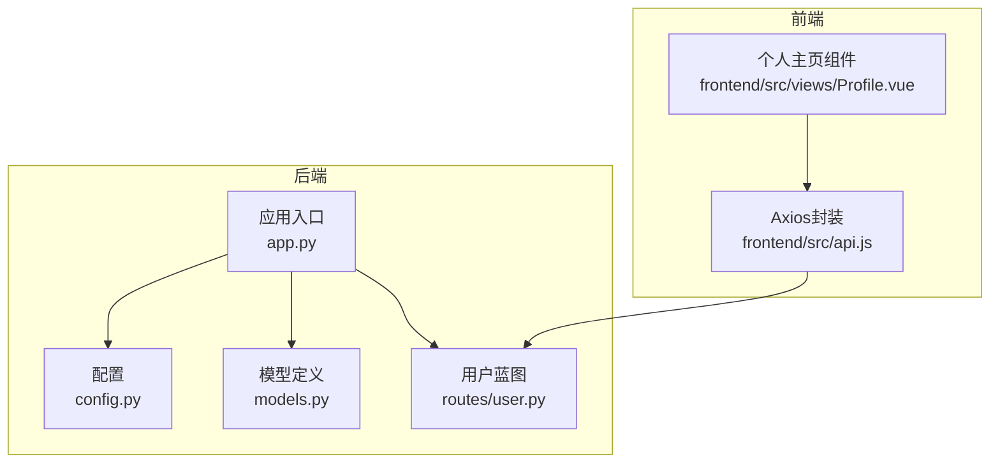
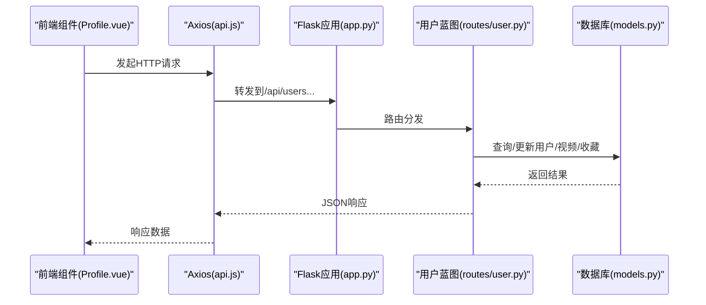
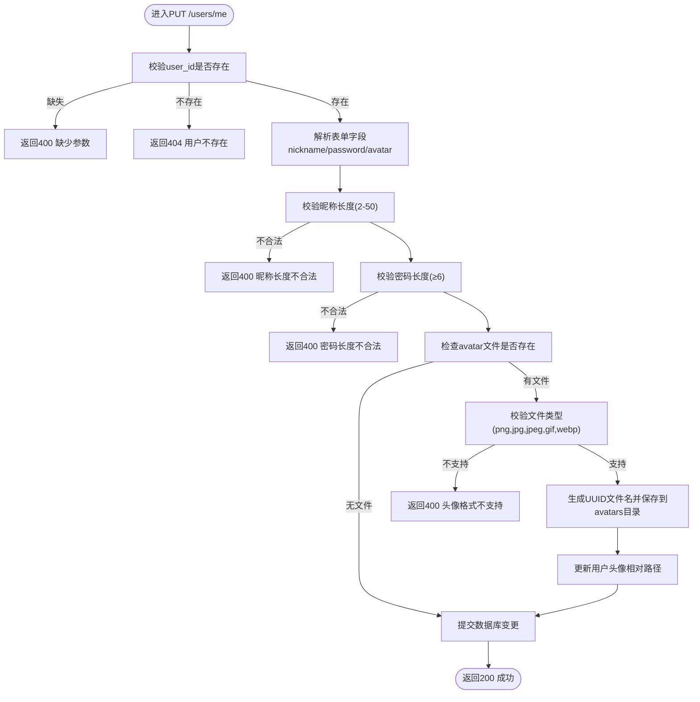
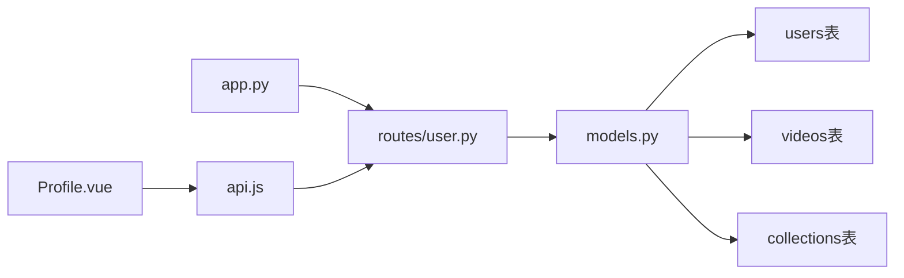

# 用户管理接口

<cite>
**本文引用的文件**
- [backend/routes/user.py](file://backend/routes/user.py)
- [backend/app.py](file://backend/app.py)
- [backend/config.py](file://backend/config.py)
- [backend/models.py](file://backend/models.py)
- [frontend/src/views/Profile.vue](file://frontend/src/views/Profile.vue)
- [frontend/src/api.js](file://frontend/src/api.js)
- [univideo_db.sql](file://univideo_db.sql)
</cite>

## 目录
1. [简介](#简介)
2. [项目结构](#项目结构)
3. [核心组件](#核心组件)
4. [架构总览](#架构总览)
5. [详细组件分析](#详细组件分析)
6. [依赖分析](#依赖分析)
7. [性能考虑](#性能考虑)
8. [故障排查指南](#故障排查指南)
9. [结论](#结论)
10. [附录](#附录)

## 简介
本文件面向UniVideo的用户个人中心功能，提供四类接口的完整API文档：用户信息获取、资料更新（含头像上传）、用户上传视频列表、用户收藏视频列表。文档基于后端Flask蓝图与数据库模型的实际实现，覆盖请求方法、参数、数据校验规则、数据库操作与响应格式，并给出包含头像上传的完整请求示例路径，帮助前后端协同对接。

## 项目结构
- 后端采用Flask + SQLAlchemy，蓝图注册于应用入口，用户相关接口位于用户蓝图中。
- 前端使用Axios封装基础请求，Profile页面负责调用用户个人中心接口并渲染数据。
- 数据库表结构由SQL脚本定义，用户、视频、收藏等模型与之严格对应。

图表来源
- [backend/app.py](file://backend/app.py#L55-L58)
- [backend/routes/user.py](file://backend/routes/user.py#L30-L271)
- [backend/config.py](file://backend/config.py#L11-L30)
- [backend/models.py](file://backend/models.py#L14-L198)
- [frontend/src/api.js](file://frontend/src/api.js#L9-L15)
- [frontend/src/views/Profile.vue](file://frontend/src/views/Profile.vue#L90-L148)

章节来源
- [backend/app.py](file://backend/app.py#L55-L58)
- [frontend/src/api.js](file://frontend/src/api.js#L9-L15)

## 核心组件
- 用户蓝图：提供GET/PUT/GET/GET四个用户个人中心接口，统一前缀为/api/users。
- 数据模型：User、Video、Collection等模型，支撑用户信息、视频列表与收藏列表的数据读写。
- 配置与静态资源：上传目录、文件类型白名单、最大上传体积等。

章节来源
- [backend/routes/user.py](file://backend/routes/user.py#L30-L271)
- [backend/models.py](file://backend/models.py#L14-L198)
- [backend/config.py](file://backend/config.py#L11-L30)

## 架构总览
用户个人中心接口在后端以蓝图形式组织，通过应用入口注册到/api/users前缀下；前端通过Axios实例统一访问，Profile组件负责调用并展示数据。

图表来源
- [frontend/src/views/Profile.vue](file://frontend/src/views/Profile.vue#L90-L148)
- [frontend/src/api.js](file://frontend/src/api.js#L9-L15)
- [backend/app.py](file://backend/app.py#L55-L58)
- [backend/routes/user.py](file://backend/routes/user.py#L30-L271)
- [backend/models.py](file://backend/models.py#L14-L198)

## 详细组件分析

### 接口一：GET /api/users/me（获取用户信息）
- 请求方法：GET
- 请求参数：user_id（查询参数，必填）
- 功能说明：根据user_id查询用户信息，返回用户昵称、头像、角色、注册时间等字段。
- 数据校验：
  - 缺少user_id：返回400，提示缺少参数。
  - user_id不存在：返回404，提示用户不存在。
- 数据库操作：User.query.get(user_id)。
- 响应格式：统一响应体包含code、msg、data；data为用户对象字典。
- 错误处理：异常捕获返回500。

章节来源
- [backend/routes/user.py](file://backend/routes/user.py#L30-L67)
- [backend/models.py](file://backend/models.py#L68-L80)

### 接口二：PUT /api/users/me（更新用户资料与头像）
- 请求方法：PUT
- 请求方式：multipart/form-data（支持文件上传）
- 请求参数（均可选，但user_id必填）：
  - user_id（必填）
  - nickname（可选，长度2-50字符）
  - password（可选，长度≥6）
  - avatar（可选，头像文件）
- 头像文件限制：
  - 类型：png、jpg、jpeg、gif、webp
  - 服务器端处理：生成UUID作为新文件名，保存至配置的上传目录avatars子目录，数据库存储相对路径。
- 数据校验：
  - 缺少user_id：返回400。
  - user_id不存在：返回404。
  - 昵称长度不在2-50范围：返回400。
  - 密码长度小于6：返回400。
  - 不支持的头像类型：返回400。
- 数据库操作：更新User对象字段并提交事务。
- 响应格式：统一响应体，data为更新后的用户对象字典。
- 错误处理：异常捕获返回500，并回滚事务。

章节来源
- [backend/routes/user.py](file://backend/routes/user.py#L69-L160)
- [backend/config.py](file://backend/config.py#L18-L25)
- [backend/app.py](file://backend/app.py#L33-L38)
- [backend/models.py](file://backend/models.py#L42-L59)

### 接口三：GET /api/users/me/videos（获取用户上传视频列表）
- 请求方法：GET
- 请求参数：user_id（查询参数，必填）
- 功能说明：返回该用户上传的所有视频，包含待审核、已发布、已驳回状态；同时返回封面与视频的完整URL。
- 数据校验：
  - 缺少user_id：返回400。
  - user_id不存在：返回404。
- 数据库操作：Video.query.filter_by(user_id=user_id).order_by(desc)。
- 响应格式：统一响应体，data包含total与list；list中每条视频包含封面URL与视频URL。
- 错误处理：异常捕获返回500。

章节来源
- [backend/routes/user.py](file://backend/routes/user.py#L162-L215)
- [backend/models.py](file://backend/models.py#L113-L198)

### 接口四：GET /api/users/me/collections（获取用户收藏的已发布视频）
- 请求方法：GET
- 请求参数：user_id（查询参数，必填）
- 功能说明：返回该用户收藏的“已发布”视频列表，包含作者信息与完整URL。
- 数据校验：
  - 缺少user_id：返回400。
  - user_id不存在：返回404。
- 数据库操作：通过User.favorites关系过滤Video.status==已发布，按时间倒序。
- 响应格式：统一响应体，data包含total与list；list中每条视频包含封面URL与视频URL。
- 错误处理：异常捕获返回500。

章节来源
- [backend/routes/user.py](file://backend/routes/user.py#L217-L271)
- [backend/models.py](file://backend/models.py#L14-L41)
- [backend/models.py](file://backend/models.py#L113-L198)

### 统一响应格式与错误码
- 成功：code=200，msg为操作成功提示，data为具体数据。
- 参数缺失：code=400，msg为缺失参数或校验失败原因。
- 用户不存在：code=404，msg为用户不存在。
- 服务器错误：code=500，msg为错误信息。

章节来源
- [backend/routes/user.py](file://backend/routes/user.py#L30-L67)
- [backend/routes/user.py](file://backend/routes/user.py#L69-L160)
- [backend/routes/user.py](file://backend/routes/user.py#L162-L215)
- [backend/routes/user.py](file://backend/routes/user.py#L217-L271)

### 头像上传流程（代码级）

图表来源
- [backend/routes/user.py](file://backend/routes/user.py#L69-L160)
- [backend/config.py](file://backend/config.py#L18-L25)
- [backend/app.py](file://backend/app.py#L33-L38)

## 依赖分析
- 蓝图注册：应用入口将用户蓝图注册到/api/users前缀，统一暴露四个接口。
- 模型依赖：User与Video通过外键关联，收藏关系通过中间表collections实现。
- 前端依赖：Profile组件通过Axios实例调用用户接口，Profile.vue中明确使用GET/PUT请求及查询参数user_id。

图表来源
- [backend/app.py](file://backend/app.py#L55-L58)
- [backend/routes/user.py](file://backend/routes/user.py#L30-L271)
- [backend/models.py](file://backend/models.py#L14-L198)
- [frontend/src/views/Profile.vue](file://frontend/src/views/Profile.vue#L90-L148)
- [frontend/src/api.js](file://frontend/src/api.js#L9-L15)

章节来源
- [backend/app.py](file://backend/app.py#L55-L58)
- [backend/models.py](file://backend/models.py#L14-L198)
- [frontend/src/views/Profile.vue](file://frontend/src/views/Profile.vue#L90-L148)

## 性能考虑
- 查询排序：视频列表按创建时间倒序，避免全表扫描，建议保持索引策略。
- 文件上传：头像文件保存在本地磁盘，建议在生产环境配合CDN或对象存储提升访问性能。
- 并发与事务：更新资料涉及数据库提交与回滚，注意并发场景下的锁竞争与异常恢复。

[本节为通用指导，无需特定文件来源]

## 故障排查指南
- 400错误（缺少参数/校验失败）
  - 检查是否传递user_id；确认昵称长度与密码长度满足要求。
  - 头像类型不支持时，确认文件扩展名为png/jpg/jpeg/gif/webp。
- 404错误（用户不存在）
  - 确认user_id是否正确且用户已注册。
- 500错误（服务器内部错误）
  - 查看后端日志定位异常堆栈；关注数据库连接与文件保存权限问题。
- 前端调用问题
  - 确认请求头Content-Type为multipart/form-data时，使用FormData提交；axios默认JSON头时需显式设置。

章节来源
- [backend/routes/user.py](file://backend/routes/user.py#L30-L67)
- [backend/routes/user.py](file://backend/routes/user.py#L69-L160)
- [backend/routes/user.py](file://backend/routes/user.py#L162-L215)
- [backend/routes/user.py](file://backend/routes/user.py#L217-L271)
- [frontend/src/views/Profile.vue](file://frontend/src/views/Profile.vue#L210-L263)
- [frontend/src/api.js](file://frontend/src/api.js#L9-L15)

## 结论
用户个人中心接口围绕用户、视频与收藏三大实体展开，具备完善的参数校验、错误处理与统一响应格式。PUT接口支持多字段更新与头像上传，GET接口分别提供用户上传视频与收藏视频两类视图，满足个人中心的核心需求。建议在生产环境中完善鉴权机制与静态资源托管策略，进一步提升安全性与性能。

[本节为总结性内容，无需特定文件来源]

## 附录

### 请求示例（路径参考）
- 获取用户信息
  - 方法：GET
  - 路径：/api/users/me?user_id=123
  - 示例路径：[Profile.vue 获取用户信息调用](file://frontend/src/views/Profile.vue#L92-L112)
- 更新资料（含头像上传）
  - 方法：PUT
  - 路径：/api/users/me
  - 请求头：Content-Type: multipart/form-data
  - 表单字段：user_id、nickname（可选）、password（可选）、avatar（可选）
  - 示例路径：[Profile.vue 提交修改资料](file://frontend/src/views/Profile.vue#L210-L263)
- 获取我的投稿
  - 方法：GET
  - 路径：/api/users/me/videos?user_id=123
  - 示例路径：[Profile.vue 获取我的投稿](file://frontend/src/views/Profile.vue#L114-L130)
- 获取我的收藏
  - 方法：GET
  - 路径：/api/users/me/collections?user_id=123
  - 示例路径：[Profile.vue 获取我的收藏](file://frontend/src/views/Profile.vue#L132-L148)

章节来源
- [frontend/src/views/Profile.vue](file://frontend/src/views/Profile.vue#L92-L148)
- [frontend/src/views/Profile.vue](file://frontend/src/views/Profile.vue#L210-L263)