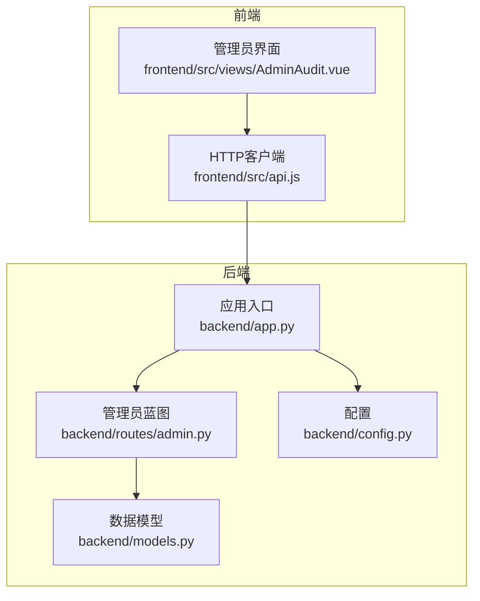
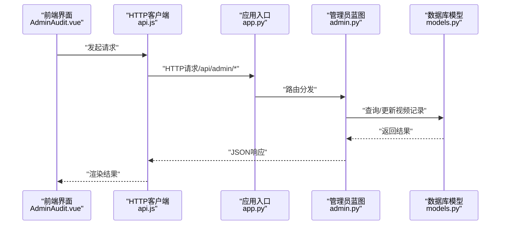
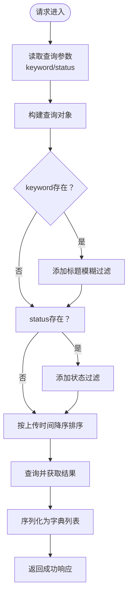
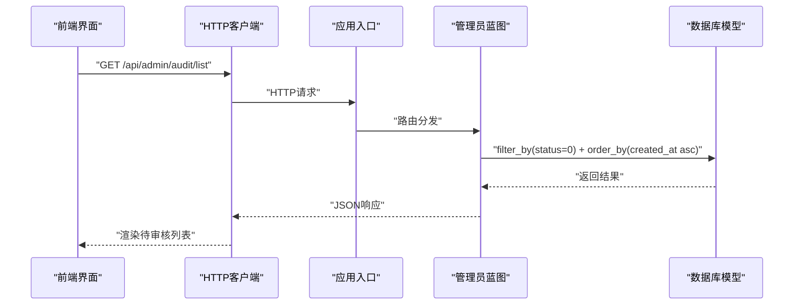
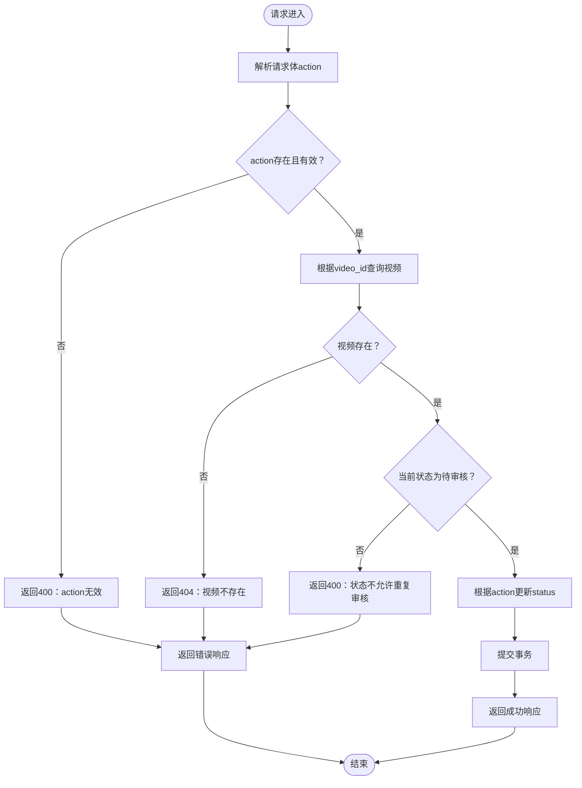
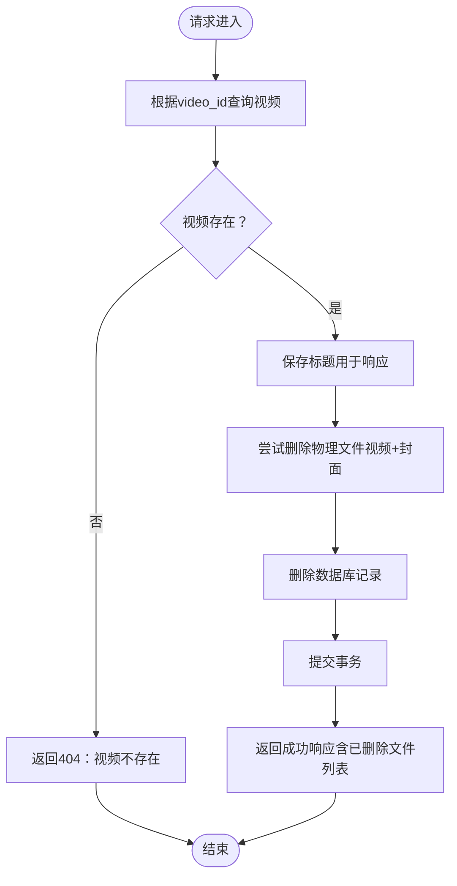
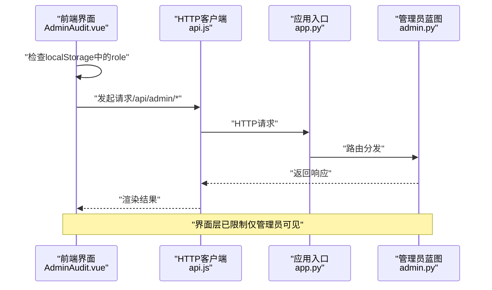
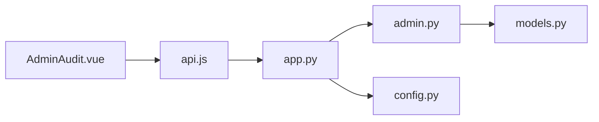

# 管理员接口

<cite>
**本文引用的文件**
- [backend/routes/admin.py](file://backend/routes/admin.py)
- [backend/models.py](file://backend/models.py)
- [backend/app.py](file://backend/app.py)
- [backend/config.py](file://backend/config.py)
- [frontend/src/views/AdminAudit.vue](file://frontend/src/views/AdminAudit.vue)
- [frontend/src/api.js](file://frontend/src/api.js)
</cite>

## 目录
1. [简介](#简介)
2. [项目结构](#项目结构)
3. [核心组件](#核心组件)
4. [架构总览](#架构总览)
5. [详细组件分析](#详细组件分析)
6. [依赖分析](#依赖分析)
7. [性能考虑](#性能考虑)
8. [故障排查指南](#故障排查指南)
9. [结论](#结论)
10. [附录](#附录)

## 简介
本文件面向UniVideo管理员后台，聚焦视频审核与管理相关API，涵盖以下接口：
- GET /api/admin/manage/list：高级筛选的视频管理列表（支持标题模糊搜索与状态筛选）
- GET /api/admin/audit/list：按上传时间升序返回所有待审核视频
- POST /api/admin/audit/{id}：视频审核操作（批准/驳回），含状态校验与幂等保护
- DELETE /api/admin/manage/video/{id}：视频删除（数据库记录与物理文件清理，失败容错）

同时结合admin.py代码，强调这些接口应仅限管理员角色访问。

## 项目结构
后端采用Flask + SQLAlchemy，路由通过蓝图注册；管理员相关接口位于backend/routes/admin.py，数据模型位于backend/models.py，应用入口与蓝图注册位于backend/app.py，上传目录与配置位于backend/config.py；前端通过frontend/src/views/AdminAudit.vue调用上述接口。

图表来源
- [backend/app.py](file://backend/app.py#L39-L58)
- [backend/routes/admin.py](file://backend/routes/admin.py#L13-L245)
- [backend/models.py](file://backend/models.py#L113-L198)
- [backend/config.py](file://backend/config.py#L11-L30)
- [frontend/src/views/AdminAudit.vue](file://frontend/src/views/AdminAudit.vue#L1-L200)
- [frontend/src/api.js](file://frontend/src/api.js#L1-L40)

章节来源
- [backend/app.py](file://backend/app.py#L39-L58)
- [backend/routes/admin.py](file://backend/routes/admin.py#L13-L245)
- [backend/models.py](file://backend/models.py#L113-L198)
- [backend/config.py](file://backend/config.py#L11-L30)
- [frontend/src/views/AdminAudit.vue](file://frontend/src/views/AdminAudit.vue#L1-L200)
- [frontend/src/api.js](file://frontend/src/api.js#L1-L40)

## 核心组件
- 管理员蓝图：提供视频管理与审核相关接口，统一挂载于/api/admin前缀
- 视频模型：包含状态字段（待审核/已发布/已驳回），用于实现“先审后发”
- 应用入口：注册管理员蓝图，初始化数据库、迁移与CORS
- 配置：上传目录、最大文件大小、允许的媒体类型等
- 前端界面：AdminAudit.vue负责调用管理与审核接口，包含搜索、筛选、审核与删除操作

章节来源
- [backend/routes/admin.py](file://backend/routes/admin.py#L13-L245)
- [backend/models.py](file://backend/models.py#L113-L198)
- [backend/app.py](file://backend/app.py#L39-L58)
- [backend/config.py](file://backend/config.py#L11-L30)
- [frontend/src/views/AdminAudit.vue](file://frontend/src/views/AdminAudit.vue#L77-L168)

## 架构总览
管理员接口的典型调用链路如下：前端AdminAudit.vue通过Axios调用后端Flask蓝图，蓝图解析参数、访问数据库模型并返回JSON响应。

图表来源
- [frontend/src/views/AdminAudit.vue](file://frontend/src/views/AdminAudit.vue#L77-L168)
- [frontend/src/api.js](file://frontend/src/api.js#L1-L40)
- [backend/app.py](file://backend/app.py#L39-L58)
- [backend/routes/admin.py](file://backend/routes/admin.py#L13-L245)
- [backend/models.py](file://backend/models.py#L113-L198)

## 详细组件分析

### GET /api/admin/manage/list：高级筛选的视频管理列表
- 功能要点
  - 支持通过keyword进行标题模糊搜索
  - 支持通过status参数（0=待审核、1=已发布、2=已驳回）筛选
  - 默认返回全部视频，按上传时间降序排列
  - 返回结构包含总数与列表，列表项包含视频基础信息与作者信息
- 参数
  - keyword：可选，字符串
  - status：可选，整数（0/1/2）
- 返回
  - code：200表示成功
  - msg：提示信息
  - data.total：列表总数
  - data.list：视频列表（每项包含作者与分类信息）

图表来源
- [backend/routes/admin.py](file://backend/routes/admin.py#L13-L51)
- [backend/models.py](file://backend/models.py#L166-L194)

章节来源
- [backend/routes/admin.py](file://backend/routes/admin.py#L13-L51)
- [backend/models.py](file://backend/models.py#L166-L194)

### GET /api/admin/audit/list：按上传时间升序返回待审核视频
- 功能要点
  - 仅查询status=0（待审核）的视频
  - 按created_at升序排列，便于管理员按先后顺序处理
  - 返回结构同上，包含总数与列表
- 参数：无
- 返回：成功时返回待审核视频列表

图表来源
- [backend/routes/admin.py](file://backend/routes/admin.py#L60-L87)
- [backend/models.py](file://backend/models.py#L113-L142)

章节来源
- [backend/routes/admin.py](file://backend/routes/admin.py#L60-L87)
- [backend/models.py](file://backend/models.py#L113-L142)

### POST /api/admin/audit/{id}：视频审核操作
- 功能要点
  - 请求体需包含action字段，取值为"approve"或"reject"
  - 审核前严格校验视频当前状态必须为待审核（0），防止重复审核
  - 审核通过：status=1（已发布）
  - 审核驳回：status=2（已驳回）
  - 异常时回滚数据库事务
- 参数
  - 路径参数：video_id（整数）
  - 请求体：{ action: "approve" | "reject" }
- 返回
  - 成功：返回新状态与视频信息
  - 失败：返回错误码与错误信息（如缺少action、action非法、非待审核状态、视频不存在、服务器错误等）

图表来源
- [backend/routes/admin.py](file://backend/routes/admin.py#L95-L173)
- [backend/models.py](file://backend/models.py#L113-L142)

章节来源
- [backend/routes/admin.py](file://backend/routes/admin.py#L95-L173)
- [backend/models.py](file://backend/models.py#L113-L142)

### DELETE /api/admin/manage/video/{id}：视频删除
- 功能要点
  - 先查找视频，若不存在返回404
  - 尝试删除服务器上的视频文件与封面文件（基于上传目录配置）
  - 即使文件删除失败也继续删除数据库记录，保证数据一致性
  - 异常时回滚数据库事务
- 参数
  - 路径参数：video_id（整数）
- 返回
  - 成功：返回删除结果，包含已删除的文件名列表
  - 失败：返回错误码与错误信息

图表来源
- [backend/routes/admin.py](file://backend/routes/admin.py#L175-L245)
- [backend/config.py](file://backend/config.py#L11-L30)

章节来源
- [backend/routes/admin.py](file://backend/routes/admin.py#L175-L245)
- [backend/config.py](file://backend/config.py#L11-L30)

### 权限控制：仅管理员可访问
- 后端层面
  - 管理员接口挂载于/api/admin前缀，由蓝图统一管理
  - 视频模型提供is_admin方法判断用户角色
- 前端层面
  - AdminAudit.vue在页面加载时检查localStorage中的role是否为admin，非管理员将被阻止访问
  - 前端Axios在请求头中携带X-User-ID，便于后端识别用户身份（尽管管理员接口未在此处显式校验，但界面层已限制）

图表来源
- [frontend/src/views/AdminAudit.vue](file://frontend/src/views/AdminAudit.vue#L195-L204)
- [frontend/src/api.js](file://frontend/src/api.js#L21-L37)
- [backend/app.py](file://backend/app.py#L39-L58)
- [backend/models.py](file://backend/models.py#L60-L67)

章节来源
- [frontend/src/views/AdminAudit.vue](file://frontend/src/views/AdminAudit.vue#L195-L204)
- [frontend/src/api.js](file://frontend/src/api.js#L21-L37)
- [backend/app.py](file://backend/app.py#L39-L58)
- [backend/models.py](file://backend/models.py#L60-L67)

## 依赖分析
- 组件耦合
  - 管理员蓝图依赖数据库模型Video进行查询与更新
  - 应用入口负责注册蓝图与初始化配置
  - 前端AdminAudit.vue依赖Axios封装的API实例
- 外部依赖
  - Flask、SQLAlchemy、Flask-CORS、Flask-Migrate
  - 上传目录与文件类型配置来自config.py

图表来源
- [backend/routes/admin.py](file://backend/routes/admin.py#L13-L245)
- [backend/models.py](file://backend/models.py#L113-L198)
- [backend/app.py](file://backend/app.py#L39-L58)
- [backend/config.py](file://backend/config.py#L11-L30)
- [frontend/src/views/AdminAudit.vue](file://frontend/src/views/AdminAudit.vue#L77-L168)
- [frontend/src/api.js](file://frontend/src/api.js#L1-L40)

章节来源
- [backend/routes/admin.py](file://backend/routes/admin.py#L13-L245)
- [backend/models.py](file://backend/models.py#L113-L198)
- [backend/app.py](file://backend/app.py#L39-L58)
- [backend/config.py](file://backend/config.py#L11-L30)
- [frontend/src/views/AdminAudit.vue](file://frontend/src/views/AdminAudit.vue#L77-L168)
- [frontend/src/api.js](file://frontend/src/api.js#L1-L40)

## 性能考虑
- 查询优化
  - manage/list接口按created_at降序返回，适合分页与懒加载
  - audit/list接口按created_at升序，便于顺序处理
- 数据库索引
  - Video.status与Video.created_at均为索引字段，有利于筛选与排序
- 文件操作
  - 删除视频时尝试删除物理文件，建议在高并发场景下增加锁或异步任务队列，避免阻塞请求线程
- 前端交互
  - 列表加载时使用loading状态与确认弹窗，提升用户体验

## 故障排查指南
- 常见错误与定位
  - 缺少action或action非法：检查请求体是否包含action字段且值为"approve"或"reject"
  - 非待审核状态：当前状态不是待审核时会拒绝重复审核
  - 视频不存在：video_id无效或已被删除
  - 服务器错误：数据库异常或文件删除失败
- 日志与回滚
  - 审核与删除接口在异常时会回滚数据库事务，确保数据一致性
  - 文件删除失败会被记录（打印日志），但不会阻止数据库记录删除
- 前端提示
  - AdminAudit.vue在调用失败时会弹窗提示具体错误信息

章节来源
- [backend/routes/admin.py](file://backend/routes/admin.py#L95-L173)
- [backend/routes/admin.py](file://backend/routes/admin.py#L175-L245)

## 结论
管理员后台的视频审核与管理接口设计清晰，具备完善的参数校验、状态校验与容错处理机制。通过关键词与状态的组合筛选，管理员可高效地完成视频治理工作；通过严格的待审核状态校验，避免重复审核带来的数据不一致问题；删除逻辑兼顾数据库与文件系统的完整性，并对文件删除失败进行容错处理。配合前端的角色限制，确保只有管理员可访问相关接口。

## 附录
- 接口清单与要点
  - GET /api/admin/manage/list
    - 支持keyword与status筛选，按上传时间降序返回
  - GET /api/admin/audit/list
    - 仅返回待审核视频，按上传时间升序排列
  - POST /api/admin/audit/{id}
    - 请求体包含action（"approve"|"reject"），严格校验待审核状态
  - DELETE /api/admin/manage/video/{id}
    - 删除数据库记录并尝试删除物理文件，失败容错

章节来源
- [backend/routes/admin.py](file://backend/routes/admin.py#L13-L245)
- [backend/models.py](file://backend/models.py#L113-L198)
- [frontend/src/views/AdminAudit.vue](file://frontend/src/views/AdminAudit.vue#L77-L168)