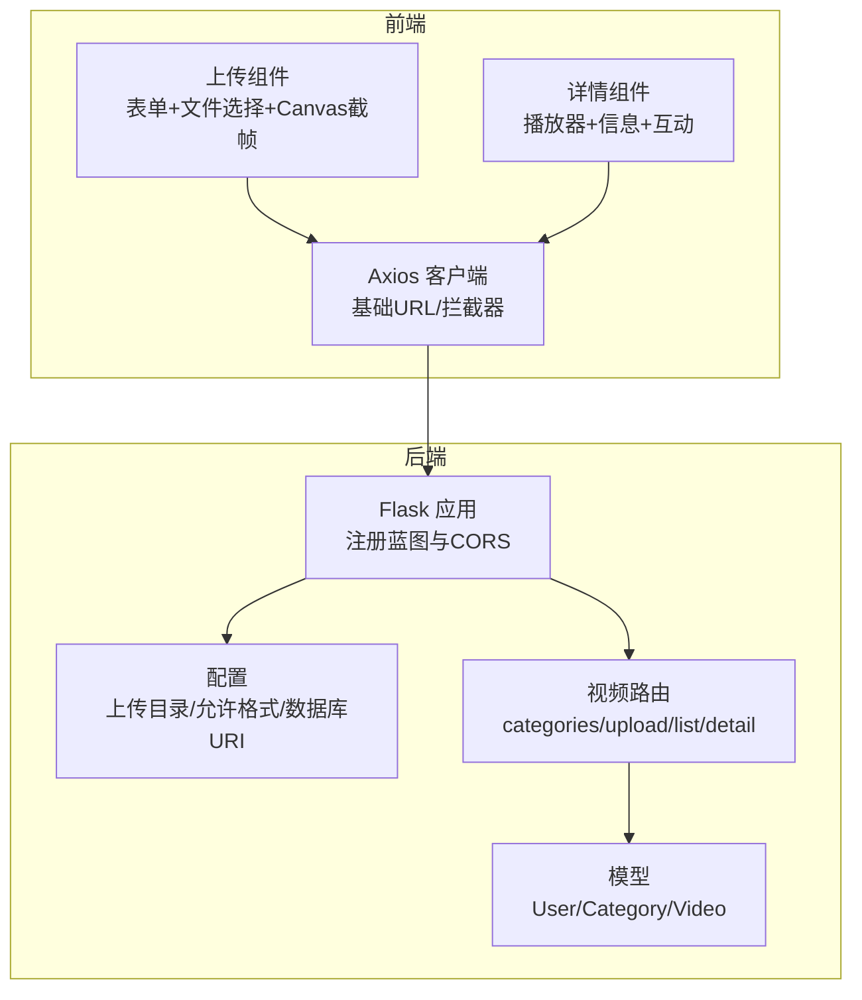
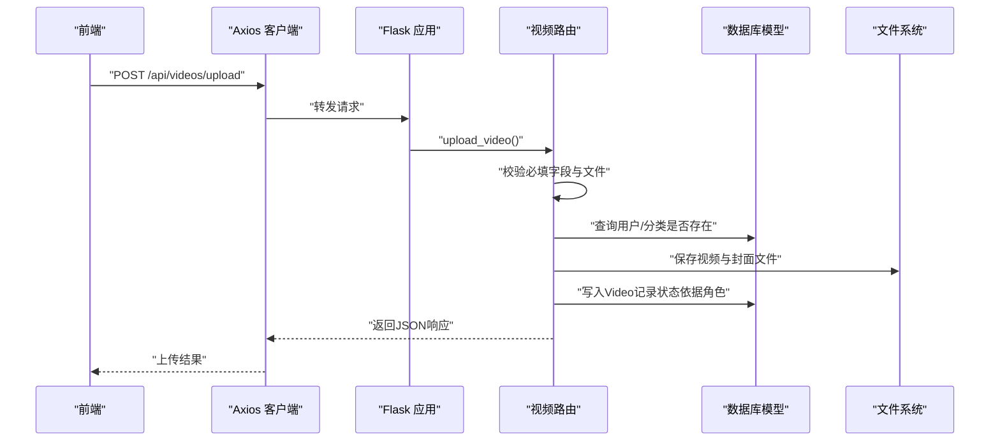
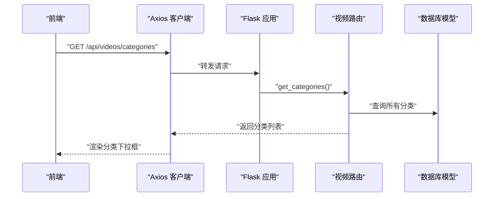
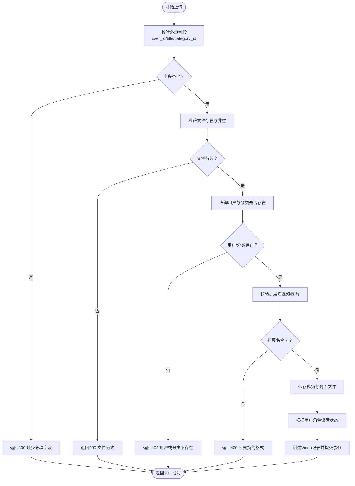
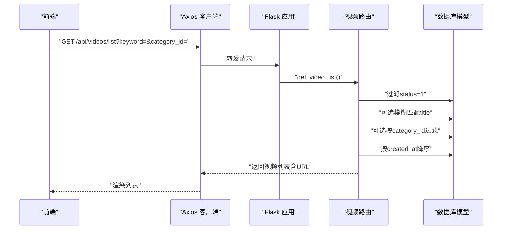
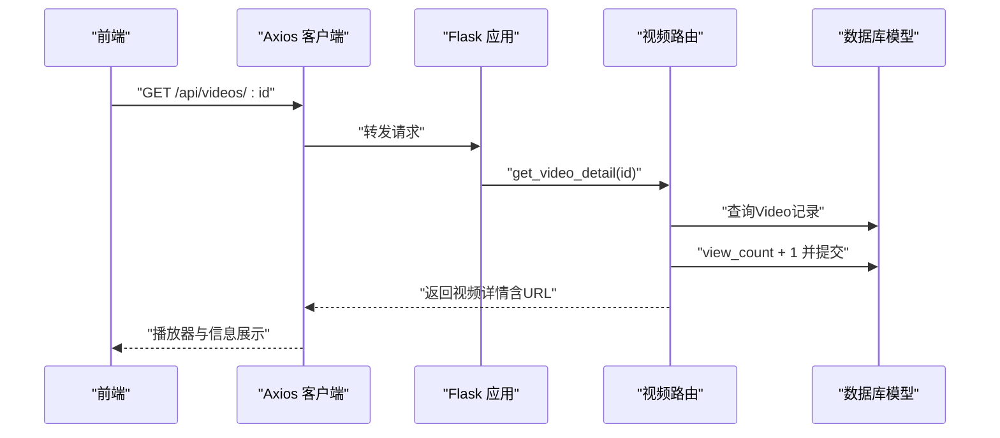
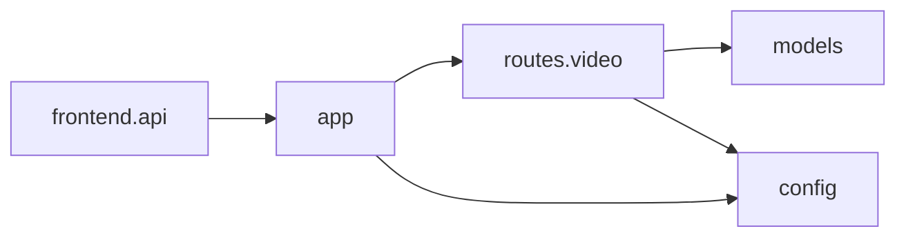

# 视频管理接口

<cite>
**本文引用的文件**
- [backend/routes/video.py](file://backend/routes/video.py)
- [backend/models.py](file://backend/models.py)
- [backend/config.py](file://backend/config.py)
- [backend/app.py](file://backend/app.py)
- [frontend/src/views/Upload.vue](file://frontend/src/views/Upload.vue)
- [frontend/src/views/VideoDetail.vue](file://frontend/src/views/VideoDetail.vue)
- [frontend/src/api.js](file://frontend/src/api.js)
</cite>

## 目录
1. [简介](#简介)
2. [项目结构](#项目结构)
3. [核心组件](#核心组件)
4. [架构总览](#架构总览)
5. [详细组件分析](#详细组件分析)
6. [依赖分析](#依赖分析)
7. [性能考虑](#性能考虑)
8. [故障排查指南](#故障排查指南)
9. [结论](#结论)

## 简介
本文件面向UniVideo的视频核心功能，提供全面的API文档，涵盖以下接口：
- 获取视频分类：GET /api/videos/categories
- 视频上传：POST /api/videos/upload（multipart/form-data）
- 视频列表查询：GET /api/videos/list（支持关键词搜索与分类筛选，仅返回已发布视频）
- 视频详情获取：GET /api/videos/<id>（自动增加播放量，待审核视频访问权限控制为TODO）

文档同时结合video.py中的实现，给出分类数据结构、上传表单字段、文件格式限制、状态流转规则，以及前端调用示例与响应结构说明。

## 项目结构
后端采用Flask + SQLAlchemy，路由集中在backend/routes/video.py，模型定义在backend/models.py，配置在backend/config.py，应用入口在backend/app.py。前端通过frontend/src/api.js统一发起请求，Upload.vue负责上传表单与文件选择，VideoDetail.vue负责详情页展示与交互。

图表来源
- [backend/app.py](file://backend/app.py#L1-L60)
- [backend/routes/video.py](file://backend/routes/video.py#L1-L40)
- [backend/config.py](file://backend/config.py#L1-L30)
- [backend/models.py](file://backend/models.py#L113-L195)
- [frontend/src/api.js](file://frontend/src/api.js#L1-L41)
- [frontend/src/views/Upload.vue](file://frontend/src/views/Upload.vue#L140-L200)
- [frontend/src/views/VideoDetail.vue](file://frontend/src/views/VideoDetail.vue#L108-L125)

章节来源
- [backend/app.py](file://backend/app.py#L1-L60)
- [backend/routes/video.py](file://backend/routes/video.py#L1-L40)
- [backend/config.py](file://backend/config.py#L1-L30)
- [frontend/src/api.js](file://frontend/src/api.js#L1-L41)

## 核心组件
- 视频路由模块：提供分类获取、上传、列表查询、详情获取四个核心接口。
- 数据模型：Video、Category、User，其中Video包含状态字段用于“先审后发”策略。
- 配置模块：定义上传目录、最大文件大小、允许的视频与图片扩展名。
- 应用入口：注册蓝图、初始化CORS与数据库，确保上传目录存在。

章节来源
- [backend/routes/video.py](file://backend/routes/video.py#L15-L282)
- [backend/models.py](file://backend/models.py#L113-L195)
- [backend/config.py](file://backend/config.py#L1-L30)
- [backend/app.py](file://backend/app.py#L23-L60)

## 架构总览
后端通过Flask蓝图注册视频路由，前端通过Axios客户端访问后端API。上传流程涉及multipart/form-data表单、文件校验、状态决策与数据库持久化；列表与详情接口分别承担检索与播放量统计逻辑。

图表来源
- [frontend/src/views/Upload.vue](file://frontend/src/views/Upload.vue#L145-L200)
- [frontend/src/api.js](file://frontend/src/api.js#L1-L41)
- [backend/routes/video.py](file://backend/routes/video.py#L37-L171)
- [backend/models.py](file://backend/models.py#L113-L195)
- [backend/app.py](file://backend/app.py#L40-L58)

## 详细组件分析

### GET /api/videos/categories
- 功能：获取所有视频分类，用于前端上传页面的分类下拉框。
- 返回结构：包含code、msg、data三部分，data为分类数组，每项包含id与name。
- 数据来源：Category模型的to_dict()方法。

图表来源
- [frontend/src/views/Upload.vue](file://frontend/src/views/Upload.vue#L38-L52)
- [backend/routes/video.py](file://backend/routes/video.py#L15-L35)
- [backend/models.py](file://backend/models.py#L85-L111)

章节来源
- [backend/routes/video.py](file://backend/routes/video.py#L15-L35)
- [backend/models.py](file://backend/models.py#L85-L111)

### POST /api/videos/upload
- 方法：POST
- 路径：/api/videos/upload
- 请求体：multipart/form-data
- 必填字段：
  - user_id：上传者用户ID
  - title：视频标题
  - category_id：分类ID
- 文件字段：
  - video_file：视频文件
  - cover_file：封面图片
- 文件格式限制（来自配置）：
  - 视频：mp4、avi、mov、mkv、flv、wmv
  - 图片：jpg、jpeg、png、gif、webp
- 文件大小限制：MAX_CONTENT_LENGTH=500MB
- 状态设置（基于用户角色）：
  - 管理员：直接发布（status=1）
  - 普通用户：待审核（status=0）
- 成功响应：包含code、msg、data（包含id、title、status、is_admin）。
- 异常处理：捕获异常并回滚事务，返回500。

图表来源
- [backend/routes/video.py](file://backend/routes/video.py#L37-L171)
- [backend/config.py](file://backend/config.py#L18-L25)
- [backend/models.py](file://backend/models.py#L113-L195)

章节来源
- [backend/routes/video.py](file://backend/routes/video.py#L37-L171)
- [backend/config.py](file://backend/config.py#L18-L25)
- [frontend/src/views/Upload.vue](file://frontend/src/views/Upload.vue#L145-L200)
- [frontend/src/api.js](file://frontend/src/api.js#L1-L41)

### GET /api/videos/list
- 方法：GET
- 路径：/api/videos/list
- 查询参数：
  - keyword：可选，模糊搜索视频标题
  - category_id：可选，分类ID；当为'all'时不按分类筛选
- 返回：仅返回status=1（已发布）的视频列表，包含作者信息、分类信息、封面URL与视频URL。
- 排序：按创建时间降序。

图表来源
- [backend/routes/video.py](file://backend/routes/video.py#L173-L226)
- [backend/models.py](file://backend/models.py#L113-L195)

章节来源
- [backend/routes/video.py](file://backend/routes/video.py#L173-L226)
- [backend/models.py](file://backend/models.py#L113-L195)

### GET /api/videos/<id>
- 方法：GET
- 路径：/api/videos/<id>
- 业务逻辑：
  - 自动增加播放量view_count
  - 待审核视频（status=0）的访问权限控制为TODO（当前未实现）
- 返回：视频详情（包含作者、分类、播放量、点赞/收藏计数、创建时间等），并附带封面与视频的完整URL。

图表来源
- [backend/routes/video.py](file://backend/routes/video.py#L228-L282)
- [backend/models.py](file://backend/models.py#L113-L195)
- [frontend/src/views/VideoDetail.vue](file://frontend/src/views/VideoDetail.vue#L108-L125)

章节来源
- [backend/routes/video.py](file://backend/routes/video.py#L228-L282)
- [backend/models.py](file://backend/models.py#L113-L195)
- [frontend/src/views/VideoDetail.vue](file://frontend/src/views/VideoDetail.vue#L108-L125)

## 依赖分析
- 组件耦合：
  - 视频路由依赖数据库模型（User、Category、Video）进行查询与写入。
  - 配置模块提供上传目录与允许扩展名，影响上传接口的文件校验与保存路径。
  - 应用入口负责注册蓝图与初始化CORS，确保前后端跨域访问。
- 外部依赖：
  - Flask、Flask-CORS、Flask-SQLAlchemy、Flask-Migrate、Werkzeug（文件处理）、MySQL驱动。
- 潜在循环依赖：
  - 路由与模型相互引用，但通过蓝图注册避免直接循环导入。

图表来源
- [backend/routes/video.py](file://backend/routes/video.py#L1-L40)
- [backend/models.py](file://backend/models.py#L1-L40)
- [backend/config.py](file://backend/config.py#L1-L30)
- [backend/app.py](file://backend/app.py#L40-L58)
- [frontend/src/api.js](file://frontend/src/api.js#L1-L41)

章节来源
- [backend/routes/video.py](file://backend/routes/video.py#L1-L40)
- [backend/models.py](file://backend/models.py#L1-L40)
- [backend/config.py](file://backend/config.py#L1-L30)
- [backend/app.py](file://backend/app.py#L40-L58)
- [frontend/src/api.js](file://frontend/src/api.js#L1-L41)

## 性能考虑
- 列表查询默认仅筛选已发布视频，减少无效数据扫描。
- 模糊搜索与分类筛选在数据库层执行，建议为title与category_id建立索引以提升查询效率。
- 上传文件保存为独立目录（videos/covers），便于后续清理与CDN部署。
- 建议对热门视频详情开启缓存（如Redis）以降低数据库压力。

## 故障排查指南
- 上传失败（400 缺少必填字段/文件）：
  - 检查前端FormData是否包含user_id、title、category_id、video_file、cover_file。
  - 确认文件未为空，扩展名在允许范围内。
- 上传失败（404 用户或分类不存在）：
  - 确认user_id与category_id有效。
- 上传失败（500 服务器错误）：
  - 查看后端日志，确认数据库连接与文件保存目录权限。
- 列表查询无结果：
  - 确认keyword与category_id参数是否正确传递；注意category_id为'all'时不进行分类筛选。
- 详情页播放量未增加：
  - 确认请求为GET且未被缓存；检查数据库view_count字段更新。
- 待审核视频访问：
  - 当前为TODO，需在路由中实现权限判断逻辑。

章节来源
- [backend/routes/video.py](file://backend/routes/video.py#L37-L171)
- [backend/routes/video.py](file://backend/routes/video.py#L173-L226)
- [backend/routes/video.py](file://backend/routes/video.py#L228-L282)

## 结论
本文档系统梳理了UniVideo的视频核心API，明确了分类获取、上传、列表查询与详情获取的接口规范与实现要点。上传接口通过用户角色自动决定视频状态，列表与详情接口遵循“先审后发”的设计原则。建议在生产环境中补充待审核视频的访问权限控制，并对查询性能进行索引优化与缓存策略落地。