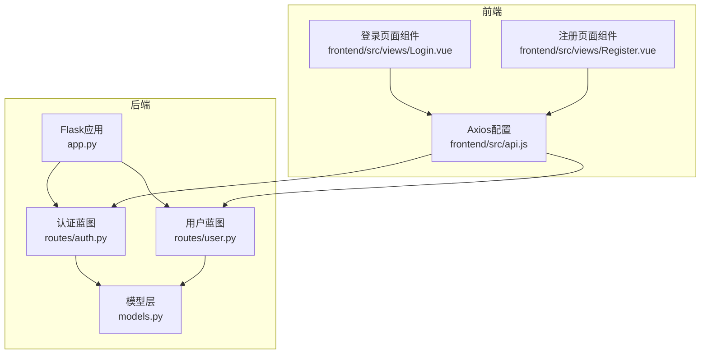
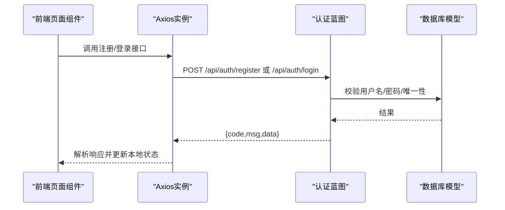
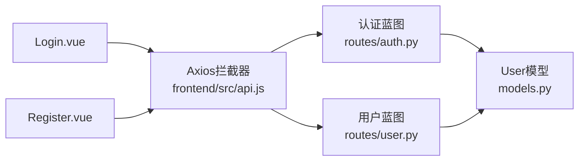

# 认证接口

<cite>
**本文引用的文件**
- [backend/routes/auth.py](file://backend/routes/auth.py)
- [backend/routes/user.py](file://backend/routes/user.py)
- [backend/models.py](file://backend/models.py)
- [backend/app.py](file://backend/app.py)
- [frontend/src/api.js](file://frontend/src/api.js)
- [frontend/src/views/Login.vue](file://frontend/src/views/Login.vue)
- [frontend/src/views/Register.vue](file://frontend/src/views/Register.vue)
</cite>

## 目录
1. [简介](#简介)
2. [项目结构](#项目结构)
3. [核心组件](#核心组件)
4. [架构总览](#架构总览)
5. [详细组件分析](#详细组件分析)
6. [依赖分析](#依赖分析)
7. [性能考虑](#性能考虑)
8. [故障排查指南](#故障排查指南)
9. [结论](#结论)
10. [附录](#附录)

## 简介
本文件面向UniVideo的用户认证系统，聚焦于三个核心接口：注册、登录、获取当前用户信息。文档基于后端Flask路由与模型实现，结合前端Axios封装与页面组件调用，给出统一的HTTP接口规范、请求/响应结构、状态码语义与常见问题排查建议，帮助前后端协同开发与集成。

## 项目结构
- 后端采用Flask + SQLAlchemy，认证路由位于后端蓝图中，用户路由位于独立蓝图中；前端通过Axios实例统一发起请求。
- 认证接口位于后端蓝图中，用户路由提供个人中心相关接口（与“获取当前用户信息”不同，后者在认证蓝图中以简化方式实现）。

图表来源
- [backend/app.py](file://backend/app.py#L39-L58)
- [backend/routes/auth.py](file://backend/routes/auth.py#L12-L184)
- [backend/routes/user.py](file://backend/routes/user.py#L30-L66)
- [backend/models.py](file://backend/models.py#L14-L83)
- [frontend/src/api.js](file://frontend/src/api.js#L9-L41)
- [frontend/src/views/Login.vue](file://frontend/src/views/Login.vue#L31-L52)
- [frontend/src/views/Register.vue](file://frontend/src/views/Register.vue#L38-L54)

章节来源
- [backend/app.py](file://backend/app.py#L39-L58)

## 核心组件
- 认证蓝图（routes/auth.py）：提供注册、登录、获取当前用户信息三类接口。
- 用户蓝图（routes/user.py）：提供更丰富的用户信息与个人中心接口（如获取当前用户详情、修改资料、我的投稿、我的收藏等）。
- 模型层（models.py）：User模型负责密码哈希、校验与字典序列化。
- 前端Axios封装（frontend/src/api.js）：统一设置基础URL、超时、请求头拦截器（自动注入X-User-ID）。
- 前端页面组件（frontend/src/views/Login.vue、Register.vue）：演示调用后端认证接口的典型用法。

章节来源
- [backend/routes/auth.py](file://backend/routes/auth.py#L12-L184)
- [backend/routes/user.py](file://backend/routes/user.py#L30-L66)
- [backend/models.py](file://backend/models.py#L14-L83)
- [frontend/src/api.js](file://frontend/src/api.js#L9-L41)
- [frontend/src/views/Login.vue](file://frontend/src/views/Login.vue#L31-L52)
- [frontend/src/views/Register.vue](file://frontend/src/views/Register.vue#L38-L54)

## 架构总览
- URL前缀：认证接口挂载在/api/auth，用户接口挂载在/api/users。
- 认证机制：
  - 注册/登录：基于用户名+密码的凭证校验，成功后返回用户简要信息（不含敏感字段）。
  - 获取当前用户信息：采用简化方案，通过请求头X-User-Id透传用户ID，无需Token。
- 响应统一结构：{ code, msg, data }，其中data为业务数据或空对象。

图表来源
- [backend/routes/auth.py](file://backend/routes/auth.py#L12-L184)
- [frontend/src/views/Login.vue](file://frontend/src/views/Login.vue#L31-L52)
- [frontend/src/views/Register.vue](file://frontend/src/views/Register.vue#L38-L54)
- [frontend/src/api.js](file://frontend/src/api.js#L9-L41)

## 详细组件分析

### 注册接口：POST /api/auth/register
- 功能概述：创建新用户，校验必填字段、用户名长度与唯一性、密码强度，成功后返回用户简要信息。
- 请求方法与路径：POST /api/auth/register
- 请求体结构（JSON）：
  - username: 字符串，长度3-50，必填
  - password: 字符串，长度≥6，必填
  - nickname: 字符串，长度建议2-50，必填
- 成功响应：
  - code: 201
  - msg: 注册成功
  - data: 包含id、username、nickname
- 常见错误与状态码：
  - 400：缺少必填字段或字段长度不符合要求
  - 409：用户名已存在
  - 500：服务器内部错误
- 错误响应示例（用户名已存在）：
  - code: 409
  - msg: 用户名已存在，请更换
- 密码强度要求：至少6位
- 用户名唯一性约束：数据库层面username唯一，后端在注册时再次校验

章节来源
- [backend/routes/auth.py](file://backend/routes/auth.py#L12-L79)
- [backend/models.py](file://backend/models.py#L21-L30)

### 登录接口：POST /api/auth/login
- 功能概述：校验用户名与密码，成功后返回用户简要信息（不含敏感字段）。
- 请求方法与路径：POST /api/auth/login
- 请求体结构（JSON）：
  - username: 字符串，必填
  - password: 字符串，必填
- 成功响应：
  - code: 200
  - msg: 登录成功
  - data: 包含id、username、nickname、role、avatar
- 常见错误与状态码：
  - 400：缺少必填字段
  - 401：用户名或密码错误（用户不存在或密码不匹配）
  - 500：服务器内部错误
- 凭证验证流程：
  - 校验必填字段
  - 根据username查找用户
  - 若用户不存在，返回401
  - 校验密码，若不匹配，返回401
  - 校验通过，返回用户简要信息

章节来源
- [backend/routes/auth.py](file://backend/routes/auth.py#L89-L145)
- [backend/models.py](file://backend/models.py#L42-L58)

### 获取当前用户信息接口：GET /api/auth/me
- 功能概述：通过请求头X-User-Id识别当前登录用户，返回用户完整信息（不含敏感字段）。
- 请求方法与路径：GET /api/auth/me
- 请求头：
  - X-User-Id: 当前登录用户的ID（由前端Axios拦截器自动注入）
- 成功响应：
  - code: 200
  - msg: 获取成功
  - data: 用户完整信息（id、username、nickname、role、avatar、created_at）
- 常见错误与状态码：
  - 401：未登录或登录已过期（请求头未携带X-User-Id）
  - 404：用户不存在（数据库中无该ID）
  - 500：服务器内部错误
- 注意事项：
  - 该接口为简化方案，不使用JWT Token，依赖前端在请求拦截器中透传X-User-Id。
  - 前端页面组件中也存在另一个“获取当前用户信息”的调用（GET /api/users/me），其参数为查询参数user_id，与本接口不同。

章节来源
- [backend/routes/auth.py](file://backend/routes/auth.py#L147-L184)
- [frontend/src/api.js](file://frontend/src/api.js#L21-L37)
- [frontend/src/views/Login.vue](file://frontend/src/views/Login.vue#L31-L52)

### GET /api/users/me（用户蓝图）
- 说明：此接口位于用户蓝图，与认证蓝图中的/me不同。它通过查询参数user_id获取用户信息，而非请求头。
- 请求方法与路径：GET /api/users/me
- 查询参数：
  - user_id: 当前登录用户的ID（由前端页面组件传入）
- 成功响应：
  - code: 200
  - msg: 获取成功
  - data: 用户完整信息（id、username、nickname、role、avatar、created_at）
- 常见错误与状态码：
  - 400：缺少参数user_id
  - 404：用户不存在
  - 500：服务器内部错误

章节来源
- [backend/routes/user.py](file://backend/routes/user.py#L30-L66)
- [frontend/src/views/Profile.vue](file://frontend/src/views/Profile.vue#L92-L112)

## 依赖分析
- 组件耦合与职责：
  - 认证蓝图依赖User模型进行密码哈希与校验、唯一性检查与查询。
  - 前端Axios拦截器负责统一注入X-User-Id，减少页面组件对认证细节的感知。
  - 页面组件Login.vue与Register.vue分别演示调用认证接口的典型流程。
- 外部依赖：
  - Flask、Flask-CORS、Flask-Migrate、Werkzeug Security（密码哈希）、SQLAlchemy（数据库ORM）。

图表来源
- [backend/routes/auth.py](file://backend/routes/auth.py#L12-L184)
- [backend/routes/user.py](file://backend/routes/user.py#L30-L66)
- [backend/models.py](file://backend/models.py#L14-L83)
- [frontend/src/api.js](file://frontend/src/api.js#L21-L37)
- [frontend/src/views/Login.vue](file://frontend/src/views/Login.vue#L31-L52)
- [frontend/src/views/Register.vue](file://frontend/src/views/Register.vue#L38-L54)

## 性能考虑
- 密码哈希：使用安全的哈希算法，避免明文存储；哈希过程在模型层完成，接口调用成本低。
- 数据库查询：用户名唯一性检查与用户查询均为单字段查询，建议在username上建立索引（模型已声明索引）。
- 前端拦截器：统一注入X-User-Id，减少重复代码，降低出错概率。
- 建议：
  - 对频繁调用的接口增加必要的缓存策略（如用户信息短期缓存）。
  - 控制日志输出敏感字段，避免泄露用户信息。

## 故障排查指南
- 注册失败（用户名已存在）：
  - 现象：返回409，msg提示用户名已存在
  - 处理：引导用户更换用户名后重试
- 登录失败（401未授权）：
  - 现象：返回401，msg提示用户名或密码错误
  - 处理：确认用户名与密码是否正确；检查是否已注册；确认前端是否正确存储并透传用户ID
- 获取当前用户信息失败（401/404）：
  - 现象：401表示未登录或登录过期；404表示用户不存在
  - 处理：检查localStorage中user_id是否存在；确认请求头X-User-Id是否被拦截器注入；确认数据库中用户ID是否有效
- 服务器错误（500）：
  - 现象：返回500，msg包含错误详情
  - 处理：查看后端日志定位异常；检查数据库连接与事务回滚逻辑

章节来源
- [backend/routes/auth.py](file://backend/routes/auth.py#L24-L79)
- [backend/routes/auth.py](file://backend/routes/auth.py#L114-L145)
- [backend/routes/auth.py](file://backend/routes/auth.py#L157-L184)
- [backend/routes/user.py](file://backend/routes/user.py#L37-L66)

## 结论
- UniVideo的认证体系采用简洁直观的方式：注册/登录返回用户简要信息；获取当前用户信息通过请求头X-User-Id识别身份，无需Token。
- 前后端协作清晰：前端Axios统一拦截器负责身份透传，页面组件专注业务交互。
- 接口规范统一、错误码明确，便于集成与维护。

## 附录

### 接口一览与状态码对照
- POST /api/auth/register
  - 成功：201
  - 错误：400、409、500
- POST /api/auth/login
  - 成功：200
  - 错误：400、401、500
- GET /api/auth/me
  - 成功：200
  - 错误：401、404、500

章节来源
- [backend/routes/auth.py](file://backend/routes/auth.py#L12-L184)

### 前端调用示例（参考路径）
- 注册调用（Register.vue）
  - 路径：frontend/src/views/Register.vue#L38-L54
  - 方法：post('/auth/register')
  - 请求体：{ username, nickname, password }
- 登录调用（Login.vue）
  - 路径：frontend/src/views/Login.vue#L31-L52
  - 方法：post('/auth/login')
  - 请求体：{ username, password }
- 获取当前用户信息（Profile.vue）
  - 路径：frontend/src/views/Profile.vue#L92-L112
  - 方法：get('/users/me')
  - 查询参数：{ user_id }
- Axios拦截器（api.js）
  - 路径：frontend/src/api.js#L21-L37
  - 行为：自动注入X-User-ID请求头

章节来源
- [frontend/src/views/Register.vue](file://frontend/src/views/Register.vue#L38-L54)
- [frontend/src/views/Login.vue](file://frontend/src/views/Login.vue#L31-L52)
- [frontend/src/views/Profile.vue](file://frontend/src/views/Profile.vue#L92-L112)
- [frontend/src/api.js](file://frontend/src/api.js#L21-L37)