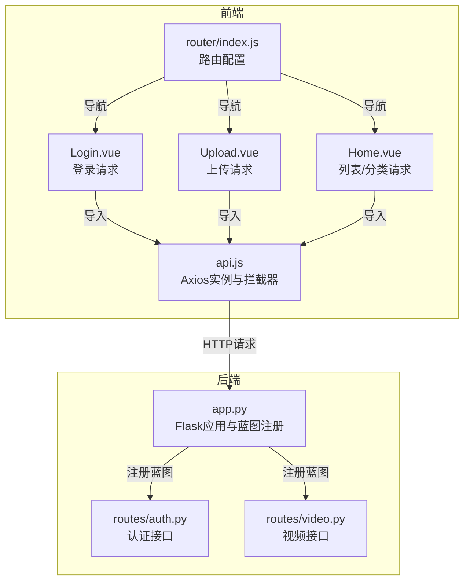
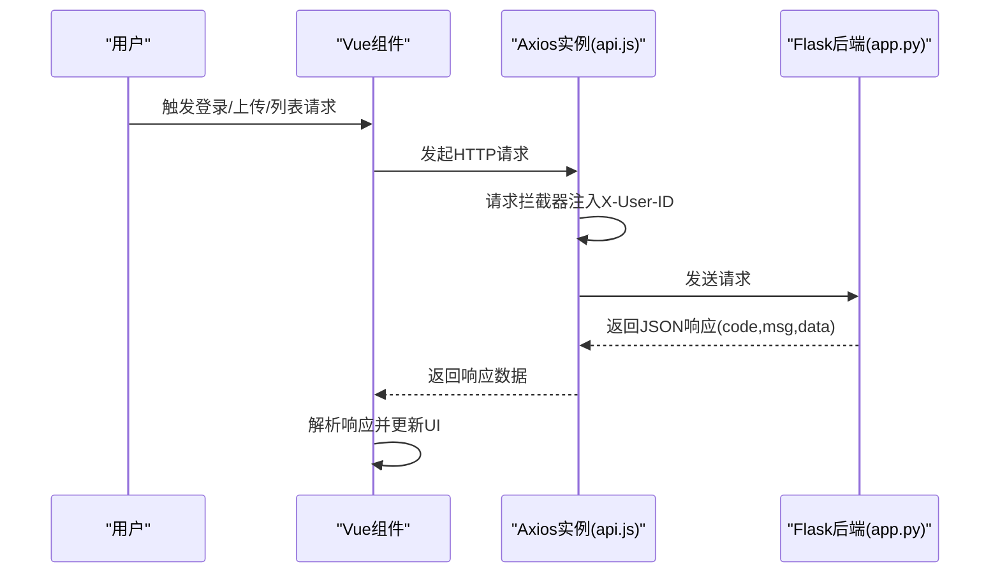
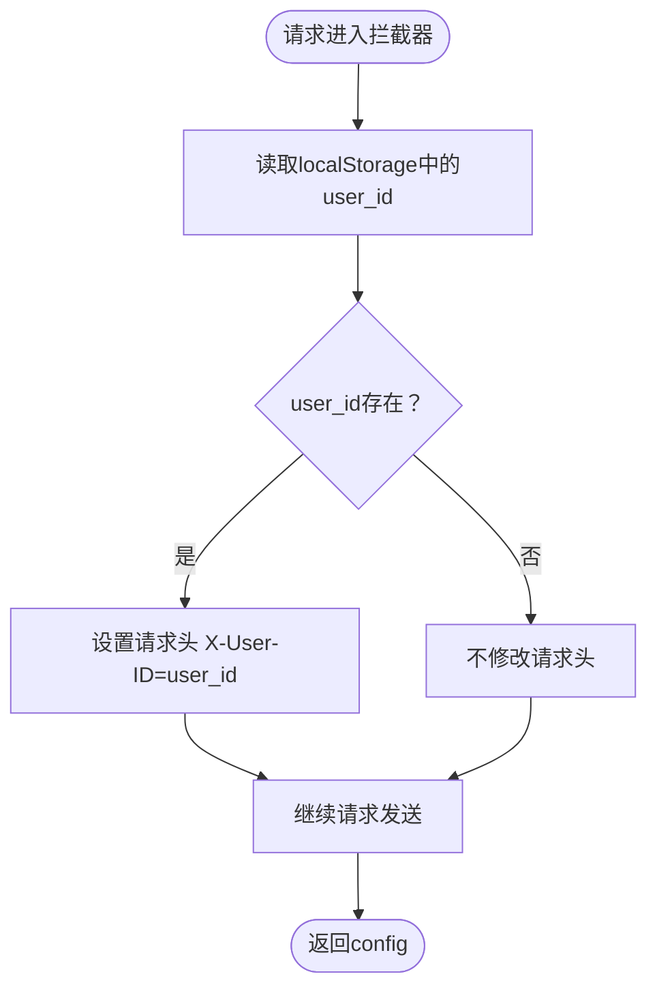
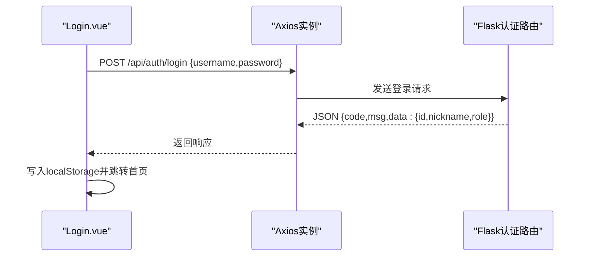
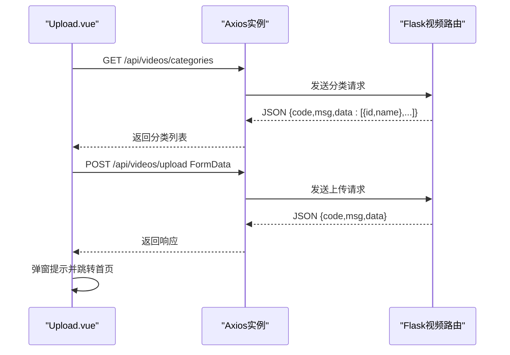
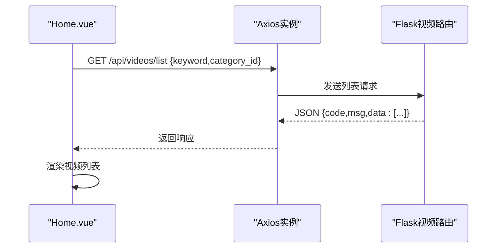
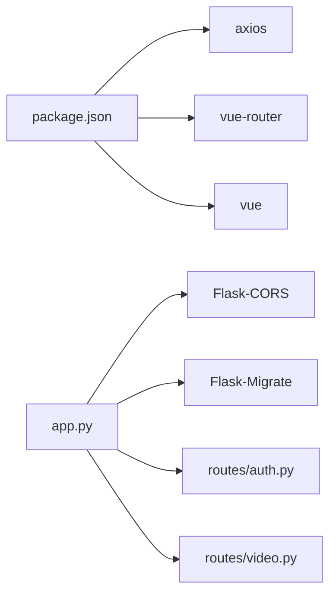

# API通信机制

<cite>
**本文引用的文件**
- [frontend/src/api.js](file://frontend/src/api.js)
- [frontend/src/views/Login.vue](file://frontend/src/views/Login.vue)
- [frontend/src/views/Upload.vue](file://frontend/src/views/Upload.vue)
- [frontend/src/views/Home.vue](file://frontend/src/views/Home.vue)
- [frontend/src/router/index.js](file://frontend/src/router/index.js)
- [frontend/package.json](file://frontend/package.json)
- [backend/app.py](file://backend/app.py)
- [backend/routes/auth.py](file://backend/routes/auth.py)
- [backend/routes/video.py](file://backend/routes/video.py)
</cite>

## 目录
1. [引言](#引言)
2. [项目结构](#项目结构)
3. [核心组件](#核心组件)
4. [架构总览](#架构总览)
5. [详细组件分析](#详细组件分析)
6. [依赖分析](#依赖分析)
7. [性能考虑](#性能考虑)
8. [故障排查指南](#故障排查指南)
9. [结论](#结论)
10. [附录](#附录)

## 引言
本文件系统性梳理UniVideo前端的API通信机制，围绕Axios实例的封装与使用规范展开，重点解析api.js中创建的axios实例配置、请求拦截器的身份透传逻辑，以及在组件中如何通过该实例发起登录、上传、列表查询等操作。同时，文档化当前缺少响应拦截器的局限性，并给出统一错误处理、全局提示与token过期重定向的改进建议；最后提供调试技巧与可扩展能力（如请求取消、防重复提交）。

## 项目结构
前端采用Vue 3 + Vite，API封装位于frontend/src/api.js，组件通过导入该实例发起HTTP请求；后端基于Flask，路由在backend/routes下，应用入口在backend/app.py。

图表来源
- [frontend/src/api.js](file://frontend/src/api.js#L1-L41)
- [frontend/src/views/Login.vue](file://frontend/src/views/Login.vue#L1-L60)
- [frontend/src/views/Upload.vue](file://frontend/src/views/Upload.vue#L1-L60)
- [frontend/src/views/Home.vue](file://frontend/src/views/Home.vue#L1-L45)
- [frontend/src/router/index.js](file://frontend/src/router/index.js#L1-L56)
- [backend/app.py](file://backend/app.py#L1-L60)
- [backend/routes/auth.py](file://backend/routes/auth.py#L1-L40)
- [backend/routes/video.py](file://backend/routes/video.py#L1-L40)

章节来源
- [frontend/src/api.js](file://frontend/src/api.js#L1-L41)
- [frontend/src/views/Login.vue](file://frontend/src/views/Login.vue#L1-L60)
- [frontend/src/views/Upload.vue](file://frontend/src/views/Upload.vue#L1-L60)
- [frontend/src/views/Home.vue](file://frontend/src/views/Home.vue#L1-L45)
- [frontend/src/router/index.js](file://frontend/src/router/index.js#L1-L56)
- [backend/app.py](file://backend/app.py#L1-L60)

## 核心组件
- Axios实例与拦截器
  - 基础配置：baseURL指向后端Flask服务，timeout设置为10秒，Content-Type默认为application/json。
  - 请求拦截器：从localStorage读取user_id并注入X-User-ID请求头，实现无感身份透传，保障后端认证连续性。
  - 响应拦截器：当前未实现，建议补充统一错误处理与全局提示。
- 组件中的API使用
  - 登录组件通过POST /api/auth/login获取用户信息并写入localStorage。
  - 上传组件通过GET /api/videos/categories与POST /api/videos/upload完成分类加载与视频上传。
  - 首页组件通过GET /api/videos/list加载视频列表。

章节来源
- [frontend/src/api.js](file://frontend/src/api.js#L1-L41)
- [frontend/src/views/Login.vue](file://frontend/src/views/Login.vue#L1-L60)
- [frontend/src/views/Upload.vue](file://frontend/src/views/Upload.vue#L1-L60)
- [frontend/src/views/Home.vue](file://frontend/src/views/Home.vue#L1-L71)

## 架构总览
前后端通过REST风格API交互，前端Axios实例负责统一请求配置与认证头注入；后端Flask通过蓝图组织认证、视频、用户等模块路由，统一返回JSON格式的响应体（包含code、msg、data）。

图表来源
- [frontend/src/api.js](file://frontend/src/api.js#L1-L41)
- [frontend/src/views/Login.vue](file://frontend/src/views/Login.vue#L1-L60)
- [frontend/src/views/Upload.vue](file://frontend/src/views/Upload.vue#L1-L60)
- [frontend/src/views/Home.vue](file://frontend/src/views/Home.vue#L1-L71)
- [backend/app.py](file://backend/app.py#L1-L60)

## 详细组件分析

### Axios实例与拦截器
- 实例配置要点
  - baseURL: http://localhost:5001/api，与后端蓝图前缀/api匹配。
  - timeout: 10000毫秒，避免请求长时间挂起。
  - headers: Content-Type为application/json，适用于JSON请求。
- 请求拦截器逻辑
  - 从localStorage读取user_id，若存在则在请求头添加X-User-ID，实现无感身份透传。
  - 任何请求错误均透传给后续处理链。
- 响应拦截器缺失
  - 当前未实现响应拦截器，导致401、500等错误无法在全局统一处理与提示。

图表来源
- [frontend/src/api.js](file://frontend/src/api.js#L1-L41)

章节来源
- [frontend/src/api.js](file://frontend/src/api.js#L1-L41)

### 登录流程（Login.vue）
- 调用POST /api/auth/login，携带用户名与密码。
- 成功后从响应中提取用户信息并写入localStorage（id、nickname、role），随后跳转首页。
- 错误处理：捕获异常并弹窗提示后端返回的msg。

图表来源
- [frontend/src/views/Login.vue](file://frontend/src/views/Login.vue#L1-L60)
- [backend/routes/auth.py](file://backend/routes/auth.py#L89-L139)

章节来源
- [frontend/src/views/Login.vue](file://frontend/src/views/Login.vue#L1-L60)
- [backend/routes/auth.py](file://backend/routes/auth.py#L89-L139)

### 上传流程（Upload.vue）
- GET /api/videos/categories：加载分类列表。
- POST /api/videos/upload：使用FormData上传视频与封面，同时显式设置Content-Type为multipart/form-data。
- 成功后弹窗提示并跳转首页；错误时弹窗提示后端返回的msg。

图表来源
- [frontend/src/views/Upload.vue](file://frontend/src/views/Upload.vue#L1-L60)
- [frontend/src/views/Upload.vue](file://frontend/src/views/Upload.vue#L145-L202)
- [backend/routes/video.py](file://backend/routes/video.py#L15-L34)
- [backend/routes/video.py](file://backend/routes/video.py#L37-L171)

章节来源
- [frontend/src/views/Upload.vue](file://frontend/src/views/Upload.vue#L1-L60)
- [frontend/src/views/Upload.vue](file://frontend/src/views/Upload.vue#L145-L202)
- [backend/routes/video.py](file://backend/routes/video.py#L15-L34)
- [backend/routes/video.py](file://backend/routes/video.py#L37-L171)

### 列表查询流程（Home.vue）
- GET /api/videos/list：支持keyword与category_id参数，返回已发布视频列表。
- 成功后渲染视频网格；失败时控制台打印错误并清空列表。

图表来源
- [frontend/src/views/Home.vue](file://frontend/src/views/Home.vue#L1-L71)
- [backend/routes/video.py](file://backend/routes/video.py#L173-L226)

章节来源
- [frontend/src/views/Home.vue](file://frontend/src/views/Home.vue#L1-L71)
- [backend/routes/video.py](file://backend/routes/video.py#L173-L226)

### 路由与导航
- 路由定义了首页、登录、注册、上传、视频详情、管理后台、个人主页等页面。
- 组件通过router.push进行页面跳转，配合API实例完成业务流转。

章节来源
- [frontend/src/router/index.js](file://frontend/src/router/index.js#L1-L56)

## 依赖分析
- 前端依赖
  - axios：HTTP客户端库，用于封装请求与拦截器。
  - vue、vue-router：前端框架与路由。
- 后端依赖
  - Flask、Flask-CORS、Flask-Migrate：后端框架、跨域与数据库迁移。
  - 蓝图注册：/api/auth、/api/videos、/api/admin、/api、/api/users等。

图表来源
- [frontend/package.json](file://frontend/package.json#L1-L25)
- [backend/app.py](file://backend/app.py#L1-L60)
- [backend/routes/auth.py](file://backend/routes/auth.py#L1-L40)
- [backend/routes/video.py](file://backend/routes/video.py#L1-L40)

章节来源
- [frontend/package.json](file://frontend/package.json#L1-L25)
- [backend/app.py](file://backend/app.py#L1-L60)

## 性能考虑
- 超时设置：10秒的timeout有助于避免请求长期挂起，提升用户体验。
- 请求头一致性：统一的Content-Type与X-User-ID头减少后端解析负担。
- 建议优化
  - 在响应拦截器中加入节流/防抖，避免频繁重复请求。
  - 对上传大文件场景增加进度回调与断点续传（需后端配合）。
  - 对列表查询增加本地缓存策略，减少重复请求。

[本节为通用性能建议，无需特定文件引用]

## 故障排查指南
- 常见问题定位
  - 网络面板：使用Chrome DevTools Network面板观察请求URL、Headers、Payload与响应状态码。
  - 跨域：确认后端已启用CORS，前端请求头中X-User-ID是否正确传递。
  - 认证失败：检查localStorage中user_id是否存在，请求头是否包含X-User-ID。
- 错误处理建议
  - 在响应拦截器中统一处理401未授权（清理本地用户信息并跳转登录）、500服务器错误（全局提示并记录日志）。
  - 对400/404等业务错误，解析后端返回的msg并友好提示。
- 调试技巧
  - 使用模拟请求测试：在Postman或curl中构造相同请求体与头，快速定位问题。
  - 在拦截器中打印请求与响应摘要，便于定位异常。
  - 对上传场景，先单独测试文件上传接口，再联调业务流程。

章节来源
- [frontend/src/api.js](file://frontend/src/api.js#L1-L41)
- [frontend/src/views/Login.vue](file://frontend/src/views/Login.vue#L1-L60)
- [frontend/src/views/Upload.vue](file://frontend/src/views/Upload.vue#L145-L202)
- [frontend/src/views/Home.vue](file://frontend/src/views/Home.vue#L1-L71)

## 结论
当前前端API通信机制以Axios实例为核心，通过请求拦截器实现了无感身份透传，满足后端基于X-User-ID的认证需求。组件层对登录、上传、列表查询等典型场景进行了清晰封装。建议尽快补充响应拦截器，统一处理401、500等错误，增强全局提示与token过期重定向能力；同时可引入请求取消、防重复提交等高级特性，进一步提升稳定性与用户体验。

[本节为总结性内容，无需特定文件引用]

## 附录

### API调用示例（路径参考）
- 登录
  - 方法与路径：POST /api/auth/login
  - 请求体：{ username, password }
  - 成功后写入：localStorage.user_id、localStorage.nickname、localStorage.role
  - 参考路径：[frontend/src/views/Login.vue](file://frontend/src/views/Login.vue#L1-L60)
- 上传视频
  - 方法与路径：POST /api/videos/upload
  - 请求体：FormData（user_id、title、description、category_id、video_file、cover_file）
  - 参考路径：[frontend/src/views/Upload.vue](file://frontend/src/views/Upload.vue#L145-L202)
- 获取分类
  - 方法与路径：GET /api/videos/categories
  - 参考路径：[frontend/src/views/Upload.vue](file://frontend/src/views/Upload.vue#L1-L60)
- 获取视频列表
  - 方法与路径：GET /api/videos/list
  - 参数：keyword（可选）、category_id（可选）
  - 参考路径：[frontend/src/views/Home.vue](file://frontend/src/views/Home.vue#L1-L71)

### 后端路由与响应格式
- 认证路由
  - POST /api/auth/login：返回 { code, msg, data:{id,nickname,role} }
  - 参考路径：[backend/routes/auth.py](file://backend/routes/auth.py#L89-L139)
- 视频路由
  - GET /api/videos/categories：返回 { code, msg, data:[{id,name},...] }
  - POST /api/videos/upload：返回 { code, msg, data:{id,title,status,is_admin} }
  - GET /api/videos/list：返回 { code, msg, data:[...] }
  - 参考路径：[backend/routes/video.py](file://backend/routes/video.py#L15-L34), [backend/routes/video.py](file://backend/routes/video.py#L37-L171), [backend/routes/video.py](file://backend/routes/video.py#L173-L226)

### 改进建议清单
- 响应拦截器
  - 统一处理401未授权：清理localStorage并跳转登录页
  - 统一处理500服务器错误：全局提示并记录日志
  - 统一处理400/404业务错误：解析msg并友好提示
- 全局提示与重定向
  - 引入消息提示组件（如Element Plus的Message），在拦截器中统一调用
  - 对401错误触发自动重定向至登录页
- 高级特性
  - 请求取消：为每个请求生成AbortController，在组件卸载或重复请求时取消
  - 防重复提交：对同一操作在短时间内去重，避免重复点击造成重复请求
  - 节流/防抖：对高频请求（如搜索）增加节流/防抖策略

[本节为通用建议，无需特定文件引用]