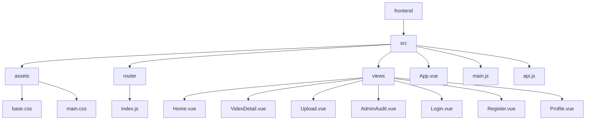
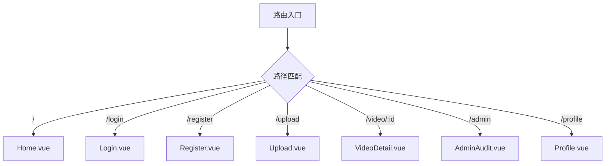
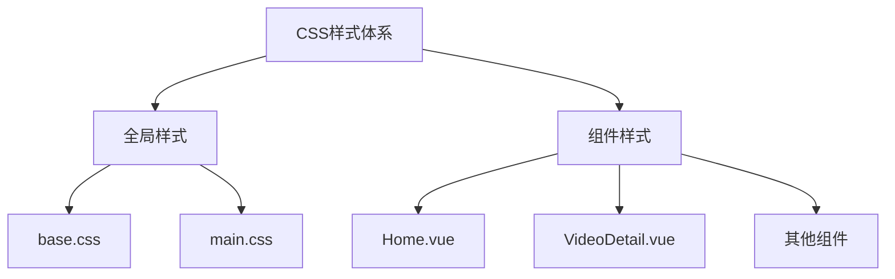
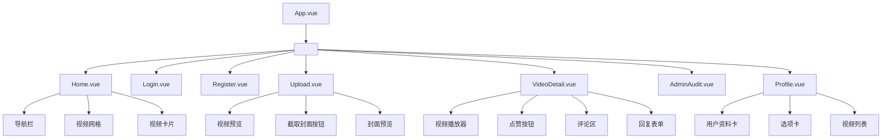

# 前端架构

<cite>
**本文档引用文件**   
- [App.vue](file://frontend/src/App.vue)
- [main.js](file://frontend/src/main.js)
- [router/index.js](file://frontend/src/router/index.js)
- [api.js](file://frontend/src/api.js)
- [views/Home.vue](file://frontend/src/views/Home.vue)
- [views/VideoDetail.vue](file://frontend/src/views/VideoDetail.vue)
- [views/Upload.vue](file://frontend/src/views/Upload.vue)
- [views/AdminAudit.vue](file://frontend/src/views/AdminAudit.vue)
- [views/Login.vue](file://frontend/src/views/Login.vue)
- [views/Register.vue](file://frontend/src/views/Register.vue)
- [views/Profile.vue](file://frontend/src/views/Profile.vue)
- [assets/main.css](file://frontend/src/assets/main.css)
- [assets/base.css](file://frontend/src/assets/base.css)
</cite>

## 目录
1. [项目结构](#项目结构)
2. [核心组件分析](#核心组件分析)
3. [路由配置](#路由配置)
4. [API通信机制](#api通信机制)
5. [视图组件功能划分](#视图组件功能划分)
6. [数据流模式](#数据流模式)
7. [CSS样式组织](#css样式组织)
8. [组件树结构示意图](#组件树结构示意图)
9. [关键交互逻辑实现](#关键交互逻辑实现)

## 项目结构

UniVideo前端项目采用标准的Vue 3 + Vite架构，项目结构清晰，遵循功能模块化组织原则。`frontend/src`目录下包含核心源码，其中`views`目录存放所有页面级组件，`router`目录管理路由配置，`assets`目录存放静态资源和全局样式，`api.js`文件封装了与后端通信的Axios实例。

**Diagram sources**
- [frontend/src/App.vue](file://frontend/src/App.vue)
- [frontend/src/router/index.js](file://frontend/src/router/index.js)
- [frontend/src/views/Home.vue](file://frontend/src/views/Home.vue)

## 核心组件分析

### App.vue 根组件

`App.vue`作为应用的根组件，其职责非常简洁明确。它通过`<RouterView />`组件作为路由出口，动态渲染当前匹配的视图组件。该组件还定义了全局基础样式，如设置`body`的`margin`为0和背景色，确保了应用的视觉一致性。

**Section sources**
- [App.vue](file://frontend/src/App.vue#L1-L13)

### main.js 入口文件

`main.js`是应用的入口点，负责创建Vue应用实例、引入并注册Vue Router，最后将应用挂载到DOM元素上。它通过`createApp(App)`创建应用，使用`app.use(router)`安装路由插件，最终通过`app.mount('#app')`完成挂载。

**Section sources**
- [main.js](file://frontend/src/main.js#L1-L12)

## 路由配置

`router/index.js`文件定义了应用的完整路由映射。它使用`createRouter`和`createWebHistory`创建了一个基于HTML5 History模式的路由器。应用定义了7个核心路由，分别对应不同的功能页面：

- **首页 (`/`)**: 显示视频列表，由`Home.vue`组件渲染。
- **登录页 (`/login`)**: 用户登录入口，由`Login.vue`组件渲染。
- **注册页 (`/register`)**: 用户注册入口，由`Register.vue`组件渲染。
- **上传页 (`/upload`)**: 视频上传功能，由`Upload.vue`组件渲染。
- **视频详情页 (`/video/:id`)**: 展示单个视频的详细信息、播放器和评论区，由`VideoDetail.vue`组件渲染。
- **管理员审核页 (`/admin`)**: 管理员管理视频的后台，由`AdminAudit.vue`组件渲染。
- **个人主页 (`/profile`)**: 用户个人资料、投稿和收藏管理，由`Profile.vue`组件渲染。

**Diagram sources**
- [router/index.js](file://frontend/src/router/index.js#L1-L56)

## API通信机制

`api.js`文件封装了与后端RESTful API通信的Axios实例，是前端与后端交互的核心枢纽。

### Axios实例配置

通过`axios.create()`创建了一个预配置的实例，其基础URL指向后端Flask API（`http://localhost:5001/api`），设置了10秒的请求超时时间，并默认使用`application/json`作为请求头。

### 请求拦截器

该文件的核心是配置了请求拦截器。在每次请求发送前，拦截器会从`localStorage`中读取`user_id`，如果存在，则将其作为`X-User-ID`头添加到请求中。这种设计实现了无感的身份认证透传，确保了后端能够识别当前用户身份，而无需在每个API调用中手动传递。

### 错误处理策略

虽然当前代码中未实现复杂的错误处理，但其基础结构已具备。拦截器的错误处理函数返回`Promise.reject(error)`，这允许在调用API的具体组件中使用`try-catch`来捕获和处理网络错误或HTTP状态码错误。实际应用中，通常会在此处统一处理401（未授权）、403（禁止访问）等状态码，例如自动跳转到登录页。

**Section sources**
- [api.js](file://frontend/src/api.js#L1-L41)

## 视图组件功能划分

各视图组件职责明确，实现了高内聚、低耦合的设计。

### HomeView (Home.vue)

作为应用的首页，`Home.vue`是用户进入系统后的主要信息入口。其核心功能包括：
- **视频列表展示**: 通过`fetchVideos`方法从`/videos/list`接口获取视频数据，并以网格形式展示。
- **导航与入口**: 提供到上传、个人主页、管理员后台的导航按钮。
- **搜索与筛选**: 支持按关键词搜索和按分类筛选视频。
- **用户状态管理**: 显示用户昵称，并提供退出登录功能。

**Section sources**
- [views/Home.vue](file://frontend/src/views/Home.vue#L1-L497)

### VideoDetail (VideoDetail.vue)

`VideoDetail.vue`负责展示单个视频的完整信息，是用户深度交互的核心页面。其功能包括：
- **视频播放**: 内嵌HTML5 `<video>` 播放器，支持播放和控制。
- **信息展示**: 显示视频标题、作者、播放量、上传时间、分类和简介。
- **互动功能**: 实现了点赞、收藏功能，状态会根据用户操作实时更新。
- **评论系统**: 支持发表主评论和回复评论，评论数据以树状结构展示。

**Section sources**
- [views/VideoDetail.vue](file://frontend/src/views/VideoDetail.vue#L1-L800)

### Upload (Upload.vue)

`Upload.vue`提供了完整的视频上传流程。其关键特性是支持**从视频中截取封面**。用户上传视频后，可以在视频播放器中选择任意帧，通过Canvas API将其捕获并转换为图片文件，极大地提升了用户体验。该组件还处理了文件选择、表单验证和上传进度。

**Section sources**
- [views/Upload.vue](file://frontend/src/views/Upload.vue#L1-L575)

### AdminAudit (AdminAudit.vue)

`AdminAudit.vue`是管理员的专属后台。它允许管理员：
- **审核视频**: 对待审核的视频执行通过或驳回操作。
- **管理视频**: 删除任何视频。
- **查看列表**: 通过搜索和状态筛选（待审核、已发布、已驳回）来管理视频。
- **预览视频**: 在模态框中预览视频内容。

**Section sources**
- [views/AdminAudit.vue](file://frontend/src/views/AdminAudit.vue#L1-L776)

### 其他视图组件

- **Login.vue & Register.vue**: 分别处理用户登录和注册逻辑，通过API调用后端接口，并将用户信息存储在`localStorage`中。
- **Profile.vue**: 展示用户个人资料，并提供修改昵称、密码和头像的功能。同时管理用户的“我的投稿”和“我的收藏”两个列表。

## 数据流模式

UniVideo前端的数据流遵循典型的Vue 3 Composition API模式，结合了响应式数据和API调用。

1.  **初始化**: 组件通过`onMounted`生命周期钩子，在挂载后立即调用API获取初始数据（如`fetchVideos`, `fetchUserInfo`）。
2.  **状态管理**: 使用`ref`创建响应式变量（如`videos`, `userInfo`, `loading`）来存储数据和UI状态。
3.  **用户交互**: 用户操作（如点击按钮、输入搜索词）会触发事件处理函数。
4.  **API调用**: 事件处理函数调用`api`实例的方法（如`api.get`, `api.post`）与后端通信。
5.  **状态更新**: 在`try-catch`块中处理API响应，成功后更新`ref`变量，触发视图重新渲染；失败时捕获错误并给出用户提示。
6.  **副作用处理**: 在`finally`块中重置加载状态，确保UI的准确性。

这种模式清晰、直接，非常适合中小型应用。

**Section sources**
- [views/Home.vue](file://frontend/src/views/Home.vue#L6-L130)
- [views/VideoDetail.vue](file://frontend/src/VideoDetail.vue#L108-L327)

## CSS样式组织

前端的CSS样式组织采用了模块化和分层的策略。

- **全局样式**: `base.css`定义了项目的基础颜色变量、字体、全局重置和暗色模式支持。`main.css`作为入口，可以引入其他全局样式。
- **组件级样式**: 所有视图组件都使用`<style scoped>`，确保样式仅作用于当前组件，避免了全局污染。组件内部通过BEM或类似命名约定（如`.video-card`, `.video-info`）来组织样式。
- **样式复用**: 通过定义通用的类名（如`.btn`, `.btn-primary`）来实现按钮等UI元素的样式复用。

**Diagram sources**
- [assets/base.css](file://frontend/src/assets/base.css#L1-L87)
- [assets/main.css](file://frontend/src/assets/main.css#L1-L2)

## 组件树结构示意图

以下是UniVideo前端应用的组件树结构示意图，展示了从根组件到各视图组件的层级关系。

**Diagram sources**
- [App.vue](file://frontend/src/App.vue#L1-L13)
- [views/Home.vue](file://frontend/src/views/Home.vue)
- [views/VideoDetail.vue](file://frontend/src/views/VideoDetail.vue)
- [views/Upload.vue](file://frontend/src/views/Upload.vue)
- [views/Profile.vue](file://frontend/src/views/Profile.vue)

## 关键交互逻辑实现

### 视频上传与封面截取

`Upload.vue`中的`captureFrame`函数是关键交互逻辑的典范。它利用`<video>`元素的`currentTime`属性获取当前播放帧，通过`canvas.drawImage()`将画面绘制到Canvas上，再使用`canvas.toBlob()`将画布内容转换为Blob对象，最后创建一个`File`对象并更新到`coverFile`响应式变量中，从而实现了从视频流中截取封面的功能。

### 评论树状结构

`VideoDetail.vue`中的`commentTree`计算属性将扁平的评论列表转换为树状结构。它通过遍历评论，将`root_id`为空的评论作为根节点，其他评论根据`root_id`分组并挂载到对应的根节点下，从而实现了评论与回复的层级展示。

### 路由导航与状态传递

组件间通过`vue-router`进行导航。例如，`Home.vue`中的`goToVideo(videoId)`函数使用`router.push(/video/${videoId})`跳转到详情页，视频ID通过路由参数传递。`Login.vue`在登录成功后，将用户信息（ID、昵称、角色）存入`localStorage`，实现了跨组件的状态共享。

**Section sources**
- [views/Upload.vue](file://frontend/src/views/Upload.vue#L99-L140)
- [views/VideoDetail.vue](file://frontend/src/views/VideoDetail.vue#L78-L104)
- [views/Login.vue](file://frontend/src/views/Login.vue#L37-L40)