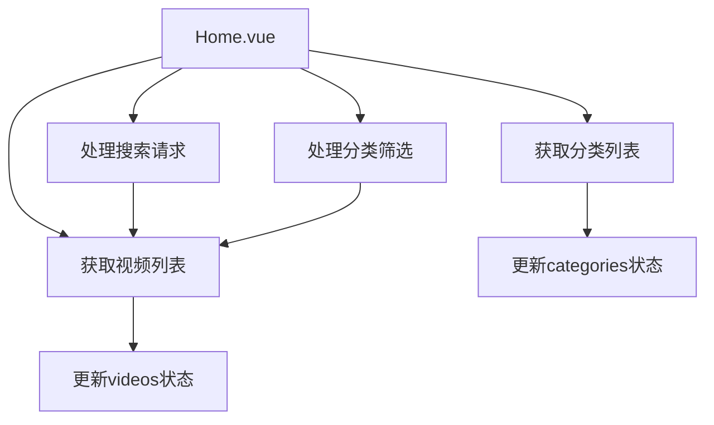
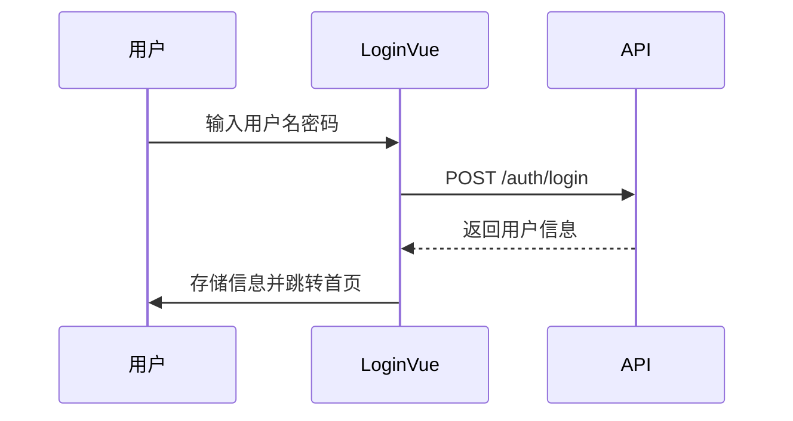
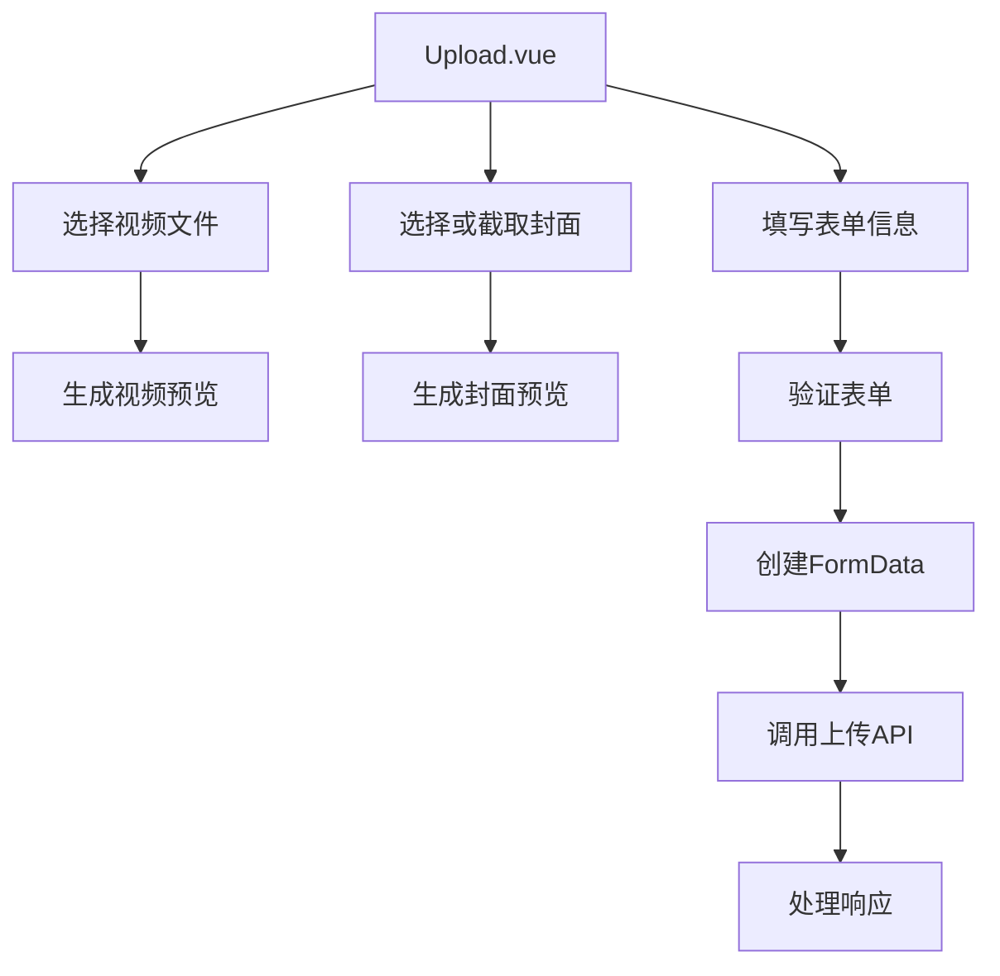
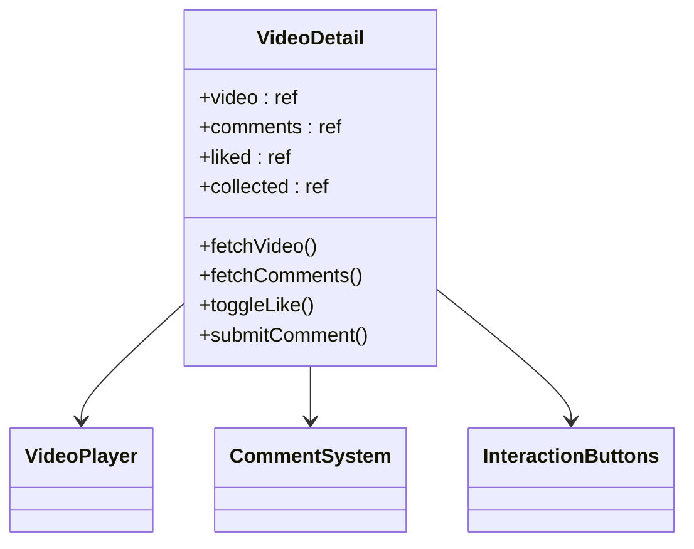
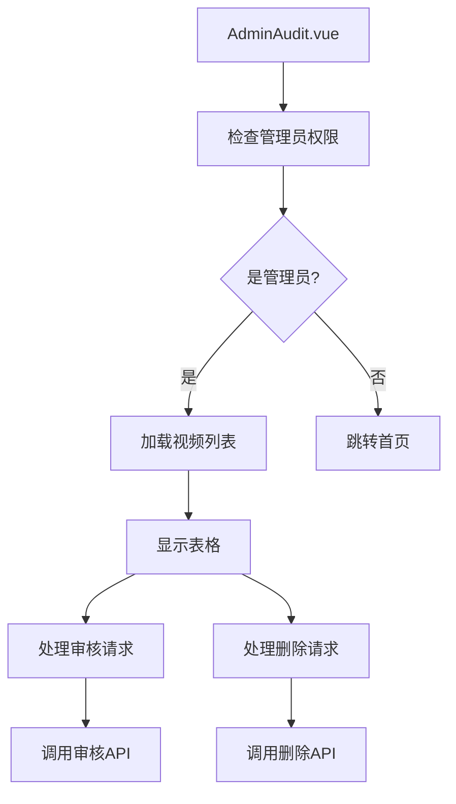
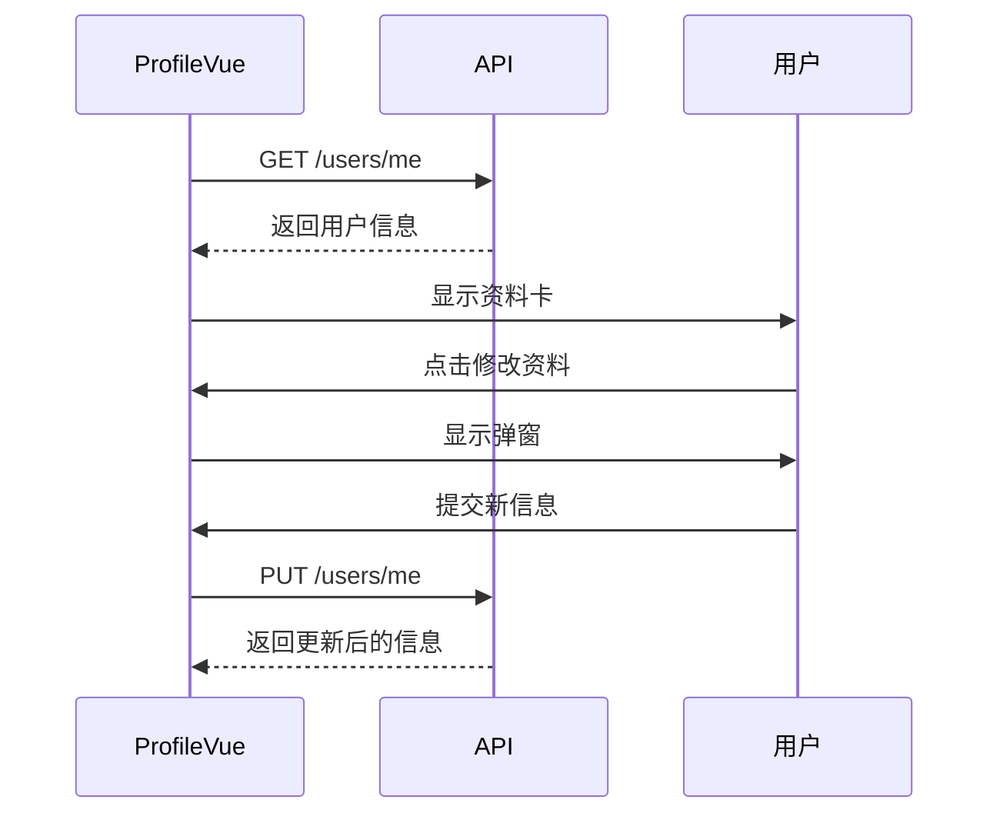

# 前端组件结构

<cite>
**本文档引用的文件**   
- [App.vue](file://frontend/src/App.vue)
- [main.js](file://frontend/src/main.js)
- [router/index.js](file://frontend/src/router/index.js)
- [Home.vue](file://frontend/src/views/Home.vue)
- [Login.vue](file://frontend/src/views/Login.vue)
- [Register.vue](file://frontend/src/views/Register.vue)
- [Upload.vue](file://frontend/src/views/Upload.vue)
- [VideoDetail.vue](file://frontend/src/views/VideoDetail.vue)
- [AdminAudit.vue](file://frontend/src/views/AdminAudit.vue)
- [Profile.vue](file://frontend/src/views/Profile.vue)
- [api.js](file://frontend/src/api.js)
- [base.css](file://frontend/src/assets/base.css)
</cite>

## 目录
1. [项目结构概述](#项目结构概述)
2. [根组件与路由机制](#根组件与路由机制)
3. [核心视图组件分析](#核心视图组件分析)
4. [组件设计模式与最佳实践](#组件设计模式与最佳实践)
5. [常见问题与解决方案](#常见问题与解决方案)
6. [性能优化建议](#性能优化建议)

## 项目结构概述

UniVideo前端项目采用Vue 3 + Vite构建，遵循标准的单页应用(SPA)架构。项目结构清晰，主要分为以下几个部分：

- **src/**: 源代码目录
  - **assets/**: 静态资源文件，包含全局CSS样式
  - **router/**: 路由配置文件，定义应用的页面导航
  - **views/**: 视图组件目录，包含所有页面级组件
  - **App.vue**: 根组件，应用的入口模板
  - **main.js**: 应用入口文件，初始化Vue实例
  - **api.js**: API配置文件，封装与后端通信的HTTP客户端

项目使用Vue Router实现路由驱动的视图渲染，通过`<RouterView />`组件动态加载不同页面。组件设计遵循单文件组件(SFC)规范，每个`.vue`文件包含`<template>`、`<script setup>`和`<style>`三个部分，实现了模板、逻辑和样式的封装。

**组件来源**
- [App.vue](file://frontend/src/App.vue)
- [main.js](file://frontend/src/main.js)
- [router/index.js](file://frontend/src/router/index.js)

## 根组件与路由机制

### App.vue 根组件

`App.vue`作为应用的根组件，其设计极为简洁，主要职责是作为路由视图的容器。组件使用`<script setup>`语法糖导入`RouterView`组件，并在模板中仅渲染`<RouterView />`。这种设计模式使得根组件不包含任何业务逻辑，纯粹作为路由系统的承载容器。

```vue
<template>
  <RouterView />
</template>
```

### 全局样式定义

`App.vue`中定义了全局的`body`样式，重置了默认的`margin`为0，并设置了统一的背景色`#f5f5f5`。这种全局样式重置是前端开发的最佳实践，确保了跨浏览器的一致性。

### 路由配置

`router/index.js`文件定义了应用的所有路由映射关系，采用懒加载(lazy loading)方式导入组件，优化了初始加载性能。路由配置包括：
- 首页 (`/`)
- 登录页 (`/login`)
- 注册页 (`/register`)
- 上传页 (`/upload`)
- 视频详情页 (`/video/:id`)
- 管理员审核页 (`/admin`)
- 个人主页 (`/profile`)

路由系统通过`createWebHistory`创建基于HTML5 History API的路由模式，实现了无刷新的页面导航。

**组件来源**
- [App.vue](file://frontend/src/App.vue#L1-L13)
- [main.js](file://frontend/src/main.js#L1-L12)
- [router/index.js](file://frontend/src/router/index.js#L1-L56)

## 核心视图组件分析

### Home.vue 首页组件

`Home.vue`是应用的首页，负责视频列表的展示和导航功能。组件通过`api.get('/videos/list')`接口异步获取视频数据，并支持搜索和分类筛选功能。页面顶部包含导航栏，显示用户信息和操作按钮，包括上传视频、个人主页和管理员后台入口。

组件采用响应式设计，使用CSS Grid布局视频网格，确保在不同屏幕尺寸下的良好显示效果。视频卡片包含封面、标题、作者和播放量等信息，点击可跳转到视频详情页。



**组件来源**
- [Home.vue](file://frontend/src/views/Home.vue#L1-L497)

### Login.vue 与 Register.vue 认证组件

`Login.vue`和`Register.vue`分别实现用户登录和注册功能。两个组件都使用`<script setup>`语法，通过`ref`定义响应式表单数据，并使用`api`实例与后端进行通信。

登录组件包含用户名、密码输入框和提交按钮，支持回车键登录。登录成功后，将用户信息（ID、昵称、角色）存储到`localStorage`中，并跳转到首页。注册组件包含用户名、昵称和密码输入框，对密码长度进行前端验证。

两个组件都采用了`scoped`样式，确保样式不会影响其他组件。表单设计采用卡片式布局，居中显示，提供良好的用户体验。



**组件来源**
- [Login.vue](file://frontend/src/views/Login.vue#L1-L191)
- [Register.vue](file://frontend/src/views/Register.vue#L1-L211)

### Upload.vue 上传组件

`Upload.vue`提供完整的视频上传功能，包含表单验证、文件上传和视频封面截取功能。组件通过`<input type="file">`元素选择视频和封面文件，并使用`URL.createObjectURL()`生成预览URL。

核心功能包括：
- **视频预览**: 选择视频后可在`<video>`元素中预览
- **封面截取**: 使用Canvas API从视频当前帧截取封面
- **表单验证**: 对标题、分类、文件等进行前端验证
- **进度反馈**: 显示上传状态，防止重复提交

组件使用`FormData`封装上传数据，支持文件上传所需的`multipart/form-data`格式。上传成功后根据用户角色显示不同提示信息，并跳转回首页。



**组件来源**
- [Upload.vue](file://frontend/src/views/Upload.vue#L1-L575)

### VideoDetail.vue 视频详情组件

`VideoDetail.vue`是视频播放的核心组件，集成了播放器、信息展示、互动功能和评论系统。组件通过`useRoute()`获取URL中的视频ID参数，动态加载对应视频数据。

主要功能模块：
- **视频播放器**: 使用原生`<video>`标签，支持控制条和封面图
- **信息展示**: 显示标题、播放量、上传时间、作者等信息
- **互动功能**: 点赞、收藏按钮，显示实时计数
- **评论系统**: 支持主评论和回复，采用树状结构展示

组件使用`computed`属性将扁平的评论列表转换为树状结构，便于嵌套显示。通过`localStorage`检查用户登录状态，未登录用户操作时会提示并跳转登录页。



**组件来源**
- [VideoDetail.vue](file://frontend/src/views/VideoDetail.vue#L1-L800)

### AdminAudit.vue 管理员组件

`AdminAudit.vue`为管理员提供视频审核和管理功能。组件首先检查用户角色，非管理员用户无法访问。页面包含视频列表表格，支持按状态筛选和关键词搜索。

核心功能：
- **视频预览**: 点击预览按钮可查看视频内容
- **审核操作**: 对待审核视频进行通过或驳回
- **删除功能**: 删除违规或不需要的视频
- **状态管理**: 显示视频的审核状态（待审核、已发布、已驳回）

组件使用模态框(Modal)显示视频预览，避免页面跳转。操作按钮根据视频状态动态显示，提供确认对话框防止误操作。



**组件来源**
- [AdminAudit.vue](file://frontend/src/views/AdminAudit.vue#L1-L776)

### Profile.vue 个人主页组件

`Profile.vue`管理用户个人信息和内容。页面分为三个主要区域：
- **用户资料卡**: 显示头像、昵称、用户名等基本信息
- **选项卡系统**: 切换"我的投稿"和"我的收藏"
- **修改资料弹窗**: 支持修改昵称、密码和头像

组件通过`localStorage`获取当前用户ID，确保数据安全。"我的投稿"列表显示用户上传的所有视频及其状态，"我的收藏"显示用户收藏的视频。头像上传支持图片预览和格式验证。



**组件来源**
- [Profile.vue](file://frontend/src/views/Profile.vue#L1-L800)

## 组件设计模式与最佳实践

### 单文件组件(SFC)结构

所有组件均遵循Vue 3 SFC标准结构：
- **`<script setup>`**: 使用组合式API，通过`ref`、`computed`等函数定义响应式状态
- **`<template>`**: 使用Vue模板语法，包含`v-for`、`v-if`等指令
- **`<style scoped>`**: 使用scoped样式，避免样式污染

### 状态管理策略

组件采用本地状态管理，通过`ref`定义响应式变量。对于跨组件状态（如用户登录信息），使用`localStorage`进行持久化存储。关键状态包括：
- `loading`: 控制加载状态显示
- `error`: 处理API调用错误
- `form data`: 管理表单输入

### 数据获取与API交互

通过`api.js`配置的axios实例与后端通信，实现统一的API调用方式。所有API调用都包含：
- **错误处理**: 使用try-catch捕获异常，显示用户友好的错误信息
- **加载状态**: 设置`loading`标志，防止重复提交
- **数据验证**: 前端验证输入，减少无效请求

### 事件处理与用户交互

组件通过`@click`、`@change`等事件监听器处理用户交互。复杂操作（如上传、审核）使用确认对话框，防止误操作。表单支持回车键提交，提升用户体验。

## 常见问题与解决方案

### 组件样式冲突

**问题**: 不同组件的样式可能相互影响，导致显示异常。

**解决方案**:
1. 使用`scoped`样式，确保样式仅作用于当前组件
2. 采用BEM命名规范，避免类名冲突
3. 在`base.css`中定义全局样式变量，统一设计系统

### 异步数据加载失败

**问题**: 网络请求失败导致页面空白或错误。

**解决方案**:
1. 实现完善的错误处理机制，使用try-catch捕获异常
2. 提供加载状态和错误提示，改善用户体验
3. 实现请求重试机制，提高系统健壮性
4. 检查网络连接和API地址配置

### 内存泄漏

**问题**: 视频预览URL未正确释放，导致内存占用持续增加。

**解决方案**:
1. 在`onUnmounted`生命周期钩子中调用`URL.revokeObjectURL()`
2. 在组件销毁前清理所有创建的Object URL
3. 使用`watch`监听文件变化，及时释放旧的URL

### 路由参数处理

**问题**: 视频详情页的ID参数处理不当，导致数据加载错误。

**解决方案**:
1. 使用`useRoute()`正确获取动态路由参数
2. 在`onMounted`中调用数据加载函数
3. 添加参数验证，处理无效ID情况

## 性能优化建议

### 懒加载与代码分割

路由配置已采用组件懒加载，进一步优化可：
- 对大型组件进行内部代码分割
- 使用`<Suspense>`处理异步组件加载状态
- 实现图片懒加载，减少初始加载时间

### 条件渲染

避免不必要的渲染：
- 使用`v-if`而非`v-show`隐藏大量DOM
- 对复杂列表使用虚拟滚动
- 在数据加载完成前显示骨架屏

### 事件优化

提升交互性能：
- 对频繁触发的事件（如搜索）使用防抖(debounce)
- 合理使用`computed`属性缓存计算结果
- 避免在模板中进行复杂计算

### 资源优化

减少资源消耗：
- 压缩图片和视频封面
- 合理设置缓存策略
- 监控并优化API请求频率