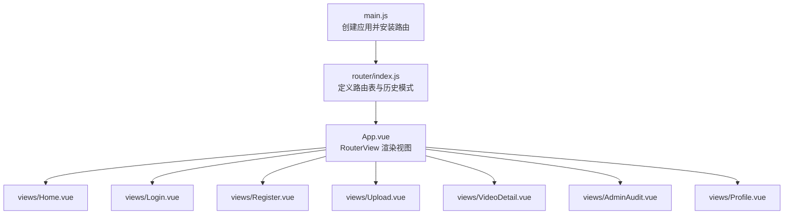
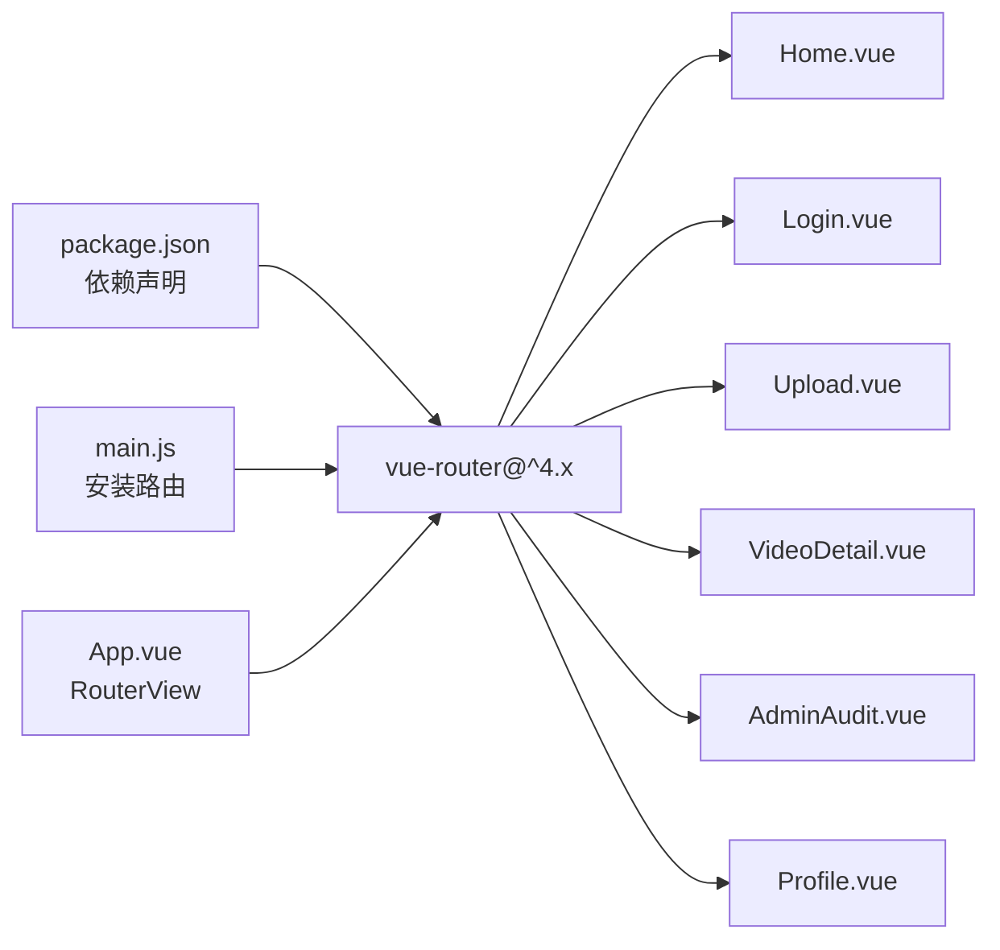

# 前端路由管理

<cite>
**本文引用的文件**
- [router/index.js](file://frontend/src/router/index.js)
- [main.js](file://frontend/src/main.js)
- [App.vue](file://frontend/src/App.vue)
- [Home.vue](file://frontend/src/views/Home.vue)
- [Login.vue](file://frontend/src/views/Login.vue)
- [Profile.vue](file://frontend/src/views/Profile.vue)
- [Upload.vue](file://frontend/src/views/Upload.vue)
- [VideoDetail.vue](file://frontend/src/views/VideoDetail.vue)
- [AdminAudit.vue](file://frontend/src/views/AdminAudit.vue)
- [package.json](file://frontend/package.json)
</cite>

## 目录
1. [引言](#引言)
2. [项目结构](#项目结构)
3. [核心组件](#核心组件)
4. [架构总览](#架构总览)
5. [详细组件分析](#详细组件分析)
6. [依赖分析](#依赖分析)
7. [性能考虑](#性能考虑)
8. [故障排查指南](#故障排查指南)
9. [结论](#结论)
10. [附录](#附录)

## 引言
本文件围绕 UniVideo 前端的路由管理进行系统化梳理，基于 vue-router 4 的声明式路由配置机制，聚焦 router/index.js 中定义的路由表结构，解释路径（path）、名称（name）与组件异步加载（import()）的映射关系；说明 createWebHistory 模式下的 URL 路由行为；梳理首页、登录、注册、上传、视频详情、管理员后台、个人主页等页面的导航逻辑；阐述路由懒加载对性能的优化作用；给出编程式导航（router.push）与声明式导航（router-link）的使用示例；指出当前路由守卫缺失带来的安全风险，并提出可扩展的权限控制方案；最后提供路由配置错误与动态参数未捕获的排查指南，并建议添加 404 路由兜底策略。

## 项目结构
前端采用 Vue 3 + vue-router 4 + Vite 的技术栈，路由配置集中于 router/index.js，应用入口在 main.js 中安装路由实例，根组件 App.vue 通过 RouterView 渲染当前匹配的视图组件。



图表来源
- [main.js](file://frontend/src/main.js#L1-L12)
- [router/index.js](file://frontend/src/router/index.js#L1-L56)
- [App.vue](file://frontend/src/App.vue#L1-L13)

章节来源
- [main.js](file://frontend/src/main.js#L1-L12)
- [router/index.js](file://frontend/src/router/index.js#L1-L56)
- [App.vue](file://frontend/src/App.vue#L1-L13)

## 核心组件
- 路由器实例与历史模式
  - 使用 createWebHistory，history 选项传入 BASE_URL，确保在不同部署环境下路径正确。
  - 路由表 routes 数组包含多个路由项，每项定义 path、name 与组件异步加载映射。
- 路由表概览
  - 首页：path="/"，name="home"，组件异步加载 Home.vue
  - 登录：path="/login"，name="login"，组件异步加载 Login.vue
  - 注册：path="/register"，name="register"，组件异步加载 Register.vue
  - 上传：path="/upload"，name="upload"，组件异步加载 Upload.vue
  - 视频详情：path="/video/:id"，name="video"，组件异步加载 VideoDetail.vue
  - 管理员后台：path="/admin"，name="admin"，组件异步加载 AdminAudit.vue
  - 个人主页：path="/profile"，name="profile"，组件异步加载 Profile.vue

章节来源
- [router/index.js](file://frontend/src/router/index.js#L1-L56)

## 架构总览
下面以类图形式展示路由与视图组件的关系，以及关键导航行为。

```mermaid
classDiagram
class RouterConfig {
+history : createWebHistory(BASE_URL)
+routes : Array
}
class HomeView {
+navigateToUpload()
+navigateToAdmin()
+navigateToProfile()
+navigateToVideo(id)
}
class LoginView {
+handleLogin()
}
class ProfileView {
+fetchUserInfo()
+fetchMyVideos()
+fetchMyCollections()
+goToVideo(id)
+goBack()
}
class UploadView {
+fetchCategories()
+handleVideoChange()
+handleCoverChange()
+captureFrame()
+handleSubmit()
+goBack()
}
class VideoDetailView {
+fetchVideo()
+fetchLikeStatus()
+fetchCollectStatus()
+fetchComments()
+toggleLike()
+toggleCollect()
+submitComment()
+openReply()
+submitReply()
+goBack()
}
class AdminAuditView {
+fetchVideoList()
+handleSearch()
+handleFilterChange()
+handleAudit(id, action)
+handleDelete(id, title)
+openPreview(video)
+closePreview()
+goBack()
}
RouterConfig --> HomeView : "path=/"
RouterConfig --> LoginView : "path=/login"
RouterConfig --> UploadView : "path=/upload"
RouterConfig --> VideoDetailView : "path=/video/ : id"
RouterConfig --> AdminAuditView : "path=/admin"
RouterConfig --> ProfileView : "path=/profile"
```

图表来源
- [router/index.js](file://frontend/src/router/index.js#L1-L56)
- [Home.vue](file://frontend/src/views/Home.vue#L88-L125)
- [Login.vue](file://frontend/src/views/Login.vue#L21-L52)
- [Profile.vue](file://frontend/src/views/Profile.vue#L265-L279)
- [Upload.vue](file://frontend/src/views/Upload.vue#L142-L203)
- [VideoDetail.vue](file://frontend/src/views/VideoDetail.vue#L181-L319)
- [AdminAudit.vue](file://frontend/src/views/AdminAudit.vue#L170-L205)

## 详细组件分析

### 路由表与懒加载
- 路由表结构
  - 每个路由项包含 path、name 与 component 字段，其中 component 为异步加载函数，返回 import(...) Promise。
  - 动态路由 /video/:id 使用命名参数 id，供 VideoDetail.vue 通过 useRoute().params.id 获取。
- createWebHistory 行为
  - 基于浏览器 History API，URL 以“/”开头，支持刷新与分享。
  - BASE_URL 来源于 import.meta.env.BASE_URL，确保在子路径部署时路径正确。
- 路由懒加载优势
  - 首屏只加载首页组件，其他页面按需加载，减少初始包体积，提升首屏性能。
  - 代码分割后，路由切换更流畅，避免一次性加载所有视图组件。

章节来源
- [router/index.js](file://frontend/src/router/index.js#L1-L56)
- [package.json](file://frontend/package.json#L1-L25)

### 编程式导航与声明式导航
- 编程式导航（router.push）
  - 在 Home.vue 中，多处使用 router.push('/upload')、router.push('/admin')、router.push('/profile')、router.push(`/video/${id}`) 实现页面跳转。
  - 在 Login.vue 中，登录成功后 router.push('/') 返回首页。
  - 在 Profile.vue、Upload.vue、VideoDetail.vue、AdminAudit.vue 中均有类似的编程式跳转。
- 声明式导航（router-link）
  - Login.vue 中使用 <router-link to="/register"> 注册链接，实现声明式跳转。
  - 其他页面中也存在类似的声明式导航使用方式（在各视图模板中体现）。

章节来源
- [Home.vue](file://frontend/src/views/Home.vue#L88-L125)
- [Login.vue](file://frontend/src/views/Login.vue#L82-L95)
- [Profile.vue](file://frontend/src/views/Profile.vue#L265-L279)
- [Upload.vue](file://frontend/src/views/Upload.vue#L142-L203)
- [VideoDetail.vue](file://frontend/src/views/VideoDetail.vue#L181-L319)
- [AdminAudit.vue](file://frontend/src/views/AdminAudit.vue#L170-L205)

### 动态路由与参数获取
- 动态路由 /video/:id
  - VideoDetail.vue 通过 useRoute().params.id 获取视频 ID，并据此调用后端接口获取视频详情、点赞/收藏状态、评论列表等。
- 参数校验与健壮性
  - 建议在 VideoDetail.vue 中增加对 route.params.id 的存在性判断与类型校验，避免非法 ID 导致的异常。

章节来源
- [router/index.js](file://frontend/src/router/index.js#L34-L39)
- [VideoDetail.vue](file://frontend/src/views/VideoDetail.vue#L111-L125)

### 权限控制与安全现状
- 当前状态
  - 路由层未设置全局前置守卫或路由独享守卫，无法强制校验登录状态或角色权限。
  - AdminAudit.vue 在 mounted 中通过 localStorage 检查 role，若非 admin 则跳转首页；但该逻辑依赖组件生命周期，不够统一。
  - Profile.vue 在获取用户信息时若检测到未登录则跳转登录页；同样依赖组件内逻辑。
- 安全风险
  - 未登录用户可直接访问 /admin、/upload、/profile 等页面，存在越权风险。
  - 未登录用户可直接访问 /video/:id 并进行点赞/收藏/评论等操作，后端虽可能拦截，但前端应做基本防护。
- 建议的扩展方案
  - 全局前置守卫：在路由实例上添加 beforeEach，统一校验登录状态与角色权限，未满足条件时跳转至登录页或首页。
  - 路由独享守卫：对 /admin、/upload、/profile 等敏感路由设置独享守卫，细化权限控制。
  - 组件内校验：保留现有组件内的校验逻辑作为补充，确保即使绕过守卫也能得到保护。

章节来源
- [AdminAudit.vue](file://frontend/src/views/AdminAudit.vue#L195-L204)
- [Profile.vue](file://frontend/src/views/Profile.vue#L92-L112)
- [Upload.vue](file://frontend/src/views/Upload.vue#L164-L171)
- [VideoDetail.vue](file://frontend/src/views/VideoDetail.vue#L185-L204)

### 导航逻辑与用户体验
- 首页 Home.vue
  - 提供上传、管理后台、个人主页、退出登录等导航入口；点击视频卡片跳转到视频详情页。
- 登录页 Login.vue
  - 登录成功后跳转首页；提供注册链接。
- 上传页 Upload.vue
  - 提交成功后返回首页；未登录时跳转登录页。
- 视频详情页 VideoDetail.vue
  - 支持点赞、收藏、评论、回复等交互；未登录时引导登录。
- 管理后台 AdminAudit.vue
  - 仅管理员可见；提供视频列表、搜索、筛选、审核、删除等操作。
- 个人主页 Profile.vue
  - 展示用户资料、我的投稿、我的收藏；支持修改资料、头像上传等。

章节来源
- [Home.vue](file://frontend/src/views/Home.vue#L88-L125)
- [Login.vue](file://frontend/src/views/Login.vue#L21-L52)
- [Upload.vue](file://frontend/src/views/Upload.vue#L142-L203)
- [VideoDetail.vue](file://frontend/src/views/VideoDetail.vue#L181-L319)
- [AdminAudit.vue](file://frontend/src/views/AdminAudit.vue#L170-L205)
- [Profile.vue](file://frontend/src/views/Profile.vue#L265-L279)

### 路由懒加载与性能优化
- 懒加载原理
  - 路由组件通过 import() 异步加载，首次进入对应路由时才下载对应模块，降低首屏体积。
- 性能收益
  - 减少初始包大小，缩短首屏渲染时间；按需加载提升整体交互体验。
- 最佳实践
  - 对不常用页面（如上传、管理后台）保持懒加载；常用页面（首页）可考虑预加载策略以优化二次进入速度（需结合实际业务流量评估）。

章节来源
- [router/index.js](file://frontend/src/router/index.js#L1-L56)

## 依赖分析
- 路由依赖
  - main.js 中 app.use(router) 安装路由实例。
  - App.vue 中通过 RouterView 渲染当前路由匹配的组件。
- 版本依赖
  - package.json 中包含 vue 与 vue-router 的版本要求，确保与 vue-router 4 的特性兼容。



图表来源
- [package.json](file://frontend/package.json#L1-L25)
- [main.js](file://frontend/src/main.js#L1-L12)
- [App.vue](file://frontend/src/App.vue#L1-L13)
- [router/index.js](file://frontend/src/router/index.js#L1-L56)

章节来源
- [package.json](file://frontend/package.json#L1-L25)
- [main.js](file://frontend/src/main.js#L1-L12)
- [App.vue](file://frontend/src/App.vue#L1-L13)

## 性能考虑
- 路由懒加载是主要优化手段，建议：
  - 对高频页面（如首页）可考虑预加载策略，平衡首屏与二次进入体验。
  - 合理拆分路由模块，避免单路由模块过大导致加载延迟。
  - 结合服务端渲染或预渲染（SSR/SSG）进一步优化首屏性能（视项目需求而定）。

## 故障排查指南
- 路由配置错误
  - 症状：页面空白、白屏或 404。
  - 排查要点：
    - 确认 path 书写正确，区分大小写与斜杠。
    - 确认 component 的 import() 路径正确，文件存在且导出默认组件。
    - 确认 BASE_URL 设置正确，避免子路径部署时的路径问题。
- 动态参数未捕获
  - 症状：/video/:id 访问时参数为空或报错。
  - 排查要点：
    - 确认路由定义为 /video/:id。
    - 在目标组件中使用 useRoute().params.id 获取参数，并进行存在性与类型校验。
- 路由守卫缺失导致的安全问题
  - 症状：未登录用户可访问 /admin、/upload、/profile。
  - 排查要点：
    - 在路由层添加全局前置守卫与路由独享守卫，统一校验登录状态与角色权限。
    - 在组件内保留校验逻辑作为补充。
- 404 路由兜底
  - 建议：在路由表末尾添加通配符路由（pathMatch: ".*"），指向 404 页面，提升用户体验与可维护性。

章节来源
- [router/index.js](file://frontend/src/router/index.js#L1-L56)
- [VideoDetail.vue](file://frontend/src/views/VideoDetail.vue#L111-L125)
- [AdminAudit.vue](file://frontend/src/views/AdminAudit.vue#L195-L204)
- [Upload.vue](file://frontend/src/views/Upload.vue#L164-L171)
- [Profile.vue](file://frontend/src/views/Profile.vue#L92-L112)

## 结论
UniVideo 的前端路由采用 vue-router 4 的声明式配置与 createWebHistory 模式，配合组件级的编程式与声明式导航，实现了清晰的页面流转。路由懒加载有效降低了首屏负担。当前路由层缺少全局守卫，存在越权访问的风险，建议尽快引入全局前置守卫与路由独享守卫，并在组件内保留校验逻辑作为补充。同时建议增加 404 路由兜底，完善错误处理与用户体验。

## 附录
- 路由跳转示例（路径参考）
  - 编程式导航：router.push('/upload')、router.push('/admin')、router.push('/profile')、router.push(`/video/${id}`)
  - 声明式导航：<router-link to="/register">注册</router-link>
- 动态路由参数：useRoute().params.id
- 历史模式：createWebHistory(import.meta.env.BASE_URL)