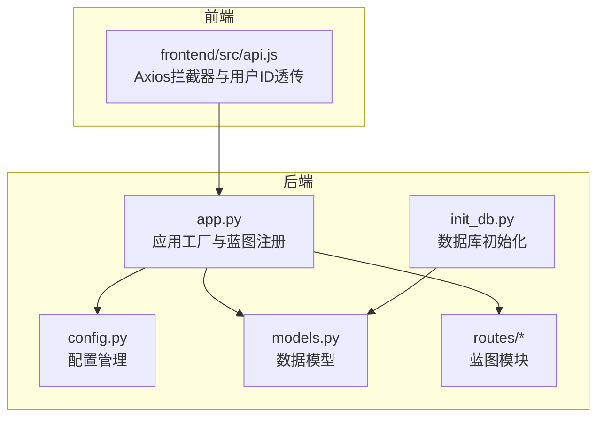
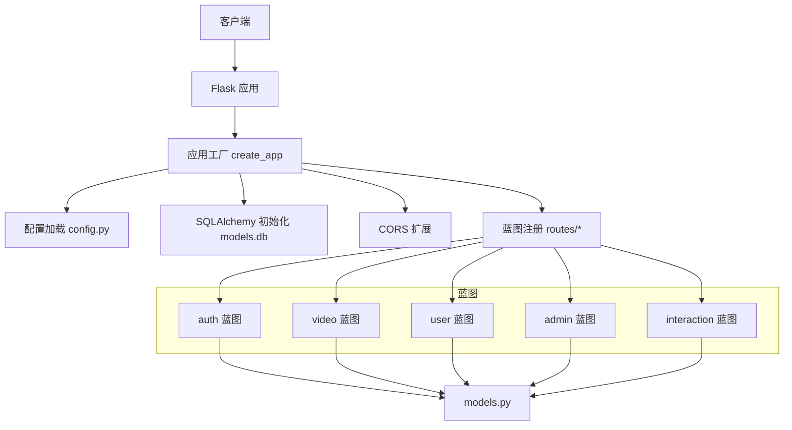
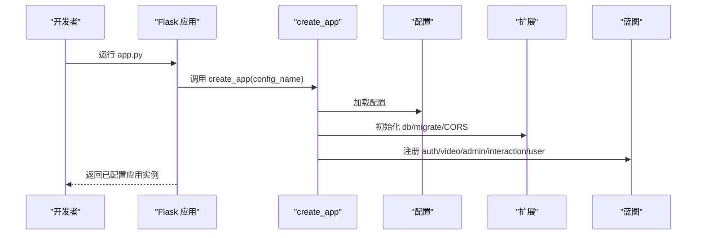
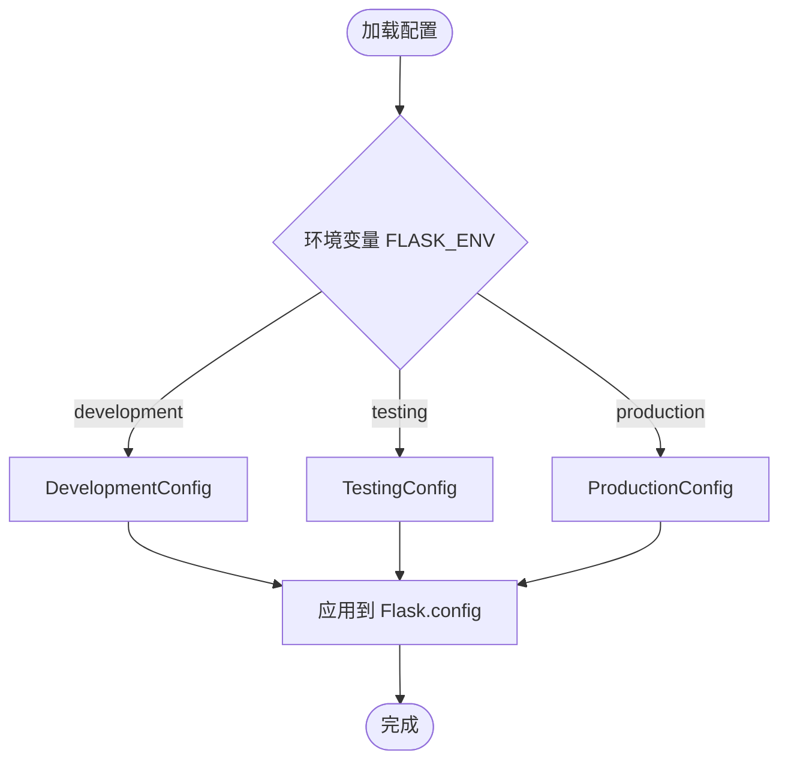
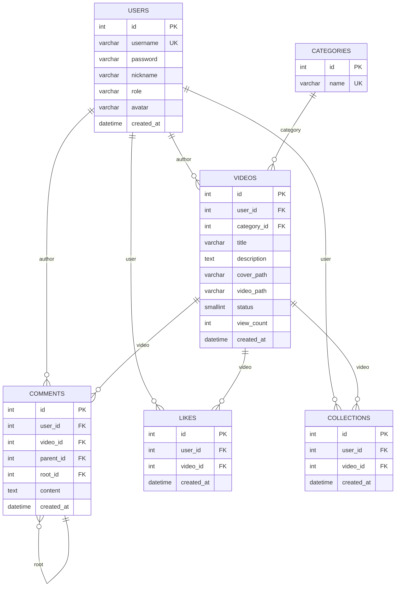
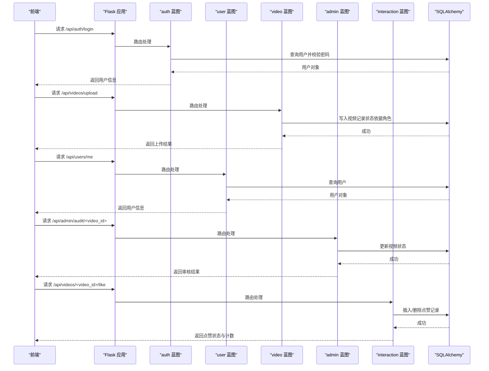
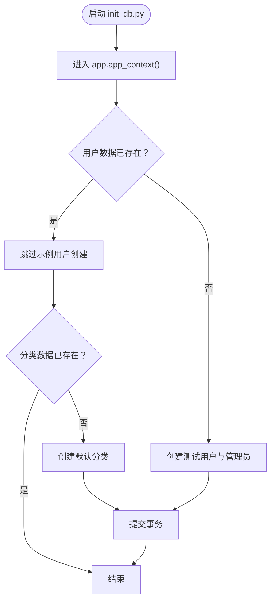
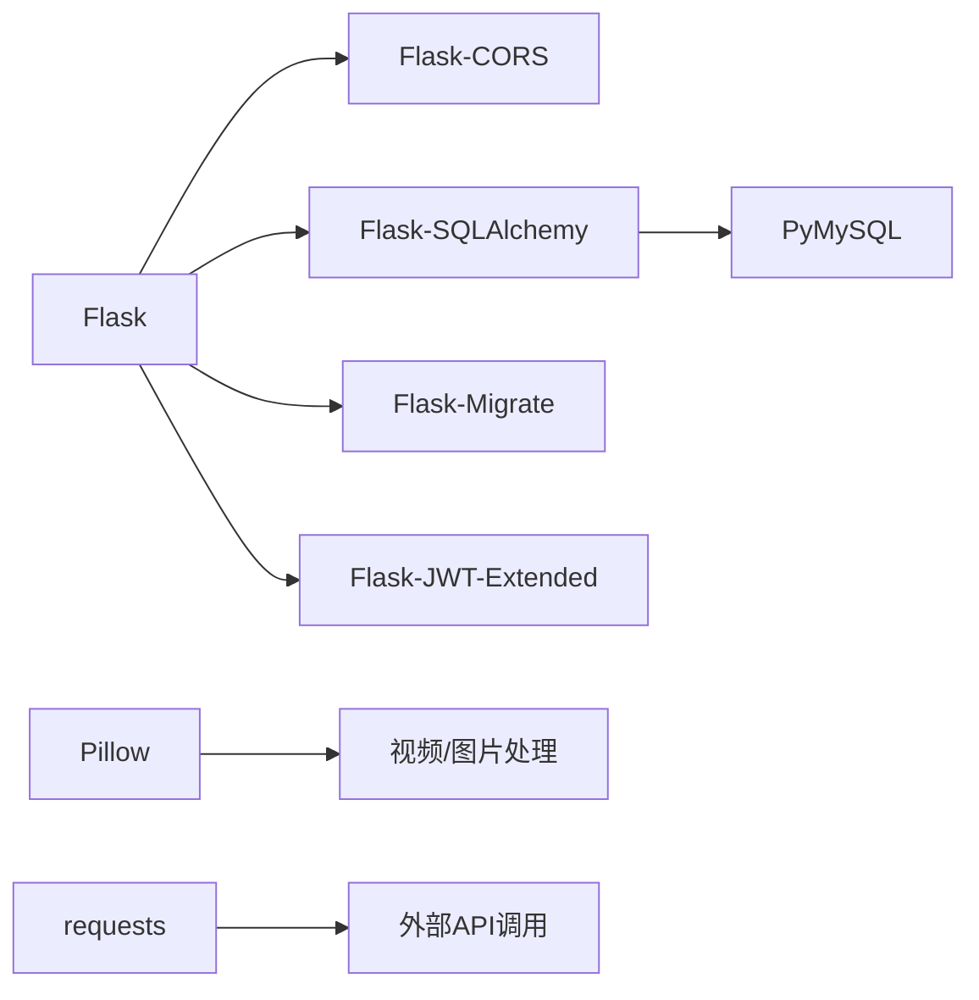

# 后端架构

<cite>
**本文引用的文件**
- [backend/app.py](file://backend/app.py)
- [backend/config.py](file://backend/config.py)
- [backend/models.py](file://backend/models.py)
- [backend/init_db.py](file://backend/init_db.py)
- [backend/routes/__init__.py](file://backend/routes/__init__.py)
- [backend/routes/auth.py](file://backend/routes/auth.py)
- [backend/routes/video.py](file://backend/routes/video.py)
- [backend/routes/user.py](file://backend/routes/user.py)
- [backend/routes/admin.py](file://backend/routes/admin.py)
- [backend/routes/interaction.py](file://backend/routes/interaction.py)
- [univideo_db.sql](file://univideo_db.sql)
- [backend/requirements.txt](file://backend/requirements.txt)
- [frontend/src/api.js](file://frontend/src/api.js)
</cite>

## 目录
1. [引言](#引言)
2. [项目结构](#项目结构)
3. [核心组件](#核心组件)
4. [架构总览](#架构总览)
5. [详细组件分析](#详细组件分析)
6. [依赖分析](#依赖分析)
7. [性能考虑](#性能考虑)
8. [故障排查指南](#故障排查指南)
9. [结论](#结论)
10. [附录](#附录)

## 引言
本文件面向UniVideo后端，围绕Flask应用初始化流程、数据模型定义与蓝图路由组织展开，系统化解析以下主题：
- 应用工厂模式与配置加载
- 蓝图（Blueprint）解耦用户、视频、互动、管理模块
- 核心数据模型（User、Video、Comment等）字段设计、关系映射与约束
- 配置管理与数据库初始化流程
- 身份验证与安全访问控制
- 后端服务启动流程与请求处理生命周期

## 项目结构
后端采用“应用工厂 + 蓝图”的分层组织方式，路由按功能拆分为独立模块，便于维护与扩展；数据模型集中于models.py并通过SQLAlchemy统一管理；配置与数据库初始化分别位于config.py与init_db.py。

图表来源
- [backend/app.py](file://backend/app.py#L1-L101)
- [backend/config.py](file://backend/config.py#L1-L66)
- [backend/models.py](file://backend/models.py#L1-L343)
- [backend/routes/__init__.py](file://backend/routes/__init__.py#L1-L5)
- [backend/init_db.py](file://backend/init_db.py#L1-L99)
- [frontend/src/api.js](file://frontend/src/api.js#L1-L40)

章节来源
- [backend/app.py](file://backend/app.py#L1-L101)
- [backend/config.py](file://backend/config.py#L1-L66)
- [backend/routes/__init__.py](file://backend/routes/__init__.py#L1-L5)

## 核心组件
- 应用工厂与蓝图注册：通过create_app集中初始化配置、扩展与蓝图，支持多环境配置切换与健康检查。
- 数据模型：User、Video、Category、Comment、Like、Collection，严格对应数据库表结构，定义外键、索引与联合唯一约束。
- 路由蓝图：auth、video、user、admin、interaction五个蓝图，分别覆盖认证、视频、用户中心、管理、互动功能。
- 配置管理：开发、测试、生产三套配置，支持环境变量覆盖与数据库连接配置。
- 数据库初始化：init_db.py用于创建默认分类与示例用户，配合univideo_db.sql完成表结构初始化。

章节来源
- [backend/app.py](file://backend/app.py#L1-L101)
- [backend/models.py](file://backend/models.py#L1-L343)
- [backend/config.py](file://backend/config.py#L1-L66)
- [backend/init_db.py](file://backend/init_db.py#L1-L99)
- [univideo_db.sql](file://univideo_db.sql#L1-L76)

## 架构总览
后端采用Flask应用工厂模式，通过蓝图将业务模块解耦，模型层基于SQLAlchemy实现安全高效的数据访问。前端通过Axios拦截器在请求头中透传用户ID，后端路由通过请求头读取用户ID实现简易的身份校验。

图表来源
- [backend/app.py](file://backend/app.py#L1-L101)
- [backend/config.py](file://backend/config.py#L1-L66)
- [backend/models.py](file://backend/models.py#L1-L343)
- [backend/routes/auth.py](file://backend/routes/auth.py#L1-L184)
- [backend/routes/video.py](file://backend/routes/video.py#L1-L282)
- [backend/routes/user.py](file://backend/routes/user.py#L1-L271)
- [backend/routes/admin.py](file://backend/routes/admin.py#L1-L245)
- [backend/routes/interaction.py](file://backend/routes/interaction.py#L1-L408)

## 详细组件分析

### 应用工厂与蓝图组织
- 应用工厂create_app负责：
  - 加载配置（开发/测试/生产）
  - 初始化SQLAlchemy与Flask-Migrate
  - 初始化CORS
  - 确保上传目录存在
  - 注册认证、视频、管理、互动、用户蓝图，url_prefix区分命名空间
- 根路由与健康检查：
  - 根路由用于服务可用性测试
  - 健康检查接口通过SQLAlchemy执行简单查询验证数据库连通性

图表来源
- [backend/app.py](file://backend/app.py#L1-L101)

章节来源
- [backend/app.py](file://backend/app.py#L1-L101)

### 配置管理机制
- 基础配置Config包含密钥、上传目录、最大文件体积、允许的文件扩展名、数据库连接URI等。
- 环境配置类：
  - DevelopmentConfig：开启调试与测试标志
  - TestingConfig：使用内存数据库，适合单元测试
  - ProductionConfig：要求真实密钥，关闭调试
- 配置字典config提供按环境选择的入口。

图表来源
- [backend/config.py](file://backend/config.py#L1-L66)

章节来源
- [backend/config.py](file://backend/config.py#L1-L66)

### 数据模型设计与关系映射
- User模型
  - 字段：主键、用户名（唯一）、密码哈希、昵称、角色、头像、创建时间
  - 关系：videos（上传）、comments（评论）、likes（点赞）、collections（收藏）、favorites（收藏视频集合）
  - 方法：set_password、check_password、is_admin、to_dict
- Category模型
  - 字段：主键、分类名称（唯一）
  - 关系：videos（多对一）
- Video模型
  - 字段：主键、标题、简介、封面路径、视频路径、状态（待审核/已发布/已驳回）、播放量、创建时间、外键user_id、category_id
  - 关系：comments、likes、collections
  - 方法：get_collections_count、get_likes_count、to_dict
- Comment模型
  - 字段：主键、内容、创建时间、user_id、video_id、parent_id、root_id
  - 自关联：parent/children、root/all_replies
  - 索引：idx_video_root（优化楼层回复查询）
- Like模型
  - 字段：主键、user_id、video_id、created_at
  - 约束：联合唯一（unique_like），防止重复点赞
- Collection模型
  - 字段：主键、user_id、video_id、created_at
  - 约束：联合唯一（unique_collection），防止重复收藏

图表来源
- [backend/models.py](file://backend/models.py#L1-L343)
- [univideo_db.sql](file://univideo_db.sql#L1-L76)

章节来源
- [backend/models.py](file://backend/models.py#L1-L343)
- [univideo_db.sql](file://univideo_db.sql#L1-L76)

### 蓝图与路由职责
- auth蓝图
  - /api/auth/register：注册，校验字段、用户名唯一、密码强度、入库
  - /api/auth/login：登录，校验用户名与密码，返回用户信息
  - /api/auth/me：获取当前用户信息（通过请求头X-User-Id透传）
- video蓝图
  - /api/videos/categories：获取分类列表
  - /api/videos/upload：视频上传，校验文件类型、生成唯一文件名、写入数据库并设置状态（管理员直发，普通用户待审核）
  - /api/videos/list：获取已发布视频列表，支持关键词与分类筛选
  - /api/videos/<id>：获取视频详情，播放量+1
- user蓝图
  - /api/users/me：获取当前用户信息（查询参数user_id）
  - /api/users/me（PUT）：修改昵称、密码、头像上传
  - /api/users/me/videos：获取当前用户所有视频（含各状态）
  - /api/users/me/collections：获取当前用户收藏的已发布视频
- admin蓝图
  - /api/admin/manage/list：管理列表（关键词与状态筛选）
  - /api/admin/audit/list：待审核列表（按上传时间升序）
  - /api/admin/audit/<video_id>（POST）：审核（approve/reject），更新状态
  - /api/admin/manage/video/<video_id>（DELETE）：删除视频（尝试删除物理文件与数据库记录）
- interaction蓝图
  - /api/videos/<video_id>/comments（POST）：发表评论，支持多级评论，计算root_id
  - /api/videos/<video_id>/collect（POST）：收藏/取消收藏
  - /api/videos/<video_id>/collect/status（GET）：查询收藏状态
  - /api/videos/<video_id>/like/status（GET）：查询点赞状态
  - /api/videos/<video_id>/comments（GET）：获取评论列表
  - /api/videos/<video_id>/like（POST）：点赞/取消点赞

图表来源
- [backend/routes/auth.py](file://backend/routes/auth.py#L1-L184)
- [backend/routes/user.py](file://backend/routes/user.py#L1-L271)
- [backend/routes/video.py](file://backend/routes/video.py#L1-L282)
- [backend/routes/admin.py](file://backend/routes/admin.py#L1-L245)
- [backend/routes/interaction.py](file://backend/routes/interaction.py#L1-L408)

章节来源
- [backend/routes/auth.py](file://backend/routes/auth.py#L1-L184)
- [backend/routes/user.py](file://backend/routes/user.py#L1-L271)
- [backend/routes/video.py](file://backend/routes/video.py#L1-L282)
- [backend/routes/admin.py](file://backend/routes/admin.py#L1-L245)
- [backend/routes/interaction.py](file://backend/routes/interaction.py#L1-L408)

### 身份验证与安全访问控制
- 当前实现：
  - 登录成功返回用户信息，前端将user_id存入localStorage
  - 通过Axios拦截器在请求头添加X-User-ID，后端路由通过请求头读取user_id进行简易身份透传
  - 路由内部对用户与视频的存在性进行校验
- 安全建议：
  - 引入JWT（Flask-JWT-Extended已在依赖中）以实现无状态令牌认证
  - 在需要鉴权的路由上增加装饰器或中间件，统一校验令牌与用户权限
  - 对敏感操作（如删除视频、审核）强制要求管理员角色校验

章节来源
- [backend/routes/auth.py](file://backend/routes/auth.py#L1-L184)
- [frontend/src/api.js](file://frontend/src/api.js#L1-L40)
- [backend/requirements.txt](file://backend/requirements.txt#L1-L45)

### 数据库初始化流程
- init_db.py在应用上下文中执行：
  - 若已有用户数据则跳过示例数据创建
  - 若分类为空则批量创建默认分类
  - 创建测试用户与管理员用户（密码经哈希处理）
  - 提交事务并输出提示信息
- 表结构由univideo_db.sql提供，包含外键、索引与约束，确保数据一致性与查询效率

图表来源
- [backend/init_db.py](file://backend/init_db.py#L1-L99)
- [univideo_db.sql](file://univideo_db.sql#L1-L76)

章节来源
- [backend/init_db.py](file://backend/init_db.py#L1-L99)
- [univideo_db.sql](file://univideo_db.sql#L1-L76)

## 依赖分析
- 外部依赖（部分）
  - Flask、Flask-CORS、Flask-SQLAlchemy、Flask-Migrate、PyMySQL、Flask-JWT-Extended、bcrypt、python-dotenv、Flask-WTF、Pillow、requests
- 组件耦合度
  - app.py集中初始化与注册，降低模块间耦合
  - models.py作为数据层，被各蓝图间接依赖
  - 路由蓝图内聚各自业务逻辑，通过db与模型交互

图表来源
- [backend/requirements.txt](file://backend/requirements.txt#L1-L45)

章节来源
- [backend/requirements.txt](file://backend/requirements.txt#L1-L45)

## 性能考虑
- 查询优化
  - Video表status建立索引，加速审核与发布筛选
  - Comment表idx_video_root索引，提升楼层回复查询效率
- I/O与存储
  - 上传文件采用唯一文件名与分目录存放，避免冲突与路径过长
  - 视频与封面路径以相对路径存储，结合静态资源服务提供完整URL
- 并发与事务
  - 路由中对异常进行回滚，保证数据一致性
  - 收藏/点赞通过联合唯一约束避免重复操作

章节来源
- [univideo_db.sql](file://univideo_db.sql#L1-L76)
- [backend/routes/video.py](file://backend/routes/video.py#L1-L282)
- [backend/routes/interaction.py](file://backend/routes/interaction.py#L1-L408)

## 故障排查指南
- 健康检查失败
  - 检查数据库连接URI与凭据
  - 确认数据库服务运行与网络可达
- 上传失败
  - 检查ALLOWED_VIDEO_EXTENSIONS与ALLOWED_IMAGE_EXTENSIONS配置
  - 确认UPLOAD_FOLDER目录权限与磁盘空间
- 路由返回401/404
  - 确认请求头X-User-ID是否正确传递
  - 校验user_id对应的用户是否存在
- 审核/删除异常
  - 检查视频状态是否符合预期
  - 确认物理文件删除权限与路径

章节来源
- [backend/app.py](file://backend/app.py#L73-L92)
- [backend/config.py](file://backend/config.py#L1-L66)
- [backend/routes/video.py](file://backend/routes/video.py#L1-L282)
- [backend/routes/admin.py](file://backend/routes/admin.py#L1-L245)
- [frontend/src/api.js](file://frontend/src/api.js#L1-L40)

## 结论
UniVideo后端采用清晰的应用工厂与蓝图架构，结合SQLAlchemy模型与数据库索引约束，实现了认证、视频、互动、管理等模块的高内聚低耦合。当前路由通过请求头透传用户ID实现简易身份校验，建议引入JWT以增强安全性与可扩展性。init_db与univideo_db.sql共同保障了开发与测试环境的快速搭建。

## 附录
- 启动流程
  - 执行univideo_db.sql创建数据库与表结构
  - 运行init_db.py初始化示例数据
  - 运行python app.py启动后端服务
- 常用接口
  - 认证：/api/auth/register、/api/auth/login、/api/auth/me
  - 视频：/api/videos/categories、/api/videos/upload、/api/videos/list、/api/videos/<id>
  - 用户：/api/users/me、/api/users/me（PUT）、/api/users/me/videos、/api/users/me/collections
  - 管理：/api/admin/manage/list、/api/admin/audit/list、/api/admin/audit/<video_id>、/api/admin/manage/video/<video_id>
  - 互动：/api/videos/<video_id>/comments、/api/videos/<video_id>/collect、/api/videos/<video_id>/collect/status、/api/videos/<video_id>/like、/api/videos/<video_id>/like/status