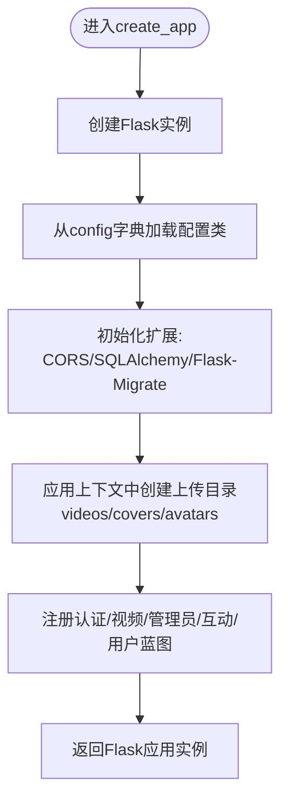

# 应用工厂模式

<cite>
**本文引用的文件**
- [backend/app.py](file://backend/app.py)
- [backend/config.py](file://backend/config.py)
- [backend/models.py](file://backend/models.py)
- [backend/routes/auth.py](file://backend/routes/auth.py)
- [backend/routes/video.py](file://backend/routes/video.py)
- [backend/routes/admin.py](file://backend/routes/admin.py)
- [backend/routes/interaction.py](file://backend/routes/interaction.py)
- [backend/routes/user.py](file://backend/routes/user.py)
- [backend/init_db.py](file://backend/init_db.py)
- [backend/requirements.txt](file://backend/requirements.txt)
</cite>

## 目录
1. [引言](#引言)
2. [项目结构](#项目结构)
3. [核心组件](#核心组件)
4. [架构总览](#架构总览)
5. [详细组件分析](#详细组件分析)
6. [依赖分析](#依赖分析)
7. [性能考虑](#性能考虑)
8. [故障排查指南](#故障排查指南)
9. [结论](#结论)
10. [附录](#附录)

## 引言
本文件围绕UniVideo后端的“应用工厂模式”展开，重点解析create_app函数的实现机制与控制流，说明如何通过配置名称（development、testing、production）动态加载不同配置类，以及CORS、SQLAlchemy、Flask-Migrate等扩展的初始化流程与应用上下文集成方式。同时，文档解释UPLOAD_FOLDER目录的自动创建机制、根路由与健康检查接口的实现逻辑，并结合config.py中的配置类结构，阐明SECRET_KEY、数据库连接URI、文件上传限制等核心配置项的加载优先级与安全实践。最后，提供应用启动时的执行流程图，并指出开发模式与生产模式的关键差异。

## 项目结构
后端采用“应用工厂+蓝图”的分层组织方式：
- 应用工厂：在app.py中定义create_app，集中初始化Flask应用、扩展与蓝图注册。
- 配置管理：在config.py中定义基础配置类与各环境配置类，并通过字典映射选择。
- 数据模型：在models.py中定义数据库模型，统一由SQLAlchemy管理。
- 路由模块：在routes目录下按功能拆分蓝图，分别注册到应用上。
- 数据初始化：init_db.py提供示例数据初始化脚本，演示如何在应用上下文中操作数据库。
- 依赖声明：requirements.txt列出后端所需第三方库。

图表来源
- [backend/app.py](file://backend/app.py#L15-L60)
- [backend/config.py](file://backend/config.py#L11-L66)
- [backend/models.py](file://backend/models.py#L1-L20)
- [backend/routes/auth.py](file://backend/routes/auth.py#L1-L20)
- [backend/routes/video.py](file://backend/routes/video.py#L1-L20)
- [backend/routes/admin.py](file://backend/routes/admin.py#L1-L20)
- [backend/routes/interaction.py](file://backend/routes/interaction.py#L1-L20)
- [backend/routes/user.py](file://backend/routes/user.py#L1-L20)
- [backend/init_db.py](file://backend/init_db.py#L24-L35)

章节来源
- [backend/app.py](file://backend/app.py#L15-L60)
- [backend/config.py](file://backend/config.py#L11-L66)
- [backend/models.py](file://backend/models.py#L1-L20)
- [backend/init_db.py](file://backend/init_db.py#L24-L35)

## 核心组件
- 应用工厂函数create_app：接收配置名称，创建Flask实例，加载配置，初始化扩展，注册蓝图，创建上传目录，返回应用实例。
- 配置类体系：Config为基础类，DevelopmentConfig/TestingConfig/ProductionConfig继承自Config，分别覆盖DEBUG、TESTING、SECRET_KEY等环境差异。
- 扩展初始化：CORS用于跨域；SQLAlchemy用于ORM；Flask-Migrate用于数据库迁移。
- 蓝图模块：认证、视频、管理员、互动、用户等模块化路由。
- 健康检查接口：/api/health用于检查服务与数据库连通性。
- 上传目录：在应用上下文中自动创建videos、covers、avatars三类子目录。

章节来源
- [backend/app.py](file://backend/app.py#L15-L60)
- [backend/config.py](file://backend/config.py#L11-L66)
- [backend/routes/auth.py](file://backend/routes/auth.py#L1-L20)
- [backend/routes/video.py](file://backend/routes/video.py#L1-L20)
- [backend/routes/admin.py](file://backend/routes/admin.py#L1-L20)
- [backend/routes/interaction.py](file://backend/routes/interaction.py#L1-L20)
- [backend/routes/user.py](file://backend/routes/user.py#L1-L20)

## 架构总览
应用工厂模式将应用创建与配置解耦，使同一套代码可在不同环境中灵活切换。create_app通过config[config_name]选择具体配置类，再依次初始化扩展与蓝图，最终形成可运行的应用实例。蓝图按功能划分，统一挂载到/api前缀下，便于前端调用。

图表来源
- [backend/app.py](file://backend/app.py#L15-L60)
- [backend/config.py](file://backend/config.py#L60-L66)

## 详细组件分析

### 应用工厂与配置加载
- create_app函数职责
  - 创建Flask实例
  - 依据config_name从config字典中选择配置类并加载
  - 初始化CORS、SQLAlchemy、Flask-Migrate
  - 在应用上下文中创建UPLOAD_FOLDER的videos、covers、avatars子目录
  - 注册认证、视频、管理员、互动、用户蓝图
  - 返回应用实例
- 配置加载优先级
  - SECRET_KEY：优先读取环境变量，开发环境提供默认值，生产环境要求显式设置
  - DATABASE_URL：优先读取环境变量，否则使用本地MySQL连接URI
  - UPLOAD_FOLDER：固定指向backend/static的绝对路径
  - MAX_CONTENT_LENGTH：统一限制上传大小
  - ALLOWED_*：限定允许的文件扩展名集合
- 环境差异
  - development：DEBUG=True，TESTING=False
  - testing：DEBUG=False，TESTING=True，数据库使用内存SQLite
  - production：DEBUG=False，TESTING=False，SECRET_KEY必须来自环境变量

图表来源
- [backend/app.py](file://backend/app.py#L15-L60)
- [backend/config.py](file://backend/config.py#L11-L66)

章节来源
- [backend/app.py](file://backend/app.py#L15-L60)
- [backend/config.py](file://backend/config.py#L11-L66)

### CORS、SQLAlchemy、Flask-Migrate初始化
- CORS：允许前端跨域访问，便于前后端分离开发与部署
- SQLAlchemy：作为db实例在models.py中定义，app.py中通过db.init_app(app)绑定应用上下文
- Flask-Migrate：通过Migrate(app, db)初始化，用于数据库迁移管理

图表来源
- [backend/app.py](file://backend/app.py#L23-L32)
- [backend/models.py](file://backend/models.py#L10-L12)

章节来源
- [backend/app.py](file://backend/app.py#L23-L32)
- [backend/models.py](file://backend/models.py#L10-L12)

### UPLOAD_FOLDER目录自动创建机制
- 在应用上下文中，通过os.makedirs在UPLOAD_FOLDER下创建videos、covers、avatars三个子目录，确保上传流程可用
- 该步骤在应用创建阶段执行，避免后续上传时出现目录不存在导致的异常

章节来源
- [backend/app.py](file://backend/app.py#L33-L38)

### 根路由与健康检查接口
- 根路由“/”用于快速确认服务是否正常运行
- 健康检查“/api/health”通过SQLAlchemy执行简单查询以验证数据库连通性，并返回服务状态、数据库状态与版本信息

图表来源
- [backend/app.py](file://backend/app.py#L65-L92)

章节来源
- [backend/app.py](file://backend/app.py#L65-L92)

### 蓝图注册与路由功能
- 认证蓝图：提供注册、登录、获取当前用户信息等接口
- 视频蓝图：提供分类查询、视频上传、列表查询、详情获取等接口
- 管理员蓝图：提供视频管理列表、待审核列表、审核与删除接口
- 互动蓝图：提供评论、点赞、收藏、状态查询等接口
- 用户蓝图：提供个人信息查询、修改资料（含头像上传）、我的视频与收藏列表等接口

章节来源
- [backend/routes/auth.py](file://backend/routes/auth.py#L1-L20)
- [backend/routes/video.py](file://backend/routes/video.py#L1-L20)
- [backend/routes/admin.py](file://backend/routes/admin.py#L1-L20)
- [backend/routes/interaction.py](file://backend/routes/interaction.py#L1-L20)
- [backend/routes/user.py](file://backend/routes/user.py#L1-L20)

### 数据模型与关系
- User、Category、Video、Comment、Like、Collection等模型严格对应数据库表结构
- 模型间通过外键与关系定义建立关联，如User与Video的一对多、Video与Comment/Collection/Like的多对一等
- 模型提供to_dict方法，便于序列化为API响应

章节来源
- [backend/models.py](file://backend/models.py#L14-L200)

### 示例数据初始化流程
- init_db.py在应用上下文中创建默认分类、测试用户与管理员用户
- 通过db.session批量提交，避免重复创建

章节来源
- [backend/init_db.py](file://backend/init_db.py#L28-L81)

## 依赖分析
- Flask生态：Flask、Flask-CORS、Flask-SQLAlchemy、Flask-Migrate、Flask-JWT-Extended（虽未在app.py直接使用，但requirements中包含）
- 数据库与驱动：SQLAlchemy、PyMySQL
- 工具与库：Werkzeug、bcrypt、python-dotenv、Flask-WTF、WTForms、python-dateutil、python-magic、Pillow、requests

图表来源
- [backend/requirements.txt](file://backend/requirements.txt#L1-L45)

章节来源
- [backend/requirements.txt](file://backend/requirements.txt#L1-L45)

## 性能考虑
- SQLALCHEMY_TRACK_MODIFICATIONS关闭：减少SQLAlchemy事件系统开销，节省内存
- 上传大小限制：MAX_CONTENT_LENGTH统一限制，避免过大请求占用资源
- 蓝图按功能拆分：降低单文件复杂度，提升可维护性与加载效率
- 健康检查轻量：仅执行简单查询，避免阻塞

## 故障排查指南
- 数据库连接失败
  - 检查DATABASE_URL环境变量或本地MySQL服务状态
  - 生产环境务必设置SECRET_KEY，否则会触发安全警告
- 上传失败或目录不存在
  - 确认UPLOAD_FOLDER路径与权限
  - 确认应用上下文已创建videos/covers/avatars子目录
- 跨域问题
  - 确认CORS已初始化，前端域名与请求头符合预期
- 健康检查报错
  - 检查数据库连通性与SQLAlchemy配置
  - 查看返回的错误信息定位具体异常

章节来源
- [backend/app.py](file://backend/app.py#L73-L92)
- [backend/config.py](file://backend/config.py#L11-L30)

## 结论
UniVideo后端通过应用工厂模式实现了清晰的环境隔离与扩展初始化流程。create_app集中管理配置加载、扩展绑定与蓝图注册，UPLOAD_FOLDER在应用上下文中自动创建，根路由与健康检查接口便于快速验证服务状态。配置类体系明确了开发、测试、生产三类环境的差异点，特别是SECRET_KEY与数据库连接URI的加载优先级与安全实践。蓝图按功能拆分，配合SQLAlchemy与Flask-Migrate，构建了可维护、可扩展的后端架构。

## 附录

### 开发模式与生产模式关键差异
- 开发模式
  - DEBUG=True，便于调试
  - SECRET_KEY提供默认值（开发专用），不建议在生产使用
- 生产模式
  - DEBUG=False，关闭调试
  - SECRET_KEY必须来自环境变量，确保安全
  - 数据库连接URI优先使用环境变量提供的DATABASE_URL

章节来源
- [backend/config.py](file://backend/config.py#L32-L57)
- [backend/app.py](file://backend/app.py#L94-L101)