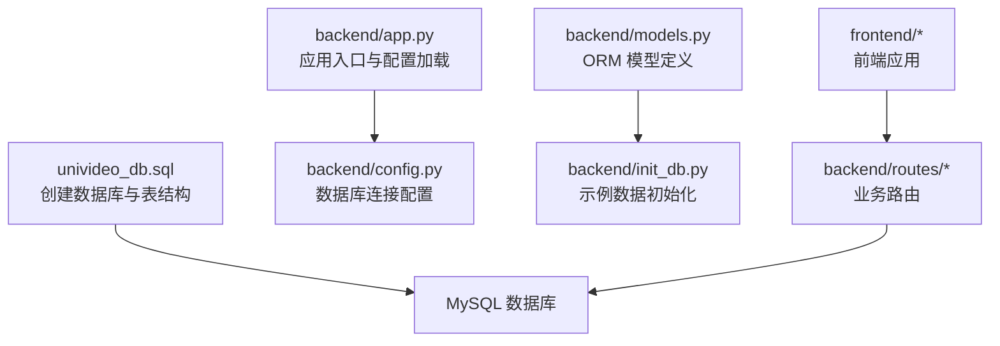
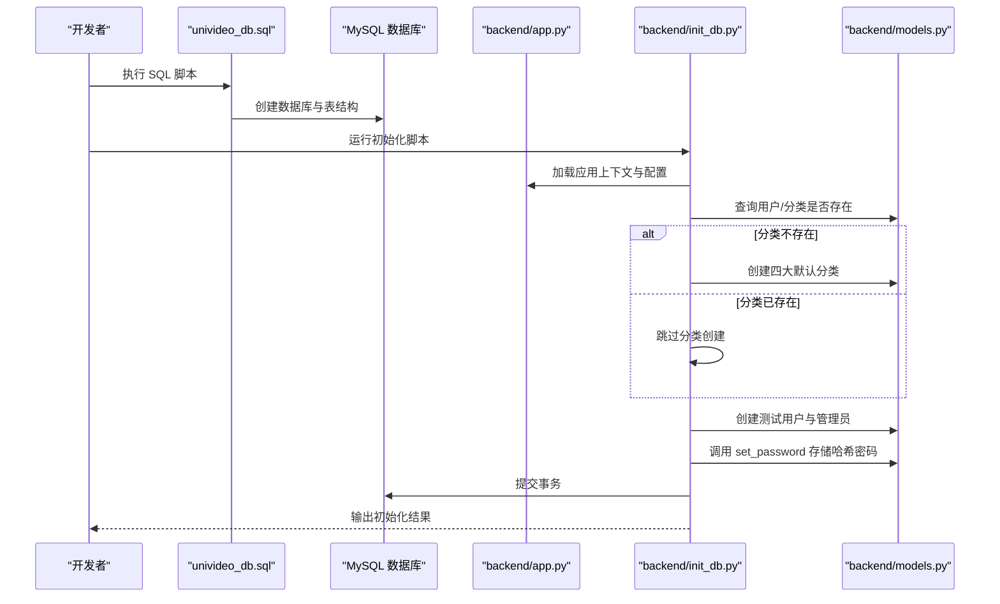
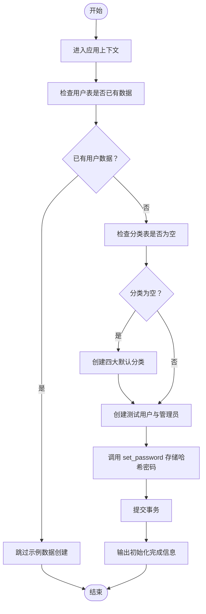
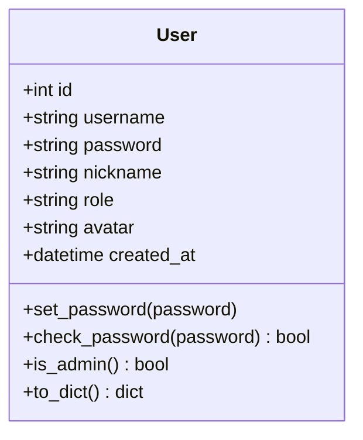
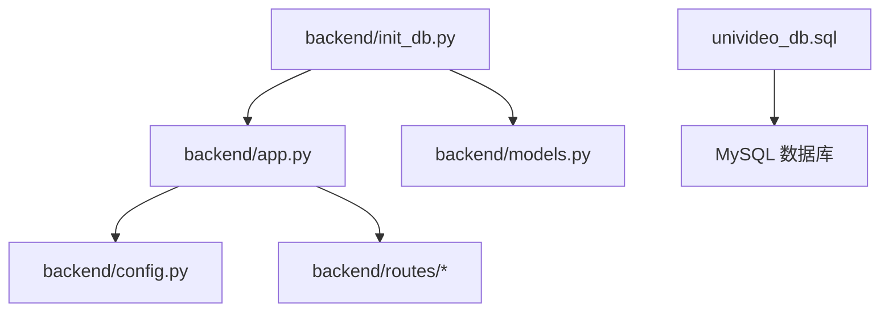

# 数据库初始化

<cite>
**本文引用的文件**
- [backend/init_db.py](file://backend/init_db.py)
- [univideo_db.sql](file://univideo_db.sql)
- [backend/models.py](file://backend/models.py)
- [backend/config.py](file://backend/config.py)
- [backend/app.py](file://backend/app.py)
</cite>

## 目录
1. [引言](#引言)
2. [项目结构](#项目结构)
3. [核心组件](#核心组件)
4. [架构总览](#架构总览)
5. [详细组件分析](#详细组件分析)
6. [依赖分析](#依赖分析)
7. [性能考虑](#性能考虑)
8. [故障排查指南](#故障排查指南)
9. [结论](#结论)
10. [附录](#附录)

## 引言
本技术文档围绕 UniVideo 的数据库初始化流程展开，重点解析 init_db.py 脚本的功能与执行逻辑，并阐明其与 univideo_db.sql 的职责分工：前者负责插入示例数据（默认分类、测试用户、管理员），后者负责创建数据库结构（表、索引、约束等）。文档将深入分析 create_sample_data 函数的执行流程、User 模型 set_password 方法在初始化中的应用、运行前提条件与典型错误处理，并给出数据库初始化的标准操作流程（SOP），最后强调生产环境中清除测试数据的重要性。

## 项目结构
- 后端核心文件位于 backend/ 目录，包含应用入口、配置、模型定义与初始化脚本。
- univideo_db.sql 位于仓库根目录，负责创建数据库与表结构。
- 前端位于 frontend/ 目录，与数据库初始化流程无直接耦合。

图表来源
- [univideo_db.sql](file://univideo_db.sql#L1-L76)
- [backend/app.py](file://backend/app.py#L1-L60)
- [backend/config.py](file://backend/config.py#L26-L30)
- [backend/models.py](file://backend/models.py#L14-L83)
- [backend/init_db.py](file://backend/init_db.py#L24-L33)

章节来源
- [backend/app.py](file://backend/app.py#L1-L60)
- [backend/config.py](file://backend/config.py#L26-L30)
- [univideo_db.sql](file://univideo_db.sql#L1-L76)

## 核心组件
- 数据库结构脚本：univideo_db.sql
  - 负责创建数据库、用户表、视频分类表、视频信息表、评论表、点赞表、收藏表及其索引与约束。
  - 在视频分类表中预置四大默认分类名称，确保后续初始化脚本无需重复创建。
- 示例数据初始化脚本：backend/init_db.py
  - 在执行前需确保数据库与表已存在（由 univideo_db.sql 完成）。
  - 通过检查现有用户数据避免重复插入；若分类不存在则创建四大默认分类。
  - 注册测试用户与管理员账号，使用 User 模型的 set_password 方法以哈希形式存储密码。
- ORM 模型：backend/models.py
  - 定义 User、Category、Video、Comment、Like、Collection 等模型，严格对应 univideo_db.sql 的表结构。
  - User 模型提供 set_password 与 check_password 方法，保障密码安全存储与校验。
- 应用配置：backend/config.py
  - 提供数据库连接 URI，默认指向本地 MySQL 数据库（univideo_db）。
  - 作为 init_db.py 运行时的数据库连接基础。

章节来源
- [univideo_db.sql](file://univideo_db.sql#L1-L76)
- [backend/init_db.py](file://backend/init_db.py#L24-L33)
- [backend/models.py](file://backend/models.py#L14-L83)
- [backend/config.py](file://backend/config.py#L26-L30)

## 架构总览
下面的序列图展示了数据库初始化的端到端流程：先执行 univideo_db.sql 创建结构，再运行 init_db.py 插入示例数据。

图表来源
- [univideo_db.sql](file://univideo_db.sql#L1-L76)
- [backend/init_db.py](file://backend/init_db.py#L28-L81)
- [backend/models.py](file://backend/models.py#L14-L83)
- [backend/app.py](file://backend/app.py#L1-L60)

## 详细组件分析

### init_db.py：示例数据初始化脚本
- 职责边界
  - 不负责创建数据库与表结构（由 univideo_db.sql 负责）。
  - 仅在数据库为空时插入默认分类与测试账号，避免重复创建。
- 关键流程
  - 应用上下文初始化：通过 app.app_context() 获取数据库会话。
  - 数据去重检查：若 User 表已有数据则直接返回，防止重复初始化。
  - 分类创建：若 Category 表为空，则批量创建四大默认分类。
  - 用户创建：分别创建测试用户与管理员用户，调用 set_password 存储哈希密码。
  - 提交事务：统一提交，保证原子性。
- 错误处理
  - 捕获异常并输出提示，建议检查 SQL 脚本是否执行、MySQL 服务是否运行、数据库连接配置是否正确。

图表来源
- [backend/init_db.py](file://backend/init_db.py#L28-L81)

章节来源
- [backend/init_db.py](file://backend/init_db.py#L24-L33)
- [backend/init_db.py](file://backend/init_db.py#L28-L81)

### univideo_db.sql：数据库结构定义
- 数据库与编码
  - 创建数据库并指定字符集与排序规则。
- 表结构与约束
  - 用户表：包含用户名唯一性、角色默认值、头像与注册时间等字段。
  - 视频分类表：唯一约束的分类名称，初始化时插入四大默认分类。
  - 视频信息表：外键关联用户与分类，状态字段实现“先审后发”机制，包含索引优化。
  - 评论表：支持多级评论的自关联结构，包含根评论与父评论字段及联合索引。
  - 点赞表与收藏表：联合唯一约束防止重复点赞/收藏。
- 初始化策略
  - 分类表在建表时即插入四大默认分类，配合 init_db.py 的去重逻辑，避免重复创建。

章节来源
- [univideo_db.sql](file://univideo_db.sql#L1-L76)

### User 模型与密码哈希
- set_password 方法
  - 使用安全散列算法生成密码哈希并存储，确保明文密码不会落盘。
- check_password 方法
  - 用于登录校验，将输入密码与存储的哈希进行比对。
- 在初始化脚本中的应用
  - 初始化测试用户与管理员时，调用 set_password 将明文密码转换为哈希后再入库。

图表来源
- [backend/models.py](file://backend/models.py#L14-L83)

章节来源
- [backend/models.py](file://backend/models.py#L42-L59)

### 应用配置与数据库连接
- 数据库连接 URI
  - 默认指向本地 MySQL 数据库（univideo_db），可由环境变量覆盖。
- 应用工厂
  - create_app 负责加载配置、初始化 SQLAlchemy 与 CORS，注册各业务蓝图。
- 健康检查
  - 提供 /api/health 接口用于检测数据库连接状态。

章节来源
- [backend/config.py](file://backend/config.py#L26-L30)
- [backend/app.py](file://backend/app.py#L1-L60)
- [backend/app.py](file://backend/app.py#L73-L92)

## 依赖分析
- init_db.py 依赖
  - app.py 中的应用上下文与数据库会话。
  - models.py 中的 User、Category 模型用于查询与写入。
- univideo_db.sql 依赖
  - MySQL 服务器与命令行客户端。
  - 与 models.py 的表结构保持严格一致，确保 ORM 与 SQL 定义同步。
- 配置依赖
  - config.py 提供数据库连接信息，init_db.py 通过 app.py 间接使用。

图表来源
- [backend/init_db.py](file://backend/init_db.py#L24-L33)
- [backend/app.py](file://backend/app.py#L1-L60)
- [backend/models.py](file://backend/models.py#L14-L83)
- [univideo_db.sql](file://univideo_db.sql#L1-L76)
- [backend/config.py](file://backend/config.py#L26-L30)

章节来源
- [backend/init_db.py](file://backend/init_db.py#L24-L33)
- [backend/app.py](file://backend/app.py#L1-L60)
- [backend/models.py](file://backend/models.py#L14-L83)
- [univideo_db.sql](file://univideo_db.sql#L1-L76)
- [backend/config.py](file://backend/config.py#L26-L30)

## 性能考虑
- 初始化脚本采用一次性提交，减少事务开销。
- 分类表在 SQL 层预先插入四大默认分类，避免 Python 层重复写入。
- 建议在生产环境禁用或移除初始化脚本，改用受控的迁移与种子数据流程。

## 故障排查指南
- 连接失败
  - 确认 MySQL 服务正在运行且端口可达。
  - 检查 DATABASE_URL 或本地默认连接配置是否正确。
- 结构未创建
  - 确保已先执行 univideo_db.sql 完成数据库与表结构创建。
- 重复初始化
  - 若 User 表已有数据，脚本会跳过示例数据创建；如需重新初始化，请清空相关表或手动删除测试数据。
- 权限问题
  - 确保数据库用户具备创建表与写入数据的权限。
- 生产环境风险
  - 初始化脚本仅用于开发测试；生产环境务必删除测试用户与管理员账号，避免安全风险。

章节来源
- [backend/init_db.py](file://backend/init_db.py#L83-L99)
- [backend/config.py](file://backend/config.py#L26-L30)

## 结论
- univideo_db.sql 与 init_db.py 各司其职：前者负责结构，后者负责示例数据。
- create_sample_data 函数通过去重检查与批量创建，确保初始化幂等与高效。
- User 模型的 set_password 方法在初始化阶段保证密码以哈希形式存储，符合安全最佳实践。
- 生产环境必须清除测试数据，遵循最小暴露面原则。

## 附录

### 标准操作流程（SOP）
- 步骤一：准备 MySQL 环境
  - 确保 MySQL 服务运行，具备创建数据库与表的权限。
- 步骤二：执行结构脚本
  - 在 MySQL 客户端中执行 univideo_db.sql，创建数据库与表结构。
- 步骤三：配置与启动
  - 设置或确认 DATABASE_URL，确保连接到正确的数据库。
  - 进入 backend 目录，运行初始化脚本。
- 步骤四：验证
  - 登录后台或使用健康检查接口确认数据库连接正常。
  - 在数据库中确认四大默认分类与测试账号已存在。
- 步骤五：清理测试数据（生产环境）
  - 删除测试用户与管理员账号，确保生产环境零暴露。

章节来源
- [univideo_db.sql](file://univideo_db.sql#L1-L76)
- [backend/init_db.py](file://backend/init_db.py#L83-L99)
- [backend/config.py](file://backend/config.py#L26-L30)
- [backend/app.py](file://backend/app.py#L73-L92)