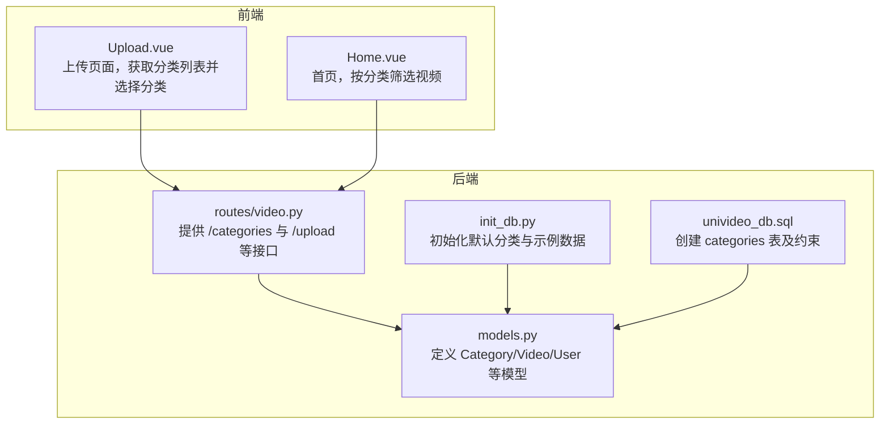
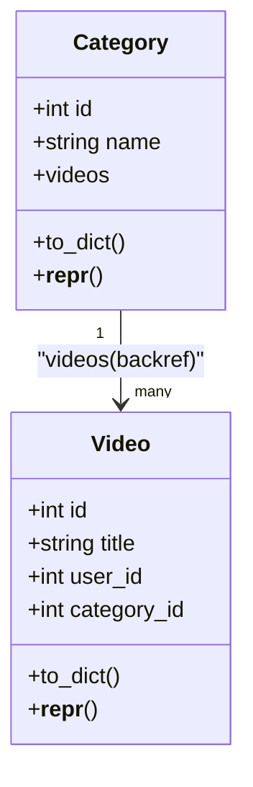
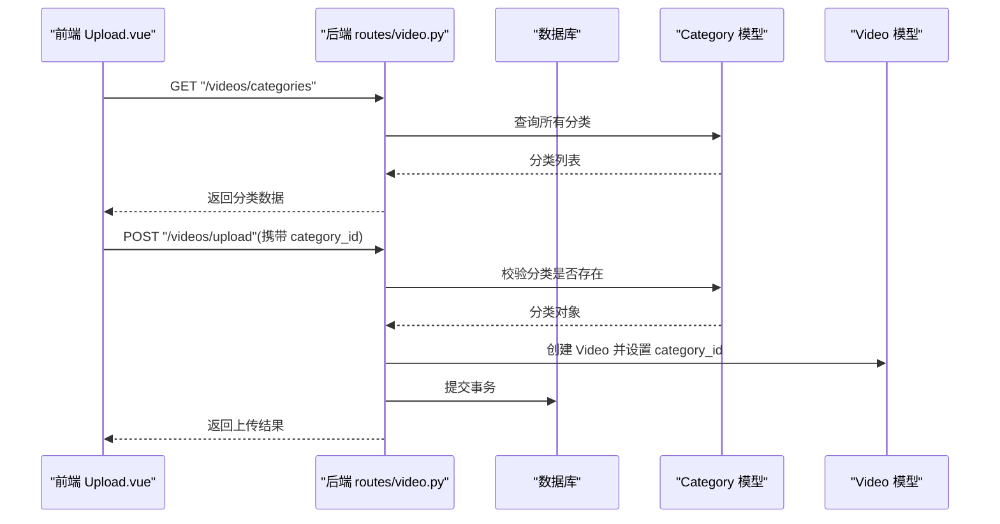
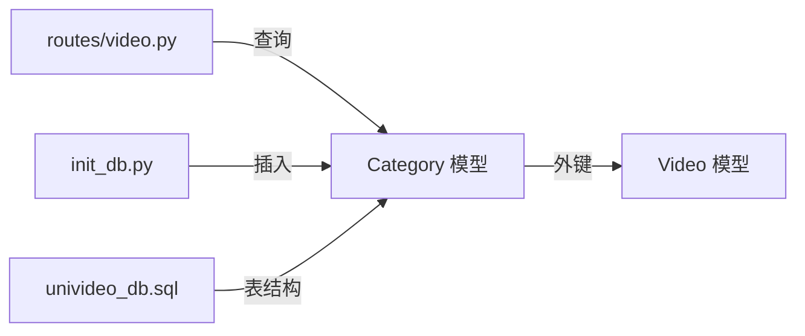

# 分类模型（Category）

<cite>
**本文引用的文件**
- [backend/models.py](file://backend/models.py)
- [univideo_db.sql](file://univideo_db.sql)
- [backend/routes/video.py](file://backend/routes/video.py)
- [backend/init_db.py](file://backend/init_db.py)
- [frontend/src/views/Upload.vue](file://frontend/src/views/Upload.vue)
- [frontend/src/views/Home.vue](file://frontend/src/views/Home.vue)
</cite>

## 目录
1. [引言](#引言)
2. [项目结构](#项目结构)
3. [核心组件](#核心组件)
4. [架构总览](#架构总览)
5. [详细组件分析](#详细组件分析)
6. [依赖分析](#依赖分析)
7. [性能考虑](#性能考虑)
8. [故障排查指南](#故障排查指南)
9. [结论](#结论)
10. [附录](#附录)

## 引言
本文件围绕视频分类模型 Category 的实现进行系统化技术说明，重点覆盖以下方面：
- 字段定义：id 与 name 的含义、约束与类型
- 唯一性与非空约束：name 字段的唯一性与非空要求
- 模型职责：为视频提供分类管理能力，支撑内容组织与筛选
- 关系映射：Category 与 Video 的一对多关系（Category.videos），backref 与 lazy='dynamic' 的查询优化意义
- 表结构一致性：categories 表的 SQL 结构（UNIQUE 约束与预置数据）与模型定义的一致性验证
- 使用示例：如何查询某一分类下的所有视频；如何在视频上传时关联分类

## 项目结构
本项目采用前后端分离架构，分类模型位于后端 SQLAlchemy ORM 层，前端通过 API 获取分类并用于上传与筛选。

图表来源
- [backend/models.py](file://backend/models.py#L85-L111)
- [backend/routes/video.py](file://backend/routes/video.py#L15-L35)
- [backend/init_db.py](file://backend/init_db.py#L39-L53)
- [univideo_db.sql](file://univideo_db.sql#L16-L21)

章节来源
- [backend/models.py](file://backend/models.py#L85-L111)
- [backend/routes/video.py](file://backend/routes/video.py#L15-L35)
- [backend/init_db.py](file://backend/init_db.py#L39-L53)
- [univideo_db.sql](file://univideo_db.sql#L16-L21)

## 核心组件
- Category 模型：代表视频分类，包含主键 id 与唯一且非空的 name 字段，并与 Video 建立一对多关系。
- Video 模型：包含外键 category_id，用于反向关联到 Category。
- 数据库表 categories：与 Category 模型严格对应，具备 id 主键与 name 唯一非空约束。
- 初始化脚本：在首次运行时插入默认分类（校园生活、课程学习、社团活动、娱乐搞笑）。
- 路由接口：提供获取分类列表的接口，供前端上传与筛选使用。
- 前端组件：上传页面获取分类列表并选择分类；首页支持按分类筛选视频。

章节来源
- [backend/models.py](file://backend/models.py#L85-L111)
- [backend/models.py](file://backend/models.py#L113-L198)
- [univideo_db.sql](file://univideo_db.sql#L16-L21)
- [backend/init_db.py](file://backend/init_db.py#L39-L53)
- [backend/routes/video.py](file://backend/routes/video.py#L15-L35)
- [frontend/src/views/Upload.vue](file://frontend/src/views/Upload.vue#L41-L52)
- [frontend/src/views/Home.vue](file://frontend/src/views/Home.vue#L47-L61)

## 架构总览
Category 在系统中的定位是“分类中心”，它通过外键与 Video 建立一对多关系，使视频能够归属到特定分类，从而实现内容组织与筛选。

图表来源
- [backend/models.py](file://backend/models.py#L85-L111)
- [backend/models.py](file://backend/models.py#L113-L198)

## 详细组件分析

### 字段定义与约束
- id：整型主键，自动递增，作为分类的唯一标识。
- name：字符串类型，长度上限 50，唯一且非空。该约束保证分类名称全局唯一，避免重复分类导致的内容混乱。
- 关系：videos 为一对多关系，指向 Video 模型，使用 backref='category'，使得 Video 对象可通过 category 属性访问所属分类。

章节来源
- [backend/models.py](file://backend/models.py#L85-L111)
- [univideo_db.sql](file://univideo_db.sql#L16-L21)

### 与 Video 的一对多关系
- 正向关系：Category.videos 为一对多，表示一个分类可包含多个视频。
- 反向关系：Video.category 通过 backref='category' 自动建立，便于在查询视频时同时获取其分类信息。
- 查询优化：lazy='dynamic' 使关系返回一个可延迟执行的查询对象，而非立即加载全部结果，适合大数据量场景下的分页与过滤。

章节来源
- [backend/models.py](file://backend/models.py#L85-L111)
- [backend/models.py](file://backend/models.py#L113-L198)

### 表结构一致性验证（categories 表）
- 主键：id 自增主键，与 Category.id 对应。
- 唯一性：name 唯一约束，与 Category.name 的唯一性约束一致。
- 非空性：name 非空，与 Category.name 的非空要求一致。
- 预置数据：SQL 中包含 INSERT IGNORE 的默认分类数据，初始化脚本也以相同名称创建默认分类，确保开发环境一致性。

章节来源
- [univideo_db.sql](file://univideo_db.sql#L16-L21)
- [backend/init_db.py](file://backend/init_db.py#L39-L53)

### 使用示例

#### 查询某一分类下的所有视频
- 方法一：通过 Category.videos 关系
  - 先获取分类对象，再访问其 videos 属性，得到该分类下所有视频的查询集合。
  - 可结合排序、过滤等操作，例如按创建时间倒序。
- 方法二：通过 Video.query.filter_by(category_id=分类ID)
  - 直接基于外键过滤，适用于仅需列表而无需完整对象关系的情况。

章节来源
- [backend/models.py](file://backend/models.py#L85-L111)
- [backend/models.py](file://backend/models.py#L113-L198)

#### 在视频上传时关联分类
- 前端上传页面会调用 /videos/categories 获取分类列表，并在表单中选择分类。
- 上传接口 /videos/upload 接收 category_id 参数，创建 Video 时将其赋给 category_id，从而完成分类关联。
- 上传流程还包含用户角色判断：管理员上传直接发布，普通用户上传进入待审核状态。

图表来源
- [frontend/src/views/Upload.vue](file://frontend/src/views/Upload.vue#L41-L52)
- [backend/routes/video.py](file://backend/routes/video.py#L15-L35)
- [backend/routes/video.py](file://backend/routes/video.py#L37-L171)
- [backend/models.py](file://backend/models.py#L85-L111)
- [backend/models.py](file://backend/models.py#L113-L198)

## 依赖分析
- Category 依赖于 SQLAlchemy 的 db.Model，使用 db.relationship 建立与 Video 的一对多关系。
- Video 依赖 Category 的外键（category_id），形成双向导航能力。
- 路由层通过 Category.query.all() 获取分类列表，供前端使用。
- 初始化脚本在首次运行时插入默认分类，确保开发环境具备基础数据。

图表来源
- [backend/models.py](file://backend/models.py#L85-L111)
- [backend/models.py](file://backend/models.py#L113-L198)
- [backend/routes/video.py](file://backend/routes/video.py#L15-L35)
- [backend/init_db.py](file://backend/init_db.py#L39-L53)
- [univideo_db.sql](file://univideo_db.sql#L16-L21)

章节来源
- [backend/models.py](file://backend/models.py#L85-L111)
- [backend/models.py](file://backend/models.py#L113-L198)
- [backend/routes/video.py](file://backend/routes/video.py#L15-L35)
- [backend/init_db.py](file://backend/init_db.py#L39-L53)
- [univideo_db.sql](file://univideo_db.sql#L16-L21)

## 性能考虑
- lazy='dynamic' 的优势：关系返回的是可延迟执行的查询对象，适合大数据量场景，避免一次性加载全部数据造成内存压力。
- 索引与约束：categories 表的 name 唯一约束与非空约束，有助于快速去重与校验；Video 的 category_id 外键与索引配合，提升按分类筛选的查询效率。
- 批量操作：初始化脚本一次性插入默认分类，减少后续重复创建的成本。

章节来源
- [backend/models.py](file://backend/models.py#L85-L111)
- [univideo_db.sql](file://univideo_db.sql#L16-L21)
- [backend/init_db.py](file://backend/init_db.py#L39-L53)

## 故障排查指南
- 分类名称重复导致插入失败
  - 现象：尝试创建同名分类时报唯一性约束错误。
  - 处理：确保 name 唯一，或先查询是否存在同名分类再决定是否创建。
- 分类不存在导致上传失败
  - 现象：上传接口校验 category_id 不存在时返回 404。
  - 处理：确认前端传入的 category_id 是否有效，或先刷新分类列表。
- 查询分类列表为空
  - 现象：/videos/categories 返回空列表。
  - 处理：确认初始化脚本是否已执行，或手动插入默认分类。

章节来源
- [backend/routes/video.py](file://backend/routes/video.py#L84-L91)
- [backend/routes/video.py](file://backend/routes/video.py#L15-L35)
- [backend/init_db.py](file://backend/init_db.py#L39-L53)

## 结论
Category 模型通过简洁明确的字段定义与严格的约束，为视频分类管理提供了可靠基础。其与 Video 的一对多关系配合 backref 与 lazy='dynamic'，既满足了内容组织与筛选需求，又兼顾了查询性能。数据库表结构与模型定义高度一致，并通过初始化脚本保障了开发环境的可用性。前端上传与筛选流程与后端接口紧密衔接，形成完整的分类使用闭环。

## 附录
- 前端上传页面会调用 /videos/categories 获取分类列表，并在上传时提交 category_id。
- 首页支持按分类筛选视频，参数 category_id 传入后端 /videos/list 接口进行过滤。

章节来源
- [frontend/src/views/Upload.vue](file://frontend/src/views/Upload.vue#L41-L52)
- [frontend/src/views/Home.vue](file://frontend/src/views/Home.vue#L47-L61)
- [backend/routes/video.py](file://backend/routes/video.py#L173-L226)