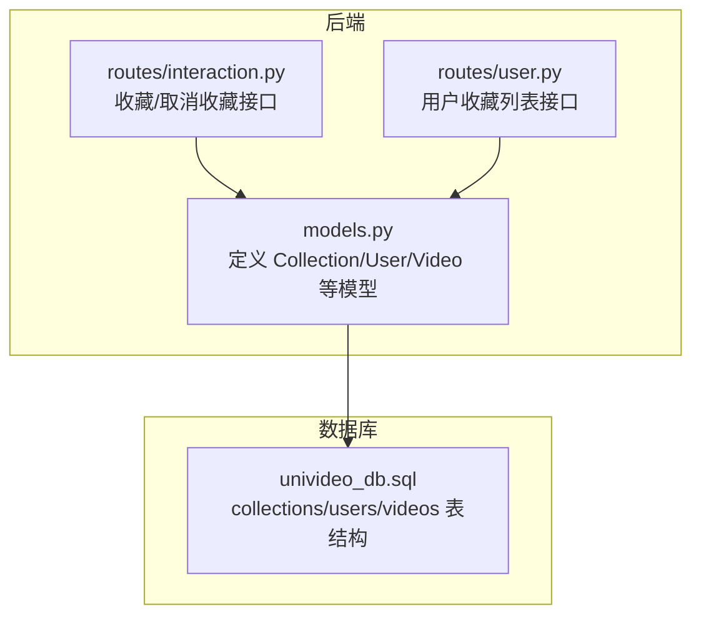
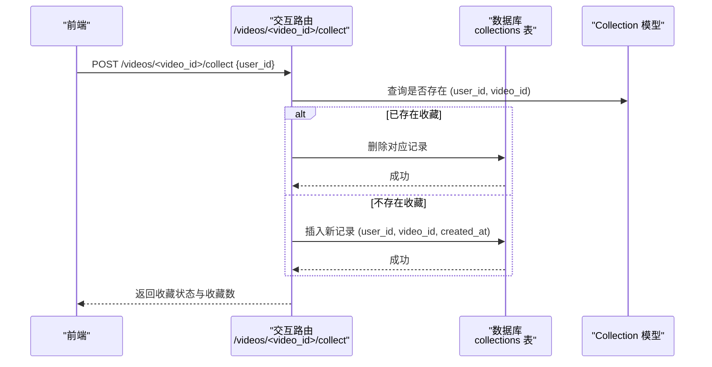
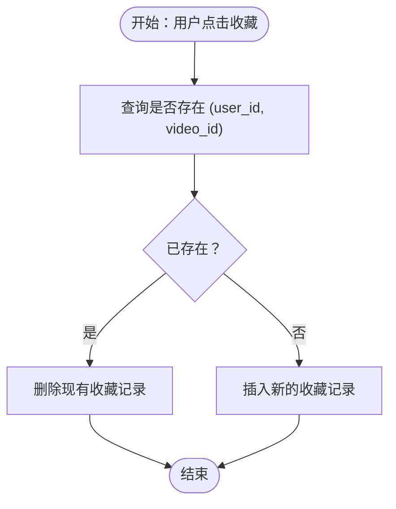
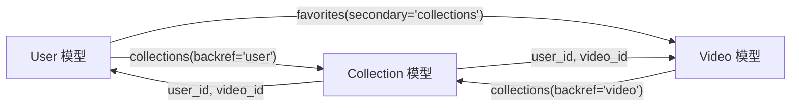

# 收藏模型 (Collection)

<cite>
**本文引用的文件**
- [models.py](file://backend/models.py)
- [univideo_db.sql](file://univideo_db.sql)
- [interaction.py](file://backend/routes/interaction.py)
- [user.py](file://backend/routes/user.py)
</cite>

## 目录
1. [简介](#简介)
2. [项目结构](#项目结构)
3. [核心组件](#核心组件)
4. [架构总览](#架构总览)
5. [详细组件分析](#详细组件分析)
6. [依赖分析](#依赖分析)
7. [性能考虑](#性能考虑)
8. [故障排查指南](#故障排查指南)
9. [结论](#结论)

## 简介
本文件围绕收藏模型 Collection 的实现进行系统化技术文档整理，重点覆盖以下方面：
- user_id 与 video_id 外键字段的业务含义与约束
- __table_args__ 中定义的联合唯一约束 unique_collection 如何保证收藏行为的幂等性
- 与 User、Video 的双向关系（backref='user'、backref='video'）及级联删除配置
- created_at 字段在记录收藏时间与排序中的作用
- 结合 collections 表的 SQL 定义，验证 UNIQUE KEY 与外键约束的实现
- User 模型中 favorites 关系通过 secondary='collections' 实现便捷的多对多访问，提升查询效率

## 项目结构
本项目采用前后端分离架构，后端使用 Flask + SQLAlchemy，收藏模型与相关路由位于 backend 目录中；数据库初始化脚本位于根目录的 univideo_db.sql。

图表来源
- [models.py](file://backend/models.py#L309-L343)
- [interaction.py](file://backend/routes/interaction.py#L114-L192)
- [user.py](file://backend/routes/user.py#L217-L256)
- [univideo_db.sql](file://univideo_db.sql#L67-L76)

章节来源
- [models.py](file://backend/models.py#L309-L343)
- [univideo_db.sql](file://univideo_db.sql#L67-L76)

## 核心组件
- Collection 模型：记录用户对视频的收藏关系，具备 user_id、video_id 外键与 created_at 时间戳，以及联合唯一约束 unique_collection。
- User 模型：通过 backref='user' 与 Collection 建立反向关系；通过 secondary='collections' 与 Video 建立多对多收藏关系（favorites），便于直接查询用户收藏的视频集合。
- Video 模型：通过 backref='video' 与 Collection 建立反向关系；通过 collections 关系统计收藏数。
- 数据库表 collections：由 univideo_db.sql 定义，包含 user_id、video_id、created_at、UNIQUE KEY 与外键约束。

章节来源
- [models.py](file://backend/models.py#L309-L343)
- [models.py](file://backend/models.py#L14-L83)
- [models.py](file://backend/models.py#L113-L198)
- [univideo_db.sql](file://univideo_db.sql#L67-L76)

## 架构总览
收藏功能涉及前端交互、后端路由处理与数据库模型三层协作。收藏/取消收藏流程通过交互路由触发，底层依赖 Collection 模型与数据库约束保证幂等性与一致性。

图表来源
- [interaction.py](file://backend/routes/interaction.py#L114-L192)
- [models.py](file://backend/models.py#L309-L343)
- [univideo_db.sql](file://univideo_db.sql#L67-L76)

## 详细组件分析

### Collection 类实现与字段语义
- 表名与主键
  - 表名：collections
  - 主键：id（自增）
- 外键字段
  - user_id：指向 users.id，ON DELETE CASCADE
  - video_id：指向 videos.id，ON DELETE CASCADE
- 时间戳
  - created_at：记录收藏发生的时间，默认为当前时间
- 联合唯一约束
  - unique_collection：确保 (user_id, video_id) 的唯一性，从而保证收藏行为的幂等性，避免重复收藏

章节来源
- [models.py](file://backend/models.py#L309-L343)
- [univideo_db.sql](file://univideo_db.sql#L67-L76)

### 与 User、Video 的双向关系与级联删除
- 与 User 的关系
  - User.collections：正向关系，表示用户拥有的收藏记录
  - Collection.user：反向关系，通过 backref='user' 提供从收藏记录访问用户的能力
  - 级联删除：cascade='all, delete-orphan'，当用户被删除或孤儿对象被清理时，对应的收藏记录也会被删除
- 与 Video 的关系
  - Video.collections：正向关系，表示视频被收藏的记录集合
  - Collection.video：反向关系，通过 backref='video' 提供从收藏记录访问视频的能力
  - 级联删除：同上，ON DELETE CASCADE 由数据库层保证
- User 的便捷多对多关系
  - User.favorites：通过 secondary='collections' 直接关联 Video，无需显式编写 JOIN 逻辑即可获取用户收藏的所有视频
  - 该关系常用于“我的收藏”等场景，提升查询效率

章节来源
- [models.py](file://backend/models.py#L14-L83)
- [models.py](file://backend/models.py#L113-L198)
- [models.py](file://backend/models.py#L309-L343)

### created_at 字段与排序
- created_at 字段用于记录收藏时间，支持按收藏时间进行排序
- 在用户收藏列表接口中，通过 Video.created_at 降序排列，使最新的收藏出现在列表顶部

章节来源
- [models.py](file://backend/models.py#L309-L343)
- [user.py](file://backend/routes/user.py#L217-L256)

### 幂等性保障：联合唯一约束 unique_collection
- 在 Python 层，Collection.__table_args__ 定义了联合唯一约束 unique_collection
- 在 SQL 层，univideo_db.sql 同样定义了 UNIQUE KEY unique_collection(user_id, video_id)
- 两者共同确保：
  - 同一用户无法对同一视频重复收藏
  - 若尝试重复收藏，数据库会拒绝插入，从而保证收藏行为的幂等性
- 交互路由 toggle_collect 的逻辑也体现了幂等性：若已存在收藏记录则删除，否则新增；不会产生重复条目

图表来源
- [interaction.py](file://backend/routes/interaction.py#L114-L192)
- [models.py](file://backend/models.py#L309-L343)
- [univideo_db.sql](file://univideo_db.sql#L67-L76)

### 多对多访问：User.favorites 通过 secondary='collections'
- User.favorites 使用 secondary='collections' 直接连接 Video，形成多对多关系
- 该关系在“我的收藏”页面中被广泛使用，可直接按 created_at 降序获取用户收藏的已发布视频
- 通过该便捷关系，应用无需手动拼接 JOIN 查询，即可高效获取收藏视频列表

章节来源
- [models.py](file://backend/models.py#L14-L83)
- [user.py](file://backend/routes/user.py#L217-L256)

## 依赖分析
- 模型依赖
  - Collection 依赖 User 与 Video 的外键关系
  - User 与 Video 通过 Collection 形成三者之间的关联
- 路由依赖
  - 交互路由 interaction.py 依赖 Collection 模型进行收藏/取消收藏
  - 用户路由 user.py 依赖 User.favorites 便捷关系获取收藏列表
- 数据库依赖
  - collections 表的外键与唯一约束由 univideo_db.sql 定义，Python 层通过 __table_args__ 与 ForeignKey/UniqueConstraint 保持一致

图表来源
- [models.py](file://backend/models.py#L14-L83)
- [models.py](file://backend/models.py#L113-L198)
- [models.py](file://backend/models.py#L309-L343)

## 性能考虑
- 外键与唯一约束
  - 数据库层的 UNIQUE KEY 与外键约束可有效防止脏数据，减少应用层冗余校验
- 级联删除
  - ON DELETE CASCADE 与 cascade='all, delete-orphan' 可降低垃圾数据残留风险，但需注意删除成本与影响范围
- 查询优化
  - User.favorites 通过 secondary='collections' 直接访问，避免复杂 JOIN
  - “我的收藏”按 Video.created_at 降序排序，有利于展示最新收藏
- 幂等性与事务
  - 交互路由在收藏/取消收藏时使用单条查询与单次提交，配合唯一约束，减少并发冲突概率

章节来源
- [models.py](file://backend/models.py#L14-L83)
- [models.py](file://backend/models.py#L113-L198)
- [models.py](file://backend/models.py#L309-L343)
- [interaction.py](file://backend/routes/interaction.py#L114-L192)
- [user.py](file://backend/routes/user.py#L217-L256)

## 故障排查指南
- 收藏失败或重复收藏
  - 症状：尝试收藏同一视频多次但无效果
  - 原因：数据库唯一约束阻止重复插入
  - 处理：确认前端逻辑是否正确调用取消收藏后再收藏，或直接使用收藏/取消收藏接口
- 收藏状态不一致
  - 症状：前端显示已收藏，但实际数据库无记录
  - 原因：并发场景下未正确处理幂等性
  - 处理：检查交互路由逻辑与数据库唯一约束是否生效
- 用户或视频被删除后收藏记录异常
  - 症状：用户/视频删除后仍有收藏记录
  - 原因：级联删除配置缺失或未启用
  - 处理：确认数据库外键约束与 Python 层 cascade 配置均正确
- “我的收藏”列表为空
  - 症状：用户收藏的视频未显示
  - 原因：过滤条件可能限制为已发布视频，或收藏尚未同步
  - 处理：检查 User.favorites 的过滤条件与 created_at 排序

章节来源
- [interaction.py](file://backend/routes/interaction.py#L114-L192)
- [models.py](file://backend/models.py#L309-L343)
- [user.py](file://backend/routes/user.py#L217-L256)

## 结论
Collection 模型通过明确的外键关系、联合唯一约束与便捷的多对多关系，实现了可靠的收藏功能。其与 User、Video 的双向关系与级联删除配置，既保证了数据一致性，又提升了查询效率。结合数据库层的约束与交互路由的幂等逻辑，系统能够稳定地支撑收藏/取消收藏的常见业务场景。