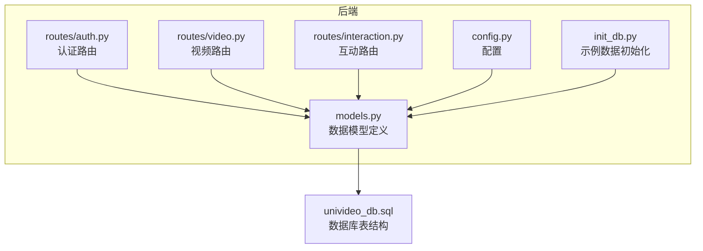
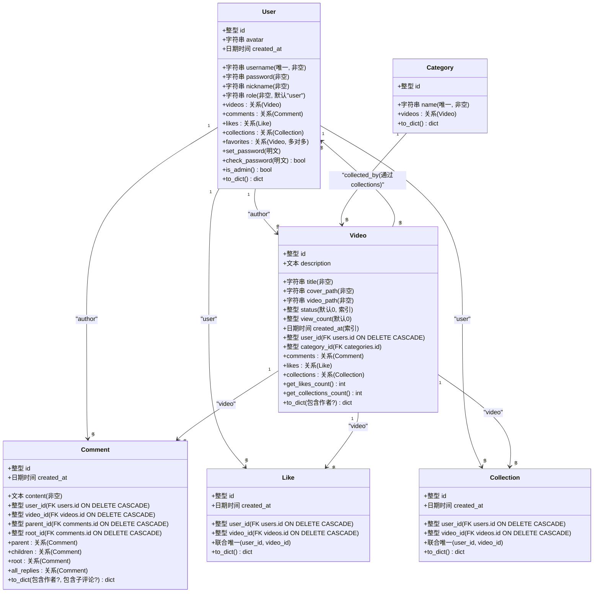
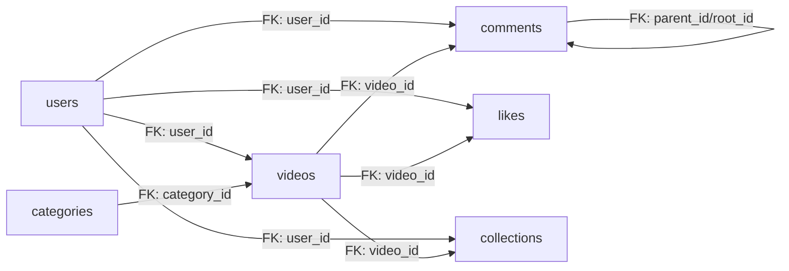
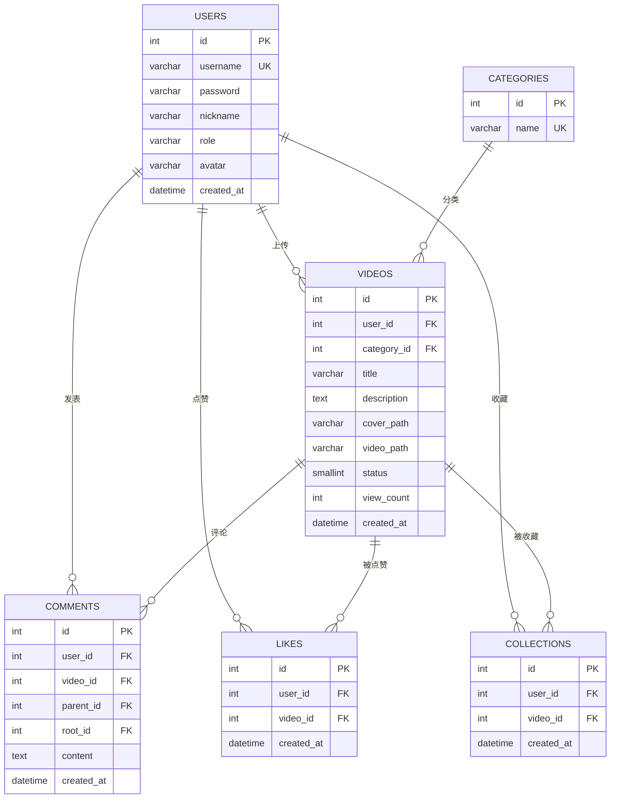
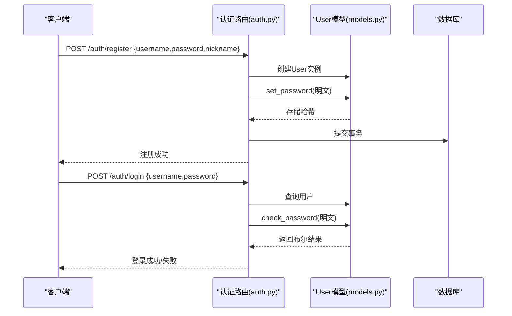
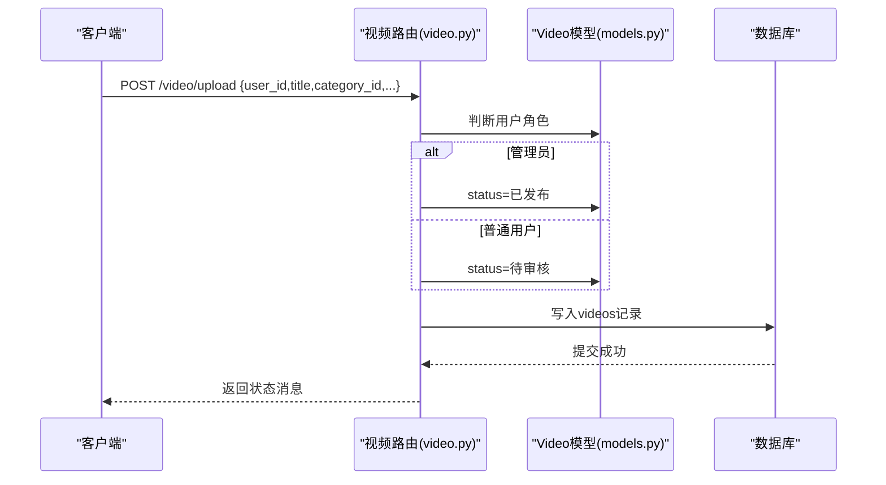
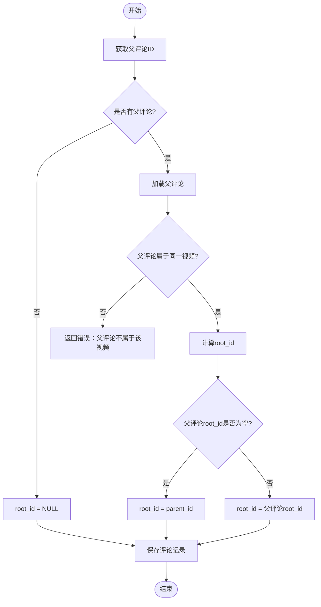

# 数据模型定义

<cite>
**本文引用的文件**
- [models.py](file://backend/models.py)
- [univideo_db.sql](file://univideo_db.sql)
- [auth.py](file://backend/routes/auth.py)
- [video.py](file://backend/routes/video.py)
- [interaction.py](file://backend/routes/interaction.py)
- [config.py](file://backend/config.py)
- [init_db.py](file://backend/init_db.py)
</cite>

## 目录
1. [引言](#引言)
2. [项目结构](#项目结构)
3. [核心组件](#核心组件)
4. [架构总览](#架构总览)
5. [详细组件分析](#详细组件分析)
6. [依赖分析](#依赖分析)
7. [性能考虑](#性能考虑)
8. [故障排查指南](#故障排查指南)
9. [结论](#结论)
10. [附录](#附录)

## 引言
本文件面向UniVideo后端数据模型，围绕User、Video、Comment、Category、Like、Collection六大模型展开，系统梳理字段定义、数据类型、约束条件（唯一性、非空、外键级联删除），并深入解析以下关键点：
- User模型的密码哈希机制（set_password/check_password）与角色权限判断（is_admin）
- Video模型的状态机设计（STATUS_PENDING/PUBLISHED/REJECTED）与“先审后发”业务逻辑
- Comment模型的多级评论实现机制（parent_id与root_id双字段设计）及其查询优化策略
- Like与Collection模型的联合唯一约束，防止重复操作
- 各模型之间的关系映射（一对多、多对多、自关联）及SQLAlchemy实现方式
- 结合univideo_db.sql验证模型与数据库表结构的一致性，并给出ER图建议

## 项目结构
后端采用Flask + SQLAlchemy，数据模型集中于backend/models.py，配合univideo_db.sql定义数据库表结构。路由层位于backend/routes/，分别处理认证、视频、互动等功能。

图表来源
- [models.py](file://backend/models.py#L1-L343)
- [univideo_db.sql](file://univideo_db.sql#L1-L76)
- [auth.py](file://backend/routes/auth.py#L1-L184)
- [video.py](file://backend/routes/video.py#L1-L282)
- [interaction.py](file://backend/routes/interaction.py#L1-L408)
- [config.py](file://backend/config.py#L1-L66)
- [init_db.py](file://backend/init_db.py#L1-L99)

章节来源
- [models.py](file://backend/models.py#L1-L343)
- [univideo_db.sql](file://univideo_db.sql#L1-L76)
- [config.py](file://backend/config.py#L1-L66)

## 核心组件
本节概述六大模型的职责与关键字段，后续章节将逐项深入。

- User：用户基本信息与认证数据，提供密码哈希与角色判断能力
- Category：视频分类，用于内容归类
- Video：视频元数据与状态机，承载“先审后发”流程
- Comment：评论系统，支持多级回复与对话串聚合
- Like：用户对视频的点赞关系
- Collection：用户对视频的收藏关系

章节来源
- [models.py](file://backend/models.py#L14-L343)

## 架构总览
下面以类图展示模型间的关系映射与外键约束，体现一对多、多对多、自关联等关系。

图表来源
- [models.py](file://backend/models.py#L14-L343)

章节来源
- [models.py](file://backend/models.py#L14-L343)

## 详细组件分析

### User模型
- 字段与约束
  - id：主键，自增
  - username：字符串，长度上限50，唯一且非空，建立索引
  - password：字符串，长度上限255，非空（存储哈希）
  - nickname：字符串，长度上限50，非空
  - role：字符串，长度上限20，非空，默认“user”
  - avatar：字符串，长度上限255，默认空
  - created_at：日期时间，默认当前UTC时间
- 关系
  - videos：一对多，反向引用author，级联删除孤儿
  - comments：一对多，反向引用author，级联删除孤儿
  - likes：一对多，反向引用user，级联删除孤儿
  - collections：一对多，反向引用user，级联删除孤儿
  - favorites：多对多，通过collections中间表反向访问收藏的视频
- 密码哈希机制
  - set_password：接收明文，生成哈希后写入password
  - check_password：校验输入明文与存储哈希是否匹配
- 角色权限判断
  - is_admin：当role为“admin”时返回True
- 序列化
  - to_dict：输出常用字段，便于API响应

章节来源
- [models.py](file://backend/models.py#L14-L83)
- [auth.py](file://backend/routes/auth.py#L12-L79)

### Category模型
- 字段与约束
  - id：主键，自增
  - name：字符串，长度上限50，唯一且非空
- 关系
  - videos：一对多，反向引用category

章节来源
- [models.py](file://backend/models.py#L85-L111)

### Video模型
- 字段与约束
  - id：主键，自增
  - title：字符串，长度上限100，非空
  - description：文本
  - cover_path：字符串，长度上限255，非空
  - video_path：字符串，长度上限255，非空
  - status：小整型，取值0/1/2，0=待审核，1=已发布，2=已驳回，默认0，建立索引
  - view_count：整型，默认0
  - created_at：日期时间，默认当前UTC时间，建立索引
  - user_id：整型，外键users.id，ON DELETE CASCADE，非空
  - category_id：整型，外键categories.id，非空
- 关系
  - comments：一对多，反向引用video，级联删除孤儿
  - likes：一对多，反向引用video，级联删除孤儿
  - collections：一对多，反向引用video，级联删除孤儿
- 状态机与“先审后发”
  - STATUS_PENDING/PUBLISHED/REJECTED：通过status字段表达
  - 上传时根据用户角色决定初始状态：管理员直接发布，普通用户进入待审核
- 辅助方法
  - get_likes_count/get_collections_count：统计点赞/收藏数量
  - to_dict：序列化，包含作者与分类信息

章节来源
- [models.py](file://backend/models.py#L113-L198)
- [video.py](file://backend/routes/video.py#L129-L147)

### Comment模型
- 字段与约束
  - id：主键，自增
  - content：文本，非空
  - created_at：日期时间，默认当前UTC时间
  - user_id：整型，外键users.id，ON DELETE CASCADE，非空
  - video_id：整型，外键videos.id，ON DELETE CASCADE，非空
  - parent_id：整型，自关联comments.id，ON DELETE CASCADE（支持多级回复）
  - root_id：整型，自关联comments.id，ON DELETE CASCADE（对话串聚合）
  - idx_video_root：联合索引(video_id, root_id)，优化按楼层查询
- 关系
  - parent：自关联，访问直接父评论
  - children：自关联，访问直接子评论
  - root：自关联，访问根评论
  - all_replies：自关联，访问根评论下的全部回复
- 多级评论实现与查询优化
  - parent_id指向直接父评论，root_id统一指向对话串根节点，便于按楼层聚合
  - idx_video_root(video_id, root_id)加速“某视频下某楼层的所有回复”的查询

章节来源
- [models.py](file://backend/models.py#L200-L271)
- [univideo_db.sql](file://univideo_db.sql#L40-L54)

### Like模型
- 字段与约束
  - id：主键，自增
  - created_at：日期时间，默认当前UTC时间
  - user_id：整型，外键users.id，ON DELETE CASCADE，非空
  - video_id：整型，外键videos.id，ON DELETE CASCADE，非空
  - unique_like：联合唯一(user_id, video_id)，防止重复点赞
- 序列化
  - to_dict：输出点赞记录

章节来源
- [models.py](file://backend/models.py#L273-L307)
- [univideo_db.sql](file://univideo_db.sql#L56-L65)

### Collection模型
- 字段与约束
  - id：主键，自增
  - created_at：日期时间，默认当前UTC时间
  - user_id：整型，外键users.id，ON DELETE CASCADE，非空
  - video_id：整型，外键videos.id，ON DELETE CASCADE，非空
  - unique_collection：联合唯一(user_id, video_id)，防止重复收藏
- 序列化
  - to_dict：输出收藏记录

章节来源
- [models.py](file://backend/models.py#L309-L343)
- [univideo_db.sql](file://univideo_db.sql#L67-L76)

## 依赖分析
- 外键与级联删除
  - users.id -> videos.user_id, comments.user_id, likes.user_id, collection.user_id：ON DELETE CASCADE
  - categories.id -> videos.category_id：无级联删除
  - comments.id -> comments.parent_id, comments.root_id：ON DELETE CASCADE
  - videos.id -> comments.video_id, likes.video_id, collection.video_id：ON DELETE CASCADE
- 索引
  - videos.status：加速审核查询
  - comments.idx_video_root(video_id, root_id)：加速楼层聚合查询
- 联合唯一
  - likes(unique_like)：user_id+video_id
  - collections(unique_collection)：user_id+video_id
- 多对多
  - User.favorites 通过中间表collections实现

图表来源
- [models.py](file://backend/models.py#L113-L343)
- [univideo_db.sql](file://univideo_db.sql#L23-L76)

章节来源
- [models.py](file://backend/models.py#L113-L343)
- [univideo_db.sql](file://univideo_db.sql#L23-L76)

## 性能考虑
- 索引策略
  - videos.status：提升审核流程查询效率
  - comments.idx_video_root(video_id, root_id)：显著优化“按楼层聚合回复”的查询
- 级联删除孤儿
  - 在User、Video、Comment、Like、Collection关系上启用级联删除孤儿，减少冗余数据
- 查询优化建议
  - 评论树渲染：利用root_id与idx_video_root，优先按楼层分组再展开子树
  - 视频列表：按status过滤已发布视频，结合分页与索引
- 文件存储
  - 上传路径与URL拼接在路由层完成，避免ORM层复杂逻辑

[本节为通用性能建议，不直接分析具体文件]

## 故障排查指南
- 认证问题
  - 注册/登录失败：检查用户名唯一性、密码长度与哈希一致性
  - 参考：注册调用set_password，登录调用check_password
- 上传与审核
  - 上传后状态不符合预期：确认用户角色与状态机逻辑
  - 参考：管理员直发，普通用户待审
- 评论异常
  - 回复楼层错乱：确认parent_id与root_id计算逻辑
  - 查询性能差：确认idx_video_root索引是否存在
- 互动重复操作
  - 点赞/收藏重复：联合唯一约束会阻止重复，若仍出现需检查业务层去重逻辑
- 数据库一致性
  - 若模型与表结构不一致，优先以univideo_db.sql为准，修正models.py

章节来源
- [auth.py](file://backend/routes/auth.py#L12-L79)
- [video.py](file://backend/routes/video.py#L129-L147)
- [interaction.py](file://backend/routes/interaction.py#L12-L112)
- [models.py](file://backend/models.py#L200-L271)
- [univideo_db.sql](file://univideo_db.sql#L23-L76)

## 结论
UniVideo的数据模型以清晰的外键关系与约束为基础，结合状态机与索引策略，有效支撑了“先审后发”“多级评论”“点赞/收藏”等核心业务。模型与数据库表结构高度一致，便于维护与扩展。建议在后续迭代中：
- 完善视频详情的权限控制（仅上传者与管理员可见待审视频）
- 评论树渲染时充分利用root_id与索引，优化前端渲染性能
- 在生产环境完善日志与监控，保障级联删除与唯一约束的稳定性

[本节为总结性内容，不直接分析具体文件]

## 附录

### 模型与数据库表结构一致性对照
- users：字段、类型、约束、注释与univideo_db.sql一致
- categories：字段、类型、唯一约束与univideo_db.sql一致
- videos：字段、类型、外键、索引、注释与univideo_db.sql一致
- comments：字段、类型、自关联、索引与univideo_db.sql一致
- likes：字段、类型、外键、联合唯一与univideo_db.sql一致
- collections：字段、类型、外键、联合唯一与univideo_db.sql一致

章节来源
- [models.py](file://backend/models.py#L14-L343)
- [univideo_db.sql](file://univideo_db.sql#L1-L76)

### ER图建议
基于模型关系绘制ER图，实体为User、Category、Video、Comment、Like、Collection，关系线标注基数与外键约束。该图为概念示意，不直接映射到具体源码文件。

[本图为概念示意，不直接映射到具体源码文件]

### 关键流程时序图

#### 用户注册与登录（密码哈希与校验）

图表来源
- [auth.py](file://backend/routes/auth.py#L12-L79)
- [models.py](file://backend/models.py#L42-L67)

#### 视频上传与状态机（管理员直发/普通用户待审）

图表来源
- [video.py](file://backend/routes/video.py#L129-L147)
- [models.py](file://backend/models.py#L113-L198)

#### 多级评论与楼层聚合（parent_id与root_id）

图表来源
- [interaction.py](file://backend/routes/interaction.py#L60-L93)
- [models.py](file://backend/models.py#L200-L271)