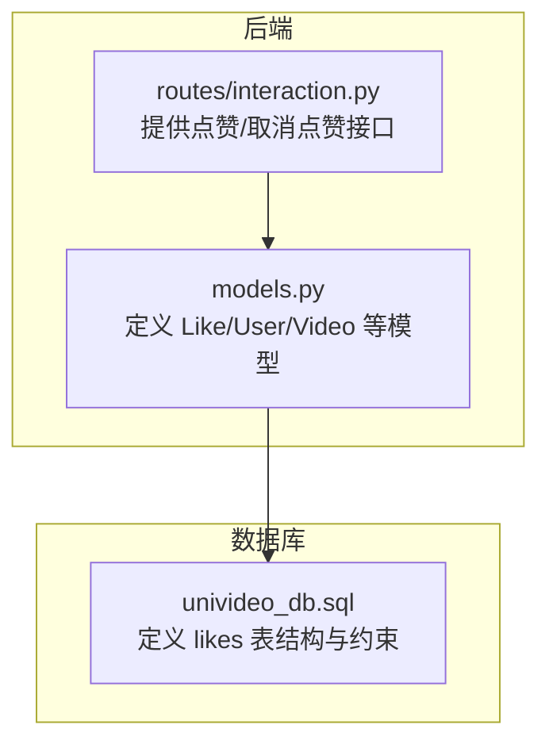
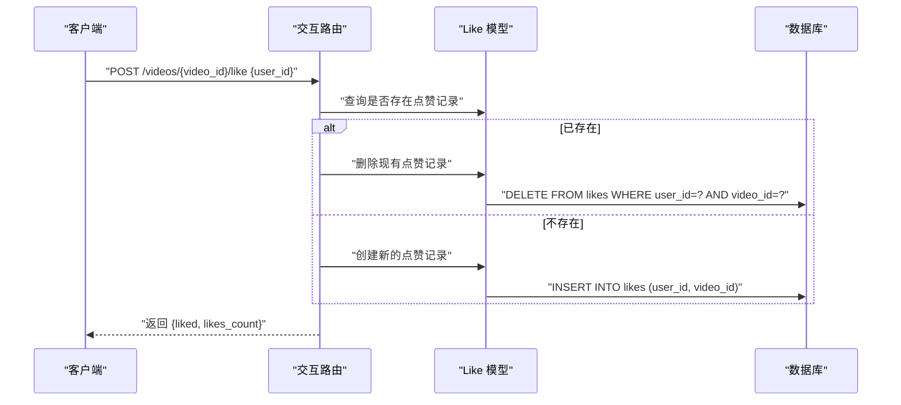
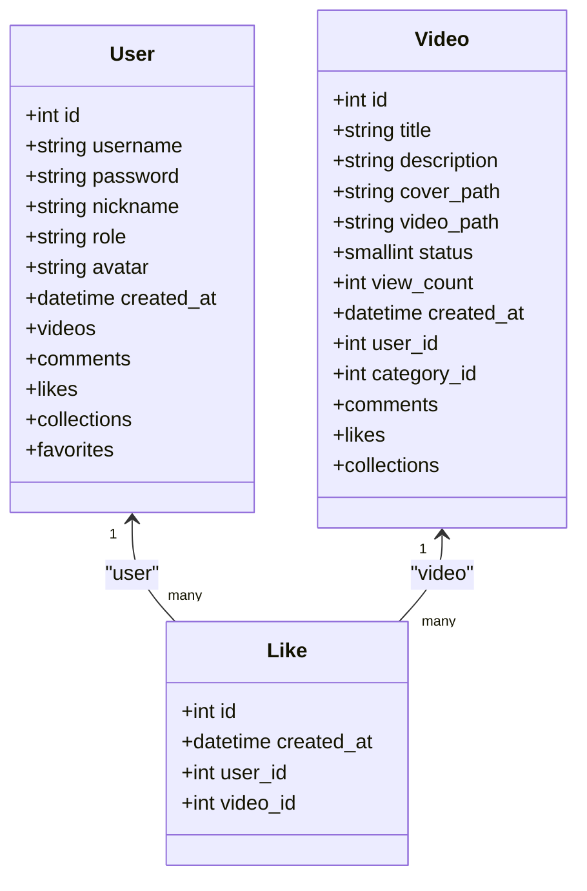
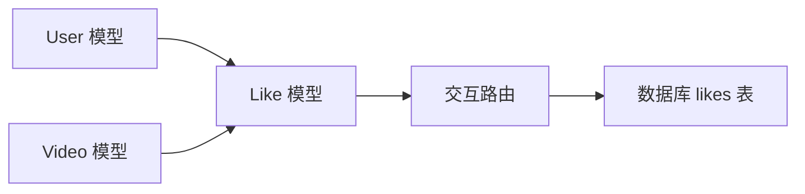

# 点赞模型 (Like)

<cite>
**本文引用的文件**
- [backend/models.py](file://backend/models.py)
- [univideo_db.sql](file://univideo_db.sql)
- [backend/routes/interaction.py](file://backend/routes/interaction.py)
</cite>

## 目录
1. [简介](#简介)
2. [项目结构](#项目结构)
3. [核心组件](#核心组件)
4. [架构概览](#架构概览)
5. [详细组件分析](#详细组件分析)
6. [依赖分析](#依赖分析)
7. [性能考虑](#性能考虑)
8. [故障排查指南](#故障排查指南)
9. [结论](#结论)
10. [附录](#附录)

## 简介
本文件围绕点赞模型（Like）进行精确技术说明，重点覆盖以下方面：
- user_id 与 video_id 外键字段及其 NOT NULL 约束
- __table_args__ 中定义的联合唯一约束 unique_like，如何防止同一用户对同一视频重复点赞
- 与 User、Video 的双向关系（backref='user'、backref='video'）及级联删除行为
- created_at 字段的审计用途
- 结合 likes 表的 SQL 定义，验证 UNIQUE KEY 与外键约束的一致性
- 使用场景示例：检查用户是否已点赞某视频、统计视频总点赞数

## 项目结构
点赞模型位于后端 ORM 层，与数据库表结构严格对应；同时在交互路由层提供点赞状态查询与切换接口。

图表来源
- [backend/models.py](file://backend/models.py#L273-L307)
- [univideo_db.sql](file://univideo_db.sql#L56-L65)
- [backend/routes/interaction.py](file://backend/routes/interaction.py#L241-L408)

章节来源
- [backend/models.py](file://backend/models.py#L273-L307)
- [univideo_db.sql](file://univideo_db.sql#L56-L65)
- [backend/routes/interaction.py](file://backend/routes/interaction.py#L241-L408)

## 核心组件
- Like 模型：记录用户对视频的点赞关系，具备 user_id、video_id 外键与 created_at 审计字段，并通过联合唯一约束 unique_like 防止重复点赞。
- User 模型：与 Like 的反向关系 backref='user'，支持“某用户的所有点赞”查询。
- Video 模型：与 Like 的反向关系 backref='video'，支持“某视频的所有点赞”查询。
- 交互路由：提供点赞状态查询与点赞/取消点赞的切换接口。

章节来源
- [backend/models.py](file://backend/models.py#L273-L307)
- [backend/models.py](file://backend/models.py#L14-L83)
- [backend/models.py](file://backend/models.py#L113-L198)
- [backend/routes/interaction.py](file://backend/routes/interaction.py#L241-L408)

## 架构概览
点赞流程涉及前端调用、后端路由处理、ORM 模型读写与数据库约束校验。

图表来源
- [backend/routes/interaction.py](file://backend/routes/interaction.py#L329-L408)
- [backend/models.py](file://backend/models.py#L273-L307)

## 详细组件分析

### Like 类实现与字段语义
- 表名映射：__tablename__ 指向 likes 表。
- 主键：id，自增。
- 审计字段：created_at，默认值为当前时间，用于记录点赞发生的时间点。
- 外键字段：
  - user_id：指向 users.id，NOT NULL，ON DELETE CASCADE。
  - video_id：指向 videos.id，NOT NULL，ON DELETE CASCADE。
- 联合唯一约束：__table_args__ 定义 (user_id, video_id) 的唯一性，确保同一用户对同一视频只能有一条点赞记录。
- 反向关系：
  - 与 User：backref='user'，允许通过 user.likes 查询某用户的所有点赞。
  - 与 Video：backref='video'，允许通过 video.likes 查询某视频的所有点赞。
- 级联删除：当用户或视频被删除时，对应的点赞记录也会被级联删除。

章节来源
- [backend/models.py](file://backend/models.py#L273-L307)

### 数据模型类图（基于实际源码）

图表来源
- [backend/models.py](file://backend/models.py#L14-L83)
- [backend/models.py](file://backend/models.py#L113-L198)
- [backend/models.py](file://backend/models.py#L273-L307)

### 约束与 SQL 对齐验证
- likes 表结构要点（来自 SQL 定义）：
  - user_id：NOT NULL
  - video_id：NOT NULL
  - UNIQUE KEY unique_like(user_id, video_id)
  - FOREIGN KEY user_id -> users(id) ON DELETE CASCADE
  - FOREIGN KEY video_id -> videos(id) ON DELETE CASCADE
- ORM 层映射：
  - user_id、video_id 均标注为 NOT NULL
  - 外键使用 db.ForeignKey 并设置 ondelete='CASCADE'
  - __table_args__ 定义联合唯一约束 unique_like
- 结论：ORM 与 SQL 在字段非空、唯一约束与外键级联删除上保持一致。

章节来源
- [univideo_db.sql](file://univideo_db.sql#L56-L65)
- [backend/models.py](file://backend/models.py#L273-L307)

### 业务流程与使用场景

#### 场景一：检查用户是否已点赞某视频
- 路由：GET /videos/{video_id}/like/status
- 参数：user_id（查询参数）
- 处理逻辑：根据 user_id 与 video_id 查询 likes 表是否存在记录，返回 liked 布尔状态。
- 典型调用路径参考：
  - [backend/routes/interaction.py](file://backend/routes/interaction.py#L241-L285)

章节来源
- [backend/routes/interaction.py](file://backend/routes/interaction.py#L241-L285)

#### 场景二：点赞/取消点赞切换
- 路由：POST /videos/{video_id}/like
- 参数：user_id（请求体）
- 处理逻辑：
  - 若存在点赞记录：删除该记录（取消点赞）
  - 若不存在点赞记录：插入一条新记录（点赞）
  - 返回当前 liked 状态与视频最新点赞总数
- 典型调用路径参考：
  - [backend/routes/interaction.py](file://backend/routes/interaction.py#L329-L408)

章节来源
- [backend/routes/interaction.py](file://backend/routes/interaction.py#L329-L408)

#### 场景三：统计视频的总点赞数
- 方法：Video.get_likes_count() 通过 video.likes.count() 统计
- 典型调用路径参考：
  - [backend/models.py](file://backend/models.py#L158-L165)
  - [backend/routes/interaction.py](file://backend/routes/interaction.py#L389-L399)

### 错误处理与边界情况
- 用户或视频不存在：路由层会返回 404
- 缺少必要参数（如 user_id）：返回 400
- 异常回滚：捕获异常后执行数据库回滚，避免不一致状态
- 重复点赞防护：由于联合唯一约束，重复插入会被数据库拒绝，ORM 层通过查询判断避免重复

章节来源
- [backend/routes/interaction.py](file://backend/routes/interaction.py#L329-L408)

## 依赖分析
- Like 模型依赖 User 与 Video 的外键关系，形成用户-视频-点赞的三元关系。
- 路由层依赖 Like 模型进行状态查询与切换，并依赖 Video 模型统计点赞数。
- 数据库层通过 likes 表的约束保证数据一致性。

图表来源
- [backend/models.py](file://backend/models.py#L14-L83)
- [backend/models.py](file://backend/models.py#L113-L198)
- [backend/models.py](file://backend/models.py#L273-L307)
- [backend/routes/interaction.py](file://backend/routes/interaction.py#L241-L408)
- [univideo_db.sql](file://univideo_db.sql#L56-L65)

章节来源
- [backend/models.py](file://backend/models.py#L14-L83)
- [backend/models.py](file://backend/models.py#L113-L198)
- [backend/models.py](file://backend/models.py#L273-L307)
- [backend/routes/interaction.py](file://backend/routes/interaction.py#L241-L408)
- [univideo_db.sql](file://univideo_db.sql#L56-L65)

## 性能考虑
- 联合唯一索引 unique_like(user_id, video_id)：有效防止重复点赞，同时作为唯一约束提升插入/查询效率。
- created_at 字段默认值为当前时间，便于审计与排序，建议在需要按时间排序的场景建立索引以优化查询。
- 点赞总数统计采用 count()，在数据量较大时建议评估缓存策略或物化视图以减少频繁统计开销。

## 故障排查指南
- 插入重复点赞报错：检查 user_id 与 video_id 是否已在 likes 表中存在，确认联合唯一约束生效。
- 级联删除异常：确认 User 或 Video 删除时是否触发 CASCADE 删除，确保外键关系完整。
- 状态查询失败：确认 GET /videos/{video_id}/like/status 的 user_id 参数是否传递正确，且视频与用户存在。
- 点赞/取消点赞接口异常：查看路由层返回的错误码与消息，定位参数缺失或数据库异常。

章节来源
- [backend/routes/interaction.py](file://backend/routes/interaction.py#L241-L408)
- [univideo_db.sql](file://univideo_db.sql#L56-L65)
- [backend/models.py](file://backend/models.py#L273-L307)

## 结论
Like 模型通过明确的外键约束、NOT NULL 约束与联合唯一约束，确保了“单用户对单视频仅一次点赞”的业务规则；配合 backref='user' 与 backref='video' 的双向关系，既满足查询需求也便于维护；created_at 字段提供了审计能力。结合 SQL 定义与 ORM 映射，整体实现与数据库约束保持高度一致，能够稳定支撑点赞与统计等核心功能。

## 附录
- 快速参考
  - 检查点赞状态：GET /videos/{video_id}/like/status?user_id={user_id}
  - 切换点赞：POST /videos/{video_id}/like {user_id}
  - 统计点赞数：调用 Video.get_likes_count()

章节来源
- [backend/routes/interaction.py](file://backend/routes/interaction.py#L241-L408)
- [backend/models.py](file://backend/models.py#L158-L165)