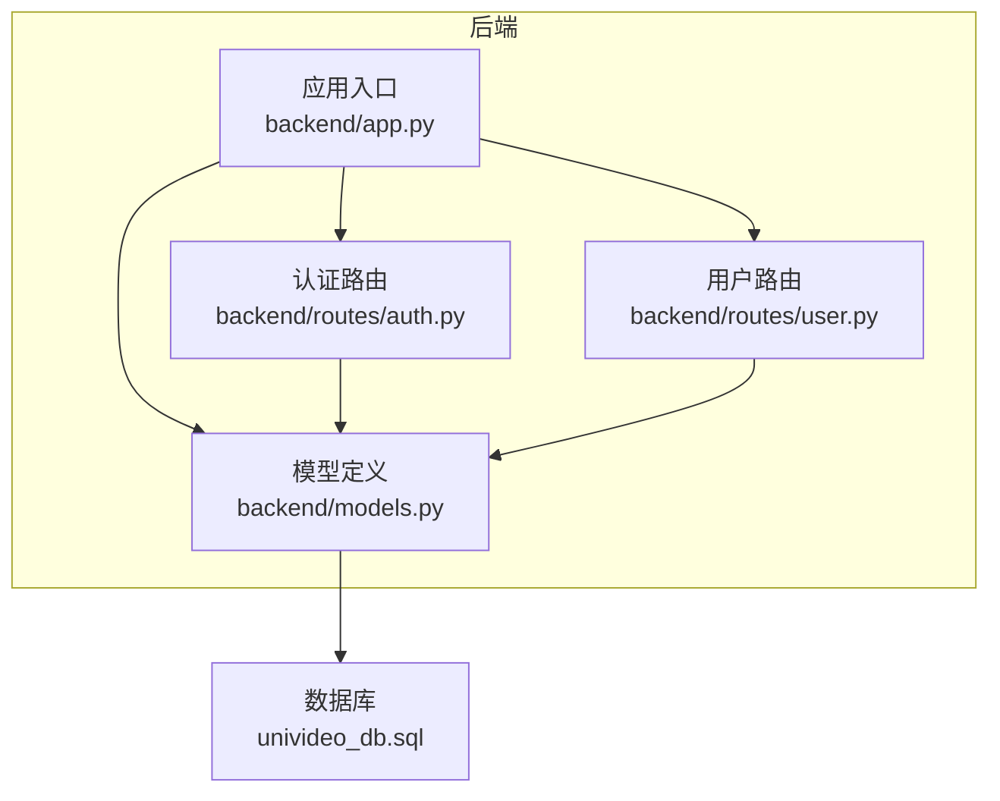
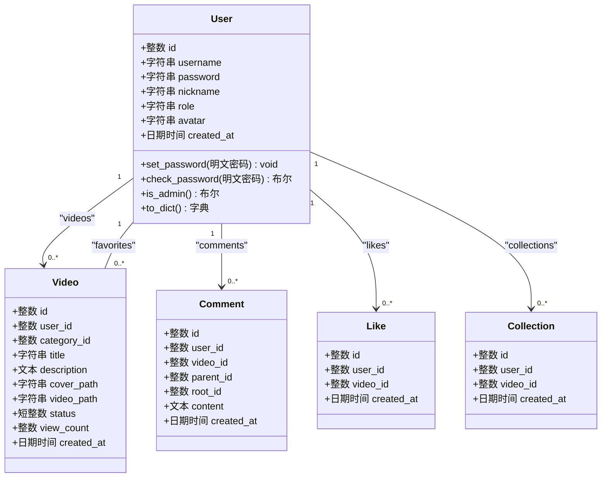
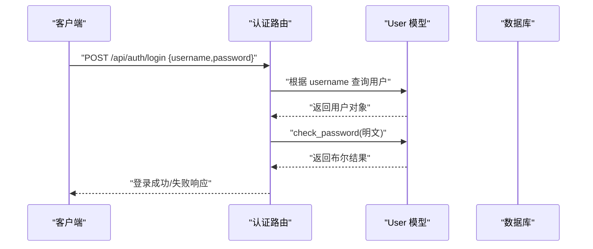
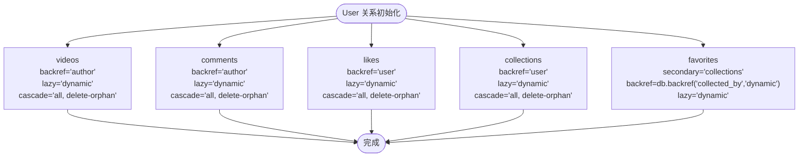
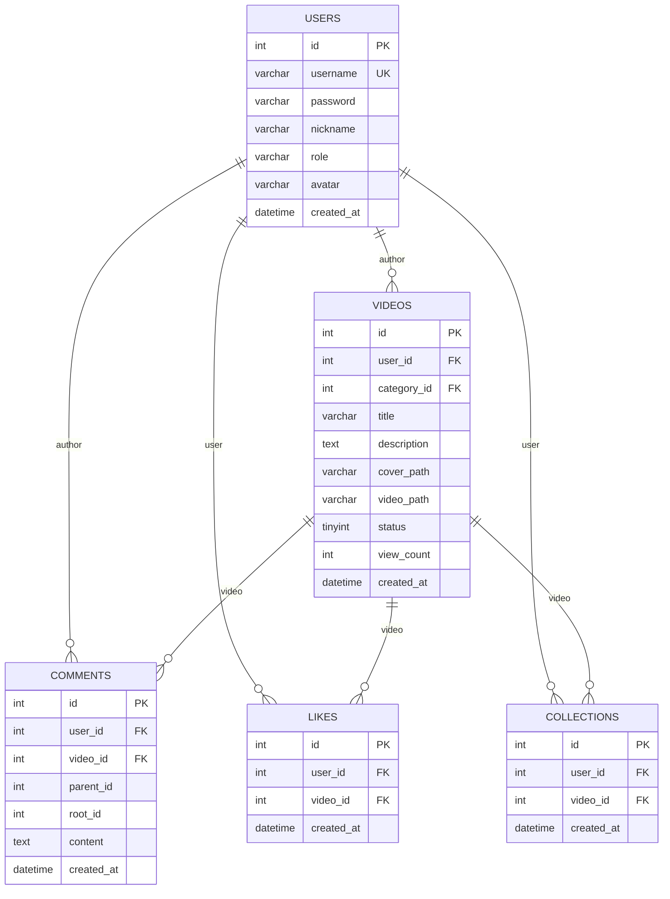
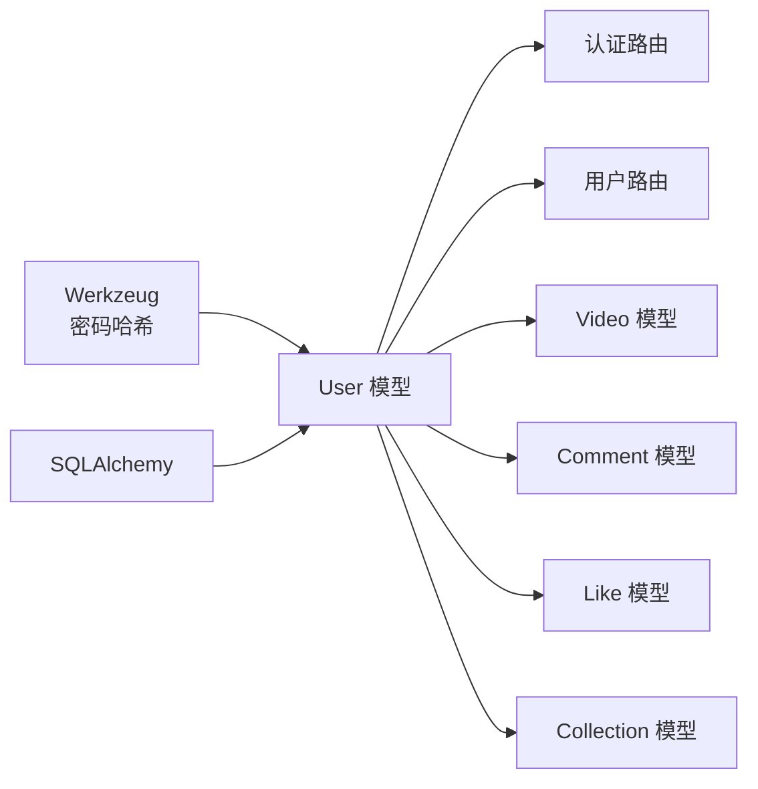

# 用户模型 (User)

<cite>
**本文引用的文件**
- [backend/models.py](file://backend/models.py)
- [univideo_db.sql](file://univideo_db.sql)
- [backend/routes/auth.py](file://backend/routes/auth.py)
- [backend/routes/user.py](file://backend/routes/user.py)
- [backend/app.py](file://backend/app.py)
</cite>

## 目录
1. [简介](#简介)
2. [项目结构](#项目结构)
3. [核心组件](#核心组件)
4. [架构总览](#架构总览)
5. [详细组件分析](#详细组件分析)
6. [依赖分析](#依赖分析)
7. [性能考虑](#性能考虑)
8. [故障排查指南](#故障排查指南)
9. [结论](#结论)
10. [附录](#附录)

## 简介
本文件围绕用户模型 User 的实现进行深入技术说明，覆盖字段定义与约束、密码安全机制、角色权限控制、与其他模型的关联关系，以及与数据库表结构的一致性校验。目标是帮助开发者与产品人员准确理解 User 模型的设计意图与使用方式。

## 项目结构
- 后端采用 Flask + SQLAlchemy 架构，模型定义集中在 backend/models.py 中，数据库初始化与迁移由 Flask-Migrate 驱动。
- 用户相关路由位于 backend/routes/user.py（个人中心）、backend/routes/auth.py（注册/登录）。
- 数据库表结构定义见 univideo_db.sql，确保 ORM 与 SQL 定义一致。

图表来源
- [backend/app.py](file://backend/app.py#L1-L60)
- [backend/models.py](file://backend/models.py#L1-L83)
- [backend/routes/auth.py](file://backend/routes/auth.py#L1-L87)
- [backend/routes/user.py](file://backend/routes/user.py#L1-L60)
- [univideo_db.sql](file://univideo_db.sql#L1-L20)

章节来源
- [backend/app.py](file://backend/app.py#L1-L60)
- [backend/models.py](file://backend/models.py#L1-L83)
- [univideo_db.sql](file://univideo_db.sql#L1-L20)

## 核心组件
- User 模型：用户基本信息与认证数据，包含主键 id、用户名 username、加密密码 password、昵称 nickname、角色 role、头像 avatar、注册时间 created_at。
- 关系映射：videos（一对多）、comments（一对多）、likes（一对多）、collections（一对多），以及 favorites（多对多）。
- 安全机制：set_password 使用 Werkzeug 的 generate_password_hash 进行哈希存储；check_password 使用 check_password_hash 进行验证。
- 权限控制：is_admin 通过 role 字段判断是否为管理员。

章节来源
- [backend/models.py](file://backend/models.py#L14-L83)

## 架构总览
User 模型在系统中的位置与交互如下：

图表来源
- [backend/models.py](file://backend/models.py#L14-L83)
- [backend/models.py](file://backend/models.py#L113-L198)
- [backend/models.py](file://backend/models.py#L200-L271)
- [backend/models.py](file://backend/models.py#L273-L307)
- [backend/models.py](file://backend/models.py#L309-L343)

## 详细组件分析

### 字段定义与约束（基于模型与 SQL）
- id：整数主键，自增，唯一标识用户。
- username：字符串，最大长度 50，唯一且非空，作为登录凭据。
- password：字符串，最大长度 255，非空，存储哈希值。
- nickname：字符串，最大长度 50，非空，用户展示名称。
- role：字符串，最大长度 20，默认值为 "user"，用于权限控制。
- avatar：字符串，最大长度 255，默认空字符串，存储头像路径。
- created_at：日期时间，默认当前时间戳，记录注册时间。

上述字段定义与 users 表的 SQL 定义保持一致，包括唯一性、默认值与注释。

章节来源
- [backend/models.py](file://backend/models.py#L21-L30)
- [univideo_db.sql](file://univideo_db.sql#L6-L14)

### 密码安全机制
- set_password：接收明文密码，调用 Werkzeug 的 generate_password_hash 生成哈希并赋值给 password 字段，确保密码以不可逆方式存储。
- check_password：接收明文密码，调用 Werkzeug 的 check_password_hash 与存储的哈希进行比对，返回布尔结果，用于登录验证。

图表来源
- [backend/routes/auth.py](file://backend/routes/auth.py#L89-L139)
- [backend/models.py](file://backend/models.py#L42-L59)

章节来源
- [backend/models.py](file://backend/models.py#L42-L59)
- [backend/routes/auth.py](file://backend/routes/auth.py#L89-L139)

### 角色权限控制逻辑
- is_admin：当 role 等于 "admin" 时返回 True，否则返回 False。该方法用于判定用户是否具备管理员权限，便于后续路由或业务逻辑中的权限判断。

章节来源
- [backend/models.py](file://backend/models.py#L60-L67)

### 与其他模型的关联关系
- 一对多关系
  - videos：用户上传的视频集合。backref 为 author，lazy='dynamic'，级联删除配置为 cascade='all, delete-orphan'。
  - comments：用户发表的评论集合。backref 为 author，lazy='dynamic'，级联删除配置为 cascade='all, delete-orphan'。
  - likes：用户点赞的视频集合。backref 为 user，lazy='dynamic'，级联删除配置为 cascade='all, delete-orphan'。
  - collections：用户收藏的视频集合。backref 为 user，lazy='dynamic'，级联删除配置为 cascade='all, delete-orphan'。
- 多对多关系
  - favorites：通过 secondary='collections' 关联到 Video，backref 为 collected_by，lazy='dynamic'。该关系允许直接查询某用户收藏的所有视频，同时通过 collected_by 反向访问收藏该视频的用户集合。

图表来源
- [backend/models.py](file://backend/models.py#L31-L41)

章节来源
- [backend/models.py](file://backend/models.py#L31-L41)

### 与数据库表结构一致性校验
- users 表字段与 User 模型字段一一对应：id、username（UNIQUE+NOT NULL）、password（NOT NULL）、nickname（NOT NULL）、role（NOT NULL DEFAULT 'user'）、avatar（DEFAULT ''）、created_at（DEFAULT CURRENT_TIMESTAMP）。
- 索引与约束：username 唯一索引；created_at 建有索引（在 Video 表中）；Role 默认值与模型一致。
- 外键约束：Video.user_id、Comment.user_id、Like.user_id、Collection.user_id 均指向 users.id，并设置 ON DELETE CASCADE，保证用户删除时级联清理其产生的视频、评论、点赞、收藏记录。

章节来源
- [univideo_db.sql](file://univideo_db.sql#L6-L14)
- [univideo_db.sql](file://univideo_db.sql#L24-L38)
- [univideo_db.sql](file://univideo_db.sql#L41-L54)
- [univideo_db.sql](file://univideo_db.sql#L57-L65)
- [univideo_db.sql](file://univideo_db.sql#L67-L76)
- [backend/models.py](file://backend/models.py#L113-L198)
- [backend/models.py](file://backend/models.py#L200-L271)
- [backend/models.py](file://backend/models.py#L273-L343)

### ER 图（基于实际表结构）

图表来源
- [univideo_db.sql](file://univideo_db.sql#L6-L14)
- [univideo_db.sql](file://univideo_db.sql#L24-L38)
- [univideo_db.sql](file://univideo_db.sql#L41-L54)
- [univideo_db.sql](file://univideo_db.sql#L57-L65)
- [univideo_db.sql](file://univideo_db.sql#L67-L76)

## 依赖分析
- 组件耦合
  - User 模型依赖 SQLAlchemy（db.Column、db.relationship、db.ForeignKey 等）。
  - 密码安全依赖 Werkzeug 的 generate_password_hash 与 check_password_hash。
  - 路由层（auth、user）依赖 User 模型进行数据访问与业务处理。
- 外部依赖
  - Flask、Flask-SQLAlchemy、Flask-Migrate、Werkzeug 等。
- 级联与外键
  - User 与 Video、Comment、Like、Collection 的 ON DELETE CASCADE 保证数据一致性。
  - favorites 通过 secondary='collections' 实现多对多关系，避免额外中间表。

图表来源
- [backend/models.py](file://backend/models.py#L14-L83)
- [backend/routes/auth.py](file://backend/routes/auth.py#L1-L87)
- [backend/routes/user.py](file://backend/routes/user.py#L1-L60)

章节来源
- [backend/models.py](file://backend/models.py#L14-L83)
- [backend/routes/auth.py](file://backend/routes/auth.py#L1-L87)
- [backend/routes/user.py](file://backend/routes/user.py#L1-L60)

## 性能考虑
- 字段索引
  - username 唯一索引，加速登录与去重查询。
  - Video.created_at 建有索引，提升按时间排序与分页查询效率。
- 关系懒加载
  - 所有关系使用 lazy='dynamic'，按需加载，减少不必要的数据加载。
- 级联删除
  - cascade='all, delete-orphan' 在删除用户时自动清理其产生的视频、评论、点赞、收藏记录，避免悬挂数据。
- 密码哈希
  - 使用 Werkzeug 的哈希算法，兼顾安全性与验证性能。

章节来源
- [backend/models.py](file://backend/models.py#L21-L30)
- [univideo_db.sql](file://univideo_db.sql#L24-L38)
- [backend/models.py](file://backend/models.py#L31-L41)

## 故障排查指南
- 登录失败
  - 确认用户名是否存在，密码是否正确（check_password 返回 False 时会触发 401）。
  - 检查前端是否正确传递用户名与密码。
- 注册失败
  - 用户名长度与唯一性校验、密码长度校验、数据库唯一约束冲突均可能导致失败。
- 头像上传失败
  - 确认文件类型是否在允许列表，上传目录是否存在，保存路径是否正确。
- 用户资料更新
  - 若更新密码，确认 set_password 已被调用；若更新头像，确认文件保存成功且路径写入数据库。

章节来源
- [backend/routes/auth.py](file://backend/routes/auth.py#L89-L139)
- [backend/routes/auth.py](file://backend/routes/auth.py#L12-L87)
- [backend/routes/user.py](file://backend/routes/user.py#L90-L153)

## 结论
User 模型在本项目中承担了用户身份与权限的核心职责，通过严格的字段约束、完善的密码安全机制与清晰的关系映射，实现了与数据库表结构的高度一致。配合路由层的认证与用户中心功能，形成了完整、可维护的用户体系。

## 附录
- 字段与约束对照表（模型 vs SQL）
  - id：主键，自增，一致。
  - username：字符串(50)，唯一+非空，一致。
  - password：字符串(255)，非空，一致。
  - nickname：字符串(50)，非空，一致。
  - role：字符串(20)，非空，默认 "user"，一致。
  - avatar：字符串(255)，默认空字符串，一致。
  - created_at：日期时间，默认 CURRENT_TIMESTAMP，一致。

章节来源
- [backend/models.py](file://backend/models.py#L21-L30)
- [univideo_db.sql](file://univideo_db.sql#L6-L14)