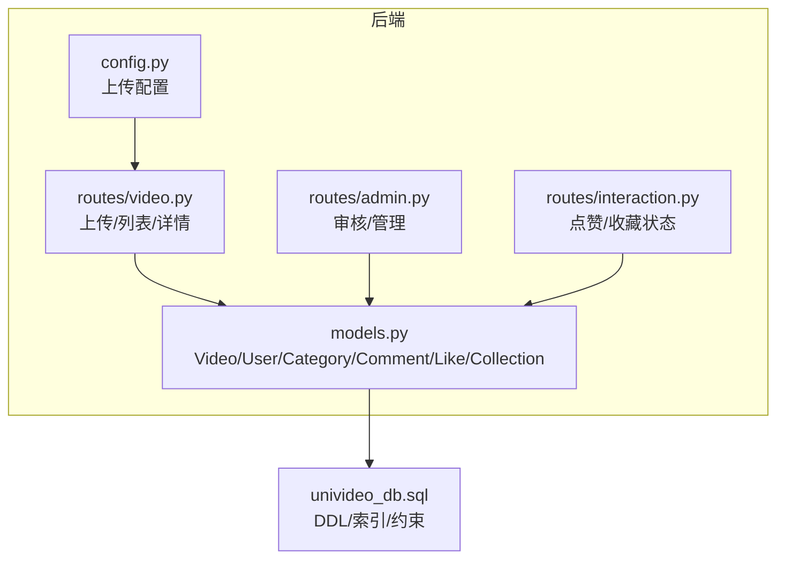
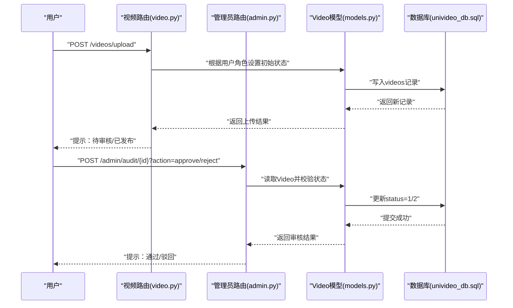
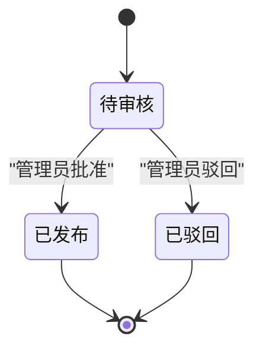
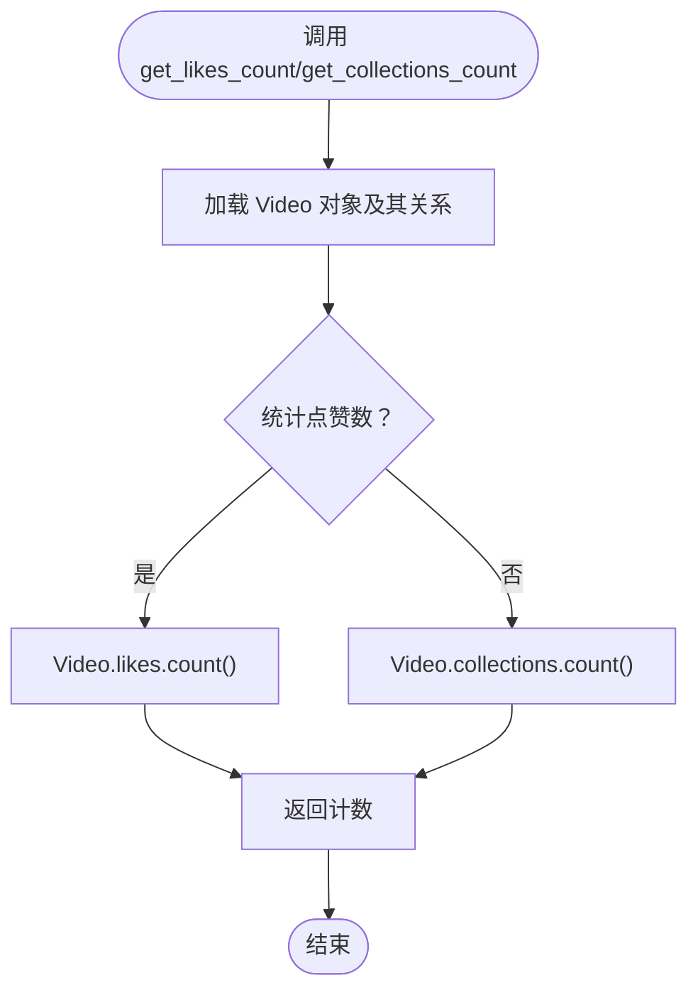
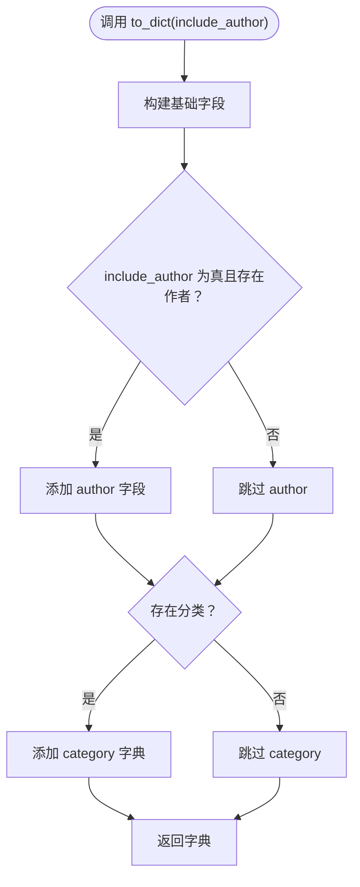
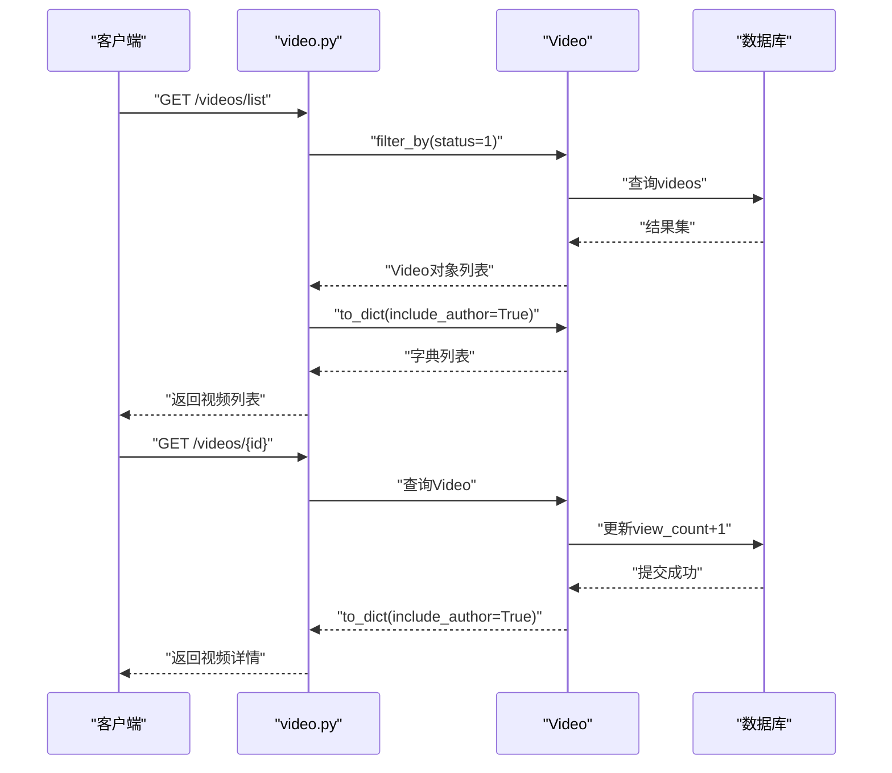
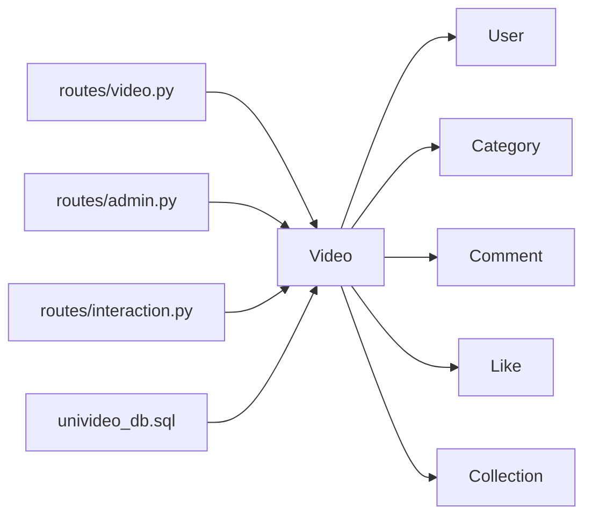

# 视频模型 (Video)

<cite>
**本文引用的文件**
- [backend/models.py](file://backend/models.py)
- [univideo_db.sql](file://univideo_db.sql)
- [backend/routes/video.py](file://backend/routes/video.py)
- [backend/routes/admin.py](file://backend/routes/admin.py)
- [backend/routes/interaction.py](file://backend/routes/interaction.py)
- [backend/config.py](file://backend/config.py)
</cite>

## 目录
1. [简介](#简介)
2. [项目结构](#项目结构)
3. [核心组件](#核心组件)
4. [架构总览](#架构总览)
5. [详细组件分析](#详细组件分析)
6. [依赖分析](#依赖分析)
7. [性能考虑](#性能考虑)
8. [故障排查指南](#故障排查指南)
9. [结论](#结论)

## 简介
本文件围绕 Video 模型展开，系统化梳理其字段语义、状态机设计（“先审后发”）、外键约束与级联行为、与评论、点赞、收藏等模型的一对多关系、辅助方法实现逻辑、序列化 to_dict 的灵活输出策略，并结合数据库层的索引与约束验证模型层面的性能优化点。目标是帮助开发者与产品人员准确理解 Video 在整体系统中的职责与边界。

## 项目结构
- 后端采用 Flask + SQLAlchemy，模型定义集中在 models.py 中，数据库 DDL 定义于 univideo_db.sql。
- 视频相关的业务入口位于 routes/video.py（上传、列表、详情），管理员审核入口位于 routes/admin.py，交互状态查询位于 routes/interaction.py。
- 配置文件 backend/config.py 提供上传目录、文件类型白名单等运行期参数。

图表来源
- [backend/models.py](file://backend/models.py#L113-L197)
- [univideo_db.sql](file://univideo_db.sql#L23-L38)
- [backend/routes/video.py](file://backend/routes/video.py#L37-L171)
- [backend/routes/admin.py](file://backend/routes/admin.py#L95-L173)
- [backend/routes/interaction.py](file://backend/routes/interaction.py#L195-L284)
- [backend/config.py](file://backend/config.py#L11-L30)

章节来源
- [backend/models.py](file://backend/models.py#L113-L197)
- [univideo_db.sql](file://univideo_db.sql#L23-L38)
- [backend/routes/video.py](file://backend/routes/video.py#L37-L171)
- [backend/routes/admin.py](file://backend/routes/admin.py#L95-L173)
- [backend/routes/interaction.py](file://backend/routes/interaction.py#L195-L284)
- [backend/config.py](file://backend/config.py#L11-L30)

## 核心组件
- Video 模型：承载视频元数据、状态、外键、一对多关系与辅助方法；是“先审后发”流程的核心载体。
- User/Category/Comment/Like/Collection：与 Video 形成完整的视频生态关系模型。
- 路由层：负责将业务流程映射到模型操作，包括上传时的角色判定、审核时的状态变更、列表/详情时的过滤与序列化。

章节来源
- [backend/models.py](file://backend/models.py#L113-L197)
- [backend/routes/video.py](file://backend/routes/video.py#L37-L171)
- [backend/routes/admin.py](file://backend/routes/admin.py#L95-L173)
- [backend/routes/interaction.py](file://backend/routes/interaction.py#L195-L284)

## 架构总览
Video 模型在数据库层与业务层之间起到承上启下的作用：
- 数据库层：videos 表定义了主键、外键、状态字段与索引；外键 user_id 引用 users.id 并启用级联删除；category_id 引用 categories.id。
- 业务层：上传时依据用户角色设置初始状态；审核时在管理员路由中将状态从待审核切换为已发布或已驳回；列表/详情时仅展示已发布的视频，并在详情页增加播放量统计。

图表来源
- [backend/routes/video.py](file://backend/routes/video.py#L129-L163)
- [backend/routes/admin.py](file://backend/routes/admin.py#L95-L173)
- [backend/models.py](file://backend/models.py#L113-L197)
- [univideo_db.sql](file://univideo_db.sql#L23-L38)

## 详细组件分析

### Video 类字段与语义
- id：主键，自增，标识视频唯一 ID。
- title：视频标题，非空。
- description：视频简介，文本。
- cover_path：封面图片路径，非空。
- video_path：视频文件路径，非空。
- status：视频状态，TinyInt/SmallInt，默认 0；0=待审核、1=已发布、2=已驳回。
- view_count：播放量，默认 0。
- created_at：上传时间，默认当前时间，带索引以优化查询。
- user_id：外键，引用 users.id，ON DELETE CASCADE；表示上传者。
- category_id：外键，引用 categories.id，无级联删除。

章节来源
- [backend/models.py](file://backend/models.py#L113-L197)
- [univideo_db.sql](file://univideo_db.sql#L23-L38)

### 状态机设计与“先审后发”
- 初始状态：上传时依据用户角色设置：
  - 管理员上传：直接发布（status=1）。
  - 普通用户上传：待审核（status=0）。
- 审核流程：管理员在后台对 status=0 的视频执行批准（status=1）或驳回（status=2）。
- 展示规则：前端列表仅展示 status=1 的视频；详情页播放量每次访问递增。

图表来源
- [backend/routes/video.py](file://backend/routes/video.py#L129-L163)
- [backend/routes/admin.py](file://backend/routes/admin.py#L95-L173)
- [backend/models.py](file://backend/models.py#L113-L197)

章节来源
- [backend/routes/video.py](file://backend/routes/video.py#L129-L163)
- [backend/routes/admin.py](file://backend/routes/admin.py#L95-L173)

### 外键约束与级联行为
- user_id -> users.id：ON DELETE CASCADE。当用户被删除时，其所有视频记录会级联删除。
- category_id -> categories.id：无级联删除。删除分类不会影响已有视频记录，但可能造成数据一致性问题，需在业务层处理。
- 数据库索引：
  - videos.idx_status(status)：加速“按状态查询”的场景（如待审核列表、管理列表按状态筛选）。
  - comments.idx_video_root(video_id, root_id)：加速评论树查询，虽非 Video 直接索引，但与视频评论生态相关。

章节来源
- [univideo_db.sql](file://univideo_db.sql#L23-L38)
- [backend/models.py](file://backend/models.py#L113-L197)

### 与评论、点赞、收藏的关系与级联
- 一对多关系：
  - Video.comments：一个视频可有多条评论；删除视频时级联删除评论。
  - Video.likes：一个视频可被多个用户点赞；删除视频时级联删除点赞记录。
  - Video.collections：一个视频可被多个用户收藏；删除视频时级联删除收藏记录。
- 关系反向：
  - Comment.video、Like.video、Collection.video：评论/点赞/收藏记录可反查所属视频。
  - User.videos、User.comments、User.likes、User.collections：用户与其产生的互动形成完整生态。

章节来源
- [backend/models.py](file://backend/models.py#L113-L197)
- [univideo_db.sql](file://univideo_db.sql#L40-L76)

### 辅助方法：get_likes_count 与 get_collections_count
- get_likes_count：通过 Video.likes.count() 统计点赞数。
- get_collections_count：通过 Video.collections.count() 统计收藏数。
- 复杂度：均为 O(n)（n 为对应关系的数量），在高并发场景建议引入缓存或物化指标。

图表来源
- [backend/models.py](file://backend/models.py#L150-L165)

章节来源
- [backend/models.py](file://backend/models.py#L150-L165)

### 序列化 to_dict：灵活输出作者与分类信息
- 必要字段：id、title、description、cover_path、video_path、status、view_count、created_at、category_id。
- 可选字段：当 include_author=True 且存在作者时，附加 author 字段；当存在分类时，附加 category 字典。
- 计数字段：自动注入 likes_count 与 collections_count，分别通过 get_likes_count 与 get_collections_count 计算。
- 用途：用于列表与详情接口的统一响应结构，便于前端渲染。

图表来源
- [backend/models.py](file://backend/models.py#L166-L194)

章节来源
- [backend/models.py](file://backend/models.py#L166-L194)

### 业务流程与接口映射
- 上传流程：video.py 在上传接口中根据用户角色设置初始状态，并持久化到数据库。
- 审核流程：admin.py 的审核接口对 status=0 的视频进行批准或驳回，更新状态并提交。
- 列表/详情：video.py 的列表接口仅返回 status=1 的视频；详情接口每次访问增加 view_count 并返回完整数据。

图表来源
- [backend/routes/video.py](file://backend/routes/video.py#L173-L282)
- [backend/models.py](file://backend/models.py#L113-L197)
- [univideo_db.sql](file://univideo_db.sql#L23-L38)

章节来源
- [backend/routes/video.py](file://backend/routes/video.py#L173-L282)

## 依赖分析
- Video 依赖 User 与 Category 的外键关系；依赖 Comment/Like/Collection 的一对多关系。
- 路由层依赖 Video 模型完成业务逻辑：上传时设置状态、审核时更新状态、列表/详情时过滤与序列化。
- 数据库层通过索引与约束保障查询效率与数据完整性。

图表来源
- [backend/models.py](file://backend/models.py#L113-L197)
- [backend/routes/video.py](file://backend/routes/video.py#L37-L171)
- [backend/routes/admin.py](file://backend/routes/admin.py#L95-L173)
- [backend/routes/interaction.py](file://backend/routes/interaction.py#L195-L284)
- [univideo_db.sql](file://univideo_db.sql#L23-L38)

章节来源
- [backend/models.py](file://backend/models.py#L113-L197)
- [backend/routes/video.py](file://backend/routes/video.py#L37-L171)
- [backend/routes/admin.py](file://backend/routes/admin.py#L95-L173)
- [backend/routes/interaction.py](file://backend/routes/interaction.py#L195-L284)
- [univideo_db.sql](file://univideo_db.sql#L23-L38)

## 性能考虑
- 索引优化：
  - videos.idx_status(status)：用于“按状态筛选”和“待审核列表”等高频查询，显著降低审核管理与列表查询的延迟。
  - videos.created_at(index)：已在模型中声明索引，用于按时间排序的列表查询。
- 关系计数：
  - get_likes_count 与 get_collections_count 通过 count() 计算，复杂度 O(n)；在高并发场景建议引入缓存或物化计数字段，避免每次请求都触发 N 次查询。
- 文件存储：
  - 上传目录与文件类型白名单由 config.py 控制，有助于限制资源占用与提升安全性。

章节来源
- [univideo_db.sql](file://univideo_db.sql#L23-L38)
- [backend/models.py](file://backend/models.py#L130-L141)
- [backend/config.py](file://backend/config.py#L11-L30)

## 故障排查指南
- 上传失败或状态异常
  - 检查用户角色与上传接口逻辑，确认是否正确设置了初始状态。
  - 参考路径：[上传接口](file://backend/routes/video.py#L129-L163)
- 审核接口报错
  - 确认视频状态为待审核（status=0），且 action 参数为 approve 或 reject。
  - 参考路径：[审核接口](file://backend/routes/admin.py#L95-L173)
- 列表/详情未显示预期数据
  - 列表仅返回已发布（status=1）视频；详情接口会增加播放量。
  - 参考路径：[列表接口](file://backend/routes/video.py#L173-L219)、[详情接口](file://backend/routes/video.py#L228-L282)
- 评论/点赞/收藏状态查询
  - 通过交互路由获取当前用户对视频的点赞/收藏状态。
  - 参考路径：[点赞状态](file://backend/routes/interaction.py#L241-L284)、[收藏状态](file://backend/routes/interaction.py#L195-L238)

章节来源
- [backend/routes/video.py](file://backend/routes/video.py#L173-L282)
- [backend/routes/admin.py](file://backend/routes/admin.py#L95-L173)
- [backend/routes/interaction.py](file://backend/routes/interaction.py#L195-L284)

## 结论
Video 模型通过明确的状态机设计与严格的外键约束，支撑起“先审后发”的核心业务流程。配合数据库索引与路由层的过滤策略，实现了高效稳定的视频管理与展示能力。建议在高并发场景下对计数类查询引入缓存或物化指标，以进一步提升性能与用户体验。