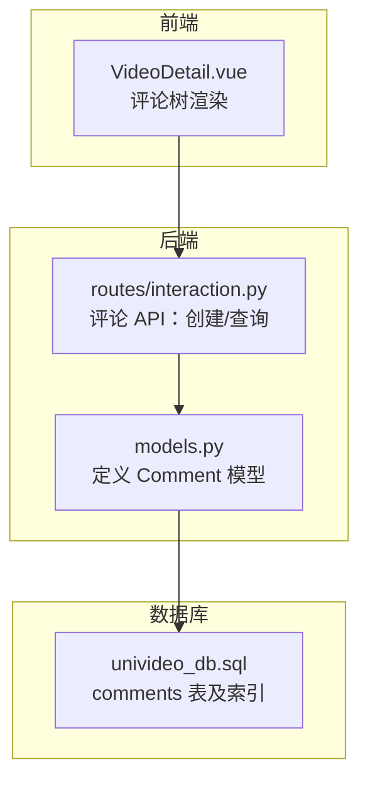
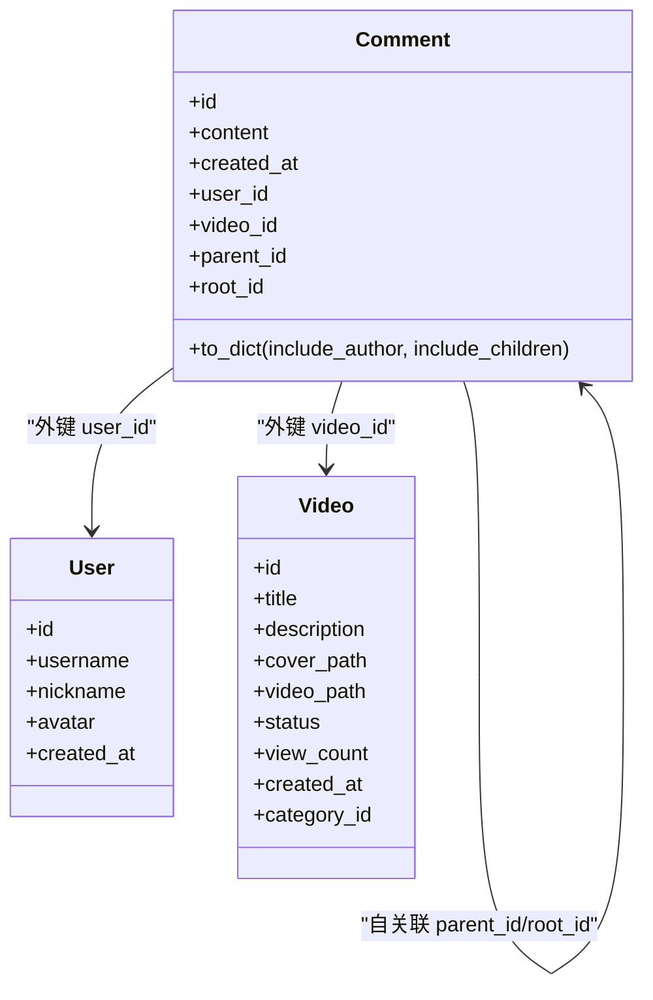
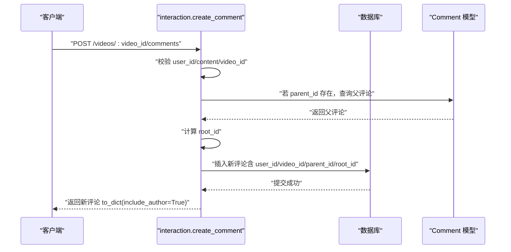
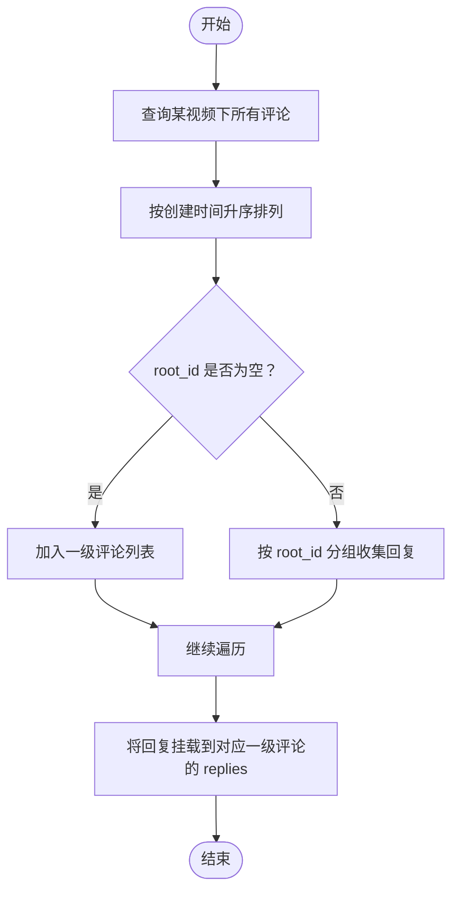
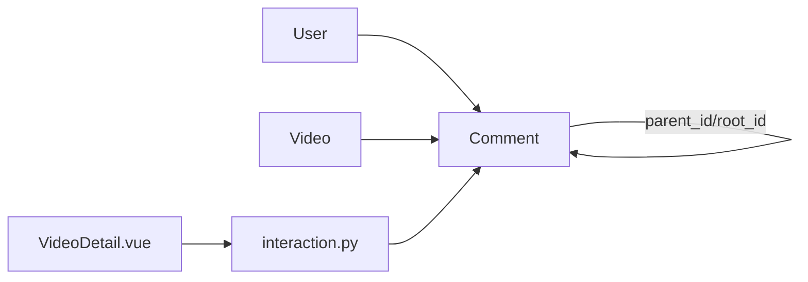

# 评论模型 (Comment)

<cite>
**本文引用的文件**
- [backend/models.py](file://backend/models.py)
- [backend/routes/interaction.py](file://backend/routes/interaction.py)
- [univideo_db.sql](file://univideo_db.sql)
- [frontend/src/views/VideoDetail.vue](file://frontend/src/views/VideoDetail.vue)
</cite>

## 目录
1. [引言](#引言)
2. [项目结构](#项目结构)
3. [核心组件](#核心组件)
4. [架构总览](#架构总览)
5. [详细组件分析](#详细组件分析)
6. [依赖分析](#依赖分析)
7. [性能考量](#性能考量)
8. [故障排查指南](#故障排查指南)
9. [结论](#结论)
10. [附录](#附录)

## 引言
本文件围绕评论模型（Comment）的多级评论实现机制展开，系统性解析以下关键点：
- 基础字段：content、created_at 等
- 自关联设计：parent_id（直接父评论）与 root_id（对话串根评论）的业务含义与协作
- 如何通过 root_id 与联合索引 idx_video_root(video_id, root_id) 支持无限层级嵌套评论并优化查询性能
- SQLAlchemy 关系属性 parent、children、root、all_replies 的配置要点（含 remote_side 的使用）
- to_dict 方法通过 include_children 控制子评论递归序列化的策略
- comments 表的 SQL 定义与外键级联删除、索引策略的一致性校验

## 项目结构
- 后端模型与路由：
  - 评论模型定义位于 backend/models.py
  - 评论相关 API（创建、查询）位于 backend/routes/interaction.py
- 数据库脚本：
  - comments 表的建表语句与索引定义位于 univideo_db.sql
- 前端展示：
  - 评论树形渲染逻辑位于 frontend/src/views/VideoDetail.vue

图表来源
- [backend/models.py](file://backend/models.py#L200-L271)
- [backend/routes/interaction.py](file://backend/routes/interaction.py#L12-L112)
- [univideo_db.sql](file://univideo_db.sql#L40-L54)
- [frontend/src/views/VideoDetail.vue](file://frontend/src/views/VideoDetail.vue#L74-L104)

章节来源
- [backend/models.py](file://backend/models.py#L200-L271)
- [backend/routes/interaction.py](file://backend/routes/interaction.py#L12-L112)
- [univideo_db.sql](file://univideo_db.sql#L40-L54)
- [frontend/src/views/VideoDetail.vue](file://frontend/src/views/VideoDetail.vue#L74-L104)

## 核心组件
- Comment 模型：承载评论内容、时间、用户与视频关联，以及自关联字段 parent_id、root_id，并定义联合索引 idx_video_root
- 关系属性：
  - parent：访问当前评论的父评论
  - children：访问当前评论的所有直接子评论
  - root：访问当前评论的根评论
  - all_replies：访问根评论下的所有回复
- 序列化方法 to_dict：支持 include_author 与 include_children 两种模式

章节来源
- [backend/models.py](file://backend/models.py#L200-L271)

## 架构总览
评论模型在后端采用“自关联 + 根评论标记”的设计，配合数据库联合索引，实现：
- 无限层级嵌套评论的稳定存储与检索
- 高效的楼层聚合查询（按 video_id + root_id）
- 前后端一致的树形结构表示与渲染

图表来源
- [backend/models.py](file://backend/models.py#L200-L271)

## 详细组件分析

### Comment 类与字段语义
- content：评论文本内容，非空
- created_at：评论创建时间，默认当前时间
- user_id、video_id：分别关联用户与视频，ON DELETE CASCADE
- parent_id：直接父评论 ID，自关联，ON DELETE CASCADE
- root_id：根评论 ID，自关联，ON DELETE CASCADE
- __table_args__：定义联合索引 idx_video_root(video_id, root_id)，用于加速“某视频下某楼层”的聚合查询

章节来源
- [backend/models.py](file://backend/models.py#L200-L271)
- [univideo_db.sql](file://univideo_db.sql#L40-L54)

### 自关联设计：parent_id 与 root_id 的业务含义
- parent_id：指向“直接父评论”，即当前评论是针对哪条评论的回复
- root_id：指向“对话串的根评论”，用于将同一楼层（同一根评论下的所有回复）聚合在一起
- 这种设计的优势：
  - 支持无限层级的嵌套回复
  - 通过 root_id 可以快速定位同一楼层的所有回复，避免深度遍历
  - 保持评论树的稳定性：当回复被删除时，不影响其他同楼层回复的 root_id

章节来源
- [backend/models.py](file://backend/models.py#L200-L271)

### 联合索引 idx_video_root(video_id, root_id) 的查询优化
- 适用场景：查询某视频下某一“楼层”（同一 root_id）的所有回复
- 选择顺序：video_id 在前，root_id 在后，符合“按视频过滤 + 按楼层分组”的典型查询模式
- 性能收益：减少扫描范围，提升排序与分组效率

章节来源
- [backend/models.py](file://backend/models.py#L227-L230)
- [univideo_db.sql](file://univideo_db.sql#L53-L54)

### SQLAlchemy 关系属性与 remote_side 配置
- parent 与 children：
  - parent：访问当前评论的父评论
  - children：访问当前评论的所有直接子评论
  - 使用 foreign_keys=[parent_id] 指定外键，避免歧义
  - 使用 remote_side=[id] 指明远端侧（父评论）的主键，明确双向关系方向
- root 与 all_replies：
  - root：访问当前评论的根评论
  - all_replies：访问根评论下的所有回复
  - 使用 foreign_keys=[root_id] 指定外键，使用 remote_side=[id] 明确方向
- 作用：确保 ORM 能正确识别“当前对象”与“远端对象”，避免关系混淆

章节来源
- [backend/models.py](file://backend/models.py#L232-L241)

### to_dict 序列化与 include_children 控制
- include_author：是否包含作者信息（id、username、nickname、avatar）
- include_children：是否包含子评论列表
  - 当 include_children=True 时，会递归调用子评论的 to_dict，形成树形结构的 JSON
- 注意：递归序列化可能带来额外的数据库访问（取决于 children 的懒加载策略），建议在需要时开启

章节来源
- [backend/models.py](file://backend/models.py#L242-L268)

### comments 表的 SQL 定义一致性校验
- 外键与级联删除：
  - user_id -> users(id)：ON DELETE CASCADE
  - video_id -> videos(id)：ON DELETE CASCADE
  - parent_id -> comments(id)：ON DELETE CASCADE
  - root_id -> comments(id)：ON DELETE CASCADE
- 索引：
  - idx_video_root(video_id, root_id)：与 __table_args__ 一致
- 结论：模型层与 SQL 层在外键与索引上保持一致，确保数据完整性与查询性能

章节来源
- [univideo_db.sql](file://univideo_db.sql#L40-L54)
- [backend/models.py](file://backend/models.py#L216-L230)

### 评论创建流程（含 root_id 计算）
- 请求参数：user_id、content（必填），parent_id（可选）
- 校验：视频存在、用户存在、父评论存在且属于同一视频
- root_id 计算规则：
  - 若 parent_id 为空：root_id = None（顶级评论）
  - 若父评论 root_id 为空：root_id = parent_id（父评论为一级评论）
  - 否则：root_id = 父评论的 root_id（沿用父评论的根）
- 保存：写入数据库，返回新评论的 to_dict(include_author=True)

图表来源
- [backend/routes/interaction.py](file://backend/routes/interaction.py#L12-L112)
- [backend/models.py](file://backend/models.py#L200-L271)

章节来源
- [backend/routes/interaction.py](file://backend/routes/interaction.py#L12-L112)

### 评论查询与树形渲染
- 查询：按 video_id 获取全部评论，按 created_at 升序排列
- 前端树形渲染：
  - 一级评论：root_id 为空
  - 回复评论：按 root_id 分组挂载到对应一级评论的 replies 列表
- 该流程与模型层的 root_id 设计高度契合，保证了前后端一致的树形结构

图表来源
- [backend/routes/interaction.py](file://backend/routes/interaction.py#L287-L326)
- [frontend/src/views/VideoDetail.vue](file://frontend/src/views/VideoDetail.vue#L74-L104)

章节来源
- [backend/routes/interaction.py](file://backend/routes/interaction.py#L287-L326)
- [frontend/src/views/VideoDetail.vue](file://frontend/src/views/VideoDetail.vue#L74-L104)

## 依赖分析
- Comment 依赖 User 与 Video 的外键关系，用于 author 关系与视频维度的评论聚合
- Comment 的自关联关系通过 parent_id 与 root_id 维护评论树
- API 层 interaction.create_comment 与 interaction.get_comments 直接依赖 Comment 模型
- 前端 VideoDetail.vue 依赖后端返回的评论列表与 root_id 字段进行树形渲染

图表来源
- [backend/models.py](file://backend/models.py#L200-L271)
- [backend/routes/interaction.py](file://backend/routes/interaction.py#L12-L112)
- [frontend/src/views/VideoDetail.vue](file://frontend/src/views/VideoDetail.vue#L74-L104)

章节来源
- [backend/models.py](file://backend/models.py#L200-L271)
- [backend/routes/interaction.py](file://backend/routes/interaction.py#L12-L112)
- [frontend/src/views/VideoDetail.vue](file://frontend/src/views/VideoDetail.vue#L74-L104)

## 性能考量
- 索引策略
  - idx_video_root(video_id, root_id)：显著降低“按视频 + 楼层”的查询成本
  - created_at 上的索引（在 Video 模型中）有助于整体排序与分页
- 关系懒加载
  - children、all_replies 默认懒加载，避免不必要的 JOIN 查询
  - 仅在需要时访问 children，以控制 N+1 查询风险
- 序列化开销
  - include_children=True 会触发递归 to_dict，建议在需要树形输出时启用
- 外键级联删除
  - 删除用户或视频时，评论将级联删除，减少孤立数据，有利于维护性与查询稳定性

章节来源
- [backend/models.py](file://backend/models.py#L227-L241)
- [univideo_db.sql](file://univideo_db.sql#L40-L54)

## 故障排查指南
- 评论创建失败
  - 检查 user_id、video_id 是否有效
  - 若 parent_id 非空，确认父评论存在且属于同一视频
  - 校验 content 是否为空
- 查询结果异常
  - 确认查询条件是否仅按 video_id 过滤
  - 若需按楼层聚合，确保 root_id 正确设置
- 树形渲染错乱
  - 检查后端返回的 root_id 字段是否正确
  - 前端按 root_id 分组挂载是否执行

章节来源
- [backend/routes/interaction.py](file://backend/routes/interaction.py#L12-L112)
- [frontend/src/views/VideoDetail.vue](file://frontend/src/views/VideoDetail.vue#L74-L104)

## 结论
Comment 模型通过 parent_id 与 root_id 的双字段设计，实现了稳定高效的多级评论体系：
- 业务清晰：parent_id 指向直接父，root_id 指向对话串根，便于楼层聚合
- 技术可靠：联合索引 idx_video_root(video_id, root_id) 提升查询性能
- ORM 明确：remote_side 与 foreign_keys 的配置确保关系方向正确
- 前后端协同：API 返回与前端树形渲染无缝衔接

## 附录
- 评论创建 API：POST /videos/{video_id}/comments
- 评论查询 API：GET /videos/{video_id}/comments
- 前端评论树渲染：基于 root_id 的分组与挂载

章节来源
- [backend/routes/interaction.py](file://backend/routes/interaction.py#L12-L112)
- [frontend/src/views/VideoDetail.vue](file://frontend/src/views/VideoDetail.vue#L74-L104)