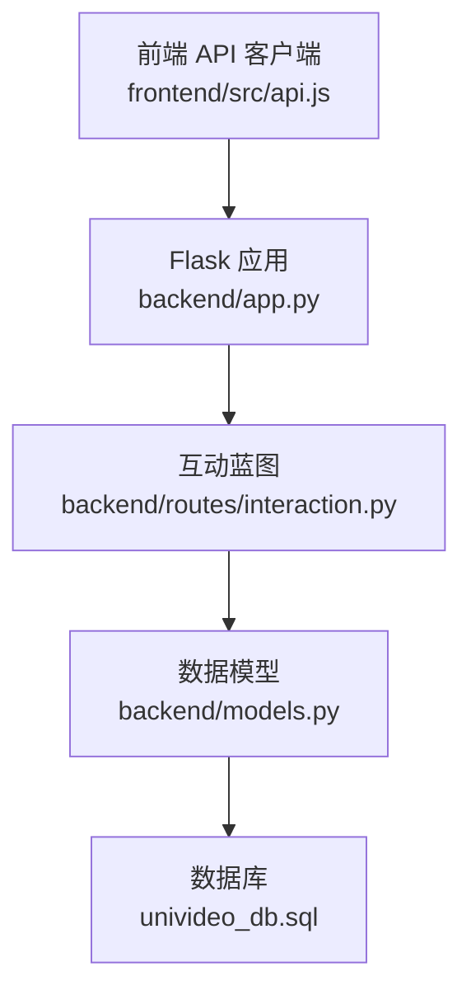
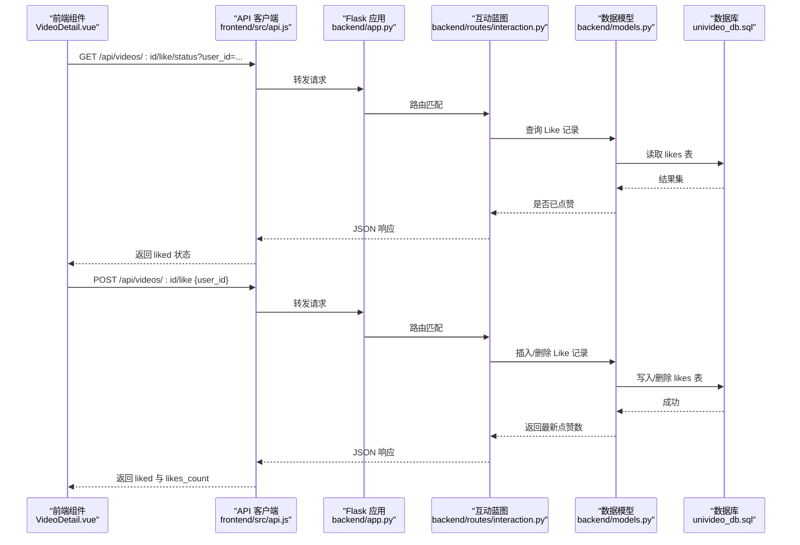
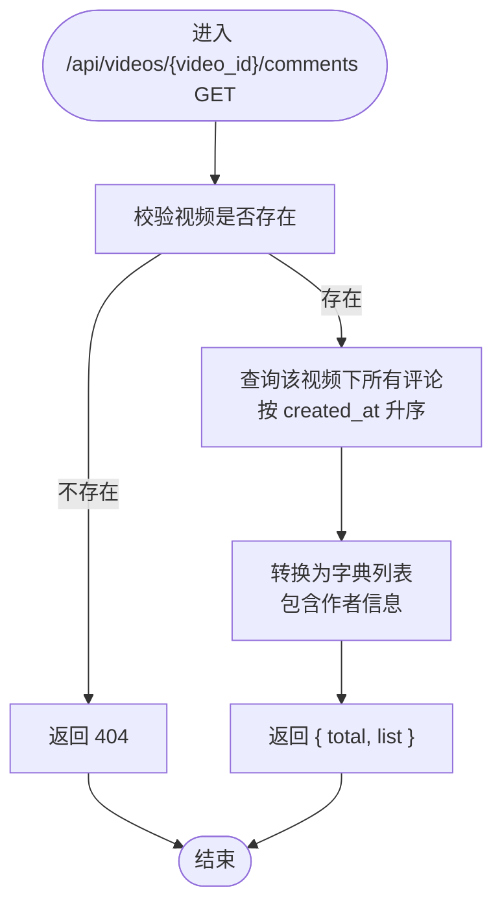
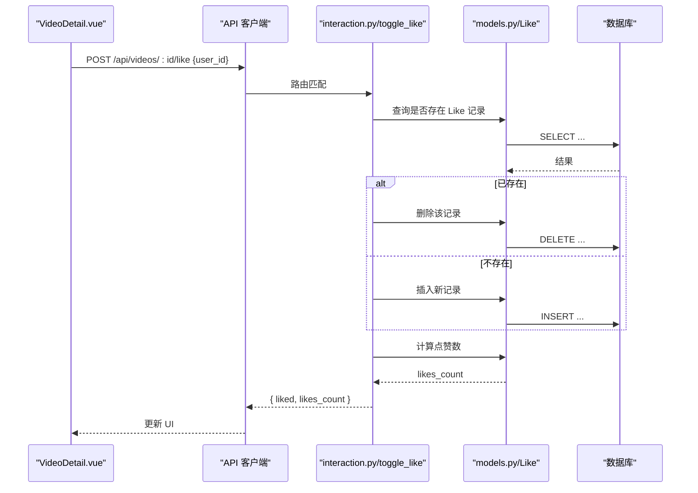
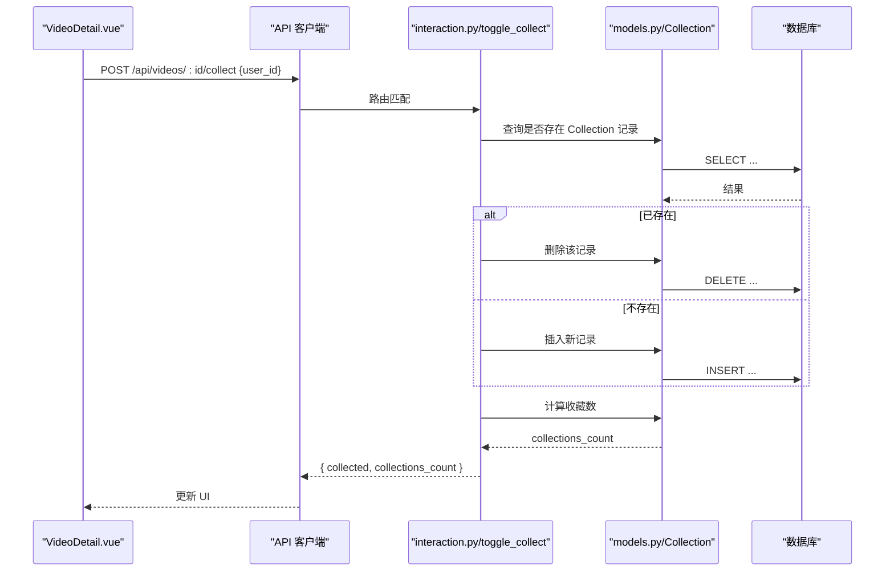
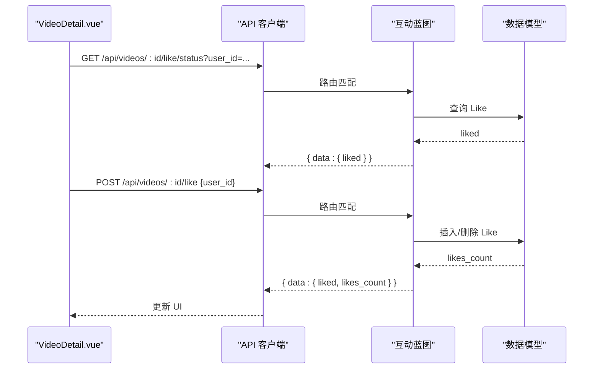
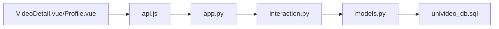

# 互动路由模块

<cite>
**本文引用的文件**
- [interaction.py](file://backend/routes/interaction.py)
- [models.py](file://backend/models.py)
- [VideoDetail.vue](file://frontend/src/views/VideoDetail.vue)
- [Profile.vue](file://frontend/src/views/Profile.vue)
- [api.js](file://frontend/src/api.js)
- [app.py](file://backend/app.py)
- [univideo_db.sql](file://univideo_db.sql)
</cite>

## 目录
1. [引言](#引言)
2. [项目结构](#项目结构)
3. [核心组件](#核心组件)
4. [架构总览](#架构总览)
5. [详细组件分析](#详细组件分析)
6. [依赖分析](#依赖分析)
7. [性能考量](#性能考量)
8. [故障排查指南](#故障排查指南)
9. [结论](#结论)

## 引言
本文件系统性地文档化后端互动路由模块（/api 下的评论、点赞、收藏接口），覆盖 RESTful 设计原则、多级评论树形结构的存储与查询逻辑、用户行为去重机制（防重复点赞/收藏）、以及互动数据的实时更新策略。同时结合前端 VideoDetail.vue 与 Profile.vue 的调用方式，说明如何在动态交互体验中使用这些接口，并给出性能优化建议（缓存策略、数据库索引）。

## 项目结构
- 后端采用 Flask 蓝图组织路由，互动路由位于 backend/routes/interaction.py，并通过 app.py 注册到 /api 前缀。
- 数据模型位于 backend/models.py，涵盖用户、视频、评论、点赞、收藏等实体及联合唯一约束。
- 前端通过 frontend/src/api.js 统一配置基础 URL 与拦截器，VideoDetail.vue 与 Profile.vue 分别调用互动接口。

图表来源
- [app.py](file://backend/app.py#L40-L58)
- [interaction.py](file://backend/routes/interaction.py#L1-L408)
- [models.py](file://backend/models.py#L140-L343)
- [univideo_db.sql](file://univideo_db.sql#L1-L76)

章节来源
- [app.py](file://backend/app.py#L40-L58)

## 核心组件
- 互动蓝图（interaction_bp）：提供评论、点赞、收藏相关接口，统一前缀 /api。
- 数据模型：
  - Comment：支持多级评论（parent_id、root_id），并建立 idx_video_root 索引。
  - Like/Collection：分别记录用户对视频的点赞与收藏，联合唯一约束防止重复。
  - Video：提供 get_likes_count、get_collections_count 辅助统计。
- 前端组件：
  - VideoDetail.vue：调用 /api/videos/:id/like、/api/videos/:id/collect、/api/videos/:id/comments、/api/videos/:id/like/status、/api/videos/:id/collect/status。
  - Profile.vue：调用 /api/users/me/collections（用于“我的收藏”）。

章节来源
- [interaction.py](file://backend/routes/interaction.py#L1-L408)
- [models.py](file://backend/models.py#L140-L343)
- [VideoDetail.vue](file://frontend/src/views/VideoDetail.vue#L108-L328)
- [Profile.vue](file://frontend/src/views/Profile.vue#L132-L148)
- [api.js](file://frontend/src/api.js#L1-L41)

## 架构总览
后端通过蓝图集中管理互动接口，前端通过统一的 axios 实例发起请求。接口遵循 RESTful 设计，路径清晰、幂等性良好；数据库层面通过联合唯一约束与索引保障一致性与查询效率。

图表来源
- [VideoDetail.vue](file://frontend/src/views/VideoDetail.vue#L127-L204)
- [api.js](file://frontend/src/api.js#L1-L41)
- [app.py](file://backend/app.py#L40-L58)
- [interaction.py](file://backend/routes/interaction.py#L241-L408)
- [models.py](file://backend/models.py#L273-L307)

## 详细组件分析

### 评论接口：多级树形结构存储与查询
- 接口路径与方法
  - POST /api/videos/{video_id}/comments：发表评论（支持 parent_id 实现回复）
  - GET /api/videos/{video_id}/comments：获取视频评论列表（按创建时间升序）
- 存储设计
  - Comment 模型包含 user_id、video_id、parent_id、root_id，形成自关联的多级评论树。
  - root_id 用于快速聚合同一对话串（同一楼层的回复均指向同一个根评论 ID）。
  - idx_video_root(video_id, root_id) 索引用于加速“某视频下某楼层的所有回复”的查询。
- 查询与渲染
  - 后端返回评论列表（包含作者信息），前端在 VideoDetail.vue 中将列表转换为树形结构：一级评论（root_id 为空）作为根节点，其余按 root_id 分组挂载为子回复。
  - 该树形结构在模板中递归渲染，支持主评论与回复的输入框联动。

图表来源
- [interaction.py](file://backend/routes/interaction.py#L287-L326)
- [models.py](file://backend/models.py#L200-L271)

章节来源
- [interaction.py](file://backend/routes/interaction.py#L12-L112)
- [interaction.py](file://backend/routes/interaction.py#L287-L326)
- [models.py](file://backend/models.py#L200-L271)
- [VideoDetail.vue](file://frontend/src/views/VideoDetail.vue#L72-L105)

### 点赞接口：状态切换与去重
- 接口路径与方法
  - POST /api/videos/{video_id}/like：点赞/取消点赞（根据 user_id 切换）
  - GET /api/videos/{video_id}/like/status：获取当前用户对该视频的点赞状态
- 去重机制
  - likes 表上存在联合唯一约束 (user_id, video_id)，防止重复点赞。
  - 后端通过查询是否存在记录决定插入或删除，保证幂等。
- 实时更新
  - 成功后重新计算 Video.get_likes_count 并返回最新点赞数，前端即时更新 UI。

图表来源
- [VideoDetail.vue](file://frontend/src/views/VideoDetail.vue#L181-L204)
- [interaction.py](file://backend/routes/interaction.py#L329-L408)
- [models.py](file://backend/models.py#L273-L307)

章节来源
- [interaction.py](file://backend/routes/interaction.py#L241-L284)
- [interaction.py](file://backend/routes/interaction.py#L329-L408)
- [models.py](file://backend/models.py#L273-L307)

### 收藏接口：状态切换与去重
- 接口路径与方法
  - POST /api/videos/{video_id}/collect：收藏/取消收藏（根据 user_id 切换）
  - GET /api/videos/{video_id}/collect/status：获取当前用户对该视频的收藏状态
- 去重机制
  - collections 表上存在联合唯一约束 (user_id, video_id)，防止重复收藏。
  - 后端通过查询是否存在记录决定插入或删除，保证幂等。
- 实时更新
  - 成功后重新计算 Video.get_collections_count 并返回最新收藏数，前端即时更新 UI。

图表来源
- [VideoDetail.vue](file://frontend/src/views/VideoDetail.vue#L206-L229)
- [interaction.py](file://backend/routes/interaction.py#L114-L193)
- [models.py](file://backend/models.py#L309-L343)

章节来源
- [interaction.py](file://backend/routes/interaction.py#L195-L239)
- [interaction.py](file://backend/routes/interaction.py#L114-L193)
- [models.py](file://backend/models.py#L309-L343)

### 前端调用与动态交互体验
- VideoDetail.vue
  - 登录态检查：未登录时提示跳转登录。
  - 点赞/收藏：调用 /api/videos/:id/like、/api/videos/:id/collect。
  - 状态查询：调用 /api/videos/:id/like/status、/api/videos/:id/collect/status。
  - 评论：调用 /api/videos/:id/comments，支持主评论与回复（parent_id）。
  - 评论树渲染：将后端返回的扁平列表转换为树形结构，递归渲染主评论与回复。
- Profile.vue
  - 调用 /api/users/me/collections 获取“我的收藏”，用于个人主页的收藏卡片展示。

图表来源
- [VideoDetail.vue](file://frontend/src/views/VideoDetail.vue#L127-L204)
- [api.js](file://frontend/src/api.js#L1-L41)
- [interaction.py](file://backend/routes/interaction.py#L241-L408)
- [models.py](file://backend/models.py#L140-L198)

章节来源
- [VideoDetail.vue](file://frontend/src/views/VideoDetail.vue#L108-L328)
- [Profile.vue](file://frontend/src/views/Profile.vue#L132-L148)
- [api.js](file://frontend/src/api.js#L1-L41)

## 依赖分析
- 蓝图注册
  - app.py 在启动时注册 interaction_bp，并设置 url_prefix='/api'，使所有互动接口以 /api 前缀暴露。
- 模型依赖
  - Comment 依赖 User、Video；Like/Collection 依赖 User、Video。
  - Video 提供 get_likes_count、get_collections_count 辅助统计。
- 数据库索引与约束
  - comments.idx_video_root(video_id, root_id)：加速按楼层聚合查询。
  - likes、collections 上的联合唯一约束：防重复点赞/收藏。
- 前后端依赖
  - 前端通过 api.js 的 baseURL=http://localhost:5001/api 统一访问后端接口。
  - VideoDetail.vue 与 Profile.vue 分别调用互动接口与用户接口。

图表来源
- [app.py](file://backend/app.py#L40-L58)
- [interaction.py](file://backend/routes/interaction.py#L1-L408)
- [models.py](file://backend/models.py#L140-L343)
- [univideo_db.sql](file://univideo_db.sql#L40-L76)
- [api.js](file://frontend/src/api.js#L1-L41)

章节来源
- [app.py](file://backend/app.py#L40-L58)
- [models.py](file://backend/models.py#L140-L343)
- [univideo_db.sql](file://univideo_db.sql#L40-L76)
- [api.js](file://frontend/src/api.js#L1-L41)

## 性能考量
- 缓存策略
  - 评论树渲染可在前端进行本地缓存（如基于 video_id 的 Map），避免重复转换；当收到新增/删除评论事件时再刷新。
  - 点赞/收藏状态可短期缓存（如 5 秒内），减少频繁查询。
- 数据库索引
  - idx_video_root(video_id, root_id) 已满足按楼层聚合查询需求，建议在高频查询场景下配合 LIMIT 与分页。
  - likes、collections 的联合唯一索引确保幂等写入，避免重复写入带来的锁竞争。
- 接口幂等性
  - 点赞/收藏切换接口通过“存在即删除、不存在即插入”的策略实现幂等，前端无需额外去重逻辑。
- 前端渲染优化
  - 评论树仅在数据变更时重建，避免全量重渲染。
  - 使用虚拟滚动（如第三方库）处理长列表，降低 DOM 压力。

[本节为通用性能建议，不直接分析具体代码文件]

## 故障排查指南
- 常见错误与定位
  - 缺少必填参数：如点赞/收藏缺少 user_id，后端返回 400。
  - 资源不存在：视频或用户不存在时返回 404。
  - 业务冲突：重复点赞/收藏会因联合唯一约束导致写入失败，需检查前端状态与后端响应。
- 日志与监控
  - 建议在交互接口中增加请求日志（用户ID、视频ID、操作类型、耗时），便于定位热点与异常。
- 前端调试
  - 使用浏览器网络面板观察 /api/videos/:id/* 请求的响应体与状态码，确认 liked、collected、comments 是否按预期更新。

章节来源
- [interaction.py](file://backend/routes/interaction.py#L24-L112)
- [interaction.py](file://backend/routes/interaction.py#L114-L193)
- [interaction.py](file://backend/routes/interaction.py#L195-L239)
- [interaction.py](file://backend/routes/interaction.py#L287-L326)

## 结论
互动路由模块以清晰的 RESTful 接口实现了评论、点赞、收藏三大核心社交功能。通过 Comment 的 root_id 与 idx_video_root 索引，高效支撑多级评论树的存储与查询；通过 likes/collections 的联合唯一约束，天然实现用户行为去重。前后端协作方面，VideoDetail.vue 与 Profile.vue 通过统一的 API 客户端完成实时状态更新与动态渲染。建议在生产环境中进一步完善缓存与限流策略，持续优化评论树渲染与数据库查询性能。