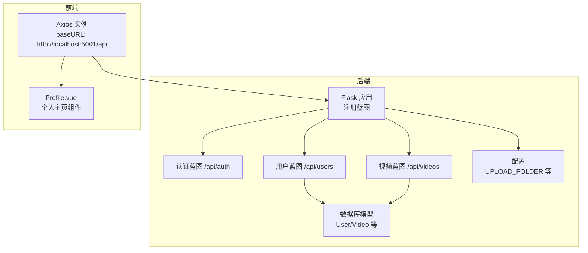
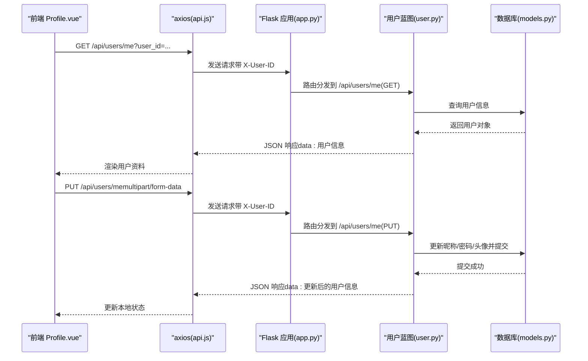
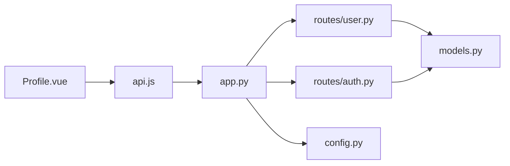

# 用户路由模块

<cite>
**本文引用的文件**
- [backend/app.py](file://backend/app.py)
- [backend/routes/user.py](file://backend/routes/user.py)
- [backend/routes/auth.py](file://backend/routes/auth.py)
- [backend/models.py](file://backend/models.py)
- [backend/config.py](file://backend/config.py)
- [frontend/src/views/Profile.vue](file://frontend/src/views/Profile.vue)
- [frontend/src/api.js](file://frontend/src/api.js)
- [univideo_db.sql](file://univideo_db.sql)
</cite>

## 目录
1. [简介](#简介)
2. [项目结构](#项目结构)
3. [核心组件](#核心组件)
4. [架构总览](#架构总览)
5. [详细组件分析](#详细组件分析)
6. [依赖分析](#依赖分析)
7. [性能考虑](#性能考虑)
8. [故障排查指南](#故障排查指南)
9. [结论](#结论)

## 简介
本文件聚焦于后端用户路由模块（/api/users 前缀），系统性剖析用户个人中心相关接口的实现与业务规则，覆盖以下端点：
- 获取当前用户信息：/api/users/me（GET）
- 更新当前用户资料：/api/users/me（PUT）
- 获取我的投稿（视频历史）：/api/users/me/videos（GET）
- 获取我的收藏：/api/users/me/collections（GET）

同时，文档将重点说明：
- 敏感信息保护策略与数据隐私控制
- 头像上传处理流程与安全校验
- 与前端 Profile.vue 组件的数据绑定机制
- 结合前端请求拦截器对 X-User-ID 请求头的透传使用，确保操作主体一致性与安全性

## 项目结构
后端采用 Flask 蓝图组织路由，用户路由位于 /api/users 前缀；前端通过 axios 统一配置基础 URL 与请求拦截器，自动注入 X-User-ID 请求头以透传当前登录用户标识。

图表来源
- [backend/app.py](file://backend/app.py#L40-L58)
- [backend/routes/user.py](file://backend/routes/user.py#L1-L20)
- [backend/routes/auth.py](file://backend/routes/auth.py#L1-L20)
- [backend/config.py](file://backend/config.py#L11-L30)
- [frontend/src/api.js](file://frontend/src/api.js#L9-L37)
- [frontend/src/views/Profile.vue](file://frontend/src/views/Profile.vue#L89-L148)

章节来源
- [backend/app.py](file://backend/app.py#L40-L58)
- [frontend/src/api.js](file://frontend/src/api.js#L9-L37)

## 核心组件
- 用户蓝图 user_bp：提供 /api/users 前缀下的用户个人中心接口
- 数据模型 User/Video：支撑用户信息、视频历史、收藏列表的数据结构与关系
- 前端 Profile.vue：负责展示用户资料、我的投稿、我的收藏，并调用后端接口
- 前端 api.js：统一配置 axios，自动注入 X-User-ID 请求头

章节来源
- [backend/routes/user.py](file://backend/routes/user.py#L1-L20)
- [backend/models.py](file://backend/models.py#L14-L83)
- [frontend/src/views/Profile.vue](file://frontend/src/views/Profile.vue#L89-L148)
- [frontend/src/api.js](file://frontend/src/api.js#L9-L37)

## 架构总览
用户路由模块在 Flask 中通过蓝图注册到 /api/users 前缀，各端点分别处理用户信息获取、资料更新、视频历史与收藏列表查询。前端 Profile.vue 通过 api.js 的请求拦截器自动附加 X-User-ID 请求头，后端在部分端点通过查询参数 user_id 或请求头 X-User-ID 进行操作主体校验。

图表来源
- [backend/app.py](file://backend/app.py#L40-L58)
- [backend/routes/user.py](file://backend/routes/user.py#L30-L159)
- [backend/models.py](file://backend/models.py#L14-L83)
- [frontend/src/api.js](file://frontend/src/api.js#L21-L37)
- [frontend/src/views/Profile.vue](file://frontend/src/views/Profile.vue#L89-L148)

## 详细组件分析

### 用户信息获取 /api/users/me（GET）
- 功能概述：根据查询参数 user_id 获取指定用户的详细信息（不含敏感字段如密码）
- 输入参数：user_id（查询参数）
- 输出：标准响应结构（code/msg/data），data 为用户对象字典
- 业务规则：
  - 必填校验：缺失 user_id 返回 400
  - 存在性校验：用户不存在返回 404
  - 成功返回：200，data 为 user.to_dict()

敏感信息保护策略：
- 响应体不包含密码字段，避免泄露
- 头像路径为相对路径，前端通过完整 URL 拼接展示

章节来源
- [backend/routes/user.py](file://backend/routes/user.py#L30-L67)
- [backend/models.py](file://backend/models.py#L68-L83)

### 个人信息更新 /api/users/me（PUT）
- 功能概述：支持更新昵称、密码与头像；支持 multipart/form-data 上传头像
- 输入参数：user_id（必填）、nickname（可选）、password（可选）、avatar（可选，文件）
- 输出：标准响应结构，data 为更新后的用户对象字典
- 业务规则：
  - 必填校验：缺失 user_id 返回 400
  - 存在性校验：用户不存在返回 404
  - 昵称长度校验：2-50 字符
  - 密码长度校验：至少 6 位
  - 头像格式校验：仅允许 png, jpg, jpeg, gif, webp
  - 头像文件命名：使用随机 UUID 生成安全文件名，保存到 uploads/avatars 目录
  - 数据库提交：成功后提交事务，失败回滚

敏感信息保护策略：
- 密码通过哈希算法存储，不以明文形式返回
- 头像路径存储为相对路径，前端拼接完整 URL

数据隐私控制：
- 仅允许更新当前用户自身的资料
- 前端通过 X-User-ID 请求头与 user_id 查询参数共同保证操作主体一致性

章节来源
- [backend/routes/user.py](file://backend/routes/user.py#L69-L159)
- [backend/models.py](file://backend/models.py#L42-L59)

### 我的投稿（视频历史）/api/users/me/videos（GET）
- 功能概述：获取当前用户发布的视频列表（按时间倒序）
- 输入参数：user_id（查询参数）
- 输出：标准响应结构，data 包含 total 与 list；list 中每个元素包含视频信息与完整封面/视频 URL
- 业务规则：
  - 必填校验：缺失 user_id 返回 400
  - 存在性校验：用户不存在返回 404
  - 查询逻辑：按 user_id 过滤视频并按 created_at 倒序排序
  - URL 拼接：前端通过完整 URL 展示封面与视频资源

数据隐私控制：
- 仅返回当前用户本人上传的视频
- 前端通过完整 URL 拼接，避免暴露服务器内部路径

章节来源
- [backend/routes/user.py](file://backend/routes/user.py#L162-L209)
- [backend/models.py](file://backend/models.py#L113-L198)

### 我的收藏 /api/users/me/collections（GET）
- 功能概述：获取当前用户收藏的已发布视频列表（按时间倒序）
- 输入参数：user_id（查询参数）
- 输出：标准响应结构，data 包含 total 与 list；list 中每个元素包含视频信息与作者信息
- 业务规则：
  - 必填校验：缺失 user_id 返回 400
  - 存在性校验：用户不存在返回 404
  - 查询逻辑：通过 user.favorites 关系过滤，且只返回状态为“已发布”的视频
  - URL 拼接：前端通过完整 URL 展示封面与视频资源

数据隐私控制：
- 仅返回已发布的视频，避免展示审核中或被驳回的内容
- 前端通过完整 URL 拼接，避免暴露服务器内部路径

章节来源
- [backend/routes/user.py](file://backend/routes/user.py#L217-L266)
- [backend/models.py](file://backend/models.py#L113-L198)

### 前端 Profile.vue 与后端接口的数据绑定机制
- 用户信息获取：Profile.vue 在挂载时调用 GET /api/users/me 并传入当前用户 ID（localStorage 中的 user_id）
- 我的投稿：首次进入页面或切换到“我的投稿”时，调用 GET /api/users/me/videos
- 我的收藏：切换到“我的收藏”时，调用 GET /api/users/me/collections
- 修改资料：打开弹窗后，收集 nickname/password/avatarFile，使用 FormData 提交 PUT /api/users/me，并设置 Content-Type 为 multipart/form-data
- URL 处理：Profile.vue 内部提供 getFullUrl 辅助函数，将相对路径拼接为完整 URL

章节来源
- [frontend/src/views/Profile.vue](file://frontend/src/views/Profile.vue#L89-L148)
- [frontend/src/views/Profile.vue](file://frontend/src/views/Profile.vue#L180-L263)

### JWT 身份验证与 X-User-ID 请求头透传
- 前端 axios 请求拦截器会在每次请求前读取 localStorage 中的 user_id，并将其作为 X-User-ID 请求头发送给后端
- 后端在部分接口（如 /api/auth/me）会从请求头读取 X-User-ID 进行身份校验
- 本用户路由模块当前通过查询参数 user_id 进行主体校验，但前端已具备 X-User-ID 透传能力，便于后续统一鉴权策略

章节来源
- [frontend/src/api.js](file://frontend/src/api.js#L21-L37)
- [backend/routes/auth.py](file://backend/routes/auth.py#L147-L178)
- [backend/routes/user.py](file://backend/routes/user.py#L30-L67)

## 依赖分析
- 蓝图注册：后端在 app.py 中注册用户蓝图到 /api/users 前缀
- 数据模型依赖：用户路由依赖 User/Video 模型进行查询与关系访问
- 配置依赖：上传目录、最大内容长度等配置来自 config.py
- 前端依赖：Profile.vue 通过 api.js 统一发起请求，自动附加 X-User-ID

图表来源
- [backend/app.py](file://backend/app.py#L40-L58)
- [backend/routes/user.py](file://backend/routes/user.py#L1-L20)
- [backend/routes/auth.py](file://backend/routes/auth.py#L1-L20)
- [backend/config.py](file://backend/config.py#L11-L30)
- [frontend/src/api.js](file://frontend/src/api.js#L9-L37)
- [frontend/src/views/Profile.vue](file://frontend/src/views/Profile.vue#L89-L148)

章节来源
- [backend/app.py](file://backend/app.py#L40-L58)
- [backend/models.py](file://backend/models.py#L14-L83)
- [backend/config.py](file://backend/config.py#L11-L30)

## 性能考虑
- 查询优化：视频历史与收藏列表按 created_at 倒序排序，建议在数据库层面建立相应索引以提升排序与筛选性能
- 文件上传：头像上传采用随机 UUID 命名，避免冲突；上传目录提前创建，减少运行时 IO 开销
- 响应体积：用户信息与视频列表返回精简字段，避免不必要的数据传输

[本节为通用性能建议，不直接分析具体文件]

## 故障排查指南
- 400 缺少参数：确认前端调用时是否传入 user_id；检查 Profile.vue 的请求参数构造
- 404 用户不存在：确认 user_id 是否有效；检查数据库 users 表
- 400 昵称/密码校验失败：检查 Profile.vue 的表单校验与后端校验规则
- 400 头像格式不支持：确认文件类型是否在允许列表（png, jpg, jpeg, gif, webp）
- 500 服务器错误：查看后端日志定位异常；确认数据库连接与事务提交

章节来源
- [backend/routes/user.py](file://backend/routes/user.py#L30-L67)
- [backend/routes/user.py](file://backend/routes/user.py#L69-L159)
- [backend/routes/user.py](file://backend/routes/user.py#L162-L209)
- [backend/routes/user.py](file://backend/routes/user.py#L217-L266)

## 结论
用户路由模块围绕 /api/users 前缀提供了完善的个人中心能力，涵盖用户信息获取、资料更新、视频历史与收藏列表。通过查询参数 user_id 与前端 X-User-ID 请求头透传，实现了操作主体的一致性与安全性。后端在数据模型层提供了清晰的关系映射，前端 Profile.vue 与 api.js 协作完成数据绑定与请求拦截。建议后续在统一鉴权策略下，逐步将主体校验从查询参数迁移到请求头与令牌机制，进一步强化安全与一致性。