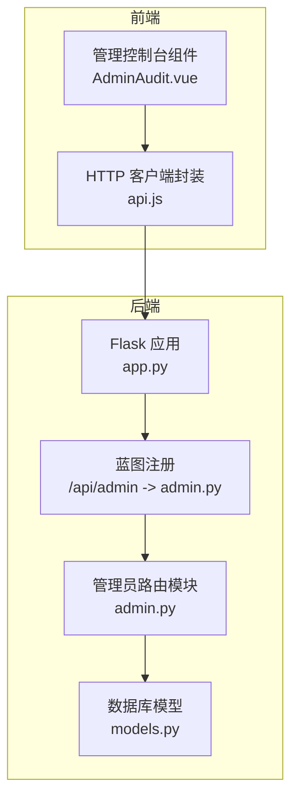
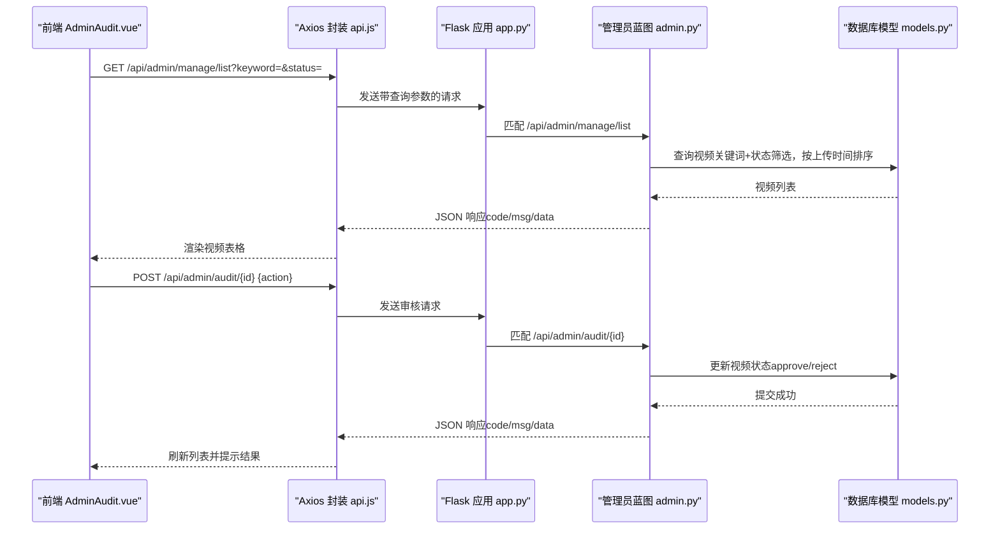
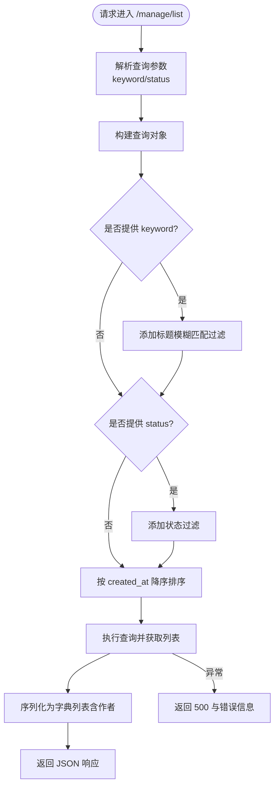
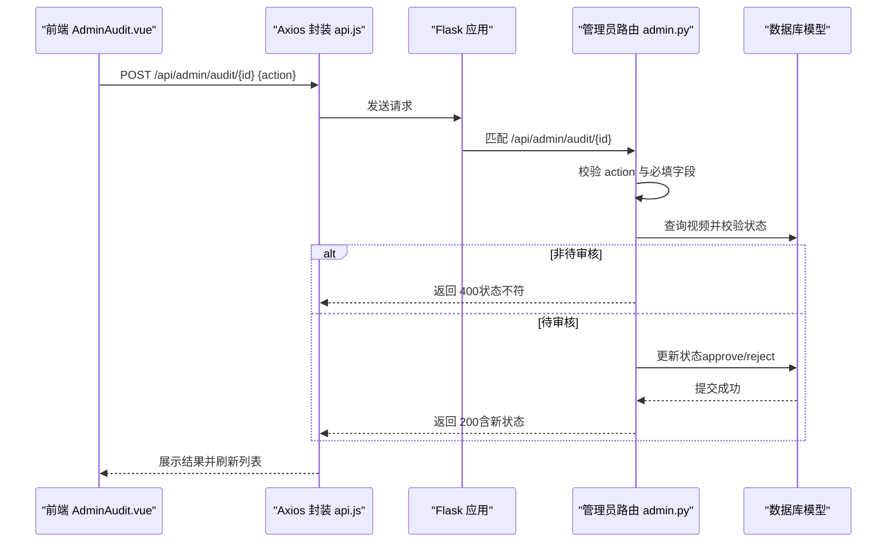
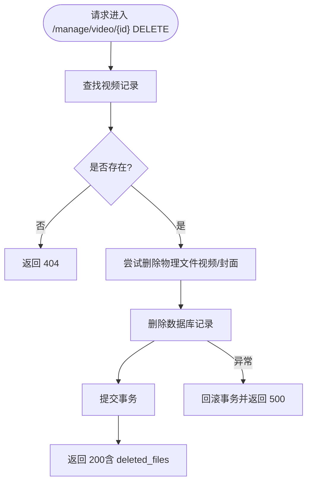
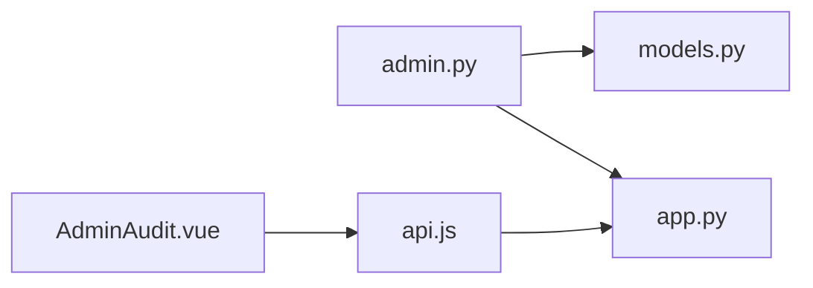

# 管理员路由模块

<cite>
**本文引用的文件**
- [backend/routes/admin.py](file://backend/routes/admin.py)
- [backend/app.py](file://backend/app.py)
- [backend/models.py](file://backend/models.py)
- [frontend/src/views/AdminAudit.vue](file://frontend/src/views/AdminAudit.vue)
- [frontend/src/api.js](file://frontend/src/api.js)
</cite>

## 目录
1. [简介](#简介)
2. [项目结构](#项目结构)
3. [核心组件](#核心组件)
4. [架构总览](#架构总览)
5. [详细组件分析](#详细组件分析)
6. [依赖分析](#依赖分析)
7. [性能考虑](#性能考虑)
8. [故障排查指南](#故障排查指南)
9. [结论](#结论)

## 简介
本文件围绕后端管理员专用接口模块进行系统化文档化，重点覆盖以下方面：
- 前缀/api/admin下的审核与管理能力
- 视频审核接口（/audit）、删除接口（/manage/video/<id>）、视频列表查询（/manage/list）与待审核列表（/audit/list）
- 权限校验机制（仅管理员可见/可操作）
- 审核日志记录与多状态筛选（待审、通过、拒绝）
- 结合AdminAudit.vue组件说明前后端交互模式
- 如何通过状态字段保障内容安全与平台合规性，提供可操作的管理控制台支持

## 项目结构
管理员路由模块位于后端routes目录下，由Flask蓝图统一注册到/api/admin前缀；前端通过AdminAudit.vue提供可视化管理界面，借助Axios封装的api.js进行HTTP调用。

图表来源
- [backend/app.py](file://backend/app.py#L40-L58)
- [backend/routes/admin.py](file://backend/routes/admin.py#L1-L20)
- [backend/models.py](file://backend/models.py#L113-L198)
- [frontend/src/views/AdminAudit.vue](file://frontend/src/views/AdminAudit.vue#L1-L205)
- [frontend/src/api.js](file://frontend/src/api.js#L1-L41)

章节来源
- [backend/app.py](file://backend/app.py#L40-L58)
- [backend/routes/admin.py](file://backend/routes/admin.py#L1-L20)
- [frontend/src/views/AdminAudit.vue](file://frontend/src/views/AdminAudit.vue#L1-L205)
- [frontend/src/api.js](file://frontend/src/api.js#L1-L41)

## 核心组件
- 管理员蓝图与路由
  - 管理列表查询：/api/admin/manage/list（支持关键词与状态筛选）
  - 待审核列表：/api/admin/audit/list（兼容旧接口）
  - 视频审核：/api/admin/audit/<video_id>（POST，action: approve/reject）
  - 删除视频：/api/admin/manage/video/<video_id>（DELETE）
- 数据模型与状态
  - Video模型包含状态字段，用于“先审后发”策略（0=待审核、1=已发布、2=已驳回）
- 前端管理控制台
  - AdminAudit.vue负责搜索、筛选、审核、删除、预览等操作，并在进入页面时进行管理员角色校验

章节来源
- [backend/routes/admin.py](file://backend/routes/admin.py#L13-L245)
- [backend/models.py](file://backend/models.py#L113-L198)
- [frontend/src/views/AdminAudit.vue](file://frontend/src/views/AdminAudit.vue#L1-L205)

## 架构总览
管理员路由模块采用Flask蓝图集中管理，统一挂载于/api/admin前缀。后端通过SQLAlchemy模型与数据库交互，前端通过Axios封装的api.js发起请求，组件AdminAudit.vue负责UI与业务编排。

图表来源
- [backend/app.py](file://backend/app.py#L40-L58)
- [backend/routes/admin.py](file://backend/routes/admin.py#L13-L173)
- [backend/models.py](file://backend/models.py#L113-L198)
- [frontend/src/views/AdminAudit.vue](file://frontend/src/views/AdminAudit.vue#L78-L168)
- [frontend/src/api.js](file://frontend/src/api.js#L1-L41)

## 详细组件分析

### 管理员路由与权限校验
- 路由注册
  - 后端在应用工厂中将admin蓝图注册到/api/admin前缀，确保所有管理员接口均以该前缀暴露。
- 权限校验
  - 后端未在admin.py内实现显式的管理员鉴权装饰器。前端在进入AdminAudit.vue时通过localStorage中的role进行校验，非admin用户会被阻止访问。建议在后端补充基于请求头或会话的管理员鉴权中间件，以增强安全性与一致性。

章节来源
- [backend/app.py](file://backend/app.py#L40-L58)
- [frontend/src/views/AdminAudit.vue](file://frontend/src/views/AdminAudit.vue#L195-L204)

### 视频列表查询（/manage/list）
- 功能要点
  - 支持关键词模糊搜索（按标题）
  - 支持状态筛选（0=待审核、1=已发布、2=已驳回），不传则查询全部
  - 按上传时间降序排列
  - 返回总数与列表，列表包含作者信息（当include_author=True时）
- 错误处理
  - 服务器内部异常统一返回500与错误信息

图表来源
- [backend/routes/admin.py](file://backend/routes/admin.py#L13-L51)
- [backend/models.py](file://backend/models.py#L166-L194)

章节来源
- [backend/routes/admin.py](file://backend/routes/admin.py#L13-L51)
- [backend/models.py](file://backend/models.py#L166-L194)

### 待审核列表（/audit/list）
- 功能要点
  - 查询所有status=0（待审核）的视频
  - 按上传时间升序排列（先传的先审）
  - 返回总数与列表，列表包含作者信息
- 兼容性
  - 该接口保留用于兼容旧版本前端或迁移阶段

章节来源
- [backend/routes/admin.py](file://backend/routes/admin.py#L60-L93)

### 视频审核（/audit/<video_id>）
- 功能要点
  - 接收JSON：action（"approve"|"reject"）
  - 通过审核：status=1（已发布）
  - 驳回：status=2（已驳回）
  - 仅对处于待审核状态的视频生效，避免重复审核
- 错误处理
  - 缺少action、action非法、视频不存在、非待审核状态、数据库异常等均有明确响应码与消息
  - 异常时回滚事务，保证数据一致性

图表来源
- [backend/routes/admin.py](file://backend/routes/admin.py#L95-L173)
- [backend/models.py](file://backend/models.py#L113-L198)
- [frontend/src/views/AdminAudit.vue](file://frontend/src/views/AdminAudit.vue#L120-L144)
- [frontend/src/api.js](file://frontend/src/api.js#L1-L41)

章节来源
- [backend/routes/admin.py](file://backend/routes/admin.py#L95-L173)
- [backend/models.py](file://backend/models.py#L113-L198)
- [frontend/src/views/AdminAudit.vue](file://frontend/src/views/AdminAudit.vue#L120-L144)
- [frontend/src/api.js](file://frontend/src/api.js#L1-L41)

### 删除视频（/manage/video/<video_id>）
- 功能要点
  - 逻辑删除：先尝试删除物理文件（视频与封面），再删除数据库记录
  - 返回被删除的视频ID、标题以及实际删除的文件名列表
- 错误处理
  - 视频不存在、数据库异常等返回相应错误码与消息
  - 物理文件删除失败仅记录日志，不影响数据库删除

图表来源
- [backend/routes/admin.py](file://backend/routes/admin.py#L175-L245)
- [backend/models.py](file://backend/models.py#L113-L198)

章节来源
- [backend/routes/admin.py](file://backend/routes/admin.py#L175-L245)
- [backend/models.py](file://backend/models.py#L113-L198)

### 前后端交互模式（AdminAudit.vue）
- 页面初始化
  - 进入页面时读取localStorage中的role，若非admin则弹窗提示并跳转首页
- 列表加载
  - 组装查询参数（keyword、status），调用/api/admin/manage/list
- 审核操作
  - confirm确认后调用/api/admin/audit/{id}，action为approve或reject
- 删除操作
  - confirm确认后调用/api/admin/manage/video/{id}
- 预览
  - 打开模态框，展示视频封面与简介，支持直接在模态框内进行审核与删除

章节来源
- [frontend/src/views/AdminAudit.vue](file://frontend/src/views/AdminAudit.vue#L78-L168)
- [frontend/src/views/AdminAudit.vue](file://frontend/src/views/AdminAudit.vue#L195-L204)
- [frontend/src/api.js](file://frontend/src/api.js#L1-L41)

### 审核日志记录与合规性
- 当前实现
  - 后端未实现专门的审核日志表或审计轨迹记录
  - 前端未提供日志查看界面
- 建议
  - 新增审核日志表，记录操作人（管理员）、操作类型（通过/驳回）、目标视频、时间戳、原因等
  - 在管理控制台增加“审核日志”页签，支持导出与检索
  - 与状态字段配合，确保“先审后发”，防止违规内容上线

章节来源
- [backend/models.py](file://backend/models.py#L113-L198)
- [backend/routes/admin.py](file://backend/routes/admin.py#L95-L173)

## 依赖分析
- 组件耦合
  - admin.py依赖models.py中的Video模型与db会话
  - 前端AdminAudit.vue依赖api.js提供的HTTP客户端
- 外部依赖
  - Flask蓝图注册、CORS跨域、SQLAlchemy ORM、文件系统（删除物理文件）

图表来源
- [backend/routes/admin.py](file://backend/routes/admin.py#L1-L20)
- [backend/models.py](file://backend/models.py#L113-L198)
- [backend/app.py](file://backend/app.py#L40-L58)
- [frontend/src/views/AdminAudit.vue](file://frontend/src/views/AdminAudit.vue#L1-L205)
- [frontend/src/api.js](file://frontend/src/api.js#L1-L41)

章节来源
- [backend/routes/admin.py](file://backend/routes/admin.py#L1-L20)
- [backend/models.py](file://backend/models.py#L113-L198)
- [backend/app.py](file://backend/app.py#L40-L58)
- [frontend/src/views/AdminAudit.vue](file://frontend/src/views/AdminAudit.vue#L1-L205)
- [frontend/src/api.js](file://frontend/src/api.js#L1-L41)

## 性能考虑
- 查询优化
  - manage/list已按created_at排序，建议在status与created_at上建立复合索引以提升大表筛选效率
- 并发与事务
  - 审核与删除均使用db.session，异常时回滚，避免脏数据
- 前端体验
  - 操作期间禁用按钮，避免重复提交
  - 列表分页（如需）可减少一次性渲染压力

## 故障排查指南
- 常见问题与定位
  - 400 缺少action或action非法：检查前端传递的action值
  - 404 视频不存在：确认video_id是否正确
  - 400 非待审核状态：确认视频当前状态是否仍为待审核
  - 500 服务器错误：查看后端日志，关注数据库异常与文件删除异常
- 建议
  - 前端统一捕获错误并提示，避免静默失败
  - 后端补充统一的异常处理器与日志记录

章节来源
- [backend/routes/admin.py](file://backend/routes/admin.py#L95-L173)
- [backend/routes/admin.py](file://backend/routes/admin.py#L175-L245)

## 结论
管理员路由模块通过清晰的REST接口实现了视频审核、删除与管理列表查询，配合前端AdminAudit.vue提供了直观的管理控制台。当前实现以状态字段为核心保障内容安全与合规性，但建议在后端补充管理员鉴权与审核日志记录，以进一步提升安全性与可追溯性。