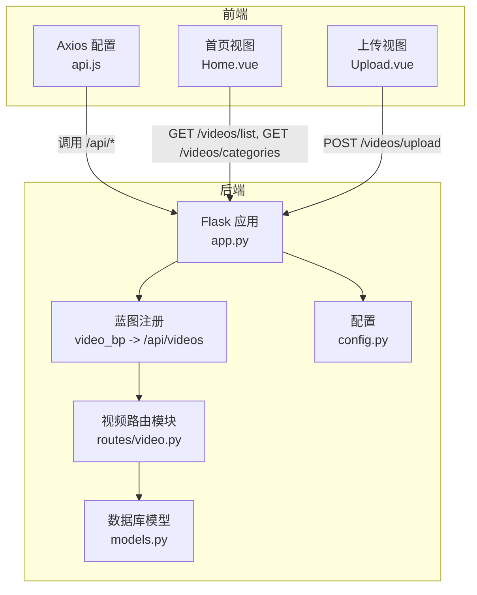
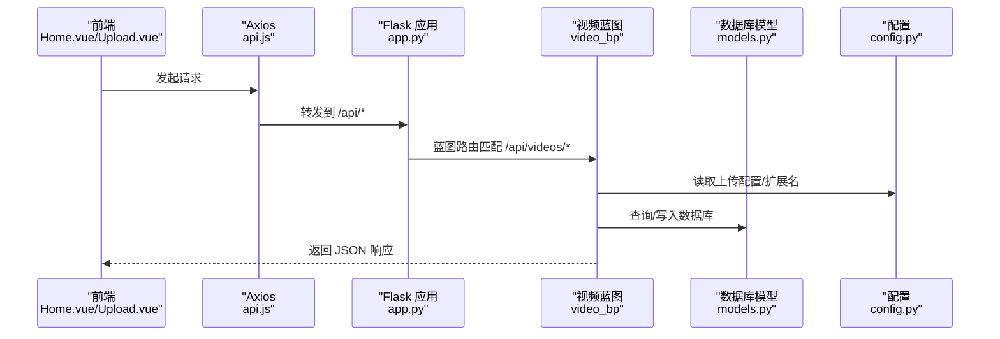
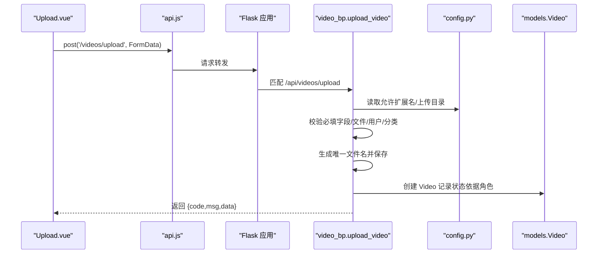
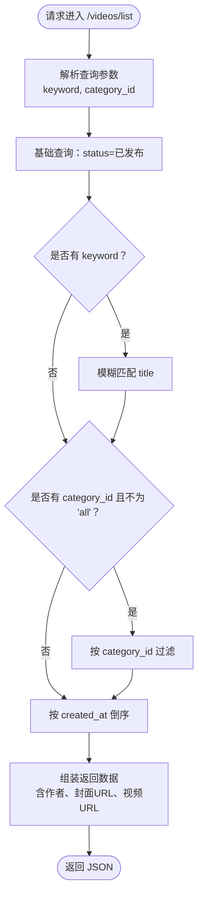
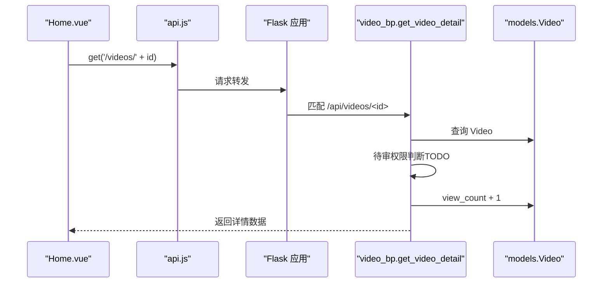
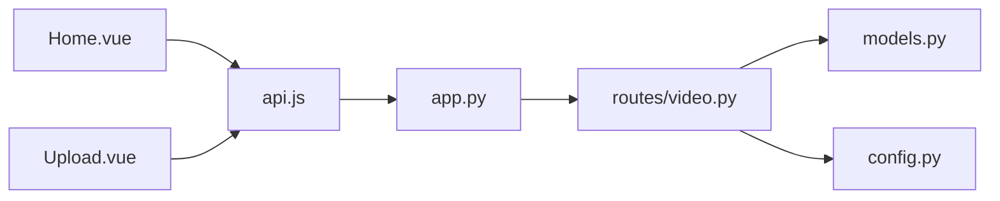

# 视频路由模块

<cite>
**本文引用的文件**
- [backend/routes/video.py](file://backend/routes/video.py)
- [backend/app.py](file://backend/app.py)
- [backend/models.py](file://backend/models.py)
- [backend/config.py](file://backend/config.py)
- [frontend/src/views/Home.vue](file://frontend/src/views/Home.vue)
- [frontend/src/views/Upload.vue](file://frontend/src/views/Upload.vue)
- [frontend/src/api.js](file://frontend/src/api.js)
</cite>

## 目录
1. [简介](#简介)
2. [项目结构](#项目结构)
3. [核心组件](#核心组件)
4. [架构总览](#架构总览)
5. [详细组件分析](#详细组件分析)
6. [依赖分析](#依赖分析)
7. [性能考虑](#性能考虑)
8. [故障排查指南](#故障排查指南)
9. [结论](#结论)
10. [附录](#附录)

## 简介
本文件聚焦于后端视频路由模块（/api/videos 前缀）的完整生命周期管理接口，涵盖视频上传、列表获取、详情查询、分类获取等端点的设计与业务逻辑。重点说明文件上传处理（视频与封面）、数据库记录创建、分页机制、模糊搜索实现及状态过滤（待审/已发布）等功能。同时结合应用蓝图注册说明其解耦设计，并给出前端 Home.vue 与 Upload.vue 的典型调用示例。

## 项目结构
- 后端采用 Flask + SQLAlchemy 架构，路由模块以蓝图形式组织，便于按功能域解耦。
- 视频路由位于 backend/routes/video.py，蓝图名为 video_bp，并在 backend/app.py 中以 /api/videos 前缀注册。
- 前端通过 axios 实例统一访问 /api 基础地址，Home.vue 调用 /videos/list 与 /videos/categories，Upload.vue 调用 /videos/upload 并提供封面截取能力。

图表来源
- [backend/app.py](file://backend/app.py#L39-L58)
- [backend/routes/video.py](file://backend/routes/video.py#L1-L20)
- [backend/config.py](file://backend/config.py#L11-L30)
- [frontend/src/api.js](file://frontend/src/api.js#L9-L15)
- [frontend/src/views/Home.vue](file://frontend/src/views/Home.vue#L34-L65)
- [frontend/src/views/Upload.vue](file://frontend/src/views/Upload.vue#L170-L202)

章节来源
- [backend/app.py](file://backend/app.py#L39-L58)
- [backend/routes/video.py](file://backend/routes/video.py#L1-L20)
- [backend/config.py](file://backend/config.py#L11-L30)
- [frontend/src/api.js](file://frontend/src/api.js#L9-L15)
- [frontend/src/views/Home.vue](file://frontend/src/views/Home.vue#L34-L65)
- [frontend/src/views/Upload.vue](file://frontend/src/views/Upload.vue#L170-L202)

## 核心组件
- 视频蓝图 video_bp：集中定义 /api/videos 前缀下的视频相关接口，包括上传、列表、详情、分类获取。
- 数据模型 Video：包含状态字段（待审/已发布/驳回），用于实现“先审后发”的核心控制。
- 配置项：允许的视频/图片扩展名、上传目录、最大文件体积等，保障上传安全与一致性。
- 前端调用：Home.vue 使用 /videos/list 与 /videos/categories；Upload.vue 使用 /videos/upload 并通过 FormData 传输文件。

章节来源
- [backend/routes/video.py](file://backend/routes/video.py#L15-L20)
- [backend/models.py](file://backend/models.py#L113-L198)
- [backend/config.py](file://backend/config.py#L18-L30)
- [frontend/src/views/Home.vue](file://frontend/src/views/Home.vue#L34-L65)
- [frontend/src/views/Upload.vue](file://frontend/src/views/Upload.vue#L170-L202)

## 架构总览
视频模块遵循“蓝图解耦 + 统一前缀”的设计，后端通过 app.py 注册 video_bp 到 /api/videos，前端通过 api.js 的 baseURL 统一访问 /api 下的各子模块。视频状态由模型层的状态常量控制，路由层据此实现差异化发布策略与查询过滤。

图表来源
- [backend/app.py](file://backend/app.py#L39-L58)
- [backend/routes/video.py](file://backend/routes/video.py#L37-L171)
- [backend/models.py](file://backend/models.py#L113-L198)
- [backend/config.py](file://backend/config.py#L18-L30)
- [frontend/src/api.js](file://frontend/src/api.js#L9-L15)

## 详细组件分析

### 视频上传接口 /api/videos/upload
- 功能概述：接收 multipart/form-data，校验必填字段与文件类型，保存视频与封面文件，创建数据库记录，并根据用户角色设置状态（管理员直接发布，普通用户待审）。
- 关键流程：
  - 表单参数校验：user_id、title、category_id 必填；video_file、cover_file 必传且非空。
  - 用户与分类存在性校验。
  - 文件扩展名校验：视频扩展名来自配置 ALLOWED_VIDEO_EXTENSIONS；封面扩展名来自 ALLOWED_IMAGE_EXTENSIONS。
  - 文件命名：时间戳+UUID，避免冲突；分别保存至 videos 与 covers 子目录。
  - 数据库写入：构造 Video 记录，状态依据用户角色动态设置。
  - 异常处理：捕获异常并回滚事务，返回统一错误响应。
- 前端调用：Upload.vue 通过 FormData 传递 user_id、title、description、category_id、video_file、cover_file，并设置 Content-Type 为 multipart/form-data。

图表来源
- [frontend/src/views/Upload.vue](file://frontend/src/views/Upload.vue#L170-L202)
- [backend/routes/video.py](file://backend/routes/video.py#L37-L171)
- [backend/config.py](file://backend/config.py#L18-L30)
- [backend/models.py](file://backend/models.py#L113-L198)

章节来源
- [backend/routes/video.py](file://backend/routes/video.py#L37-L171)
- [frontend/src/views/Upload.vue](file://frontend/src/views/Upload.vue#L170-L202)
- [backend/config.py](file://backend/config.py#L18-L30)
- [backend/models.py](file://backend/models.py#L113-L198)

### 视频列表接口 /api/videos/list
- 功能概述：仅返回已发布状态的视频列表，支持关键词模糊搜索（基于标题）与分类筛选（category_id），按上传时间倒序排序。
- 关键流程：
  - 过滤条件：status=已发布（常量）。
  - 模糊搜索：当提供 keyword 时，对 title 进行模糊匹配。
  - 分类筛选：当 category_id 存在且不为 'all' 时，按分类过滤；非法值将被忽略。
  - 结果构建：遍历查询结果，组装包含作者信息、封面与视频 URL 的数据。
- 前端调用：Home.vue 在搜索与分类切换时调用 /videos/list，并将 keyword 与 category_id 作为查询参数传递。

图表来源
- [backend/routes/video.py](file://backend/routes/video.py#L173-L226)
- [backend/models.py](file://backend/models.py#L113-L198)

章节来源
- [backend/routes/video.py](file://backend/routes/video.py#L173-L226)
- [frontend/src/views/Home.vue](file://frontend/src/views/Home.vue#L48-L65)
- [backend/models.py](file://backend/models.py#L113-L198)

### 视频详情接口 /api/videos/<id>
- 功能概述：根据视频 ID 获取详情，每次访问增加播放量；当前版本对待审视频的访问权限判断为 TODO，后续可基于请求头中的用户标识实现仅上传者或管理员可见。
- 关键流程：
  - 查询视频是否存在；不存在返回 404。
  - 待审视频访问权限判断（TODO）。
  - 每次访问 view_count +1 并提交事务。
  - 返回包含作者信息与完整封面/视频 URL 的数据。
- 前端调用：Home.vue 点击视频卡片跳转到 /video/:id，前端路由与视频详情页配合使用该接口。

图表来源
- [backend/routes/video.py](file://backend/routes/video.py#L228-L282)
- [frontend/src/views/Home.vue](file://frontend/src/views/Home.vue#L120-L125)
- [backend/models.py](file://backend/models.py#L113-L198)

章节来源
- [backend/routes/video.py](file://backend/routes/video.py#L228-L282)
- [frontend/src/views/Home.vue](file://frontend/src/views/Home.vue#L120-L125)
- [backend/models.py](file://backend/models.py#L113-L198)

### 分类获取接口 /api/videos/categories
- 功能概述：返回所有视频分类，供上传页面的分类下拉框使用。
- 关键流程：查询 Category 表并序列化为字典列表。

章节来源
- [backend/routes/video.py](file://backend/routes/video.py#L15-L35)
- [frontend/src/views/Upload.vue](file://frontend/src/views/Upload.vue#L38-L52)
- [frontend/src/views/Home.vue](file://frontend/src/views/Home.vue#L34-L45)

### 蓝图注册与解耦设计
- 解耦要点：
  - 路由集中在 video.py 中，通过 Blueprint 定义，避免在应用入口中堆叠大量路由代码。
  - 在 app.py 中以 url_prefix='/api/videos' 注册，使路由具备清晰的命名空间，便于扩展其他模块（如 /api/users、/api/admin）。
  - 配置集中于 config.py，上传目录、扩展名、最大文件体积等通过 app.py 在启动时初始化，确保前后端一致。

章节来源
- [backend/app.py](file://backend/app.py#L39-L58)
- [backend/config.py](file://backend/config.py#L11-L30)

## 依赖分析
- 组件耦合与内聚：
  - video_bp 对 models.py 的 Video/Category/User 有直接依赖，用于查询与写入。
  - 与 config.py 的耦合体现在上传目录与扩展名校验，确保上传行为的一致性。
  - 前端通过 api.js 统一访问 /api，Home.vue 与 Upload.vue 分别依赖 /videos/list 与 /videos/upload。
- 外部依赖与集成点：
  - Flask-CORS 在 app.py 中初始化，允许前端跨域访问。
  - Flask-Migrate 在 app.py 中初始化，用于数据库迁移工具链。
  - 前端 axios 默认超时与请求头透传（X-User-ID）在 api.js 中配置。

图表来源
- [backend/routes/video.py](file://backend/routes/video.py#L1-L20)
- [backend/models.py](file://backend/models.py#L113-L198)
- [backend/config.py](file://backend/config.py#L11-L30)
- [backend/app.py](file://backend/app.py#L23-L58)
- [frontend/src/api.js](file://frontend/src/api.js#L9-L15)
- [frontend/src/views/Home.vue](file://frontend/src/views/Home.vue#L34-L65)
- [frontend/src/views/Upload.vue](file://frontend/src/views/Upload.vue#L170-L202)

章节来源
- [backend/routes/video.py](file://backend/routes/video.py#L1-L20)
- [backend/models.py](file://backend/models.py#L113-L198)
- [backend/config.py](file://backend/config.py#L11-L30)
- [backend/app.py](file://backend/app.py#L23-L58)
- [frontend/src/api.js](file://frontend/src/api.js#L9-L15)
- [frontend/src/views/Home.vue](file://frontend/src/views/Home.vue#L34-L65)
- [frontend/src/views/Upload.vue](file://frontend/src/views/Upload.vue#L170-L202)

## 性能考虑
- 查询性能：
  - 列表接口对 status 与 created_at 建有索引，模糊搜索对 title 使用 like，建议在大数据量时限制返回条数或引入分页（当前实现未分页，后续可考虑）。
- 上传性能：
  - 上传目录提前创建，避免运行时 IO 错误。
  - 文件命名采用时间戳+UUID，减少冲突概率。
- 前端体验：
  - Upload.vue 在选择文件后即时生成预览 URL，注意在组件卸载时释放 URL，避免内存泄漏。
  - Home.vue 在搜索与分类切换时触发请求，建议在高频交互场景加入防抖。

[本节为通用指导，不涉及具体文件分析]

## 故障排查指南
- 上传失败（400 缺少参数/文件）：
  - 检查前端是否正确构造 FormData，确认 user_id、title、category_id、video_file、cover_file 是否存在。
  - 检查文件扩展名是否在 ALLOWED_VIDEO_EXTENSIONS 或 ALLOWED_IMAGE_EXTENSIONS。
- 上传失败（404 用户/分类不存在）：
  - 确认 user_id 与 category_id 对应的数据存在。
- 服务器错误（500）：
  - 检查数据库连接与权限；查看后端日志定位异常。
- 列表为空或未显示待审视频：
  - 列表接口仅返回已发布视频；待审视频需管理员或上传者本人访问（权限判断为 TODO）。
- 详情访问受限（403）：
  - 当前实现对待审视频的访问权限判断为 TODO，需在路由中补充基于请求头的用户校验。

章节来源
- [backend/routes/video.py](file://backend/routes/video.py#L37-L171)
- [backend/routes/video.py](file://backend/routes/video.py#L173-L226)
- [backend/routes/video.py](file://backend/routes/video.py#L228-L282)
- [backend/config.py](file://backend/config.py#L18-L30)

## 结论
视频路由模块以蓝图形式实现了清晰的命名空间与职责划分，围绕 /api/videos 前缀提供上传、列表、详情与分类等核心能力。通过模型层的状态常量与路由层的角色判断，实现了“先审后发”的关键控制；前端通过统一的 axios 配置与视图组件，完成了典型使用场景的调用闭环。后续可在列表接口引入分页与更完善的权限控制，进一步提升性能与安全性。

[本节为总结性内容，不涉及具体文件分析]

## 附录
- 前端典型调用示例路径：
  - Home.vue 获取分类与列表：[frontend/src/views/Home.vue](file://frontend/src/views/Home.vue#L34-L65)
  - Upload.vue 上传视频：[frontend/src/views/Upload.vue](file://frontend/src/views/Upload.vue#L170-L202)
  - Axios 基础配置：[frontend/src/api.js](file://frontend/src/api.js#L9-L15)
- 后端蓝图注册与配置：
  - 蓝图注册：[backend/app.py](file://backend/app.py#L39-L58)
  - 配置项（上传目录/扩展名/最大体积）：[backend/config.py](file://backend/config.py#L18-L30)
- 数据模型状态常量：
  - Video 状态常量与 to_dict：[backend/models.py](file://backend/models.py#L113-L198)