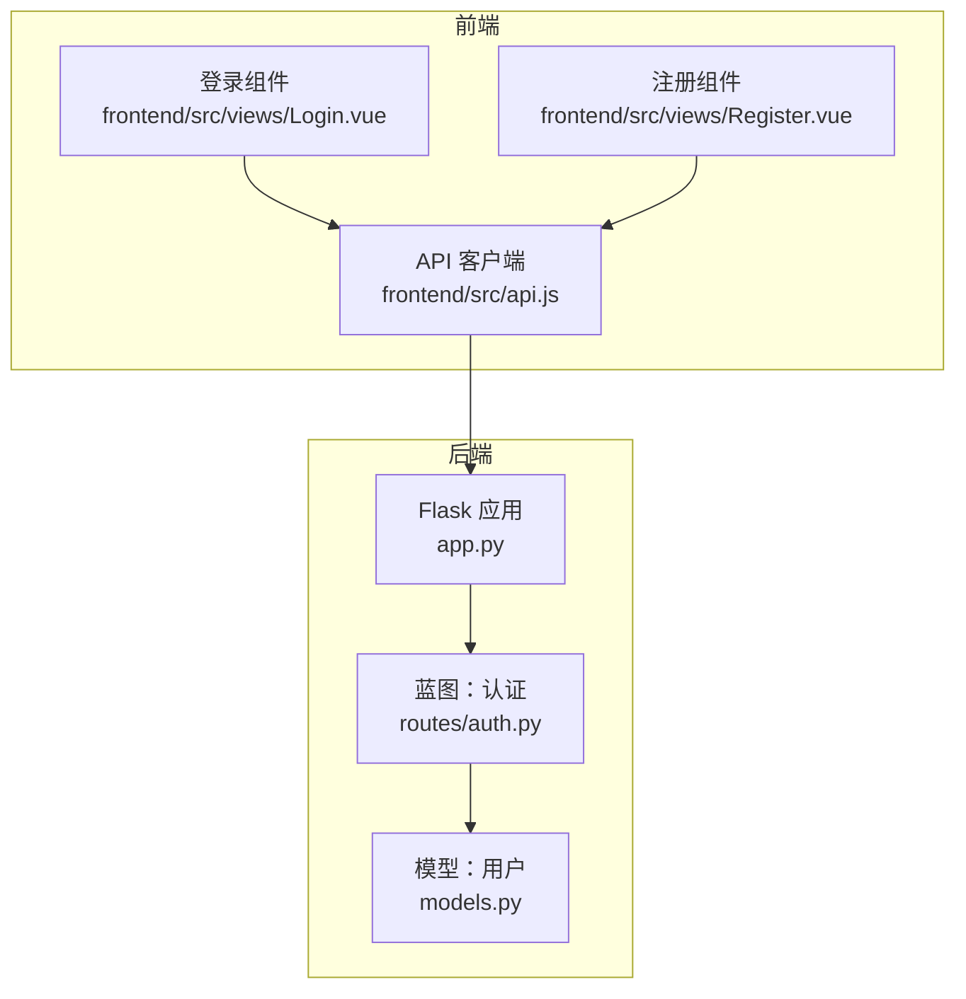
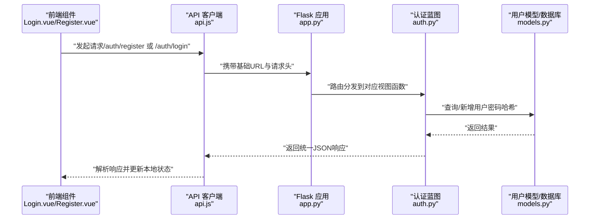
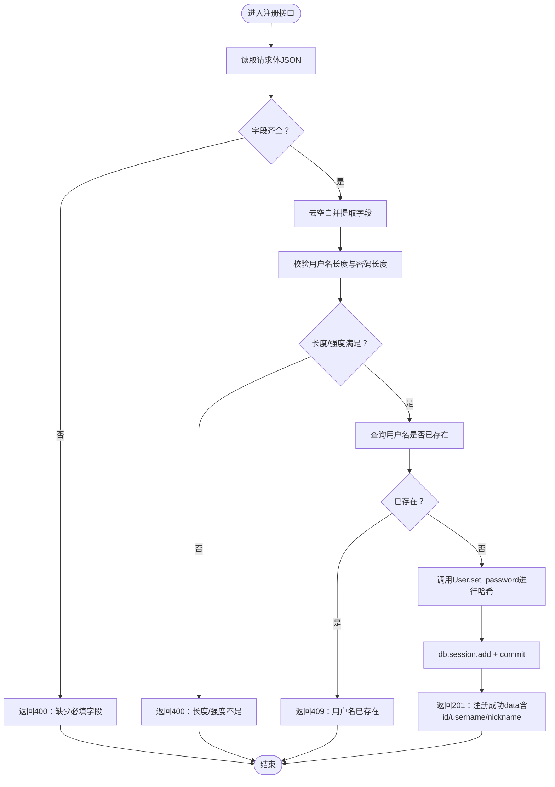
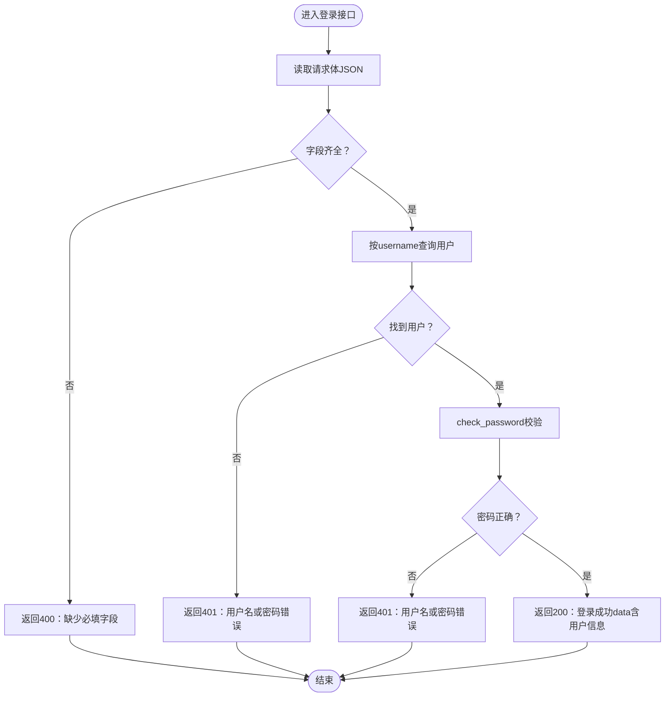
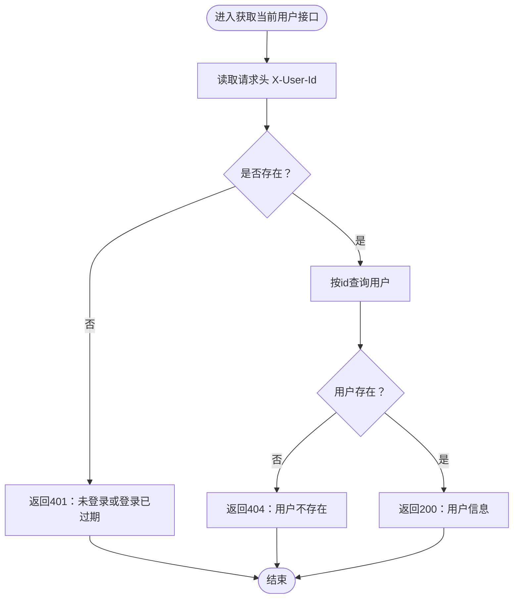
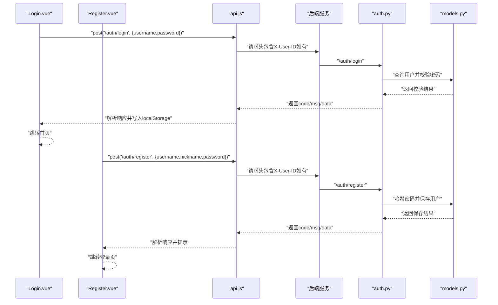
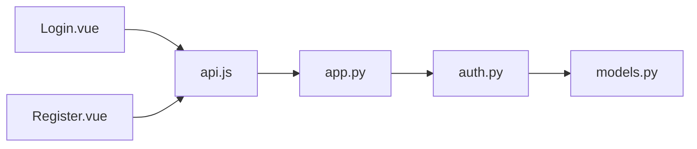

# 认证路由模块

<cite>
**本文引用的文件列表**
- [backend/routes/auth.py](file://backend/routes/auth.py)
- [backend/app.py](file://backend/app.py)
- [backend/models.py](file://backend/models.py)
- [frontend/src/views/Login.vue](file://frontend/src/views/Login.vue)
- [frontend/src/views/Register.vue](file://frontend/src/views/Register.vue)
- [frontend/src/api.js](file://frontend/src/api.js)
</cite>

## 目录
1. [简介](#简介)
2. [项目结构](#项目结构)
3. [核心组件](#核心组件)
4. [架构总览](#架构总览)
5. [详细组件分析](#详细组件分析)
6. [依赖分析](#依赖分析)
7. [性能考虑](#性能考虑)
8. [故障排查指南](#故障排查指南)
9. [结论](#结论)

## 简介
本文件系统化解析后端认证路由模块（auth.py），重点阐述基于Flask蓝图的/auth功能边界设计，包括注册与登录接口的RESTful设计、密码哈希处理流程、请求参数验证与唯一性检查、异常处理策略，以及与前端Login.vue与Register.vue组件的协同方式。同时给出统一的错误响应格式与HTTP状态码使用策略，帮助开发者理解并安全地集成身份认证服务。

## 项目结构
后端采用Flask应用工厂模式，通过蓝图将不同业务域拆分，认证相关逻辑集中在auth.py，并由app.py集中注册。前端通过Axios封装统一请求，拦截器自动注入用户标识，便于后端在需要时进行会话态校验。

图表来源
- [backend/app.py](file://backend/app.py#L39-L60)
- [backend/routes/auth.py](file://backend/routes/auth.py#L1-L184)
- [backend/models.py](file://backend/models.py#L14-L83)
- [frontend/src/api.js](file://frontend/src/api.js#L1-L41)
- [frontend/src/views/Login.vue](file://frontend/src/views/Login.vue#L1-L52)
- [frontend/src/views/Register.vue](file://frontend/src/views/Register.vue#L1-L54)

章节来源
- [backend/app.py](file://backend/app.py#L39-L60)
- [backend/routes/auth.py](file://backend/routes/auth.py#L1-L184)
- [frontend/src/api.js](file://frontend/src/api.js#L1-L41)

## 核心组件
- 认证蓝图（auth_bp）：提供注册、登录、当前用户信息查询三个接口，均位于/api/auth前缀下。
- 用户模型（User）：负责密码哈希设置与校验、角色判断、序列化输出等。
- 前端API客户端：统一基地址、超时、请求头注入（X-User-ID），并与Vue组件协作完成认证流程。

章节来源
- [backend/routes/auth.py](file://backend/routes/auth.py#L1-L184)
- [backend/models.py](file://backend/models.py#L14-L83)
- [frontend/src/api.js](file://frontend/src/api.js#L1-L41)

## 架构总览
认证模块遵循“请求-验证-业务-持久化-响应”的标准流水线，错误通过统一的JSON结构返回，状态码遵循REST语义。前端通过拦截器自动附加用户标识，后端在需要时可据此进行会话态校验。

图表来源
- [frontend/src/views/Login.vue](file://frontend/src/views/Login.vue#L21-L52)
- [frontend/src/views/Register.vue](file://frontend/src/views/Register.vue#L22-L54)
- [frontend/src/api.js](file://frontend/src/api.js#L9-L40)
- [backend/app.py](file://backend/app.py#L39-L60)
- [backend/routes/auth.py](file://backend/routes/auth.py#L12-L184)
- [backend/models.py](file://backend/models.py#L14-L83)

## 详细组件分析

### 注册接口（/auth/register）
- 功能边界
  - 输入：JSON对象，包含username、password、nickname。
  - 输出：注册成功时返回用户简要信息；失败时返回统一错误结构。
- 请求参数验证
  - 必填字段校验：若缺少任一字段，返回400错误。
  - 字段长度与强度校验：用户名长度限制、密码长度限制。
- 唯一性检查
  - 查询username是否已存在，若存在则返回409冲突。
- 密码哈希处理
  - 使用User.set_password进行哈希存储，避免明文落库。
- 数据持久化
  - 新建User实体，调用db.session.add与commit提交。
- 成功响应
  - 201 Created，返回code=200与data（含id、username、nickname）。
- 异常处理
  - 捕获异常并回滚事务，返回500服务器错误。

图表来源
- [backend/routes/auth.py](file://backend/routes/auth.py#L12-L79)
- [backend/models.py](file://backend/models.py#L42-L59)

章节来源
- [backend/routes/auth.py](file://backend/routes/auth.py#L12-L79)
- [backend/models.py](file://backend/models.py#L42-L59)

### 登录接口（/auth/login）
- 功能边界
  - 输入：JSON对象，包含username、password。
  - 输出：登录成功时返回用户简要信息（不含敏感字段）。
- 请求参数验证
  - 必填字段校验：若缺少任一字段，返回400错误。
- 用户查找与凭证校验
  - 根据username查询用户；若不存在或密码不匹配，返回401未授权。
- 成功响应
  - 200 OK，返回code=200与data（含id、username、nickname、role、avatar）。
- 异常处理
  - 捕获异常并返回500服务器错误。

图表来源
- [backend/routes/auth.py](file://backend/routes/auth.py#L89-L145)
- [backend/models.py](file://backend/models.py#L50-L59)

章节来源
- [backend/routes/auth.py](file://backend/routes/auth.py#L89-L145)
- [backend/models.py](file://backend/models.py#L50-L59)

### 当前用户信息接口（/auth/me）
- 功能边界
  - 通过请求头X-User-Id获取当前用户信息，用于简化版会话态校验。
- 请求参数与校验
  - 若请求头缺失，返回401未授权。
  - 若用户不存在，返回404。
- 成功响应
  - 200 OK，返回code=200与data（用户完整信息）。
- 异常处理
  - 捕获异常并返回500服务器错误。

图表来源
- [backend/routes/auth.py](file://backend/routes/auth.py#L147-L184)

章节来源
- [backend/routes/auth.py](file://backend/routes/auth.py#L147-L184)

### 前后端协同与会话态管理
- 前端Login.vue
  - 调用后端登录接口，成功后将用户id、昵称、角色写入localStorage。
  - 组件内部对必填字段进行前端校验，避免无效请求。
- 前端Register.vue
  - 调用后端注册接口，成功后提示并跳转登录页。
  - 前端对密码长度进行校验，与后端一致。
- 前端API拦截器
  - 自动从localStorage读取user_id并注入请求头X-User-ID，便于后端在需要时进行会话态校验。
- 后端蓝图注册
  - app.py将auth蓝图注册到/api/auth前缀，保证接口路径与前端调用一致。

图表来源
- [frontend/src/views/Login.vue](file://frontend/src/views/Login.vue#L21-L52)
- [frontend/src/views/Register.vue](file://frontend/src/views/Register.vue#L22-L54)
- [frontend/src/api.js](file://frontend/src/api.js#L21-L37)
- [backend/app.py](file://backend/app.py#L39-L60)
- [backend/routes/auth.py](file://backend/routes/auth.py#L12-L184)
- [backend/models.py](file://backend/models.py#L42-L59)

章节来源
- [frontend/src/views/Login.vue](file://frontend/src/views/Login.vue#L1-L52)
- [frontend/src/views/Register.vue](file://frontend/src/views/Register.vue#L1-L54)
- [frontend/src/api.js](file://frontend/src/api.js#L1-L41)
- [backend/app.py](file://backend/app.py#L39-L60)
- [backend/routes/auth.py](file://backend/routes/auth.py#L12-L184)
- [backend/models.py](file://backend/models.py#L42-L59)

## 依赖分析
- 组件耦合
  - auth.py依赖models.User与db，负责业务逻辑与数据持久化。
  - app.py集中注册蓝图，形成清晰的路由边界。
  - 前端api.js通过拦截器与后端约定的请求头进行会话态透传。
- 外部依赖
  - Flask、Flask-SQLAlchemy、Werkzeug（密码哈希）、Flask-CORS（跨域）。
- 潜在风险
  - 当前登录接口未返回JWT，会话态依赖localStorage与请求头透传，需注意XSS与CSRF防护。
  - 注册接口未实现邮箱唯一性校验，若业务需要可扩展。

图表来源
- [backend/routes/auth.py](file://backend/routes/auth.py#L1-L184)
- [backend/models.py](file://backend/models.py#L14-L83)
- [backend/app.py](file://backend/app.py#L39-L60)
- [frontend/src/api.js](file://frontend/src/api.js#L1-L41)
- [frontend/src/views/Login.vue](file://frontend/src/views/Login.vue#L1-L52)
- [frontend/src/views/Register.vue](file://frontend/src/views/Register.vue#L1-L54)

章节来源
- [backend/routes/auth.py](file://backend/routes/auth.py#L1-L184)
- [backend/models.py](file://backend/models.py#L14-L83)
- [backend/app.py](file://backend/app.py#L39-L60)
- [frontend/src/api.js](file://frontend/src/api.js#L1-L41)

## 性能考虑
- 数据库查询
  - 用户名字段具备唯一索引与索引，查询效率较高。
- 密码哈希
  - 使用Werkzeug默认哈希算法，安全性与性能平衡良好。
- 建议
  - 对高频接口增加缓存（如登录态校验）。
  - 对批量操作或复杂查询引入分页与索引优化。

## 故障排查指南
- 常见错误与定位
  - 400 缺少必填字段：检查前端表单与后端字段校验逻辑。
  - 400 密码/用户名长度不足：前后端校验保持一致，避免无效请求。
  - 409 用户名已存在：提示用户更换用户名。
  - 401 未授权：确认用户名存在且密码正确；检查前端是否正确写入localStorage与请求头。
  - 404 用户不存在：确认X-User-ID是否正确传递。
  - 500 服务器错误：查看后端日志，关注数据库事务回滚与异常捕获。
- 统一响应格式
  - 所有接口返回结构包含code、msg、data（可选）。建议前端统一解析并展示msg。
- HTTP状态码策略
  - 2xx：成功；4xx：客户端错误（参数、权限、资源不存在）；5xx：服务器错误。

章节来源
- [backend/routes/auth.py](file://backend/routes/auth.py#L24-L87)
- [backend/routes/auth.py](file://backend/routes/auth.py#L101-L145)
- [backend/routes/auth.py](file://backend/routes/auth.py#L157-L184)

## 结论
认证路由模块以Flask蓝图形式清晰划分了注册、登录与当前用户信息接口，配合统一的错误响应格式与明确的HTTP状态码策略，实现了简洁而安全的身份认证能力。前端通过拦截器自动注入用户标识，后端在需要时可据此进行会话态校验。建议后续根据业务需求引入JWT令牌与更完善的会话安全策略，以进一步提升系统的安全性与可维护性。