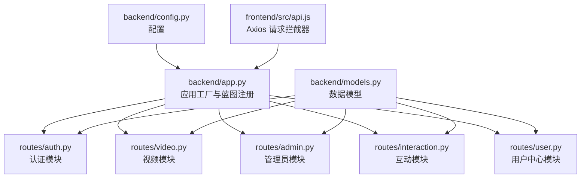
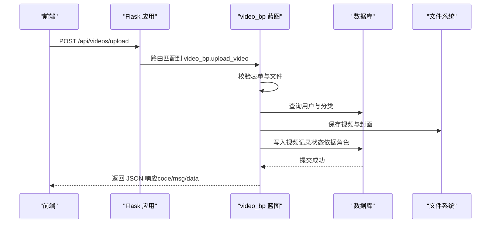
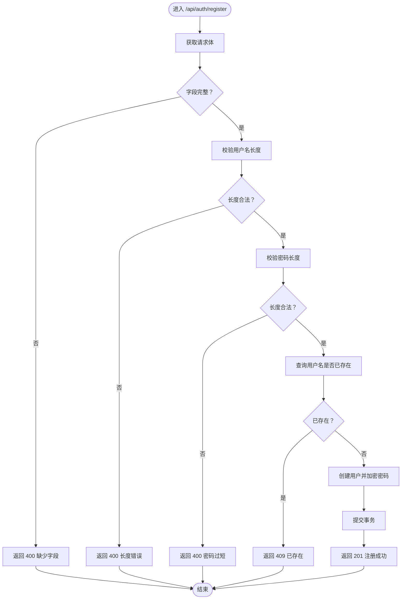
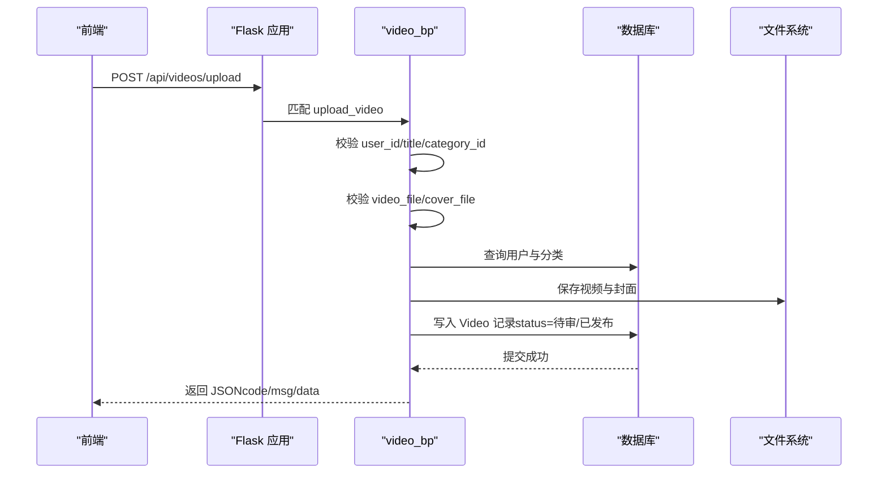
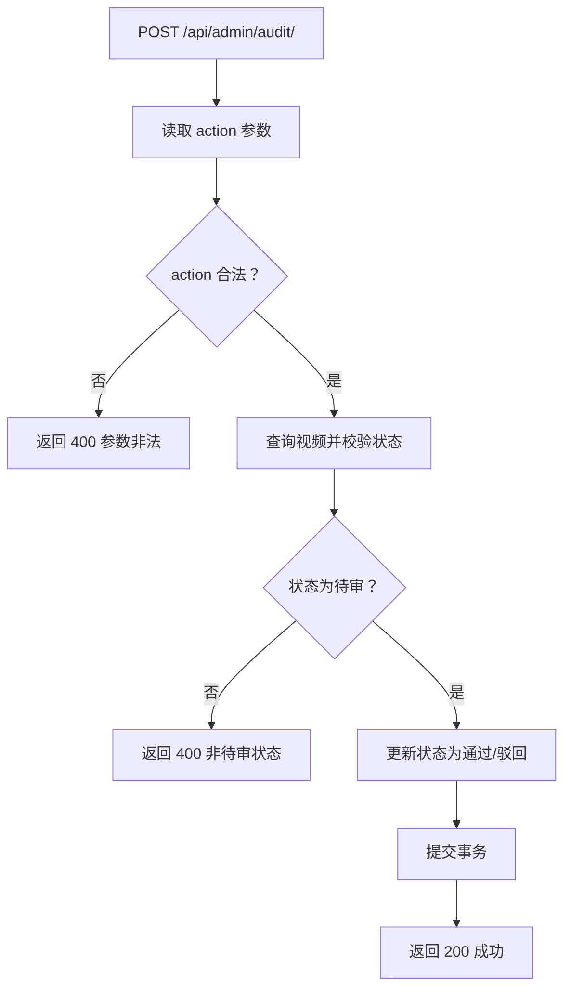
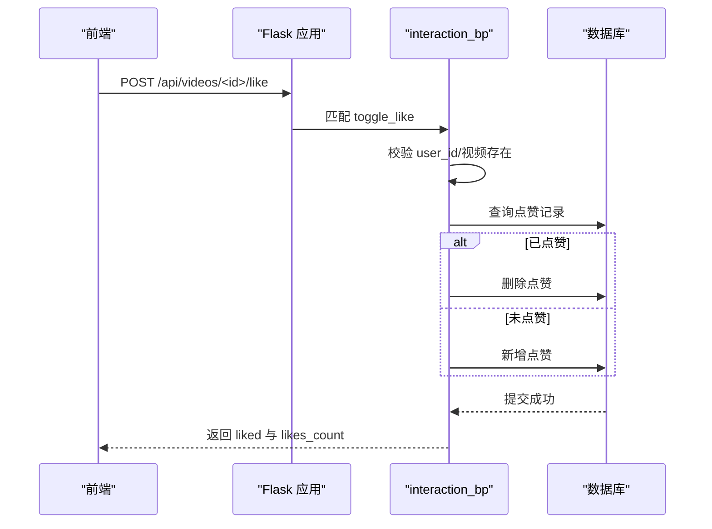
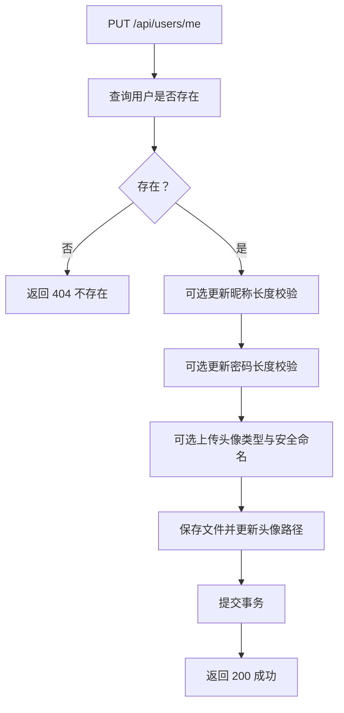
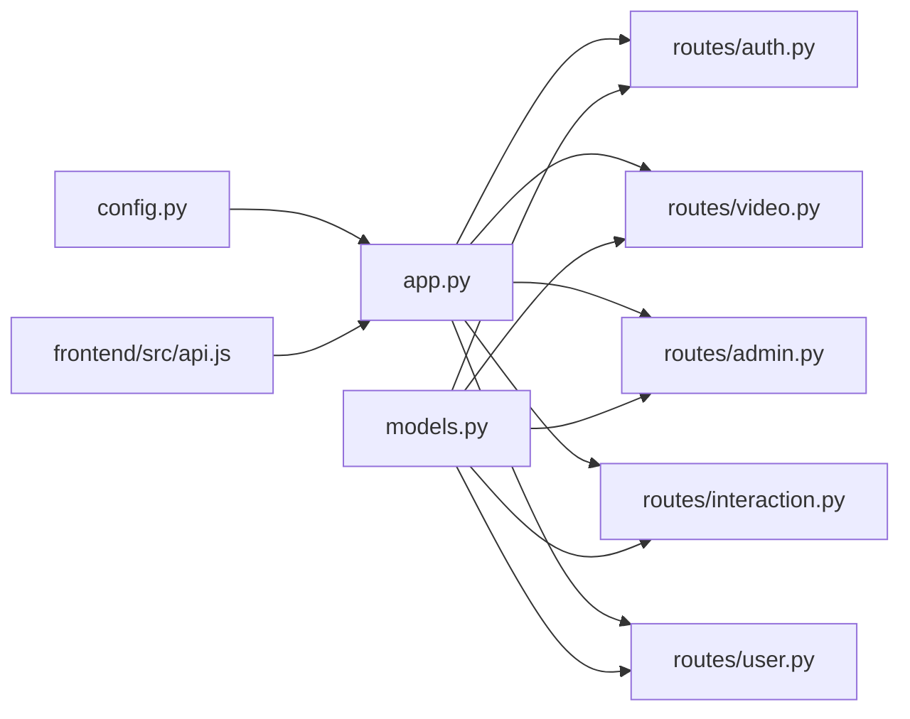

# 路由架构设计

<cite>
**本文引用的文件**
- [backend/app.py](file://backend/app.py)
- [backend/config.py](file://backend/config.py)
- [backend/models.py](file://backend/models.py)
- [backend/routes/__init__.py](file://backend/routes/__init__.py)
- [backend/routes/auth.py](file://backend/routes/auth.py)
- [backend/routes/video.py](file://backend/routes/video.py)
- [backend/routes/admin.py](file://backend/routes/admin.py)
- [backend/routes/interaction.py](file://backend/routes/interaction.py)
- [backend/routes/user.py](file://backend/routes/user.py)
- [backend/init_db.py](file://backend/init_db.py)
- [frontend/src/api.js](file://frontend/src/api.js)
</cite>

## 目录
1. [引言](#引言)
2. [项目结构](#项目结构)
3. [核心组件](#核心组件)
4. [架构总览](#架构总览)
5. [详细组件分析](#详细组件分析)
6. [依赖分析](#依赖分析)
7. [性能考虑](#性能考虑)
8. [故障排查指南](#故障排查指南)
9. [结论](#结论)
10. [附录](#附录)

## 引言
本文件系统性梳理 UniVideo 后端基于 Flask 蓝图（Blueprint）的模块化路由架构，重点解析 app.py 中如何通过 register_blueprint 将 auth、video、admin、interaction、user 五大功能模块解耦，明确各蓝图的 URL 前缀与其功能边界，并深入分析请求处理流程、错误处理机制与响应格式规范。同时结合前端 axios 配置说明 JWT 身份验证的“请求头透传”实践，帮助读者快速理解 RESTful API 的设计风格与最佳实践。

## 项目结构
后端采用“应用工厂 + 蓝图”的分层组织方式：
- 应用工厂 create_app 负责创建 Flask 实例、加载配置、初始化扩展与数据库、注册蓝图。
- 各蓝图模块独立存放于 routes 下，分别承载认证、视频、管理员、互动、用户中心等业务域。
- 配置集中于 config.py，模型定义于 models.py，便于跨模块复用。
- 前端通过 axios 统一注入 X-User-ID 请求头，实现轻量的身份透传。

图表来源
- [backend/app.py](file://backend/app.py#L15-L60)
- [backend/config.py](file://backend/config.py#L11-L66)
- [backend/models.py](file://backend/models.py#L10-L120)
- [frontend/src/api.js](file://frontend/src/api.js#L1-L40)

章节来源
- [backend/app.py](file://backend/app.py#L15-L60)
- [backend/config.py](file://backend/config.py#L11-L66)
- [backend/routes/__init__.py](file://backend/routes/__init__.py#L1-L5)

## 核心组件
- 应用工厂 create_app：创建 Flask 实例，加载配置，初始化数据库与迁移、CORS，确保上传目录存在，并注册五大蓝图。
- 蓝图注册与 URL 前缀：
  - /api/auth：认证模块（注册、登录、获取当前用户）
  - /api/videos：视频模块（分类、上传、列表、详情）
  - /api/admin：管理员模块（视频管理、审核、删除）
  - /api：互动模块（评论、点赞、收藏、状态查询）
  - /api/users：用户中心模块（个人信息、修改资料、我的视频、我的收藏）
- 错误处理与响应格式：统一以 JSON 结构返回，包含 code、msg、data 字段；状态码遵循语义化映射。
- 身份验证：前端通过请求拦截器在每个请求头添加 X-User-ID，后端部分接口读取该头部实现轻量身份透传。

章节来源
- [backend/app.py](file://backend/app.py#L15-L60)
- [backend/routes/auth.py](file://backend/routes/auth.py#L12-L184)
- [backend/routes/video.py](file://backend/routes/video.py#L15-L282)
- [backend/routes/admin.py](file://backend/routes/admin.py#L13-L245)
- [backend/routes/interaction.py](file://backend/routes/interaction.py#L12-L408)
- [backend/routes/user.py](file://backend/routes/user.py#L30-L271)
- [frontend/src/api.js](file://frontend/src/api.js#L1-L40)

## 架构总览
下面以序列图展示一次典型“上传视频”请求在后端的调用链路，体现蓝图解耦与模块协作。

图表来源
- [backend/app.py](file://backend/app.py#L39-L57)
- [backend/routes/video.py](file://backend/routes/video.py#L37-L171)
- [backend/models.py](file://backend/models.py#L14-L198)

章节来源
- [backend/app.py](file://backend/app.py#L39-L57)
- [backend/routes/video.py](file://backend/routes/video.py#L37-L171)

## 详细组件分析

### 认证模块（/api/auth）
- 功能边界
  - 用户注册：校验字段、用户名唯一性、密码强度、入库并返回用户简要信息。
  - 用户登录：校验凭据、返回用户简要信息。
  - 获取当前用户：通过请求头 X-User-ID 透传身份，查询用户并返回。
- 请求处理流程
  - 解析 JSON/表单，参数校验，数据库查询与写入，异常捕获与回滚。
- 错误处理与响应
  - 统一返回 JSON，包含 code、msg、data；常见状态码：400 缺少参数、401 凭据错误、404 资源不存在、409 冲突、500 服务器错误。
- 安全与最佳实践
  - 密码使用哈希存储；字段长度与格式校验；异常时回滚事务；避免在响应中泄露敏感信息。

图表来源
- [backend/routes/auth.py](file://backend/routes/auth.py#L12-L79)

章节来源
- [backend/routes/auth.py](file://backend/routes/auth.py#L12-L184)

### 视频模块（/api/videos）
- 功能边界
  - 获取分类：返回所有分类列表。
  - 上传视频：接收 multipart/form-data，校验文件类型与大小，生成唯一文件名，写入数据库并设置状态（管理员直发，普通用户待审）。
  - 获取视频列表：仅返回已发布状态，支持关键词与分类筛选。
  - 获取视频详情：增加播放量，返回视频详情与完整 URL。
- 请求处理流程
  - 表单参数校验、文件校验、用户与分类存在性校验、文件落盘、状态决策、数据库写入、异常回滚。
- 错误处理与响应
  - 统一 JSON 结构；状态码语义化；上传成功返回状态与是否管理员标记。
- 性能与可靠性
  - 上传目录提前创建；文件名加时间戳+UUID 避免冲突；数据库事务回滚保证一致性。

图表来源
- [backend/routes/video.py](file://backend/routes/video.py#L37-L171)
- [backend/models.py](file://backend/models.py#L113-L198)

章节来源
- [backend/routes/video.py](file://backend/routes/video.py#L15-L282)
- [backend/models.py](file://backend/models.py#L113-L198)

### 管理员模块（/api/admin）
- 功能边界
  - 管理列表：支持关键词与状态筛选，返回总数与列表。
  - 待审核列表：按上传时间升序返回待审视频。
  - 审核接口：approve/reject 切换状态，重复审核保护。
  - 删除视频：尝试删除物理文件与数据库记录。
- 请求处理流程
  - 参数校验、状态检查、数据库更新、文件删除（失败仅记录日志），异常回滚。
- 错误处理与响应
  - 统一 JSON 结构；状态码语义化；删除接口返回已删除文件清单。

图表来源
- [backend/routes/admin.py](file://backend/routes/admin.py#L95-L173)

章节来源
- [backend/routes/admin.py](file://backend/routes/admin.py#L13-L245)

### 互动模块（/api）
- 功能边界
  - 评论：支持一级与回复评论，自动计算 root_id，校验父评论归属。
  - 点赞/取消点赞：联合唯一约束保障幂等。
  - 收藏/取消收藏：联合唯一约束保障幂等。
  - 状态查询：获取用户对视频的点赞/收藏状态。
  - 评论列表：按时间升序返回视频评论。
- 请求处理流程
  - 参数校验、视频与用户存在性校验、关联关系查询、数据库写入/删除、统计更新。
- 错误处理与响应
  - 统一 JSON 结构；状态码语义化；点赞/收藏返回最新计数。

图表来源
- [backend/routes/interaction.py](file://backend/routes/interaction.py#L329-L408)
- [backend/models.py](file://backend/models.py#L273-L343)

章节来源
- [backend/routes/interaction.py](file://backend/routes/interaction.py#L12-L408)
- [backend/models.py](file://backend/models.py#L200-L343)

### 用户中心模块（/api/users）
- 功能边界
  - 获取当前用户：通过 user_id 查询并返回用户信息。
  - 修改资料：支持昵称、密码、头像文件上传，安全文件名与类型校验。
  - 我的视频：返回该用户上传的所有视频（含各状态）。
  - 我的收藏：返回该用户收藏的已发布视频。
- 请求处理流程
  - 参数校验、用户存在性校验、头像文件保存、数据库更新、异常回滚。
- 错误处理与响应
  - 统一 JSON 结构；状态码语义化；返回完整静态资源 URL。

图表来源
- [backend/routes/user.py](file://backend/routes/user.py#L69-L160)

章节来源
- [backend/routes/user.py](file://backend/routes/user.py#L30-L271)

## 依赖分析
- 组件耦合与内聚
  - app.py 仅负责注册蓝图与基础配置，内聚度高、耦合度低。
  - 各蓝图内部职责清晰，与 models.py 的 ORM 层交互，避免跨蓝图直接耦合。
- 外部依赖与集成点
  - Flask-CORS 允许前端跨域访问。
  - Flask-Migrate 用于数据库迁移。
  - 前端 axios 通过请求拦截器统一注入 X-User-ID，实现轻量身份透传。
- 潜在循环依赖
  - 蓝图间无直接导入循环；models.py 作为共享依赖位于顶层，避免循环。

图表来源
- [backend/app.py](file://backend/app.py#L15-L60)
- [backend/config.py](file://backend/config.py#L11-L66)
- [backend/models.py](file://backend/models.py#L10-L120)
- [frontend/src/api.js](file://frontend/src/api.js#L1-L40)

章节来源
- [backend/app.py](file://backend/app.py#L15-L60)
- [backend/config.py](file://backend/config.py#L11-L66)
- [backend/models.py](file://backend/models.py#L10-L120)
- [frontend/src/api.js](file://frontend/src/api.js#L1-L40)

## 性能考虑
- 数据库查询优化
  - 视频列表按状态与时间排序，建议在 status 与 created_at 上建立索引以提升筛选与排序性能。
- 文件上传与存储
  - 上传目录提前创建，避免运行时 IO 异常；文件名采用时间戳+UUID，减少冲突概率。
- 响应体积控制
  - 详情页与列表页返回完整 URL，前端可按需缓存；避免一次性返回过多冗余字段。
- 并发与幂等
  - 点赞/收藏使用联合唯一约束，天然保证幂等；异常回滚确保一致性。

[本节为通用性能建议，无需列出章节来源]

## 故障排查指南
- 常见错误与定位
  - 400 缺少参数：检查请求体/表单字段是否齐全。
  - 401 未登录或登录过期：确认前端是否正确注入 X-User-ID。
  - 404 资源不存在：确认 user_id、video_id、category_id 是否有效。
  - 409 用户名已存在：更换用户名后重试。
  - 500 服务器错误：查看后端日志，关注数据库异常与文件系统异常。
- 建议排查步骤
  - 启用 Flask debug 模式，观察堆栈信息。
  - 核对数据库连接与表结构是否正确（init_db.py 可辅助初始化示例数据）。
  - 检查上传目录权限与磁盘空间。
- 前端身份透传
  - 确认 axios 请求拦截器已注入 X-User-ID；后端接口读取该头部进行身份透传。

章节来源
- [backend/routes/auth.py](file://backend/routes/auth.py#L147-L184)
- [backend/routes/video.py](file://backend/routes/video.py#L173-L282)
- [backend/routes/admin.py](file://backend/routes/admin.py#L13-L245)
- [backend/routes/interaction.py](file://backend/routes/interaction.py#L12-L408)
- [backend/routes/user.py](file://backend/routes/user.py#L30-L271)
- [backend/init_db.py](file://backend/init_db.py#L28-L99)
- [frontend/src/api.js](file://frontend/src/api.js#L1-L40)

## 结论
本项目通过 Flask 蓝图实现了清晰的模块化路由架构：app.py 仅承担装配职责，五大蓝图各自聚焦领域边界，配合统一的响应格式与错误处理策略，形成高内聚、低耦合的后端 API 设计。前端通过请求拦截器注入 X-User-ID，实现轻量身份透传，满足当前业务需求。后续可在数据库索引、文件系统与并发控制方面进一步优化，以支撑更大规模的访问与数据量。

[本节为总结性内容，无需列出章节来源]

## 附录
- 响应格式规范
  - 所有接口统一返回 JSON，包含 code、msg、data 字段；code 采用语义化状态码。
- RESTful 设计要点
  - 资源命名采用名词复数形式；HTTP 方法与语义一致；路径参数用于资源标识；查询参数用于筛选与分页。
- 示例数据初始化
  - 使用 init_db.py 可快速创建默认分类与测试账号，便于本地开发与联调。

章节来源
- [backend/routes/auth.py](file://backend/routes/auth.py#L12-L184)
- [backend/routes/video.py](file://backend/routes/video.py#L15-L282)
- [backend/routes/admin.py](file://backend/routes/admin.py#L13-L245)
- [backend/routes/interaction.py](file://backend/routes/interaction.py#L12-L408)
- [backend/routes/user.py](file://backend/routes/user.py#L30-L271)
- [backend/init_db.py](file://backend/init_db.py#L28-L99)