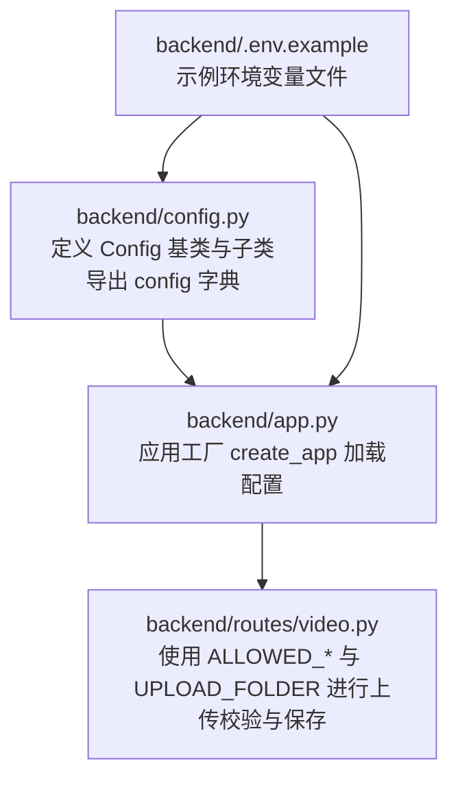
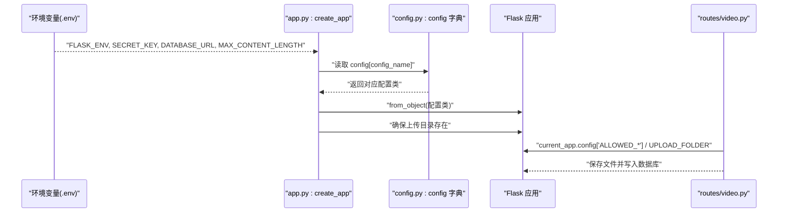
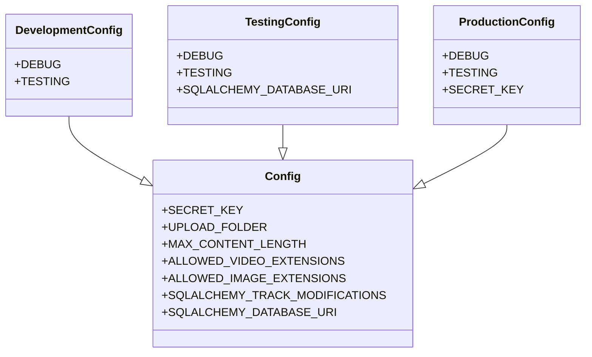
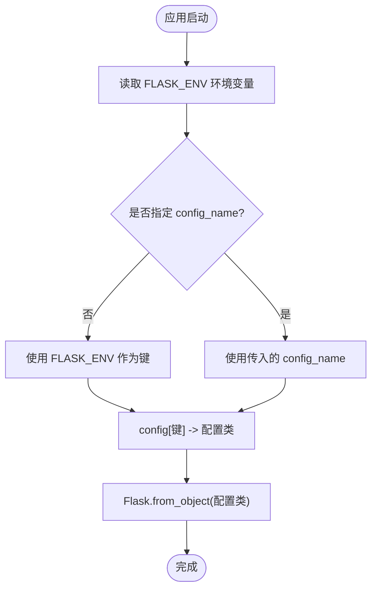
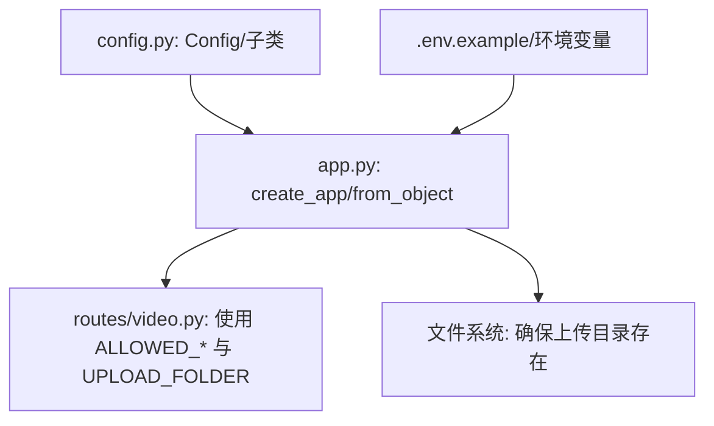

# 配置管理机制

<cite>
**本文引用的文件**
- [backend/config.py](file://backend/config.py)
- [backend/app.py](file://backend/app.py)
- [backend/.env.example](file://backend/.env.example)
- [backend/routes/video.py](file://backend/routes/video.py)
</cite>

## 目录
1. [引言](#引言)
2. [项目结构](#项目结构)
3. [核心组件](#核心组件)
4. [架构总览](#架构总览)
5. [详细组件分析](#详细组件分析)
6. [依赖分析](#依赖分析)
7. [性能考虑](#性能考虑)
8. [故障排查指南](#故障排查指南)
9. [结论](#结论)

## 引言
本专项文档聚焦 UniVideo 后端的配置管理机制，围绕 backend/config.py 中的多环境配置体系展开，系统解析 Config 基类与 DevelopmentConfig、TestingConfig、ProductionConfig 三类子类的继承关系与配置差异；阐明 SECRET_KEY 的安全管理策略（开发环境默认值与生产环境强制要求）、SQLALCHEMY_DATABASE_URI 的多级加载逻辑（环境变量优先于默认值）、文件上传路径（UPLOAD_FOLDER）的绝对路径处理；解释 MAX_CONTENT_LENGTH 对视频上传大小的限制（500MB）以及 ALLOWED_VIDEO_EXTENSIONS/ALLOWED_IMAGE_EXTENSIONS 对文件类型的白名单控制；说明 config 字典如何依据 FLASK_ENV 环境变量动态选择配置方案，并强调生产环境配置的安全注意事项；最后结合 .env.example 文件说明敏感配置的外部化管理方法。

## 项目结构
- 配置文件位于 backend/config.py，定义了基础配置类与三类环境子类，并导出 config 字典用于按环境选择配置。
- 应用入口 backend/app.py 通过 create_app 工厂函数加载配置，并在启动时确保上传目录存在。
- 示例环境变量文件 backend/.env.example 提供了开发环境示例，包括 FLASK_ENV、SECRET_KEY、DATABASE_URL、MAX_CONTENT_LENGTH 等关键项。
- 视频上传路由 backend/routes/video.py 展示了如何使用当前应用配置（如 ALLOWED_VIDEO_EXTENSIONS、ALLOWED_IMAGE_EXTENSIONS、UPLOAD_FOLDER）进行文件类型校验与保存路径构建。

图表来源
- [backend/config.py](file://backend/config.py#L1-L66)
- [backend/app.py](file://backend/app.py#L1-L101)
- [backend/.env.example](file://backend/.env.example#L1-L21)
- [backend/routes/video.py](file://backend/routes/video.py#L1-L282)

章节来源
- [backend/config.py](file://backend/config.py#L1-L66)
- [backend/app.py](file://backend/app.py#L1-L101)
- [backend/.env.example](file://backend/.env.example#L1-L21)
- [backend/routes/video.py](file://backend/routes/video.py#L1-L282)

## 核心组件
- Config 基类：集中定义所有环境共享的配置项，包括 SECRET_KEY、UPLOAD_FOLDER（绝对路径）、MAX_CONTENT_LENGTH（500MB）、ALLOWED_VIDEO_EXTENSIONS、ALLOWED_IMAGE_EXTENSIONS、SQLALCHEMY_TRACK_MODIFICATIONS、SQLALCHEMY_DATABASE_URI（多级加载逻辑）。
- DevelopmentConfig：开启调试与测试标志，适合本地开发。
- TestingConfig：使用内存数据库进行测试，避免影响生产数据。
- ProductionConfig：关闭调试与测试标志，强制要求真实 SECRET_KEY（来自环境变量），提升生产安全。
- config 字典：以字符串为键映射到具体配置类，作为应用工厂按需选择配置的依据。

章节来源
- [backend/config.py](file://backend/config.py#L11-L66)

## 架构总览
下图展示了配置体系在应用启动时的装配流程，以及配置项在上传路由中的使用方式。

图表来源
- [backend/app.py](file://backend/app.py#L15-L60)
- [backend/config.py](file://backend/config.py#L59-L66)
- [backend/routes/video.py](file://backend/routes/video.py#L37-L124)

章节来源
- [backend/app.py](file://backend/app.py#L15-L60)
- [backend/config.py](file://backend/config.py#L59-L66)
- [backend/routes/video.py](file://backend/routes/video.py#L37-L124)

## 详细组件分析

### 继承关系与配置差异
- 继承关系：DevelopmentConfig、TestingConfig、ProductionConfig 均继承自 Config，复用其共享配置项，并在必要处覆盖或补充特定环境行为。
- 配置差异：
  - DevelopmentConfig：DEBUG=True，TESTING=False，便于本地开发调试。
  - TestingConfig：DEBUG=False，TESTING=True，并将数据库 URI 覆盖为内存数据库，保证测试隔离。
  - ProductionConfig：DEBUG=False，TESTING=False，且 SECRET_KEY 必须由环境变量提供，避免硬编码泄露风险。

图表来源
- [backend/config.py](file://backend/config.py#L11-L66)

章节来源
- [backend/config.py](file://backend/config.py#L11-L66)

### SECRET_KEY 安全管理策略
- 开发环境默认值：当未设置环境变量 SECRET_KEY 时，基类会回退到开发专用的默认密钥，便于本地快速启动。
- 生产环境强制要求：ProductionConfig 显式从环境变量读取 SECRET_KEY，若未提供将导致配置缺失，从而阻止应用在生产环境启动，有效避免默认密钥泄露风险。
- 建议实践：
  - 在生产环境务必设置强随机的 SECRET_KEY；
  - 不要将密钥提交到版本控制；
  - 使用环境变量或密钥管理服务注入。

章节来源
- [backend/config.py](file://backend/config.py#L15-L20)
- [backend/config.py](file://backend/config.py#L55-L57)
- [backend/.env.example](file://backend/.env.example#L5-L8)

### SQLALCHEMY_DATABASE_URI 多级加载逻辑
- 加载顺序（优先级从高到低）：
  1) 环境变量 DATABASE_URL；
  2) 若未提供，则使用基类内置的默认 MySQL 连接字符串。
- TestingConfig 覆盖为内存数据库，确保测试隔离。
- 建议实践：
  - 开发与测试阶段可使用 SQLite 或内存数据库；
  - 生产环境务必使用真实数据库，并通过环境变量注入连接信息。

章节来源
- [backend/config.py](file://backend/config.py#L26-L30)
- [backend/config.py](file://backend/config.py#L44-L47)
- [backend/.env.example](file://backend/.env.example#L9-L11)

### 文件上传路径与大小限制
- UPLOAD_FOLDER：采用绝对路径，确保在不同工作目录下的一致性与可预测性。
- MAX_CONTENT_LENGTH：统一限制上传内容的最大体积为 500MB，避免过大文件占用资源。
- 上传路由使用 current_app.config['UPLOAD_FOLDER'] 构建保存路径，结合白名单扩展名进行类型校验。

章节来源
- [backend/config.py](file://backend/config.py#L18-L21)
- [backend/app.py](file://backend/app.py#L33-L38)
- [backend/routes/video.py](file://backend/routes/video.py#L117-L124)

### 文件类型白名单控制
- ALLOWED_VIDEO_EXTENSIONS：限定视频文件的允许扩展名集合。
- ALLOWED_IMAGE_EXTENSIONS：限定封面图片的允许扩展名集合。
- 上传路由在接收文件后，分别提取扩展名并校验是否在白名单内，不在则拒绝请求。

章节来源
- [backend/config.py](file://backend/config.py#L22-L24)
- [backend/routes/video.py](file://backend/routes/video.py#L92-L109)

### config 字典与 FLASK_ENV 动态选择
- config 字典：键为环境名称字符串，值为对应的配置类；default 指向 DevelopmentConfig。
- FLASK_ENV：应用入口通过 os.environ.get('FLASK_ENV') 获取当前环境，默认 development。
- create_app：根据传入的 config_name 或从环境变量推断的环境名，从 config 字典中取出对应配置类并通过 Flask.from_object 加载。

图表来源
- [backend/app.py](file://backend/app.py#L15-L22)
- [backend/app.py](file://backend/app.py#L61-L63)
- [backend/config.py](file://backend/config.py#L59-L66)

章节来源
- [backend/app.py](file://backend/app.py#L15-L22)
- [backend/app.py](file://backend/app.py#L61-L63)
- [backend/config.py](file://backend/config.py#L59-L66)

### 生产环境安全注意事项
- 必须设置真实且高强度的 SECRET_KEY，禁止使用默认值；
- 数据库连接信息必须通过环境变量注入，避免硬编码；
- 严格控制 ALLOWED_* 白名单，防止恶意文件类型上传；
- 合理设置 MAX_CONTENT_LENGTH，平衡用户体验与资源占用；
- 使用 .env 管理敏感配置，但不要提交到仓库，配合 .gitignore 保护。

章节来源
- [backend/config.py](file://backend/config.py#L15-L20)
- [backend/config.py](file://backend/config.py#L26-L30)
- [backend/config.py](file://backend/config.py#L55-L57)
- [backend/.env.example](file://backend/.env.example#L1-L21)

### 敏感配置外部化管理（.env.example）
- .env.example 提供了开发环境的示例配置，包括：
  - FLASK_ENV：指定当前环境；
  - SECRET_KEY：应用密钥；
  - DATABASE_URL：数据库连接字符串；
  - MAX_CONTENT_LENGTH：上传大小限制；
  - HOST/PORT：服务器监听配置。
- 实际部署时应复制 .env.example 为 .env 并替换为真实值，同时确保 .env 被 .gitignore 忽略。

章节来源
- [backend/.env.example](file://backend/.env.example#L1-L21)

## 依赖分析
- 配置依赖：app.py 依赖 config.py 中的 config 字典与各配置类；路由层（如 video.py）依赖 Flask.current_app.config 中的配置项。
- 环境变量依赖：FLASK_ENV、SECRET_KEY、DATABASE_URL、MAX_CONTENT_LENGTH 等通过环境变量注入，形成“环境即配置”的外部化管理模式。
- 目录依赖：app.py 在启动时确保 UPLOAD_FOLDER 下的 videos、covers、avatars 子目录存在，避免运行时因目录缺失导致异常。

图表来源
- [backend/config.py](file://backend/config.py#L11-L66)
- [backend/app.py](file://backend/app.py#L15-L60)
- [backend/routes/video.py](file://backend/routes/video.py#L37-L124)

章节来源
- [backend/config.py](file://backend/config.py#L11-L66)
- [backend/app.py](file://backend/app.py#L15-L60)
- [backend/routes/video.py](file://backend/routes/video.py#L37-L124)

## 性能考虑
- MAX_CONTENT_LENGTH 限制上传大小，有助于控制内存占用与网络带宽，建议根据业务规模与服务器资源合理调整。
- SQLALCHEMY_TRACK_MODIFICATIONS 默认关闭，减少 SQLAlchemy 事件系统的开销，有利于生产环境性能与稳定性。
- TestingConfig 使用内存数据库，避免磁盘 IO 干扰测试性能。

章节来源
- [backend/config.py](file://backend/config.py#L26-L30)
- [backend/config.py](file://backend/config.py#L44-L47)

## 故障排查指南
- 上传失败或类型不被接受：
  - 检查 ALLOWED_VIDEO_EXTENSIONS 与 ALLOWED_IMAGE_EXTENSIONS 是否包含目标扩展名；
  - 确认请求中文件扩展名解析正确。
- 上传目录不存在：
  - 确认 app.py 在启动时已调用 os.makedirs 确保 UPLOAD_FOLDER 下的子目录存在。
- 数据库连接异常：
  - 检查 DATABASE_URL 是否正确设置；
  - TestingConfig 仅用于测试，生产环境不应使用内存数据库。
- 密钥问题：
  - 生产环境必须设置 SECRET_KEY，否则应用无法在生产环境启动；
  - 避免使用默认开发密钥。

章节来源
- [backend/routes/video.py](file://backend/routes/video.py#L92-L109)
- [backend/app.py](file://backend/app.py#L33-L38)
- [backend/config.py](file://backend/config.py#L26-L30)
- [backend/config.py](file://backend/config.py#L55-L57)

## 结论
UniVideo 的配置管理机制通过“基类共享 + 子类覆盖”的方式实现了清晰的多环境分层；通过环境变量驱动的外部化配置，既保证了开发便利性，又强化了生产环境的安全性。SECRET_KEY 的强制要求、数据库连接的多级加载、上传路径的绝对化与大小限制、以及严格的文件类型白名单，共同构成了稳定、可控且安全的配置体系。建议在生产环境中严格遵循安全最佳实践，确保敏感配置不泄露、连接信息不硬编码、上传行为受控。