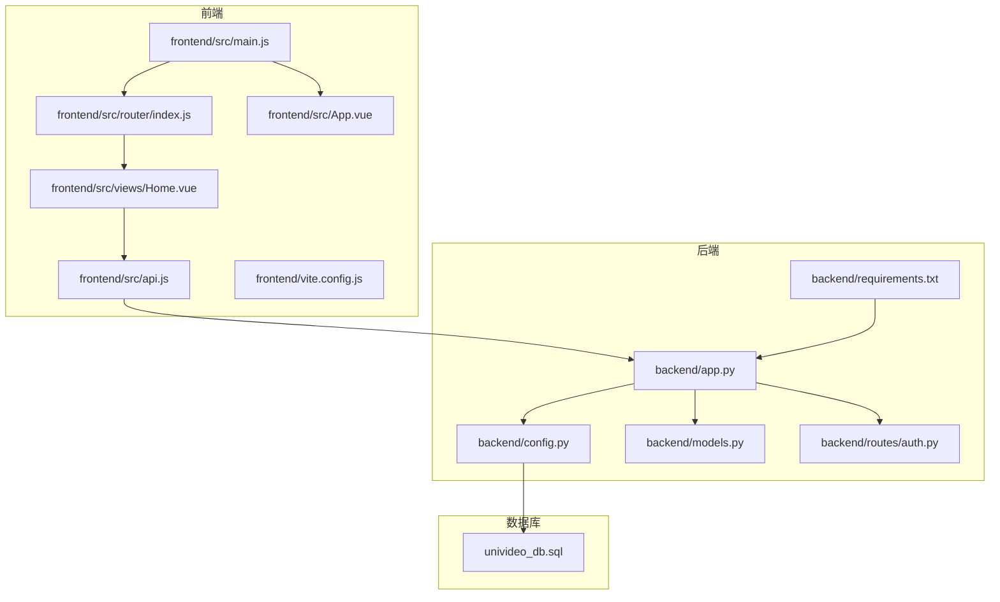
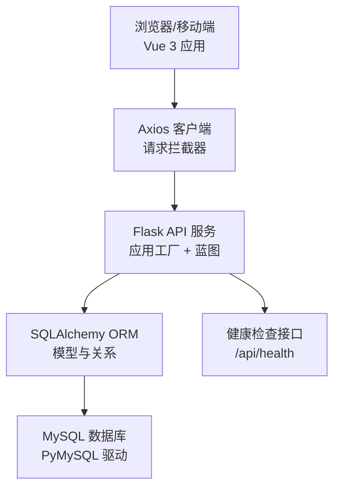
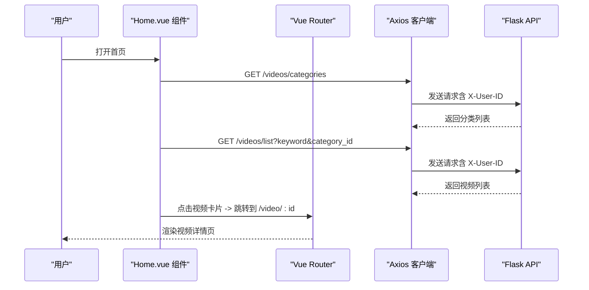
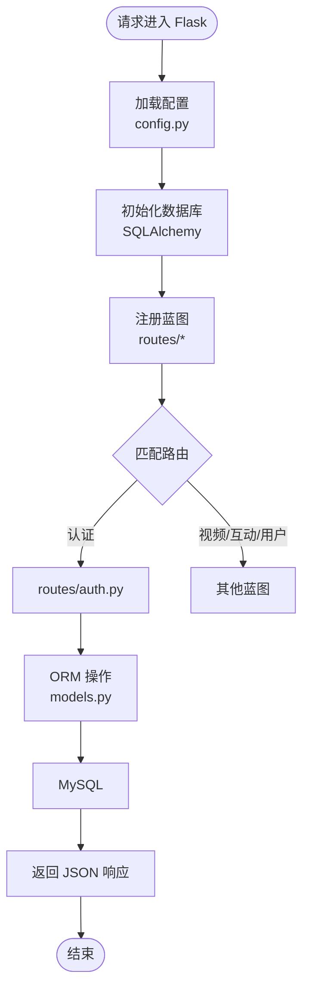
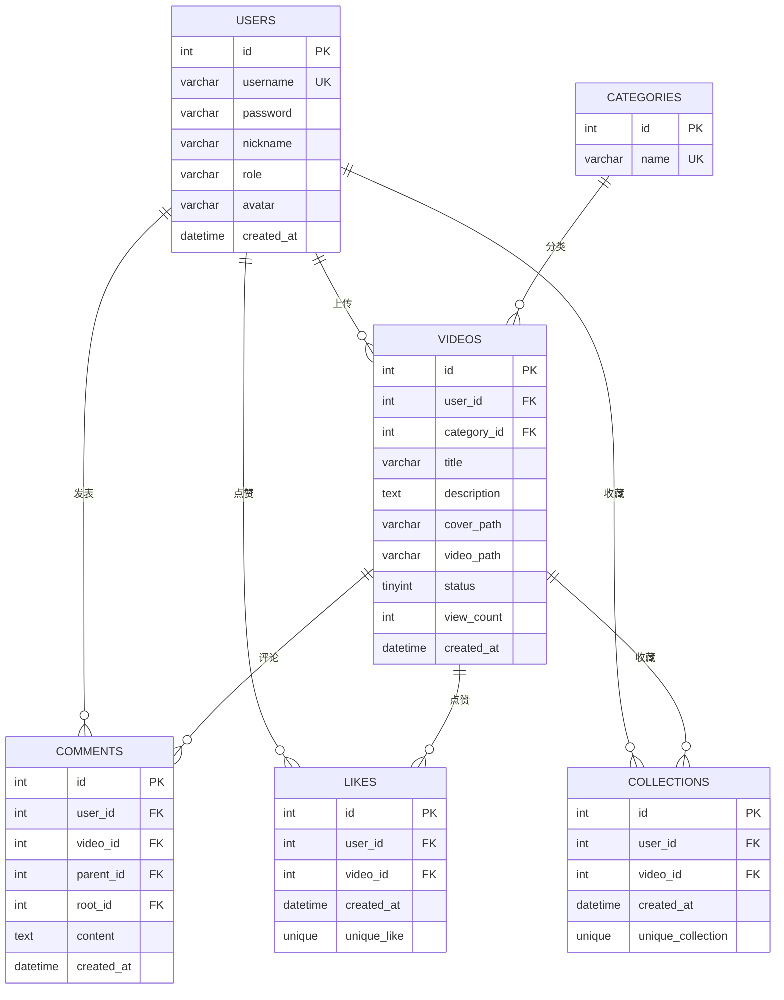

# 技术栈

<cite>
**本文引用的文件**
- [backend/requirements.txt](file://backend/requirements.txt)
- [frontend/package.json](file://frontend/package.json)
- [backend/app.py](file://backend/app.py)
- [backend/config.py](file://backend/config.py)
- [backend/models.py](file://backend/models.py)
- [backend/routes/auth.py](file://backend/routes/auth.py)
- [frontend/src/main.js](file://frontend/src/main.js)
- [frontend/src/router/index.js](file://frontend/src/router/index.js)
- [frontend/src/api.js](file://frontend/src/api.js)
- [frontend/vite.config.js](file://frontend/vite.config.js)
- [frontend/src/views/Home.vue](file://frontend/src/views/Home.vue)
- [frontend/src/App.vue](file://frontend/src/App.vue)
- [univideo_db.sql](file://univideo_db.sql)
</cite>

## 目录
1. [引言](#引言)
2. [项目结构](#项目结构)
3. [核心组件](#核心组件)
4. [架构总览](#架构总览)
5. [详细组件分析](#详细组件分析)
6. [依赖关系分析](#依赖关系分析)
7. [性能考虑](#性能考虑)
8. [故障排查指南](#故障排查指南)
9. [结论](#结论)
10. [附录](#附录)

## 引言
本文件系统化梳理 UniVideo 项目的三层技术栈：前端采用 Vue 3 + Vue Router + Axios，后端基于 Flask + SQLAlchemy ORM + Flask-JWT-Extended，数据库选用 MySQL 并通过 PyMySQL 驱动连接。文档从架构设计、组件职责、数据流与处理逻辑、集成点与错误处理、性能特征等方面展开，帮助读者理解该技术组合如何满足高校视频平台在可维护性、扩展性与开发效率方面的需求，并给出版本兼容性说明与关键依赖清单。

## 项目结构
项目采用前后端分离架构，前端使用 Vite + Vue 3，后端使用 Flask，数据库为 MySQL。关键文件组织如下：
- 前端：入口文件 main.js、路由配置 router/index.js、HTTP 客户端封装 api.js、页面视图 Home.vue 等。
- 后端：应用工厂 app.py、配置 config.py、ORM 模型 models.py、认证路由 routes/auth.py、依赖 requirements.txt。
- 数据库：初始化脚本 univideo_db.sql，定义用户、分类、视频、评论、点赞、收藏等表结构。

图表来源
- [frontend/src/main.js](file://frontend/src/main.js#L1-L12)
- [frontend/src/router/index.js](file://frontend/src/router/index.js#L1-L56)
- [frontend/src/api.js](file://frontend/src/api.js#L1-L41)
- [frontend/src/views/Home.vue](file://frontend/src/views/Home.vue#L1-L131)
- [frontend/src/App.vue](file://frontend/src/App.vue#L1-L13)
- [frontend/vite.config.js](file://frontend/vite.config.js#L1-L19)
- [backend/app.py](file://backend/app.py#L1-L101)
- [backend/config.py](file://backend/config.py#L1-L66)
- [backend/models.py](file://backend/models.py#L1-L343)
- [backend/routes/auth.py](file://backend/routes/auth.py#L1-L184)
- [backend/requirements.txt](file://backend/requirements.txt#L1-L45)
- [univideo_db.sql](file://univideo_db.sql#L1-L76)

章节来源
- [frontend/src/main.js](file://frontend/src/main.js#L1-L12)
- [frontend/src/router/index.js](file://frontend/src/router/index.js#L1-L56)
- [frontend/src/api.js](file://frontend/src/api.js#L1-L41)
- [frontend/src/views/Home.vue](file://frontend/src/views/Home.vue#L1-L131)
- [frontend/src/App.vue](file://frontend/src/App.vue#L1-L13)
- [frontend/vite.config.js](file://frontend/vite.config.js#L1-L19)
- [backend/app.py](file://backend/app.py#L1-L101)
- [backend/config.py](file://backend/config.py#L1-L66)
- [backend/models.py](file://backend/models.py#L1-L343)
- [backend/routes/auth.py](file://backend/routes/auth.py#L1-L184)
- [backend/requirements.txt](file://backend/requirements.txt#L1-L45)
- [univideo_db.sql](file://univideo_db.sql#L1-L76)

## 核心组件
- 前端技术栈
  - Vue 3：组件化开发，Composition API，响应式数据与生命周期管理。
  - Vue Router：前端路由与页面导航，支持动态路由与懒加载。
  - Axios：统一 HTTP 客户端，拦截器注入用户标识，统一错误处理。
- 后端技术栈
  - Flask：轻量 WSGI 框架，应用工厂模式，蓝图组织路由。
  - SQLAlchemy ORM：模型定义、关系映射、查询与事务管理。
  - Flask-JWT-Extended：JWT 身份验证扩展（项目中以简化方案实现）。
- 数据库
  - MySQL：关系型数据库，PyMySQL 驱动，统一连接 URI 管理。

章节来源
- [frontend/package.json](file://frontend/package.json#L1-L25)
- [backend/requirements.txt](file://backend/requirements.txt#L1-L45)
- [backend/config.py](file://backend/config.py#L1-L66)

## 架构总览
整体架构采用前后端分离，前端通过 Axios 调用后端 REST API，后端使用 SQLAlchemy 进行数据持久化，数据库为 MySQL。健康检查接口用于服务与数据库连通性验证。

图表来源
- [frontend/src/api.js](file://frontend/src/api.js#L1-L41)
- [backend/app.py](file://backend/app.py#L1-L101)
- [backend/config.py](file://backend/config.py#L1-L66)
- [backend/models.py](file://backend/models.py#L1-L343)
- [univideo_db.sql](file://univideo_db.sql#L1-L76)

## 详细组件分析

### 前端：Vue 3、Vue Router、Axios 集成
- 应用入口与挂载
  - main.js 创建 Vue 应用实例，注册路由插件并挂载到 DOM。
- 路由配置
  - router/index.js 使用 createRouter + createWebHistory，定义首页、登录、注册、上传、视频详情、管理后台、个人主页等路由，支持动态导入与懒加载。
- HTTP 客户端
  - api.js 创建 axios 实例，设置基础 URL、超时与 Content-Type；通过请求拦截器向后端透传用户标识 X-User-ID，便于后端识别当前登录用户。
- 页面组件
  - Home.vue 使用 Composition API 管理状态，发起分类与视频列表请求，支持搜索与分类筛选，跳转到上传、管理后台、个人主页与视频详情页。

图表来源
- [frontend/src/views/Home.vue](file://frontend/src/views/Home.vue#L1-L131)
- [frontend/src/router/index.js](file://frontend/src/router/index.js#L1-L56)
- [frontend/src/api.js](file://frontend/src/api.js#L1-L41)

章节来源
- [frontend/src/main.js](file://frontend/src/main.js#L1-L12)
- [frontend/src/router/index.js](file://frontend/src/router/index.js#L1-L56)
- [frontend/src/api.js](file://frontend/src/api.js#L1-L41)
- [frontend/src/views/Home.vue](file://frontend/src/views/Home.vue#L1-L131)
- [frontend/src/App.vue](file://frontend/src/App.vue#L1-L13)
- [frontend/vite.config.js](file://frontend/vite.config.js#L1-L19)

### 后端：Flask、SQLAlchemy ORM、Flask-JWT-Extended
- 应用工厂与蓝图
  - app.py 提供 create_app 工厂函数，加载配置、初始化数据库与迁移、启用 CORS，注册认证、视频、管理员、互动、用户等蓝图。
- 配置管理
  - config.py 定义开发、测试、生产三套配置，统一数据库连接 URI（默认使用 mysql+pymysql），上传目录与最大文件大小，以及密钥与文件扩展名白名单。
- ORM 模型
  - models.py 定义 User、Category、Video、Comment、Like、Collection 等模型，建立外键与关系，提供序列化方法 to_dict，支持联合唯一约束与索引优化。
- 认证路由
  - routes/auth.py 提供注册、登录、获取当前用户信息接口，使用模型方法加密/校验密码，返回标准化响应结构。
- 健康检查
  - app.py 提供 /api/health 接口，测试数据库连通性并返回服务状态。

图表来源
- [backend/app.py](file://backend/app.py#L1-L101)
- [backend/config.py](file://backend/config.py#L1-L66)
- [backend/models.py](file://backend/models.py#L1-L343)
- [backend/routes/auth.py](file://backend/routes/auth.py#L1-L184)

章节来源
- [backend/app.py](file://backend/app.py#L1-L101)
- [backend/config.py](file://backend/config.py#L1-L66)
- [backend/models.py](file://backend/models.py#L1-L343)
- [backend/routes/auth.py](file://backend/routes/auth.py#L1-L184)

### 数据库：MySQL 与 PyMySQL 驱动
- 连接配置
  - config.py 中 SQLALCHEMY_DATABASE_URI 默认使用 mysql+pymysql 协议，支持通过环境变量覆盖。
- 表结构
  - univideo_db.sql 定义 users、categories、videos、comments、likes、collections 等表，包含外键约束、索引与注释，支撑“先审后发”与评论树结构。
- ORM 映射
  - models.py 严格对应表结构，使用 db.relationship 建立一对多/多对多关系，配合联合唯一约束防止重复点赞/收藏。

图表来源
- [univideo_db.sql](file://univideo_db.sql#L1-L76)
- [backend/models.py](file://backend/models.py#L1-L343)

章节来源
- [backend/config.py](file://backend/config.py#L1-L66)
- [univideo_db.sql](file://univideo_db.sql#L1-L76)
- [backend/models.py](file://backend/models.py#L1-L343)

## 依赖关系分析
- 前端依赖
  - Vue 3、Vue Router、Axios 为核心运行时依赖；Vite 与 @vitejs/plugin-vue 用于构建与开发体验。
- 后端依赖
  - Flask、Flask-CORS、Flask-SQLAlchemy、Flask-Migrate、Flask-JWT-Extended、PyMySQL、bcrypt、python-dotenv、Flask-WTF、WTForms、requests、Pillow、python-magic 等。
- 版本与兼容性
  - 前端：Node 引擎要求 ^20.19.0 或 >=22.12.0；Vue 3、Vue Router、Axios 版本见 package.json。
  - 后端：Flask 2.3.3、Werkzeug 2.3.7、SQLAlchemy 2.0.36、Flask-SQLAlchemy 3.0.5、PyMySQL 1.1.0、Flask-JWT-Extended 4.5.2、bcrypt 4.0.1 等见 requirements.txt。
- 关键依赖用途
  - 前端：Vue 3 提供组件化与响应式；Vue Router 管理路由；Axios 统一网络层；Vite 提供开发与构建工具链。
  - 后端：Flask 提供 Web 框架；Flask-CORS 解决跨域；Flask-SQLAlchemy/SQLAlchemy 提供 ORM；Flask-Migrate 管理迁移；Flask-JWT-Extended 提供 JWT 能力；PyMySQL 连接 MySQL；bcrypt 密码加密；python-dotenv 环境变量；Flask-WTF/WTForms 表单验证；requests 外部 API；Pillow 图片处理；python-magic 文件类型检测。

章节来源
- [frontend/package.json](file://frontend/package.json#L1-L25)
- [backend/requirements.txt](file://backend/requirements.txt#L1-L45)

## 性能考虑
- 前端
  - 使用动态导入与懒加载减少首屏体积；Vite 构建优化与按需加载提升开发体验。
- 后端
  - SQLAlchemy 查询优化：合理使用索引（如 videos.status、comments.idx_video_root）、延迟加载（lazy='dynamic'）与关系预加载；蓝图拆分降低耦合；CORS 仅在开发环境启用，生产环境注意跨域策略。
- 数据库
  - 通过索引与联合唯一约束优化查询与去重；限制上传文件大小与扩展名，降低存储与处理压力；使用统一连接池与连接 URI 管理。

[本节为通用指导，无需特定文件来源]

## 故障排查指南
- 健康检查
  - 访问 /api/health，确认服务与数据库连通性；若返回数据库错误，检查连接 URI 与数据库服务状态。
- 跨域问题
  - 确认 Flask-CORS 已初始化；开发环境允许跨域，生产环境需明确配置。
- 认证流程
  - 注册/登录接口返回标准化错误码与消息；检查用户名长度、密码强度、唯一性约束；确认前端请求头携带 X-User-ID。
- 数据库连接
  - 检查 SQLALCHEMY_DATABASE_URI 与环境变量；确认 MySQL 服务运行与账号权限；查看表结构与索引是否完整。

章节来源
- [backend/app.py](file://backend/app.py#L73-L92)
- [backend/config.py](file://backend/config.py#L1-L66)
- [backend/routes/auth.py](file://backend/routes/auth.py#L1-L184)

## 结论
UniVideo 的技术栈在高校视频平台场景下具备良好平衡：前端以 Vue 3 为核心，搭配 Vue Router 与 Axios，实现清晰的路由与网络层；后端以 Flask 为基础，结合 SQLAlchemy ORM 与 Flask-Migrate，提供稳定的数据访问与迁移能力；数据库采用 MySQL 并通过 PyMySQL 驱动连接，兼顾易用性与性能。该组合在可维护性（模块化与蓝图）、扩展性（模型与路由可扩展）、开发效率（Vite + ORM + 蓝图）方面均表现良好，适合持续演进。

[本节为总结性内容，无需特定文件来源]

## 附录
- 关键依赖与用途对照
  - 前端
    - vue：组件化与响应式
    - vue-router：前端路由
    - axios：HTTP 客户端
    - vite：构建与开发工具
    - @vitejs/plugin-vue：Vue 插件
  - 后端
    - flask：WSGI 框架
    - flask-cors：跨域支持
    - flask-sqlalchemy/sqlalchemy：ORM
    - flask-migrate：数据库迁移
    - flask-jwt-extended：JWT 身份验证
    - pymysql：MySQL 驱动
    - bcrypt：密码加密
    - python-dotenv：环境变量
    - flask-wtf/wtforms：表单验证
    - requests：外部 API
    - pillow：图片处理
    - python-magic：文件类型检测

章节来源
- [frontend/package.json](file://frontend/package.json#L1-L25)
- [backend/requirements.txt](file://backend/requirements.txt#L1-L45)