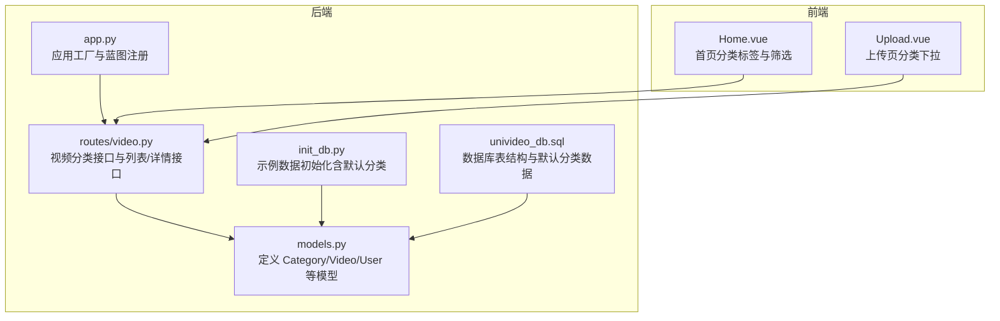
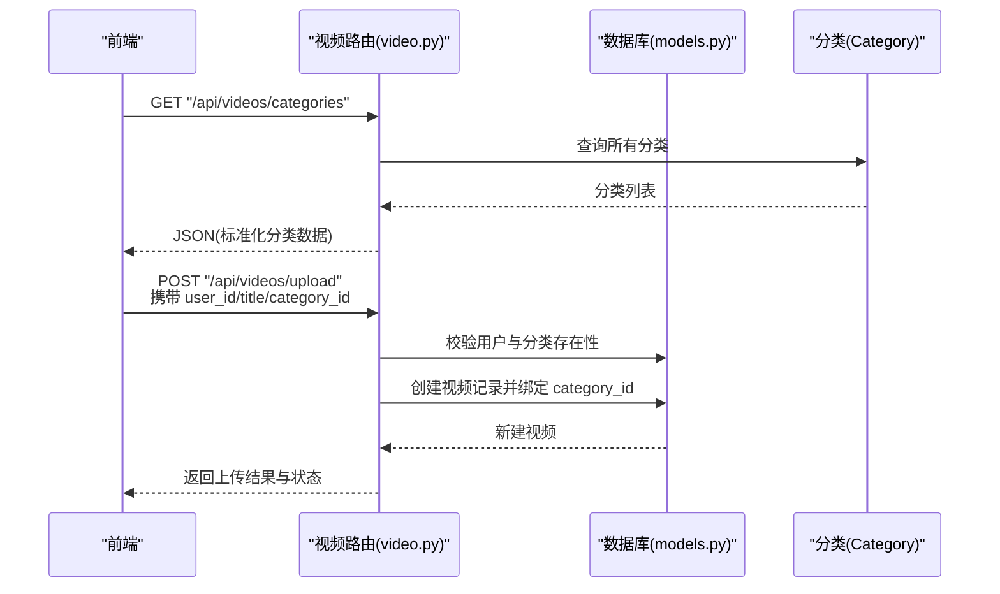
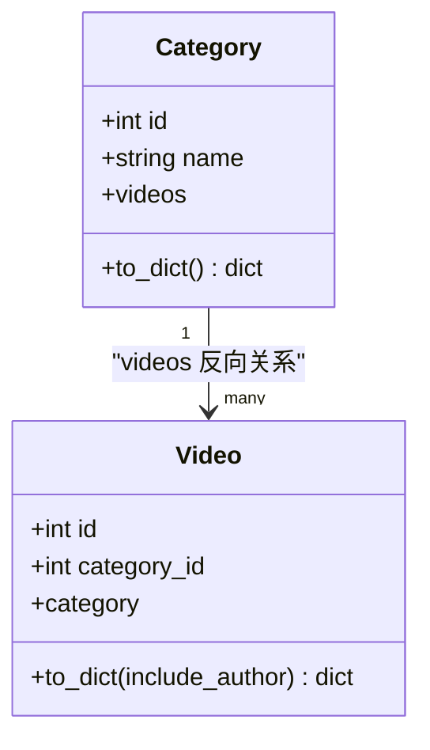
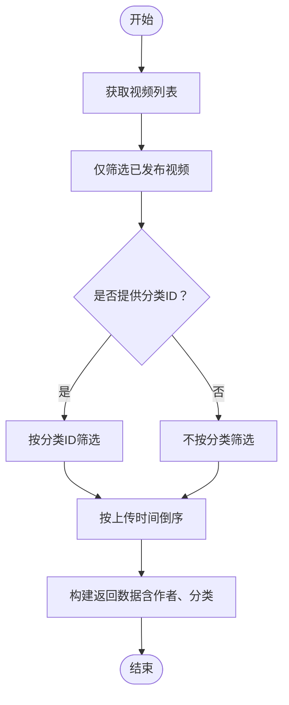
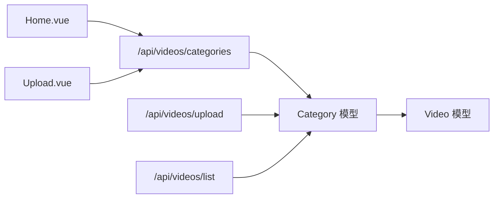

# 分类模型

<cite>
**本文引用的文件**
- [models.py](file://backend/models.py)
- [univideo_db.sql](file://univideo_db.sql)
- [video.py](file://backend/routes/video.py)
- [app.py](file://backend/app.py)
- [init_db.py](file://backend/init_db.py)
- [Home.vue](file://frontend/src/views/Home.vue)
- [Upload.vue](file://frontend/src/views/Upload.vue)
</cite>

## 目录
1. [简介](#简介)
2. [项目结构](#项目结构)
3. [核心组件](#核心组件)
4. [架构总览](#架构总览)
5. [详细组件分析](#详细组件分析)
6. [依赖分析](#依赖分析)
7. [性能考虑](#性能考虑)
8. [故障排查指南](#故障排查指南)
9. [结论](#结论)

## 简介
本文件围绕 Category 模型展开，系统性阐述其作为视频内容分类管理的基础作用。重点包括：
- 字段定义：id 为主键，name 为分类名称且具备唯一约束，防止重复分类。
- 关系属性：videos 关系实现“一个分类包含多个视频”的映射。
- 序列化：to_dict() 方法在 API 响应中返回标准化的分类数据格式。
- 结构验证：结合 categories 表的 SQL 定义，确认其作为基础字典表的结构合理性。
- 默认分类：系统预设“校园生活”“课程学习”“社团活动”“娱乐搞笑”四类。
- 功能定位：在视频发布与筛选流程中承担核心地位，支撑“先审后发”与分类筛选。

## 项目结构
后端采用 Flask + SQLAlchemy 架构，模型定义集中在 models.py；数据库表结构由 univideo_db.sql 统一定义；视频相关路由位于 backend/routes/video.py；前端通过 Vue 组件调用后端接口。

图表来源
- [models.py](file://backend/models.py#L85-L111)
- [video.py](file://backend/routes/video.py#L15-L35)
- [app.py](file://backend/app.py#L39-L58)
- [init_db.py](file://backend/init_db.py#L28-L81)
- [univideo_db.sql](file://univideo_db.sql#L16-L21)
- [Home.vue](file://frontend/src/views/Home.vue#L170-L188)
- [Upload.vue](file://frontend/src/views/Upload.vue#L41-L52)

章节来源
- [models.py](file://backend/models.py#L85-L111)
- [univideo_db.sql](file://univideo_db.sql#L16-L21)
- [video.py](file://backend/routes/video.py#L15-L35)
- [app.py](file://backend/app.py#L39-L58)
- [init_db.py](file://backend/init_db.py#L28-L81)
- [Home.vue](file://frontend/src/views/Home.vue#L170-L188)
- [Upload.vue](file://frontend/src/views/Upload.vue#L41-L52)

## 核心组件
- Category 模型
  - 字段
    - id：主键，自增，标识分类唯一 ID。
    - name：字符串类型，长度上限 50，唯一约束，非空，用于表示分类名称。
  - 关系
    - videos：反向关系，指向 Video 模型，实现“一个分类包含多个视频”的映射。
  - 序列化
    - to_dict()：返回包含 id 与 name 的字典，便于 API 响应标准化输出。
- 数据库表结构
  - categories 表
    - id：自增主键。
    - name：非空且唯一，作为分类名称。
  - 默认分类数据
    - 通过 SQL 插入语句与初始化脚本共同维护，包含“校园生活”“课程学习”“社团活动”“娱乐搞笑”。

章节来源
- [models.py](file://backend/models.py#L85-L111)
- [univideo_db.sql](file://univideo_db.sql#L16-L21)
- [init_db.py](file://backend/init_db.py#L40-L53)

## 架构总览
Category 在系统中的职责是提供稳定的分类字典，贯穿视频发布与筛选两大关键流程：
- 发布流程：上传接口在创建视频记录时绑定 category_id，从而将视频归类到指定分类。
- 筛选流程：首页与列表接口根据分类 ID 进行筛选，配合状态过滤实现“仅展示已发布视频”。

图表来源
- [video.py](file://backend/routes/video.py#L15-L35)
- [video.py](file://backend/routes/video.py#L37-L171)
- [models.py](file://backend/models.py#L85-L111)

## 详细组件分析

### Category 模型类图

图表来源
- [models.py](file://backend/models.py#L85-L111)
- [models.py](file://backend/models.py#L113-L198)

章节来源
- [models.py](file://backend/models.py#L85-L111)

### 字段与约束
- id：主键，自增，保证每条分类记录的唯一标识。
- name：非空且唯一，避免重复分类导致的数据不一致与业务歧义。
- 唯一约束：在 SQL 层与 ORM 层均体现，确保数据一致性。

章节来源
- [models.py](file://backend/models.py#L92-L99)
- [univideo_db.sql](file://univideo_db.sql#L16-L21)

### 关系属性：videos 映射
- Category.videos：反向关系，指向 Video，实现“一个分类包含多个视频”的映射。
- Video.category：正向外键，指向 Category，形成双向导航。
- 使用场景：在视频列表与详情中，可通过 Category.videos 快速统计分类下的视频数量；在前端展示分类标签时，可直接读取该关系。

章节来源
- [models.py](file://backend/models.py#L97-L111)
- [models.py](file://backend/models.py#L138-L149)

### 序列化 to_dict() 的 API 输出
- Category.to_dict()：返回标准化字典，包含 id 与 name，便于前端渲染与交互。
- Video.to_dict()：在包含作者信息时，会嵌套输出分类信息（category），确保列表/详情页的完整展示。

章节来源
- [models.py](file://backend/models.py#L100-L111)
- [models.py](file://backend/models.py#L166-L194)

### SQL 定义与结构合理性
- categories 表
  - 主键 id：自增，满足分类唯一标识需求。
  - 唯一约束 name：防止重复分类，保障业务一致性。
- 默认分类数据
  - SQL 插入语句与初始化脚本共同维护，确保系统启动即具备可用分类字典。
- 结构合理性
  - 简洁稳定，适合作为基础字典表；与 Video 的外键关联清晰，便于后续扩展。

章节来源
- [univideo_db.sql](file://univideo_db.sql#L16-L21)
- [init_db.py](file://backend/init_db.py#L40-L53)

### 系统预设分类
- “校园生活”“课程学习”“社团活动”“娱乐搞笑”
- 通过 SQL 插入与初始化脚本双重保障，确保系统具备初始可用分类集合。

章节来源
- [univideo_db.sql](file://univideo_db.sql#L16-L21)
- [init_db.py](file://backend/init_db.py#L40-L53)

### 在视频发布与筛选中的核心地位
- 发布流程
  - 上传接口在创建视频记录时绑定 category_id，从而将视频归类到指定分类。
  - 管理员与普通用户的审核策略不同，但分类选择在两者中保持一致。
- 筛选流程
  - 列表接口支持按分类 ID 进行筛选；首页与列表页通过分类标签实现快速筛选。
  - 与状态过滤（仅展示已发布视频）结合，确保用户看到的内容符合审核策略。

图表来源
- [video.py](file://backend/routes/video.py#L173-L215)
- [models.py](file://backend/models.py#L166-L194)

章节来源
- [video.py](file://backend/routes/video.py#L37-L171)
- [video.py](file://backend/routes/video.py#L173-L215)
- [Home.vue](file://frontend/src/views/Home.vue#L170-L188)
- [Upload.vue](file://frontend/src/views/Upload.vue#L41-L52)

## 依赖分析
- Category 与 Video 的关系
  - Category.videos 反向关系与 Video.category 正向外键共同构成分类-视频的多对一/一对多映射。
- 路由层依赖
  - 视频路由依赖 Category 模型进行分类查询与校验。
- 前端依赖
  - 首页与上传页分别通过调用分类接口与分类下拉框，间接依赖 Category 模型提供的数据。

图表来源
- [models.py](file://backend/models.py#L85-L111)
- [video.py](file://backend/routes/video.py#L15-L35)
- [video.py](file://backend/routes/video.py#L37-L171)
- [video.py](file://backend/routes/video.py#L173-L215)
- [Home.vue](file://frontend/src/views/Home.vue#L170-L188)
- [Upload.vue](file://frontend/src/views/Upload.vue#L41-L52)

章节来源
- [models.py](file://backend/models.py#L85-L111)
- [video.py](file://backend/routes/video.py#L15-L35)
- [video.py](file://backend/routes/video.py#L37-L171)
- [video.py](file://backend/routes/video.py#L173-L215)
- [Home.vue](file://frontend/src/views/Home.vue#L170-L188)
- [Upload.vue](file://frontend/src/views/Upload.vue#L41-L52)

## 性能考虑
- 唯一约束与索引
  - name 的唯一约束可有效避免重复分类带来的查询歧义与写入冲突。
  - categories 表未显式声明索引，但唯一约束通常会伴随隐式索引，足以支撑高频查询。
- 查询路径
  - 分类查询通常为全表扫描或基于唯一键的快速查找，开销较小。
  - 与视频列表筛选结合时，建议在前端控制分类 ID 的传递与缓存，减少重复请求。
- 扩展建议
  - 若分类数量增长，可在 name 上建立显式索引以提升模糊匹配效率（如需）。
  - 对于高频分类接口，可考虑引入缓存层以降低数据库压力。

## 故障排查指南
- 分类重复
  - 现象：新增分类时报唯一约束冲突。
  - 排查：确认 name 是否已存在；必要时先查询再插入。
- 分类不存在
  - 现象：上传视频时报分类不存在。
  - 排查：确认 category_id 是否正确；检查分类接口返回的分类列表。
- 分类接口异常
  - 现象：获取分类失败。
  - 排查：检查数据库连接、路由注册与 CORS 配置；确认 app.py 中蓝图注册顺序与前缀正确。
- 前端分类不显示
  - 现象：上传页或首页分类下拉为空。
  - 排查：确认前端调用 /api/videos/categories 成功；检查网络请求与响应结构。

章节来源
- [video.py](file://backend/routes/video.py#L15-L35)
- [video.py](file://backend/routes/video.py#L37-L171)
- [app.py](file://backend/app.py#L39-L58)

## 结论
Category 模型以简洁稳定的结构承担视频分类管理的基础职责。其唯一约束确保了分类数据的一致性，videos 关系实现了分类与视频的自然映射，to_dict() 提供了标准化的 API 输出。结合 categories 表的 SQL 定义与系统预设的四类默认分类，Category 在视频发布与筛选流程中发挥着核心作用，为系统的可维护性与扩展性奠定了坚实基础。