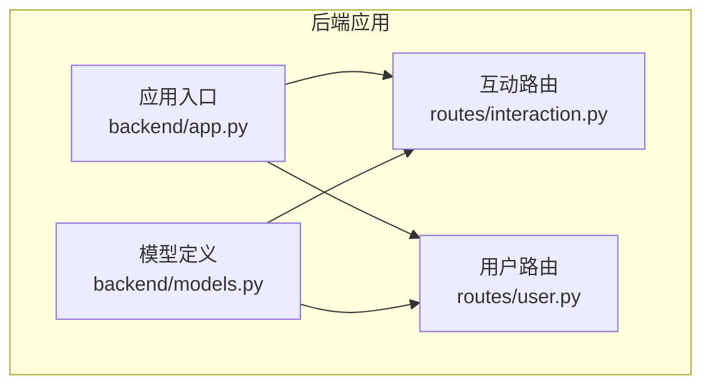
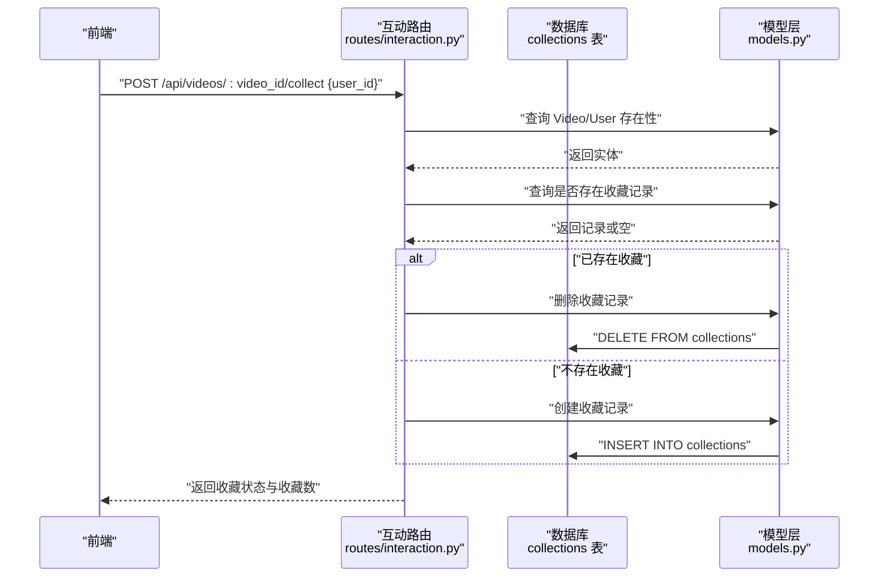
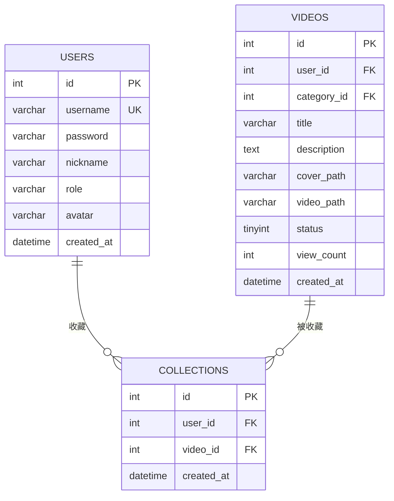
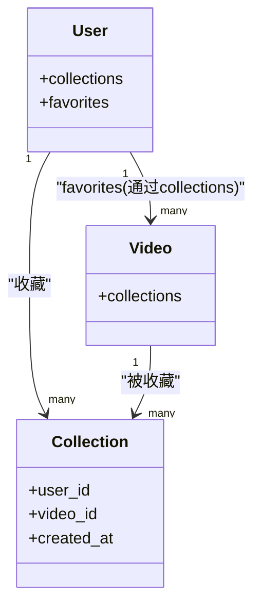
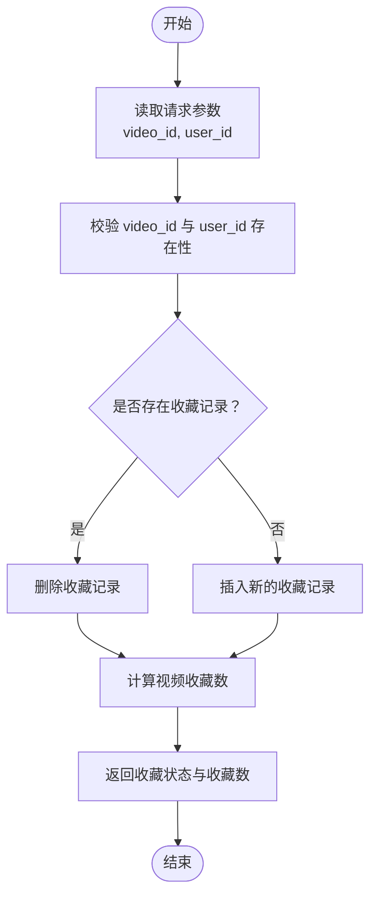
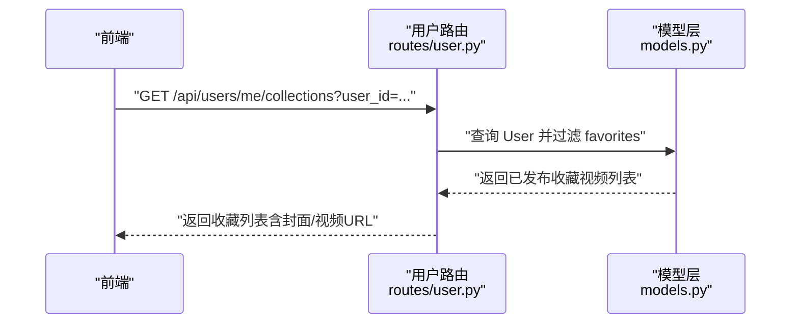
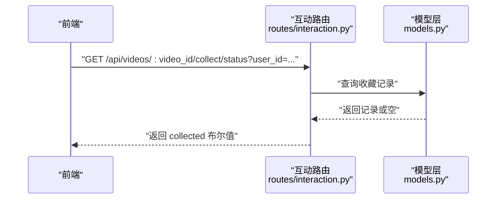
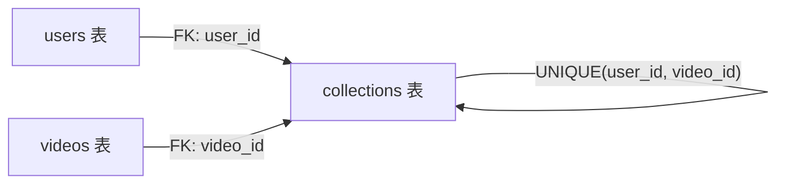

# 收藏模型

<cite>
**本文引用的文件**
- [backend/models.py](file://backend/models.py)
- [univideo_db.sql](file://univideo_db.sql)
- [backend/routes/interaction.py](file://backend/routes/interaction.py)
- [backend/routes/user.py](file://backend/routes/user.py)
- [backend/app.py](file://backend/app.py)
</cite>

## 目录
1. [引言](#引言)
2. [项目结构](#项目结构)
3. [核心组件](#核心组件)
4. [架构总览](#架构总览)
5. [详细组件分析](#详细组件分析)
6. [依赖分析](#依赖分析)
7. [性能考虑](#性能考虑)
8. [故障排查指南](#故障排查指南)
9. [结论](#结论)
10. [附录](#附录)

## 引言
本文件系统化阐述收藏模型的实现原理与使用方式，围绕以下目标展开：
- 解释 Collection 模型如何通过 user_id 与 video_id 外键建立用户收藏行为记录；
- 说明 unique_collection 联合唯一约束如何确保用户不能重复收藏同一视频；
- 描述 created_at 字段在记录收藏时间方面的业务价值；
- 解析 ORM 关系：User.collections、Video.collections 以及 User.favorites 的便捷访问；
- 验证 to_dict() 输出结构与 collections 表的 SQL 定义一致；
- 给出“获取用户收藏列表”和“判断视频是否被收藏”的典型查询实现建议。

## 项目结构
后端采用 Flask + SQLAlchemy 架构，模型定义集中在 models.py，收藏相关 API 在 routes/interaction.py 中提供收藏/取消收藏与收藏状态查询；用户收藏列表在 routes/user.py 中提供。

图表来源
- [backend/app.py](file://backend/app.py#L40-L58)
- [backend/models.py](file://backend/models.py#L14-L41)
- [backend/routes/interaction.py](file://backend/routes/interaction.py#L114-L238)
- [backend/routes/user.py](file://backend/routes/user.py#L217-L265)

章节来源
- [backend/app.py](file://backend/app.py#L40-L58)

## 核心组件
- 收藏模型 Collection：记录用户对视频的收藏关系，具备 created_at 时间戳与 unique_collection 联合唯一约束。
- 用户模型 User：通过 collections 关系维护收藏记录，通过 favorites 关系便捷访问收藏的视频。
- 视频模型 Video：通过 collections 关系维护收藏记录，提供收藏计数辅助方法。
- 互动路由 interaction：提供收藏/取消收藏与收藏状态查询接口。
- 用户路由 user：提供获取当前用户收藏列表的接口。

章节来源
- [backend/models.py](file://backend/models.py#L310-L343)
- [backend/models.py](file://backend/models.py#L14-L41)
- [backend/models.py](file://backend/models.py#L113-L198)
- [backend/routes/interaction.py](file://backend/routes/interaction.py#L114-L238)
- [backend/routes/user.py](file://backend/routes/user.py#L217-L265)

## 架构总览
收藏功能涉及三层：前端调用、后端路由、数据库模型与表结构。核心流程是：前端发起收藏/取消收藏或收藏状态查询请求，后端路由校验参数与实体存在性，ORM 层通过 Collection 关系与约束保证数据一致性，最终返回 JSON 响应。

图表来源
- [backend/routes/interaction.py](file://backend/routes/interaction.py#L114-L185)
- [backend/models.py](file://backend/models.py#L310-L343)
- [univideo_db.sql](file://univideo_db.sql#L67-L76)

## 详细组件分析

### 收藏模型与外键关系
- 外键 user_id 与 video_id：分别指向 users.id 与 videos.id，ON DELETE CASCADE 确保级联删除。
- 联合唯一约束 unique_collection(user_id, video_id)：防止重复收藏。
- created_at：记录收藏时间，便于排序与统计。

图表来源
- [univideo_db.sql](file://univideo_db.sql#L6-L14)
- [univideo_db.sql](file://univideo_db.sql#L23-L38)
- [univideo_db.sql](file://univideo_db.sql#L67-L76)
- [backend/models.py](file://backend/models.py#L310-L343)

章节来源
- [backend/models.py](file://backend/models.py#L310-L343)
- [univideo_db.sql](file://univideo_db.sql#L67-L76)

### ORM 关系与便捷访问
- User.collections：一个用户可收藏多个视频，backref 指向 Collection.user。
- Video.collections：一个视频可被多个用户收藏，backref 指向 Collection.video。
- User.favorites：通过 secondary='collections' 直接访问收藏的视频集合，便于“我的收藏列表”等场景。

图表来源
- [backend/models.py](file://backend/models.py#L310-L343)
- [backend/models.py](file://backend/models.py#L14-L41)
- [backend/models.py](file://backend/models.py#L113-L198)

章节来源
- [backend/models.py](file://backend/models.py#L310-L343)
- [backend/models.py](file://backend/models.py#L14-L41)
- [backend/models.py](file://backend/models.py#L113-L198)

### to_dict() 输出结构验证
- Collection.to_dict() 输出包含 id、user_id、video_id、created_at，与 collections 表字段一一对应。
- User.to_dict() 输出用户基本信息，用于前端展示。
- Video.to_dict() 输出视频基础信息及统计字段，收藏列表中会补充完整 URL。

章节来源
- [backend/models.py](file://backend/models.py#L330-L343)
- [backend/models.py](file://backend/models.py#L68-L80)
- [backend/models.py](file://backend/models.py#L166-L194)

### 数据完整性与业务价值
- unique_collection 联合唯一约束：确保同一用户对同一视频只能有一条收藏记录，避免重复收藏导致的统计与展示问题。
- created_at：用于排序（如“最近收藏”）、统计（如近7日收藏趋势）与审计追踪。

章节来源
- [backend/models.py](file://backend/models.py#L324-L328)
- [univideo_db.sql](file://univideo_db.sql#L67-L76)

### API 流程与典型查询

#### 收藏/取消收藏流程

图表来源
- [backend/routes/interaction.py](file://backend/routes/interaction.py#L114-L185)
- [backend/models.py](file://backend/models.py#L149-L157)

章节来源
- [backend/routes/interaction.py](file://backend/routes/interaction.py#L114-L185)

#### 获取用户收藏列表
- 路由：GET /api/users/me/collections?user_id=...
- 实现要点：
  - 通过 User.favorites 关系获取收藏视频；
  - 过滤条件：Video.status == Video.STATUS_PUBLISHED；
  - 排序：Video.created_at.desc()；
  - 补充封面与视频 URL，便于前端直接渲染。

图表来源
- [backend/routes/user.py](file://backend/routes/user.py#L217-L265)
- [backend/models.py](file://backend/models.py#L14-L41)
- [backend/models.py](file://backend/models.py#L113-L198)

章节来源
- [backend/routes/user.py](file://backend/routes/user.py#L217-L265)

#### 判断视频是否被收藏
- 路由：GET /api/videos/:video_id/collect/status?user_id=...
- 实现要点：
  - 使用 Collection.query.filter_by(user_id, video_id).first() 查询；
  - 返回布尔值 collected 表示当前用户是否已收藏。

图表来源
- [backend/routes/interaction.py](file://backend/routes/interaction.py#L195-L238)
- [backend/models.py](file://backend/models.py#L310-L343)

章节来源
- [backend/routes/interaction.py](file://backend/routes/interaction.py#L195-L238)

## 依赖分析
- 模块耦合：
  - routes/interaction.py 与 routes/user.py 均依赖 models.py 的 User、Video、Collection。
  - Collection 作为中间表，同时被 User.favorites 与 Video.collections 使用，形成双向关联。
- 外键与约束：
  - collections.user_id -> users.id（ON DELETE CASCADE）
  - collections.video_id -> videos.id（ON DELETE CASCADE）
  - unique_collection(user_id, video_id) 防止重复收藏
- 级联删除：
  - 删除用户或视频时，其相关的收藏记录会自动清理，避免悬挂数据。

图表来源
- [univideo_db.sql](file://univideo_db.sql#L67-L76)
- [backend/models.py](file://backend/models.py#L310-L343)

章节来源
- [univideo_db.sql](file://univideo_db.sql#L67-L76)
- [backend/models.py](file://backend/models.py#L310-L343)

## 性能考虑
- 查询优化：
  - 收藏状态查询使用 filter_by(user_id, video_id)，配合 unique_collection 索引，命中率高且稳定。
  - “我的收藏列表”按 Video.created_at 倒序，适合在视频表上建立索引以提升排序效率。
- 写入优化：
  - 收藏/取消收藏为单条记录写入/删除，开销小；unique_collection 约束在插入时触发唯一性检查，建议保持索引有效。
- 批量场景：
  - 若未来需要批量收藏/取消收藏，可在路由层合并事务，减少多次往返。

## 故障排查指南
- 收藏状态查询返回空：
  - 检查 user_id 与 video_id 是否正确传递；
  - 确认 Video 与 User 是否存在。
- 收藏/取消收藏失败：
  - 查看是否有并发写入导致唯一约束冲突；
  - 确认数据库连接与事务提交是否成功。
- “我的收藏列表”为空：
  - 确认收藏视频的状态为已发布；
  - 检查 User.favorites 关系是否正确使用。

章节来源
- [backend/routes/interaction.py](file://backend/routes/interaction.py#L114-L185)
- [backend/routes/interaction.py](file://backend/routes/interaction.py#L195-L238)
- [backend/routes/user.py](file://backend/routes/user.py#L217-L265)

## 结论
收藏模型通过简洁的外键与联合唯一约束，实现了可靠的用户-视频收藏关系管理。ORM 层的 collections 与 favorites 关系，既满足了数据完整性，又提供了便捷的查询能力。结合 created_at 字段，可支撑排序与统计等常见业务需求。推荐在生产环境中继续沿用现有设计，并根据实际流量对相关索引进行评估与优化。

## 附录
- API 参考（基于现有实现）：
  - 收藏/取消收藏：POST /api/videos/{video_id}/collect
  - 收藏状态查询：GET /api/videos/{video_id}/collect/status?user_id=...
  - 获取我的收藏列表：GET /api/users/me/collections?user_id=...

章节来源
- [backend/routes/interaction.py](file://backend/routes/interaction.py#L114-L238)
- [backend/routes/user.py](file://backend/routes/user.py#L217-L265)