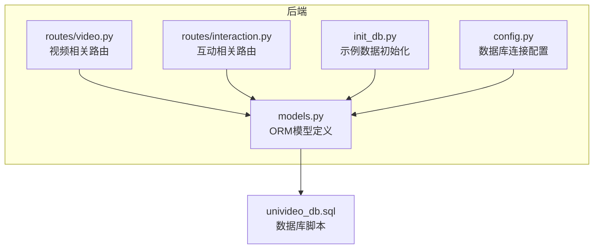
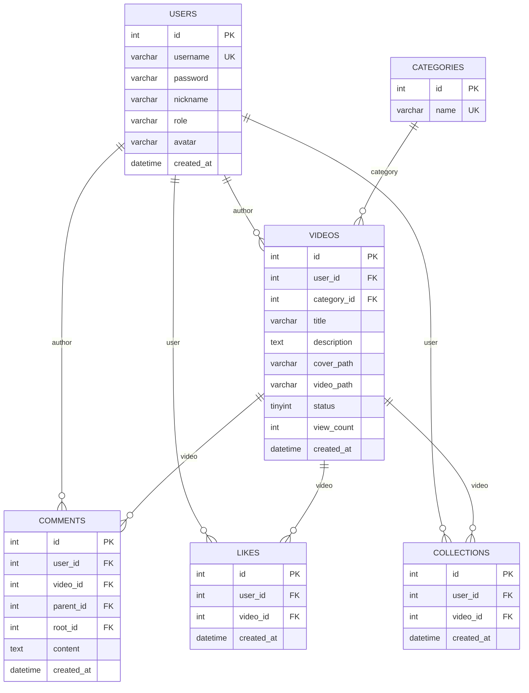
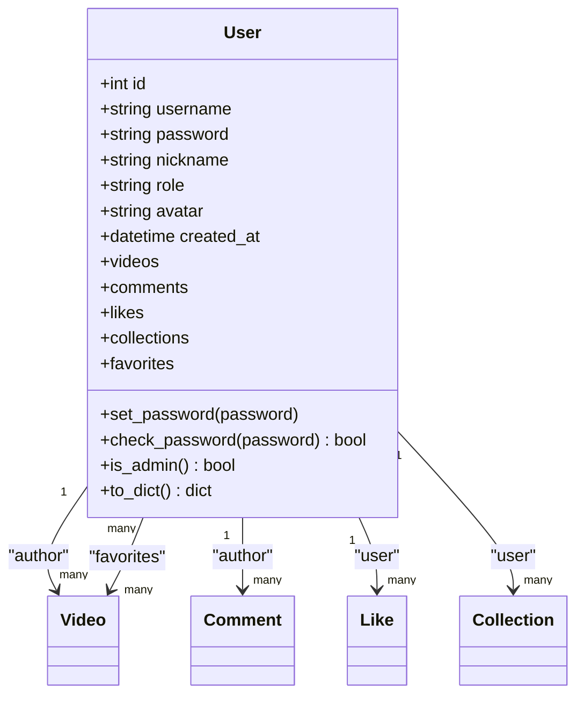
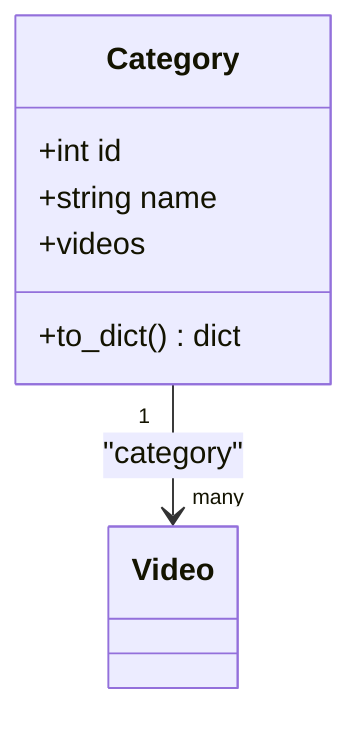
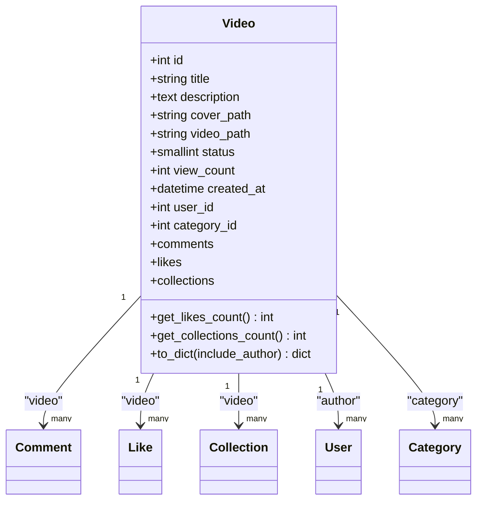
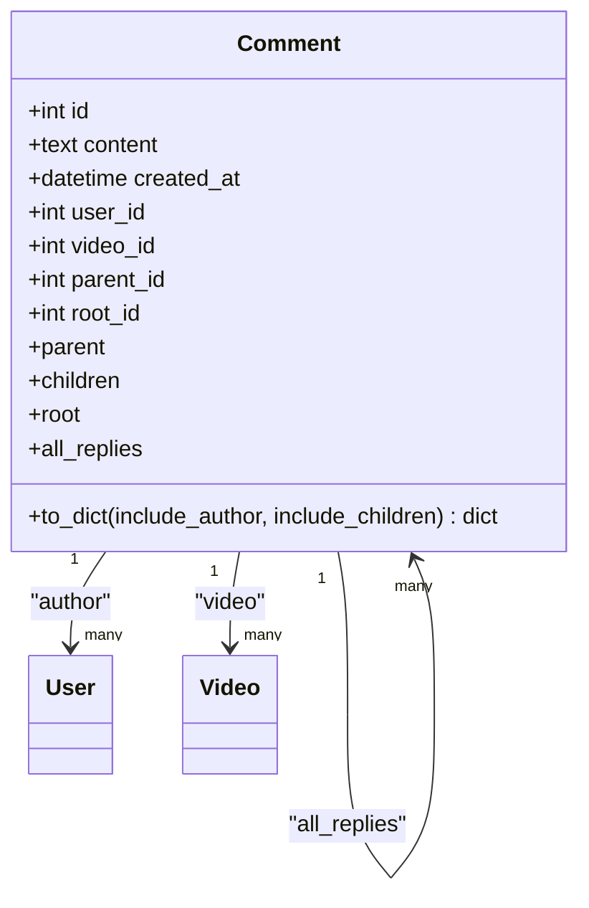
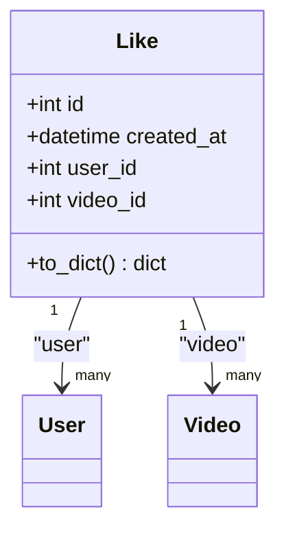
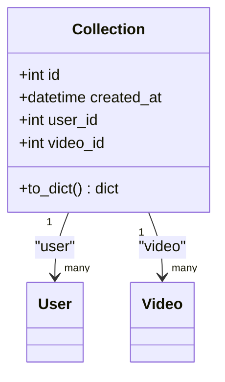
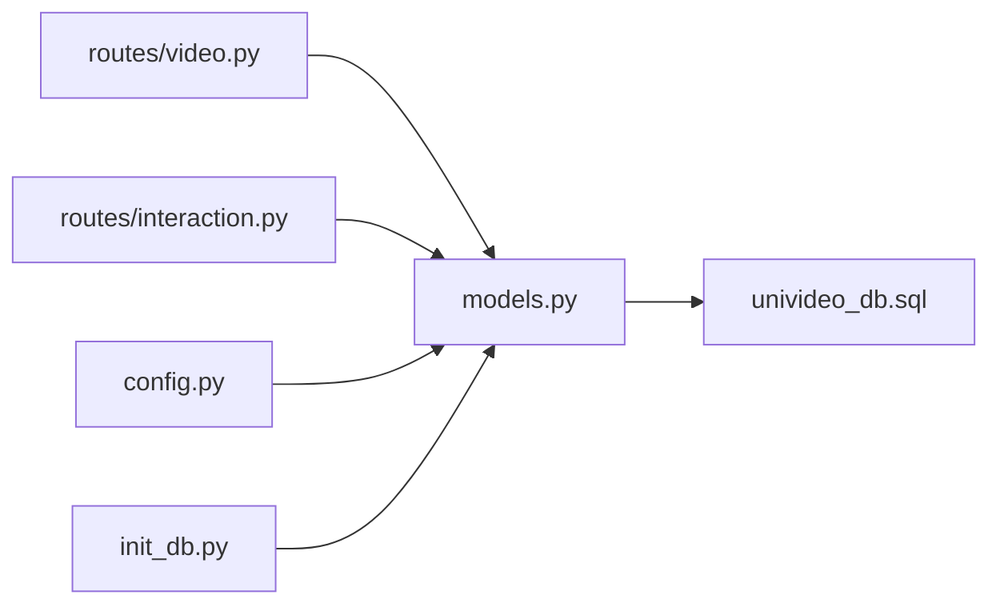

# 数据模型

<cite>
**本文引用的文件**
- [models.py](file://backend/models.py)
- [univideo_db.sql](file://univideo_db.sql)
- [config.py](file://backend/config.py)
- [init_db.py](file://backend/init_db.py)
- [video.py](file://backend/routes/video.py)
- [interaction.py](file://backend/routes/interaction.py)
</cite>

## 目录
1. [引言](#引言)
2. [项目结构](#项目结构)
3. [核心组件](#核心组件)
4. [架构总览](#架构总览)
5. [详细组件分析](#详细组件分析)
6. [依赖分析](#依赖分析)
7. [性能考虑](#性能考虑)
8. [故障排查指南](#故障排查指南)
9. [结论](#结论)
10. [附录](#附录)

## 引言
本文件面向UniVideo系统的数据模型，基于后端ORM模型文件与数据库脚本，系统化梳理核心实体（用户、视频、评论、点赞、收藏）的字段定义、主外键关系、索引策略、业务约束与数据一致性保障机制。同时结合路由层业务逻辑，给出典型查询场景与数据生命周期管理策略（如删除级联规则），帮助开发者与运维人员准确理解并维护数据结构。

## 项目结构
- 后端采用Flask+SQLAlchemy，模型定义位于backend/models.py，数据库脚本位于univideo_db.sql。
- 数据库连接配置位于backend/config.py，示例数据初始化脚本位于backend/init_db.py。
- 业务路由位于backend/routes/，其中视频路由video.py与互动路由interaction.py分别体现视频审核状态机与评论/点赞/收藏的业务流程。

图表来源
- [models.py](file://backend/models.py#L1-L343)
- [univideo_db.sql](file://univideo_db.sql#L1-L76)
- [config.py](file://backend/config.py#L1-L66)
- [init_db.py](file://backend/init_db.py#L1-L99)
- [video.py](file://backend/routes/video.py#L1-L282)
- [interaction.py](file://backend/routes/interaction.py#L1-L408)

章节来源
- [models.py](file://backend/models.py#L1-L343)
- [univideo_db.sql](file://univideo_db.sql#L1-L76)
- [config.py](file://backend/config.py#L1-L66)
- [init_db.py](file://backend/init_db.py#L1-L99)
- [video.py](file://backend/routes/video.py#L1-L282)
- [interaction.py](file://backend/routes/interaction.py#L1-L408)

## 核心组件
本节对每个核心模型进行字段、关系、索引与约束的系统化说明，并指出与数据库脚本的对应关系。

- 用户（User）
  - 字段与类型：id（主键）、username（唯一索引）、password、nickname、role（默认值）、avatar、created_at。
  - 关系：一对多（videos、comments、likes、collections），多对多（favorites，通过collections中间表）。
  - 约束与索引：username唯一；ORM中显式建立username索引；to_dict序列化输出。
  - 与数据库脚本对应：users表结构与索引一致。

- 分类（Category）
  - 字段与类型：id（主键）、name（唯一）。
  - 关系：一对多（videos）。
  - 约束与索引：name唯一；无额外索引。
  - 与数据库脚本对应：categories表结构一致。

- 视频（Video）
  - 字段与类型：id（主键）、title、description、cover_path、video_path、status（状态机：待审核/已发布/已驳回）、view_count、created_at、user_id（外键，级联删除）、category_id（外键）。
  - 关系：一对多（comments、likes、collections），反向关联author/category。
  - 约束与索引：status建立索引；to_dict包含作者与分类信息；提供统计方法（点赞数、收藏数）。
  - 业务约束：status字段实现“先审后发”，上传时根据用户角色决定初始状态。

- 评论（Comment）
  - 字段与类型：id（主键）、content、created_at、user_id（外键，级联删除）、video_id（外键，级联删除）、parent_id（自关联，外键，级联删除）、root_id（自关联，外键，级联删除）。
  - 关系：自关联（parent/children、root/all_replies）；一对多（video/comments）。
  - 约束与索引：联合索引(idx_video_root)优化楼层查询；parent_id与root_id用于多级评论树。
  - 业务约束：root_id计算逻辑保证同一楼层对话串的聚合。

- 点赞（Like）
  - 字段与类型：id（主键）、created_at、user_id（外键，级联删除）、video_id（外键，级联删除）。
  - 约束与索引：联合唯一约束(unique_like)，防止重复点赞。
  - 业务约束：toggle_like接口实现点赞/取消点赞。

- 收藏（Collection）
  - 字段与类型：id（主键）、created_at、user_id（外键，级联删除）、video_id（外键，级联删除）。
  - 约束与索引：联合唯一约束(unique_collection)，防止重复收藏。
  - 业务约束：toggle_collect接口实现收藏/取消收藏。

章节来源
- [models.py](file://backend/models.py#L14-L343)
- [univideo_db.sql](file://univideo_db.sql#L1-L76)

## 架构总览
下图展示UniVideo的数据模型与数据库脚本之间的映射关系，以及核心实体间的主外键与索引策略。

图表来源
- [models.py](file://backend/models.py#L14-L343)
- [univideo_db.sql](file://univideo_db.sql#L1-L76)

## 详细组件分析

### 用户（User）
- 字段与类型：见“核心组件”。
- 关系与多态：videos、comments、likes、collections为一对多；favorites通过中间表collections与Video建立多对多。
- 序列化：to_dict输出必要字段，便于API响应。
- 安全：set_password与check_password封装密码哈希校验。

图表来源
- [models.py](file://backend/models.py#L14-L111)

章节来源
- [models.py](file://backend/models.py#L14-L111)

### 分类（Category）
- 字段与类型：见“核心组件”。
- 关系：videos为一对多。

图表来源
- [models.py](file://backend/models.py#L85-L111)

章节来源
- [models.py](file://backend/models.py#L85-L111)

### 视频（Video）
- 字段与类型：见“核心组件”。
- 状态机：status字段实现“先审后发”。上传时根据用户角色决定初始状态（管理员直接发布，普通用户进入待审核）。
- 统计：get_likes_count与get_collections_count通过关联表计数。
- 序列化：to_dict包含作者与分类信息，便于前端渲染。

图表来源
- [models.py](file://backend/models.py#L113-L198)
- [video.py](file://backend/routes/video.py#L129-L147)

章节来源
- [models.py](file://backend/models.py#L113-L198)
- [video.py](file://backend/routes/video.py#L129-L147)

### 评论（Comment）
- 字段与类型：见“核心组件”。
- 多级评论：parent_id与root_id构成自关联树形结构；联合索引(idx_video_root)优化楼层查询。
- 序列化：to_dict支持包含作者与子评论（children）。

图表来源
- [models.py](file://backend/models.py#L200-L271)

章节来源
- [models.py](file://backend/models.py#L200-L271)

### 点赞（Like）
- 字段与类型：见“核心组件”。
- 唯一约束：联合唯一(user_id, video_id)防止重复点赞。
- 业务：toggle_like接口实现点赞/取消点赞。

图表来源
- [models.py](file://backend/models.py#L273-L307)

章节来源
- [models.py](file://backend/models.py#L273-L307)
- [interaction.py](file://backend/routes/interaction.py#L329-L400)

### 收藏（Collection）
- 字段与类型：见“核心组件”。
- 唯一约束：联合唯一(user_id, video_id)防止重复收藏。
- 业务：toggle_collect接口实现收藏/取消收藏。

图表来源
- [models.py](file://backend/models.py#L309-L343)

章节来源
- [models.py](file://backend/models.py#L309-L343)
- [interaction.py](file://backend/routes/interaction.py#L114-L185)

## 依赖分析
- ORM与数据库一致性
  - models.py中的字段类型、主键、外键、索引与约束与univideo_db.sql严格对应，确保ORM映射与数据库结构一致。
  - 删除级联：users、videos、comments、likes、collections的外键均设置ON DELETE CASCADE，保证用户或视频删除时，相关互动数据自动清理。
- 路由层依赖
  - video.py依赖Video、Category、User模型，实现上传、列表、详情等业务。
  - interaction.py依赖Comment、Like、Collection、Video、User模型，实现评论、点赞、收藏等互动功能。
- 配置与连接
  - config.py提供MySQL连接URI，init_db.py在应用上下文中写入默认分类与示例用户，确保开发环境可用。

图表来源
- [models.py](file://backend/models.py#L1-L343)
- [univideo_db.sql](file://univideo_db.sql#L1-L76)
- [config.py](file://backend/config.py#L1-L66)
- [init_db.py](file://backend/init_db.py#L1-L99)
- [video.py](file://backend/routes/video.py#L1-L282)
- [interaction.py](file://backend/routes/interaction.py#L1-L408)

章节来源
- [models.py](file://backend/models.py#L1-L343)
- [univideo_db.sql](file://univideo_db.sql#L1-L76)
- [config.py](file://backend/config.py#L1-L66)
- [init_db.py](file://backend/init_db.py#L1-L99)
- [video.py](file://backend/routes/video.py#L1-L282)
- [interaction.py](file://backend/routes/interaction.py#L1-L408)

## 性能考虑
- 索引策略
  - Video.status建立索引，优化审核查询与筛选。
  - Comment.idx_video_root联合索引，加速按视频与楼层的评论查询。
- 级联删除
  - ON DELETE CASCADE减少孤立数据，降低清理成本。
- 查询优化建议
  - 列表查询按created_at倒序，配合索引提升分页性能。
  - 评论树查询建议优先使用root_id定位楼层，再按created_at排序。
- 存储与文件路径
  - 上传文件路径存于数据库，静态资源通过配置的UPLOAD_FOLDER提供，注意磁盘空间与备份策略。

[本节为通用性能建议，无需特定文件来源]

## 故障排查指南
- 数据库连接问题
  - 检查config.py中的SQLALCHEMY_DATABASE_URI是否正确指向univideo_db。
  - 确认init_db.py已先执行univideo_db.sql创建数据库与表。
- 数据一致性问题
  - 确保likes与collections的联合唯一约束生效，避免重复点赞/收藏。
  - 确认users与videos的外键约束，删除用户或视频时检查级联删除是否触发。
- 评论树异常
  - root_id计算逻辑需确保父评论属于同一视频，避免跨视频引用。
- 示例数据缺失
  - 运行init_db.py创建默认分类与示例用户，避免因无数据导致的查询异常。

章节来源
- [config.py](file://backend/config.py#L26-L30)
- [init_db.py](file://backend/init_db.py#L1-L99)
- [interaction.py](file://backend/routes/interaction.py#L60-L85)

## 结论
UniVideo的数据模型围绕“先审后发”的视频审核状态机与“评论-点赞-收藏”的互动体系构建，ORM与数据库脚本高度一致，删除级联规则完善，索引策略覆盖常见查询场景。通过路由层的业务逻辑，系统实现了从上传、审核、展示到互动的完整闭环。建议在生产环境中强化权限控制（如待审核视频的访问限制）与监控告警，持续优化查询与存储策略。

[本节为总结性内容，无需特定文件来源]

## 附录

### 典型查询场景与SQL示例
以下为基于模型与脚本的典型查询思路（以路径代替具体SQL内容）：
- 获取所有分类
  - 路径参考：[routes/video.py](file://backend/routes/video.py#L15-L35)
- 上传视频（根据用户角色设置状态）
  - 路径参考：[routes/video.py](file://backend/routes/video.py#L129-L147)
- 获取已发布视频列表（支持关键词与分类筛选）
  - 路径参考：[routes/video.py](file://backend/routes/video.py#L173-L226)
- 获取视频详情（播放量+1）
  - 路径参考：[routes/video.py](file://backend/routes/video.py#L228-L282)
- 发表评论（多级评论root_id计算）
  - 路径参考：[routes/interaction.py](file://backend/routes/interaction.py#L12-L112)
- 获取视频评论列表
  - 路径参考：[routes/interaction.py](file://backend/routes/interaction.py#L287-L327)
- 点赞/取消点赞
  - 路径参考：[routes/interaction.py](file://backend/routes/interaction.py#L329-L400)
- 收藏/取消收藏
  - 路径参考：[routes/interaction.py](file://backend/routes/interaction.py#L114-L185)

### 数据生命周期管理策略
- 用户删除
  - 级联删除：用户的所有视频、评论、点赞、收藏将被删除。
- 视频删除
  - 级联删除：视频相关的评论、点赞、收藏将被删除。
- 评论删除
  - 级联删除：子评论随父评论删除，保持评论树一致性。

章节来源
- [univideo_db.sql](file://univideo_db.sql#L35-L54)
- [models.py](file://backend/models.py#L31-L38)
- [models.py](file://backend/models.py#L138-L149)
- [models.py](file://backend/models.py#L216-L226)
- [models.py](file://backend/models.py#L284-L288)
- [models.py](file://backend/models.py#L320-L324)