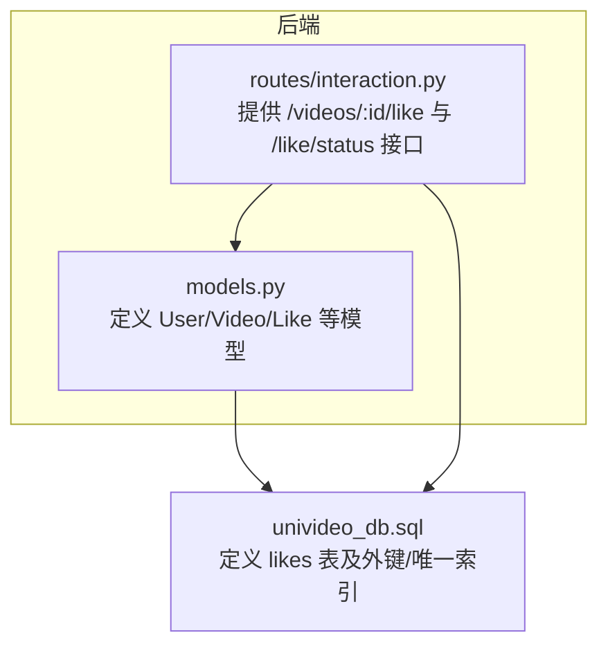
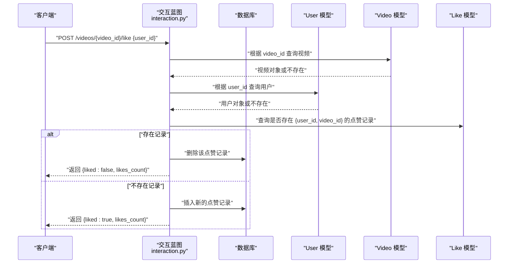
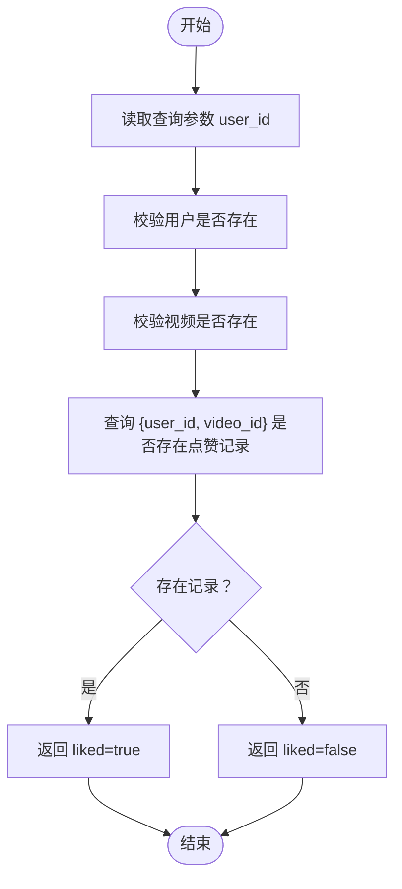
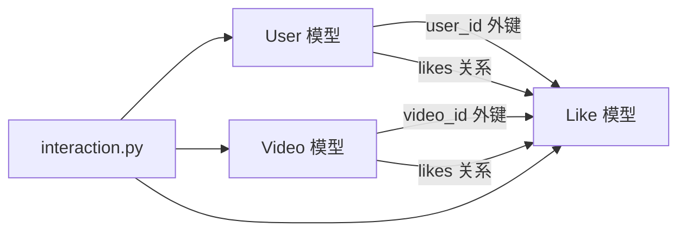

# 点赞模型

<cite>
**本文引用的文件**
- [models.py](file://backend/models.py)
- [univideo_db.sql](file://univideo_db.sql)
- [interaction.py](file://backend/routes/interaction.py)
</cite>

## 目录
1. [简介](#简介)
2. [项目结构](#项目结构)
3. [核心组件](#核心组件)
4. [架构总览](#架构总览)
5. [详细组件分析](#详细组件分析)
6. [依赖分析](#依赖分析)
7. [性能考虑](#性能考虑)
8. [故障排查指南](#故障排查指南)
9. [结论](#结论)

## 简介
本节面向“点赞模型”在系统中的实现机制进行深入说明。重点包括：
- 如何通过 user_id 与 video_id 外键建立用户与视频之间的点赞关联；
- unique_like 联合唯一约束如何防止重复点赞；
- created_at 字段的审计与时间记录能力；
- ORM 关系映射：一个用户可点赞多个视频（User.likes），一个视频可被多个用户点赞（Video.likes）；
- to_dict() 序列化输出格式；
- 结合 likes 表的 SQL 定义，验证外键级联删除与唯一索引的正确配置；
- 典型查询思路：检查某用户是否已点赞某视频。

## 项目结构
点赞模型位于后端模型层，与数据库表结构严格对应；同时在交互路由中提供点赞状态查询与切换接口。

图表来源
- [models.py](file://backend/models.py#L140-L306)
- [univideo_db.sql](file://univideo_db.sql#L56-L65)
- [interaction.py](file://backend/routes/interaction.py#L241-L407)

章节来源
- [models.py](file://backend/models.py#L140-L306)
- [univideo_db.sql](file://univideo_db.sql#L56-L65)
- [interaction.py](file://backend/routes/interaction.py#L241-L407)

## 核心组件
- 点赞模型（Like）：记录用户对视频的点赞关系，具备外键 user_id、video_id，以及 created_at 时间戳与 unique_like 联合唯一约束。
- 用户模型（User）：通过 likes 关系反向关联到点赞记录。
- 视频模型（Video）：通过 likes 关系反向关联到点赞记录，并提供点赞数统计方法。
- 交互路由（interaction.py）：提供点赞状态查询与点赞/取消点赞的切换接口。

章节来源
- [models.py](file://backend/models.py#L140-L306)
- [interaction.py](file://backend/routes/interaction.py#L241-L407)

## 架构总览
点赞功能的端到端流程如下：客户端调用点赞接口，服务端校验用户与视频存在性，查询是否存在点赞记录，若存在则删除，否则新增；随后返回当前点赞状态与视频点赞数。

图表来源
- [interaction.py](file://backend/routes/interaction.py#L329-L407)
- [models.py](file://backend/models.py#L140-L306)

## 详细组件分析

### Like 模型与外键关系
- 表名与主键：likes 表，主键 id。
- 外键字段：
  - user_id：指向 users.id，ON DELETE CASCADE。
  - video_id：指向 videos.id，ON DELETE CASCADE。
- 联合唯一约束：unique_like(user_id, video_id)，确保同一用户对同一视频只能点赞一次。
- 审计字段：created_at，默认记录点赞时间。
- ORM 关系：
  - User.likes：一个用户可点赞多个视频。
  - Video.likes：一个视频可被多个用户点赞。
- 序列化：to_dict() 输出包含 id、user_id、video_id、created_at。

章节来源
- [models.py](file://backend/models.py#L273-L306)
- [univideo_db.sql](file://univideo_db.sql#L56-L65)

### 数据库表结构验证
- likes 表定义包含：
  - user_id、video_id、created_at；
  - 唯一索引 unique_like(user_id, video_id)；
  - 外键 user_id(users.id)、video_id(videos.id)，均设置 ON DELETE CASCADE。
- 这与模型层的外键与唯一约束定义完全一致。

章节来源
- [univideo_db.sql](file://univideo_db.sql#L56-L65)
- [models.py](file://backend/models.py#L273-L306)

### ORM 关系映射
- User.likes：backref 到 Like.user，lazy='dynamic'，级联删除 orphan。
- Video.likes：backref 到 Like.video，lazy='dynamic'，级联删除 orphan。
- 这些关系保证了：
  - 删除用户或视频时，其相关的点赞记录会级联删除；
  - 通过 user.likes 或 video.likes 可以遍历相关点赞记录。

章节来源
- [models.py](file://backend/models.py#L31-L41)
- [models.py](file://backend/models.py#L143-L149)
- [models.py](file://backend/models.py#L273-L306)

### created_at 字段的审计功能
- created_at 默认使用当前时间，用于记录点赞发生的时间点。
- 在 to_dict() 中以 ISO 格式输出，便于前端展示与排序。

章节来源
- [models.py](file://backend/models.py#L282-L303)

### to_dict() 方法的序列化输出格式
- 输出字段：id、user_id、video_id、created_at（ISO 字符串）。
- 该格式与 likes 表结构一一对应，便于 API 响应与日志审计。

章节来源
- [models.py](file://backend/models.py#L294-L303)

### 典型查询：检查某用户是否已点赞某视频
- 思路：在交互路由中，通过 Like.query.filter_by(user_id=user_id, video_id=video_id).first() 查询是否存在点赞记录，存在即已点赞，否则未点赞。
- 接口：GET /videos/{video_id}/like/status?user_id=...

图表来源
- [interaction.py](file://backend/routes/interaction.py#L241-L279)

章节来源
- [interaction.py](file://backend/routes/interaction.py#L241-L279)

## 依赖分析
- 模型层依赖：
  - User 与 Video 通过外键分别关联 users 与 videos；
  - Like 同时关联 users 与 videos，且受 unique_like 约束；
  - User.likes 与 Video.likes 为双向关系，由 backref 维护。
- 路由层依赖：
  - interaction.py 依赖 models.py 中的 User、Video、Like；
  - 通过查询与增删操作实现点赞状态切换与查询。

图表来源
- [models.py](file://backend/models.py#L140-L306)
- [interaction.py](file://backend/routes/interaction.py#L241-L407)

章节来源
- [models.py](file://backend/models.py#L140-L306)
- [interaction.py](file://backend/routes/interaction.py#L241-L407)

## 性能考虑
- 外键级联删除：ON DELETE CASCADE 确保删除用户或视频时自动清理相关点赞记录，避免悬挂数据。
- 唯一索引：unique_like(user_id, video_id) 防止重复点赞，同时在查询与插入时具备高效去重能力。
- 查询优化：likes 表仅包含三列（含主键），索引命中良好；点赞状态查询为单条记录过滤，复杂度低。
- 扩展建议：若需按时间倒序查看最近点赞，可在 created_at 上建立索引（当前模型未显式声明，但 created_at 已默认索引）。

## 故障排查指南
- 重复点赞报错：当尝试再次对同一用户-视频组合插入点赞记录时，数据库唯一约束会触发冲突。应通过状态查询接口先判断，或在业务层捕获异常并提示用户。
- 用户/视频不存在：接口会先校验用户与视频的存在性，若不存在返回相应错误码与消息。
- 级联删除影响：删除用户或视频后，相关点赞记录会自动删除；如需保留审计记录，请在数据库层面调整策略（当前采用 CASCADE）。

章节来源
- [interaction.py](file://backend/routes/interaction.py#L329-L407)
- [models.py](file://backend/models.py#L273-L306)

## 结论
点赞模型通过简洁的数据结构与严格的约束实现了可靠的用户-视频互动记录：
- 外键 user_id 与 video_id 建立稳定关联；
- unique_like 联合唯一约束有效防止重复点赞；
- created_at 提供审计时间戳；
- ORM 关系清晰表达“多对多”互动语义；
- 路由层提供点赞状态查询与切换接口，满足典型业务场景。