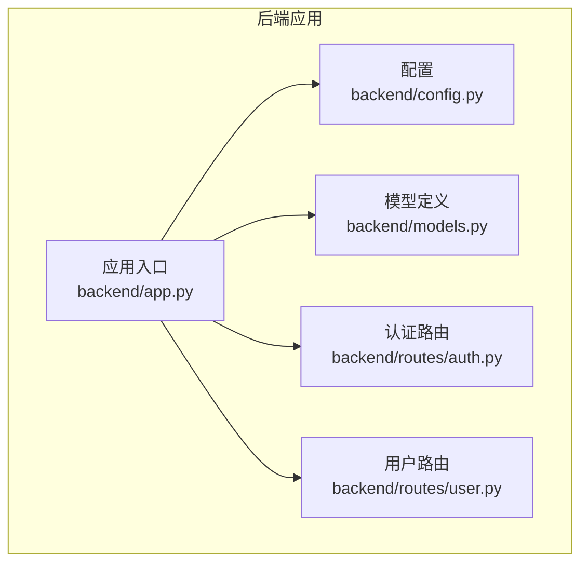
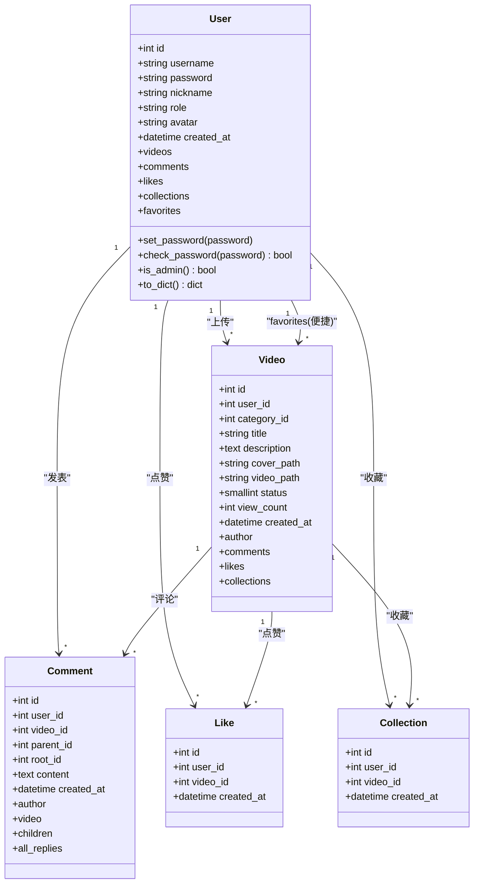
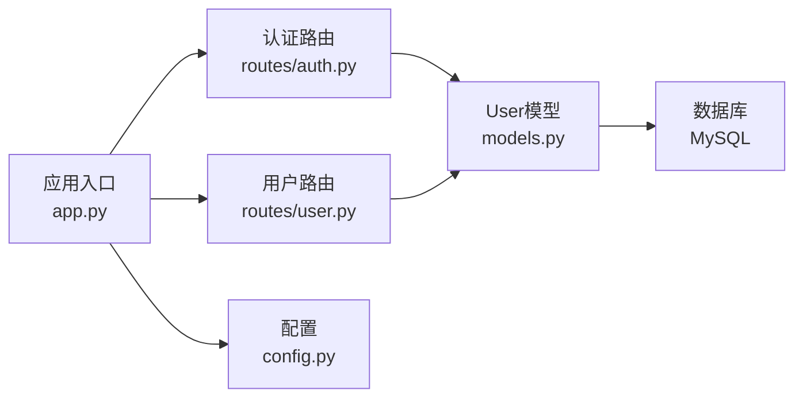
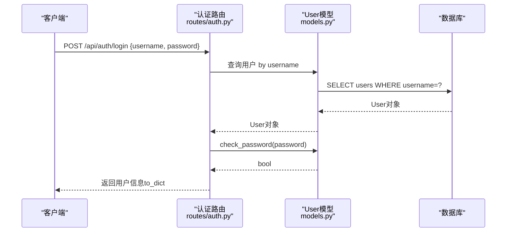

# 用户模型

<cite>
**本文引用的文件**
- [backend/models.py](file://backend/models.py)
- [univideo_db.sql](file://univideo_db.sql)
- [backend/routes/auth.py](file://backend/routes/auth.py)
- [backend/routes/user.py](file://backend/routes/user.py)
- [backend/app.py](file://backend/app.py)
- [backend/config.py](file://backend/config.py)
</cite>

## 目录
1. [简介](#简介)
2. [项目结构](#项目结构)
3. [核心组件](#核心组件)
4. [架构总览](#架构总览)
5. [详细组件分析](#详细组件分析)
6. [依赖分析](#依赖分析)
7. [性能考虑](#性能考虑)
8. [故障排查指南](#故障排查指南)
9. [结论](#结论)
10. [附录](#附录)

## 简介
本文件围绕后端模型层中的用户模型（User）展开，系统性阐述其字段定义、数据类型、约束与索引策略；解释密码字段的安全哈希机制；说明角色字段在权限控制中的作用；梳理ORM关系映射及便捷关系；给出API序列化输出示例并与数据库脚本保持一致；最后说明外键级联删除在数据完整性中的意义。

## 项目结构
- 用户模型位于后端模型文件中，采用SQLAlchemy ORM映射数据库users表。
- 蓝图路由模块提供用户相关的API接口，包括注册、登录、个人资料修改、我的视频、我的收藏等。
- 应用入口负责初始化Flask应用、注册蓝图、数据库连接与CORS配置。
- 配置文件提供数据库连接、上传目录、文件类型限制等基础配置。

图表来源
- [backend/app.py](file://backend/app.py#L1-L60)
- [backend/config.py](file://backend/config.py#L1-L66)
- [backend/models.py](file://backend/models.py#L1-L82)
- [backend/routes/auth.py](file://backend/routes/auth.py#L1-L87)
- [backend/routes/user.py](file://backend/routes/user.py#L1-L60)

章节来源
- [backend/app.py](file://backend/app.py#L1-L60)
- [backend/config.py](file://backend/config.py#L1-L66)

## 核心组件
- 用户模型（User）：承载用户基本信息与认证数据，提供密码哈希、校验、管理员判断与API序列化方法。
- 数据库users表：严格对应模型字段与约束，包含唯一性、非空、默认值与索引。
- 权限控制：通过role字段区分普通用户与管理员。
- 安全机制：密码字段使用哈希加密，避免明文存储。
- ORM关系：用户与视频、评论、点赞、收藏之间的双向关联与便捷关系。

章节来源
- [backend/models.py](file://backend/models.py#L14-L82)
- [univideo_db.sql](file://univideo_db.sql#L6-L14)

## 架构总览
用户模型在系统中的位置与交互如下：

图表来源
- [backend/models.py](file://backend/models.py#L14-L82)
- [backend/models.py](file://backend/models.py#L113-L198)
- [backend/models.py](file://backend/models.py#L200-L271)
- [backend/models.py](file://backend/models.py#L273-L343)

## 详细组件分析

### 字段定义、数据类型、约束与索引
- 字段与类型
  - id：整型，主键，自增。
  - username：字符串，最大长度50，唯一且非空，建立索引。
  - password：字符串，最大长度255，非空，存储哈希值。
  - nickname：字符串，最大长度50，非空。
  - role：字符串，最大长度20，非空，默认“user”。
  - avatar：字符串，最大长度255，默认空字符串。
  - created_at：日期时间，默认当前UTC时间。
- 约束与索引
  - 唯一性：username唯一。
  - 非空：username、password、nickname。
  - 默认值：role默认“user”，avatar默认空字符串，created_at默认当前时间。
  - 索引：username建立索引，便于按用户名检索。
- 与数据库脚本一致性
  - users表结构与模型字段一一对应，包含唯一性、非空、默认值与注释，与SQL脚本一致。

章节来源
- [backend/models.py](file://backend/models.py#L21-L30)
- [univideo_db.sql](file://univideo_db.sql#L6-L14)

### 密码哈希安全机制
- 存储策略
  - 注册与更新密码时，调用模型方法将明文密码转换为哈希值后存入password字段。
- 校验策略
  - 登录时使用校验方法比对输入密码与存储哈希值，成功则放行。
- 安全性
  - 避免明文存储，降低泄露风险；哈希算法由框架提供，具备抗碰撞能力。

章节来源
- [backend/models.py](file://backend/models.py#L42-L59)
- [backend/routes/auth.py](file://backend/routes/auth.py#L56-L68)
- [backend/routes/auth.py](file://backend/routes/auth.py#L110-L126)

### 角色字段与权限控制逻辑
- 角色字段
  - role字段取值“user”或“admin”，默认“user”。
- 权限判定
  - 提供is_admin方法判断是否为管理员。
- 实际用途
  - 在认证路由中默认分配普通用户角色；在管理相关功能中可用于权限校验（例如管理员审核流程）。

章节来源
- [backend/models.py](file://backend/models.py#L27-L29)
- [backend/models.py](file://backend/models.py#L60-L67)
- [backend/routes/auth.py](file://backend/routes/auth.py#L60-L61)

### ORM关系映射与便捷关系
- 一对多关系
  - 用户与视频：一个用户可上传多个视频；外键user_id指向users.id，ON DELETE CASCADE。
  - 用户与评论：一个用户可发表多条评论；外键user_id指向users.id，ON DELETE CASCADE。
  - 用户与点赞：一个用户可点赞多个视频；外键user_id指向users.id，ON DELETE CASCADE。
  - 用户与收藏：一个用户可收藏多个视频；外键user_id指向users.id，ON DELETE CASCADE。
- 便捷关系
  - favorites：通过collections中间表便捷访问用户收藏的视频集合，无需显式遍历收藏记录。
- 级联删除
  - 所有上述外键均设置ON DELETE CASCADE，确保当用户被删除时，其产生的视频、评论、点赞、收藏记录也会被级联清理，保证数据一致性。

章节来源
- [backend/models.py](file://backend/models.py#L31-L41)
- [backend/models.py](file://backend/models.py#L138-L142)
- [backend/models.py](file://backend/models.py#L216-L226)
- [backend/models.py](file://backend/models.py#L284-L292)
- [backend/models.py](file://backend/models.py#L320-L328)
- [univideo_db.sql](file://univideo_db.sql#L35-L38)
- [univideo_db.sql](file://univideo_db.sql#L49-L54)
- [univideo_db.sql](file://univideo_db.sql#L63-L65)
- [univideo_db.sql](file://univideo_db.sql#L73-L75)

### API序列化输出示例（to_dict）
- 输出字段
  - id、username、nickname、role、avatar、created_at（ISO格式字符串或None）。
- 使用场景
  - 认证路由返回登录成功信息时，使用to_dict输出用户简要信息。
  - 用户路由获取当前用户详情时，使用to_dict输出完整用户信息。
- 与数据库一致性
  - 字段与users表结构一致，便于前后端对接。

章节来源
- [backend/models.py](file://backend/models.py#L68-L79)
- [backend/routes/auth.py](file://backend/routes/auth.py#L127-L138)
- [backend/routes/user.py](file://backend/routes/user.py#L56-L60)

### 级联删除（ON DELETE CASCADE）的作用
- 数据完整性
  - 当删除用户时，与其相关的视频、评论、点赞、收藏记录会自动删除，避免孤儿数据。
- 业务一致性
  - 清理用户产生的所有内容，防止后续统计与展示出现悬挂引用。
- 外键约束
  - users表与其他表的外键均设置ON DELETE CASCADE，确保跨表一致性。

章节来源
- [univideo_db.sql](file://univideo_db.sql#L35-L38)
- [univideo_db.sql](file://univideo_db.sql#L49-L54)
- [univideo_db.sql](file://univideo_db.sql#L63-L65)
- [univideo_db.sql](file://univideo_db.sql#L73-L75)
- [backend/models.py](file://backend/models.py#L138-L142)
- [backend/models.py](file://backend/models.py#L216-L226)
- [backend/models.py](file://backend/models.py#L284-L292)
- [backend/models.py](file://backend/models.py#L320-L328)

## 依赖分析
- 组件耦合
  - User模型依赖SQLAlchemy ORM与安全工具；被认证与用户路由模块广泛使用。
  - 路由模块通过User模型执行查询、更新与序列化。
- 外部依赖
  - 数据库：MySQL，连接信息来自配置文件。
  - 文件上传：静态资源目录与扩展名白名单由配置文件定义。
- 潜在循环依赖
  - 模型与路由通过蓝图解耦，无直接循环导入。

图表来源
- [backend/routes/auth.py](file://backend/routes/auth.py#L1-L87)
- [backend/routes/user.py](file://backend/routes/user.py#L1-L60)
- [backend/models.py](file://backend/models.py#L14-L82)
- [backend/app.py](file://backend/app.py#L39-L58)
- [backend/config.py](file://backend/config.py#L19-L30)

章节来源
- [backend/app.py](file://backend/app.py#L39-L58)
- [backend/config.py](file://backend/config.py#L19-L30)

## 性能考虑
- 索引策略
  - users表的username字段建立索引，有利于按用户名快速查找。
  - videos表的status字段建立索引，有助于审核查询优化。
- 查询优化
  - 使用relationship懒加载（lazy='dynamic'）减少不必要的关联查询开销。
  - 通过favorites便捷关系直接访问收藏视频，避免多次中间表查询。
- 存储与传输
  - 密码字段使用哈希存储，避免明文传输与存储带来的安全与性能问题。
  - created_at统一使用UTC时间，便于跨时区展示与排序。

章节来源
- [univideo_db.sql](file://univideo_db.sql#L14-L14)
- [univideo_db.sql](file://univideo_db.sql#L37-L38)
- [backend/models.py](file://backend/models.py#L24-L30)
- [backend/models.py](file://backend/models.py#L31-L41)

## 故障排查指南
- 注册失败：用户名已存在
  - 现象：返回冲突状态码与提示。
  - 处理：更换用户名后重试。
- 登录失败：用户名或密码错误
  - 现象：返回未授权状态码与提示。
  - 处理：确认用户名与密码大小写与长度要求。
- 更新资料失败：密码长度不足或昵称长度不在范围内
  - 现象：返回参数错误状态码与提示。
  - 处理：满足最小长度要求后重试。
- 头像上传失败：文件类型不支持
  - 现象：返回参数错误状态码与提示。
  - 处理：使用允许的扩展名（png、jpg、jpeg、gif、webp）。
- 服务器错误
  - 现象：返回内部错误状态码与异常信息。
  - 处理：查看后端日志定位具体异常并修复。

章节来源
- [backend/routes/auth.py](file://backend/routes/auth.py#L48-L55)
- [backend/routes/auth.py](file://backend/routes/auth.py#L110-L126)
- [backend/routes/user.py](file://backend/routes/user.py#L98-L118)
- [backend/routes/user.py](file://backend/routes/user.py#L120-L144)

## 结论
用户模型在本项目中实现了清晰的字段定义、严格的约束与索引策略，采用哈希加密保障密码安全，并通过role字段实现基础权限控制。ORM关系映射完整覆盖用户与视频、评论、点赞、收藏的业务关联，同时提供favorites便捷关系提升查询效率。to_dict方法为API序列化提供了统一输出格式，与数据库users表结构保持一致。外键级联删除确保了数据完整性与业务一致性。整体设计兼顾安全性、可维护性与性能。

## 附录

### 字段与约束对照表（users表）
- 字段
  - id：主键，整型，自增。
  - username：字符串，唯一且非空，索引。
  - password：字符串，非空。
  - nickname：字符串，非空。
  - role：字符串，默认“user”，非空。
  - avatar：字符串，默认空字符串。
  - created_at：日期时间，默认当前时间。
- 约束
  - 唯一性：username。
  - 非空：username、password、nickname。
  - 默认值：role、avatar、created_at。
- 索引
  - username：索引。

章节来源
- [univideo_db.sql](file://univideo_db.sql#L6-L14)
- [backend/models.py](file://backend/models.py#L21-L30)

### API调用时序（登录）

图表来源
- [backend/routes/auth.py](file://backend/routes/auth.py#L89-L139)
- [backend/models.py](file://backend/models.py#L42-L59)
- [backend/models.py](file://backend/models.py#L68-L79)