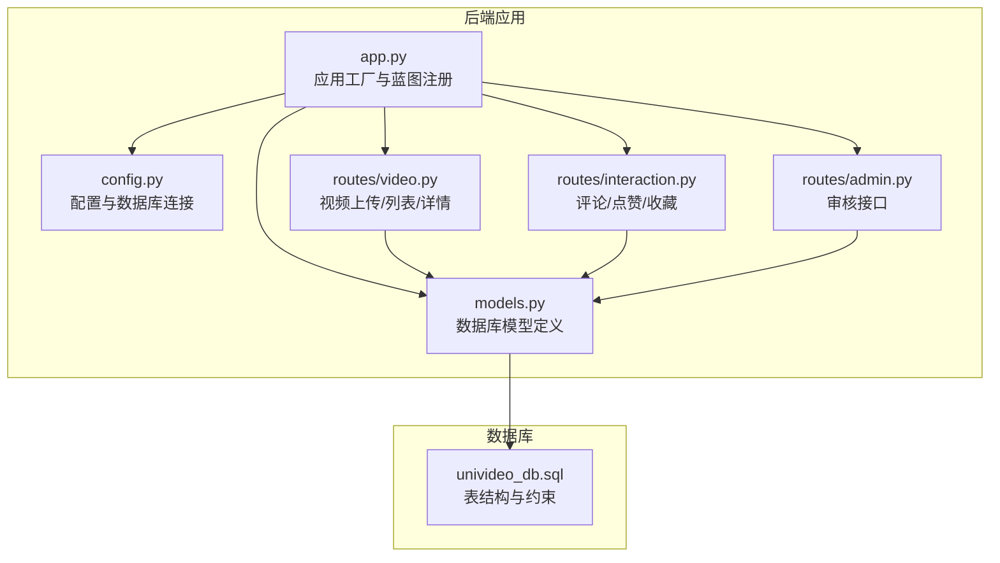
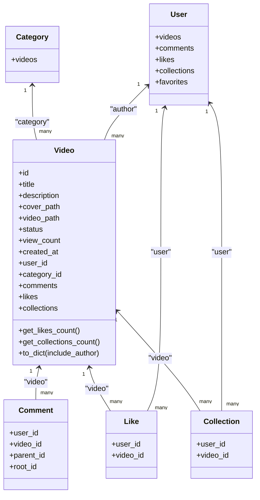
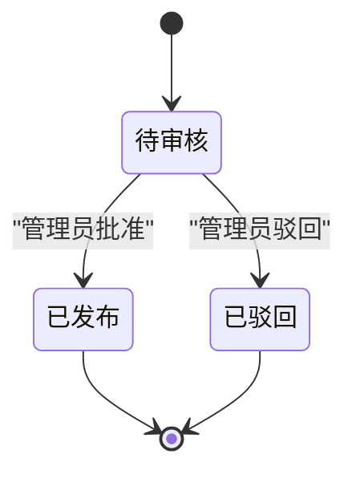
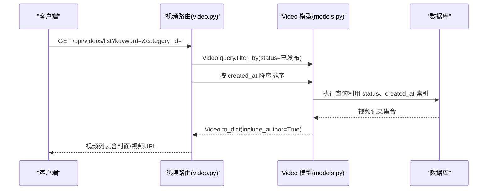
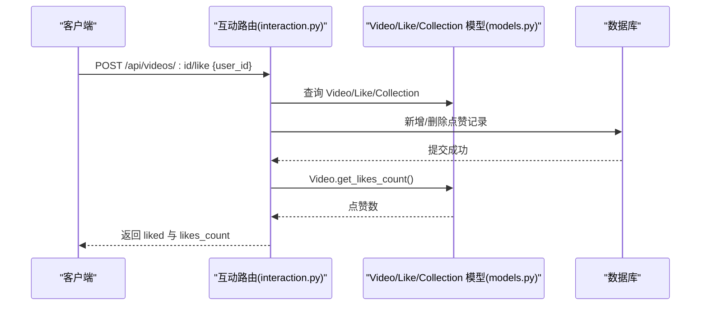
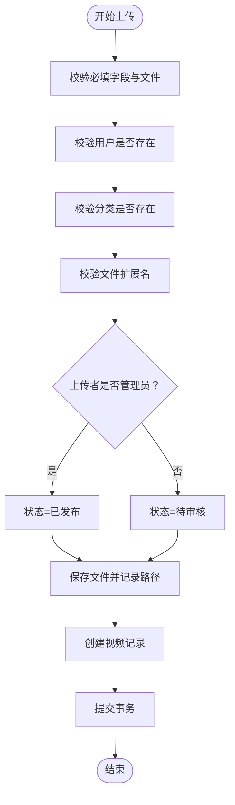
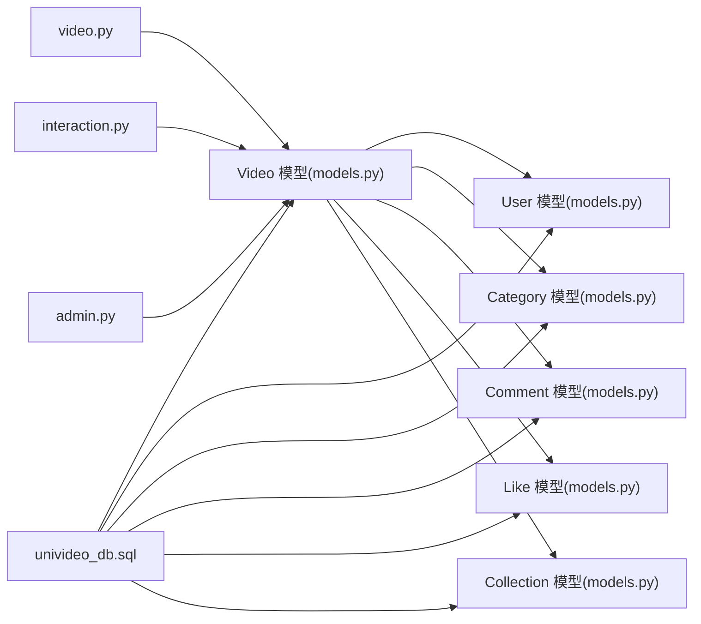

# 视频模型

<cite>
**本文引用的文件**
- [models.py](file://backend/models.py)
- [univideo_db.sql](file://univideo_db.sql)
- [video.py](file://backend/routes/video.py)
- [interaction.py](file://backend/routes/interaction.py)
- [admin.py](file://backend/routes/admin.py)
- [app.py](file://backend/app.py)
- [config.py](file://backend/config.py)
</cite>

## 目录
1. [简介](#简介)
2. [项目结构](#项目结构)
3. [核心组件](#核心组件)
4. [架构总览](#架构总览)
5. [详细组件分析](#详细组件分析)
6. [依赖分析](#依赖分析)
7. [性能考虑](#性能考虑)
8. [故障排查指南](#故障排查指南)
9. [结论](#结论)

## 简介
本文件围绕视频模型（Video）进行深入解析，覆盖其核心字段（title、description、cover_path、video_path、status、view_count、created_at）的业务含义与取值约束；重点阐述“先审后发”的审核机制，包括状态机设计（待审核、已发布、已驳回）与管理员审核流程；说明外键 user_id 与 category_id 的关联关系；解释 created_at 与 status 上的索引在查询优化中的作用；梳理 ORM 关系：一个视频可拥有多条评论、被多个用户点赞与收藏；详解 get_likes_count() 与 get_collections_count() 的统计逻辑；说明 to_dict() 方法中 include_author 参数的使用场景；最后结合 videos 表的 SQL 定义验证外键约束与索引配置。

## 项目结构
后端采用 Flask + SQLAlchemy 架构，模型定义位于 models.py，数据库初始化与迁移由 app.py 与 config.py 配合完成；视频相关的路由集中在 routes/video.py，互动（评论、点赞、收藏）集中在 routes/interaction.py，管理员审核集中在 routes/admin.py；数据库结构定义于 univideo_db.sql。

图表来源
- [app.py](file://backend/app.py#L1-L101)
- [config.py](file://backend/config.py#L1-L66)
- [models.py](file://backend/models.py#L1-L343)
- [univideo_db.sql](file://univideo_db.sql#L1-L76)
- [video.py](file://backend/routes/video.py#L1-L282)
- [interaction.py](file://backend/routes/interaction.py#L1-L408)
- [admin.py](file://backend/routes/admin.py#L60-L172)

章节来源
- [app.py](file://backend/app.py#L1-L101)
- [config.py](file://backend/config.py#L1-L66)
- [models.py](file://backend/models.py#L1-L343)
- [univideo_db.sql](file://univideo_db.sql#L1-L76)

## 核心组件
- 视频模型 Video：承载视频元数据与审核状态，维护与用户、分类、评论、点赞、收藏的关系。
- 审核状态常量：STATUS_PENDING（待审核）、STATUS_PUBLISHED（已发布）、STATUS_REJECTED（已驳回），支撑“先审后发”机制。
- 统计方法：get_likes_count()、get_collections_count() 基于 ORM 关系计数。
- 序列化方法：to_dict(include_author) 控制是否包含作者信息与分类信息。
- 外键与索引：user_id、category_id 外键约束；status、created_at 索引用于查询优化。

章节来源
- [models.py](file://backend/models.py#L113-L198)

## 架构总览
视频模型在 ORM 层与数据库层一一对应，状态机贯穿上传、审核与展示流程；前端通过路由调用后端接口，后端通过模型执行数据读写与统计。

图表来源
- [models.py](file://backend/models.py#L14-L198)

## 详细组件分析

### Video 模型字段与业务含义
- id：视频主键，自增。
- title：视频标题，非空。
- description：视频简介，可空。
- cover_path：封面图片路径，非空。
- video_path：视频文件路径，非空。
- status：视频状态，0=待审核、1=已发布、2=已驳回。
- view_count：播放量，默认0。
- created_at：上传时间，默认当前时间，用于排序与归档。
- user_id：外键，关联用户表，ON DELETE CASCADE。
- category_id：外键，关联分类表。

章节来源
- [models.py](file://backend/models.py#L113-L198)
- [univideo_db.sql](file://univideo_db.sql#L23-L38)

### 审核状态机与“先审后发”
- 上传决策：当上传者为管理员时，状态直接设为已发布；否则为待审核。
- 列表过滤：仅展示状态为已发布的视频。
- 审核流程：管理员对待审核视频进行批准（设为已发布）或驳回（设为已驳回）。
- 权限控制：详情页对未发布的视频可预留权限校验（当前代码为 TODO，仅在注释中标明）。

图表来源
- [video.py](file://backend/routes/video.py#L129-L147)
- [video.py](file://backend/routes/video.py#L173-L214)
- [admin.py](file://backend/routes/admin.py#L60-L172)

章节来源
- [video.py](file://backend/routes/video.py#L129-L147)
- [video.py](file://backend/routes/video.py#L173-L214)
- [admin.py](file://backend/routes/admin.py#L60-L172)

### 外键关联与索引优化
- 外键约束：
  - videos.user_id 引用 users.id，ON DELETE CASCADE。
  - videos.category_id 引用 categories.id。
- 索引配置：
  - videos.status 上建立索引，加速审核列表与状态筛选。
  - videos.created_at 上建立索引，加速按时间排序与分页。
- 评论表 comments 建有联合索引 idx_video_root(video_id, root_id)，优化楼层聚合查询。

章节来源
- [univideo_db.sql](file://univideo_db.sql#L23-L38)
- [univideo_db.sql](file://univideo_db.sql#L40-L54)
- [models.py](file://backend/models.py#L113-L198)

### ORM 关系与统计逻辑
- 一对多关系：
  - Video.author ←→ User.videos
  - Video.category ←→ Category.videos
  - Video.comments ←→ Comment.video
  - Video.likes ←→ Like.video
  - Video.collections ←→ Collection.video
- 统计方法：
  - get_likes_count()：基于 Video.likes 的 count() 统计点赞数。
  - get_collections_count()：基于 Video.collections 的 count() 统计收藏数。
- 序列化 to_dict(include_author)：
  - 默认包含基础字段与统计字段。
  - include_author=True 时附加作者信息（id、username、nickname、avatar）。
  - 若存在分类，附加分类信息（id、name）。

图表来源
- [video.py](file://backend/routes/video.py#L173-L214)
- [models.py](file://backend/models.py#L113-L198)
- [univideo_db.sql](file://univideo_db.sql#L23-L38)

章节来源
- [models.py](file://backend/models.py#L113-L198)
- [video.py](file://backend/routes/video.py#L173-L214)

### 互动关系与统计联动
- 点赞/收藏接口：
  - 交互路由对 Like、Collection 进行新增/删除，Video 通过 get_likes_count()/get_collections_count() 获取最新计数。
- 评论树形结构：
  - 评论表支持父子评论与根评论聚合，联合索引 idx_video_root(video_id, root_id) 提升查询效率。

图表来源
- [interaction.py](file://backend/routes/interaction.py#L329-L408)
- [models.py](file://backend/models.py#L113-L198)

章节来源
- [interaction.py](file://backend/routes/interaction.py#L114-L193)
- [interaction.py](file://backend/routes/interaction.py#L329-L408)
- [models.py](file://backend/models.py#L113-L198)

### 上传流程与状态决策
- 上传接口接收 user_id、title、description、category_id、video_file、cover_file。
- 校验用户与分类存在性、文件类型与非空。
- 根据上传者角色决定初始状态：管理员直接发布，普通用户进入待审核。
- 成功后返回视频状态与是否管理员提示。

图表来源
- [video.py](file://backend/routes/video.py#L37-L171)
- [models.py](file://backend/models.py#L113-L198)

章节来源
- [video.py](file://backend/routes/video.py#L37-L171)

## 依赖分析
- Video 依赖 User、Category、Comment、Like、Collection 的 ORM 关系。
- 路由层依赖 Video 模型进行数据读写与统计。
- 数据库层由 univideo_db.sql 定义外键与索引，保证数据一致性与查询性能。

图表来源
- [models.py](file://backend/models.py#L14-L198)
- [video.py](file://backend/routes/video.py#L1-L282)
- [interaction.py](file://backend/routes/interaction.py#L1-L408)
- [admin.py](file://backend/routes/admin.py#L60-L172)
- [univideo_db.sql](file://univideo_db.sql#L1-L76)

章节来源
- [models.py](file://backend/models.py#L14-L198)
- [univideo_db.sql](file://univideo_db.sql#L1-L76)

## 性能考虑
- 索引策略：
  - videos.status：加速审核列表与状态筛选。
  - videos.created_at：加速按上传时间排序与分页。
  - comments.idx_video_root：加速楼层聚合查询。
- 统计方法：
  - get_likes_count()/get_collections_count() 使用 count()，避免一次性加载大量中间对象，降低内存占用。
- 查询优化建议：
  - 列表接口已按 created_at 降序排序，配合 created_at 索引可提升性能。
  - 审核列表按 created_at 升序排列，配合 status 索引可提升待审核队列处理效率。

章节来源
- [univideo_db.sql](file://univideo_db.sql#L23-L38)
- [univideo_db.sql](file://univideo_db.sql#L40-L54)
- [models.py](file://backend/models.py#L113-L198)
- [video.py](file://backend/routes/video.py#L173-L214)

## 故障排查指南
- 上传失败：
  - 检查必填字段与文件类型是否符合配置。
  - 确认用户与分类存在性。
- 审核异常：
  - 确认视频状态为待审核，避免重复审核。
  - 管理员操作后检查数据库状态变更。
- 列表与详情：
  - 列表仅展示已发布视频，确认 status=1。
  - 详情页播放量自增逻辑正常，注意权限校验（TODO）。
- 互动异常：
  - 点赞/收藏接口需唯一性约束，避免重复记录。
  - 统计值以数据库为准，若不一致检查事务提交与并发问题。

章节来源
- [video.py](file://backend/routes/video.py#L37-L171)
- [admin.py](file://backend/routes/admin.py#L60-L172)
- [interaction.py](file://backend/routes/interaction.py#L114-L193)
- [interaction.py](file://backend/routes/interaction.py#L329-L408)

## 结论
Video 模型通过明确的字段语义、严谨的外键与索引配置、清晰的审核状态机与完善的 ORM 关系，有效支撑了“先审后发”的核心业务流程。统计方法与序列化接口兼顾性能与可读性，配合路由层的查询与权限控制，形成完整的视频管理闭环。后续可在详情页完善权限校验与缓存策略，进一步提升用户体验与系统稳定性。