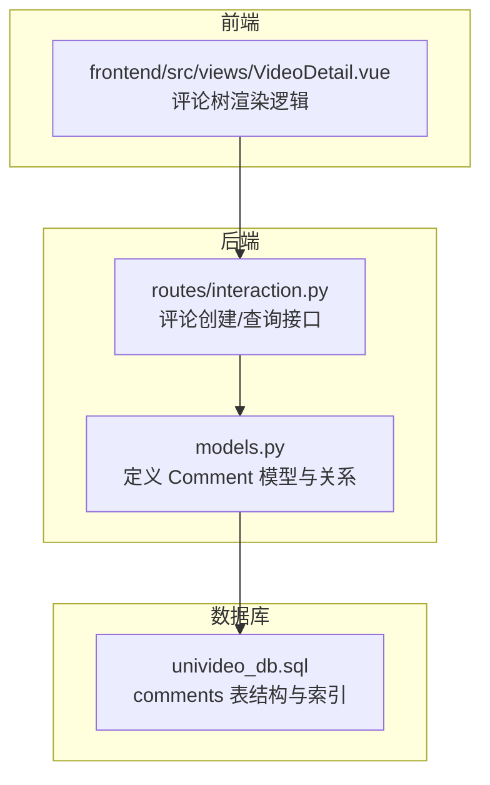
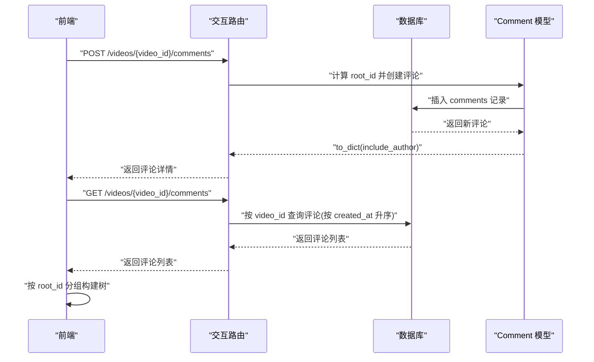
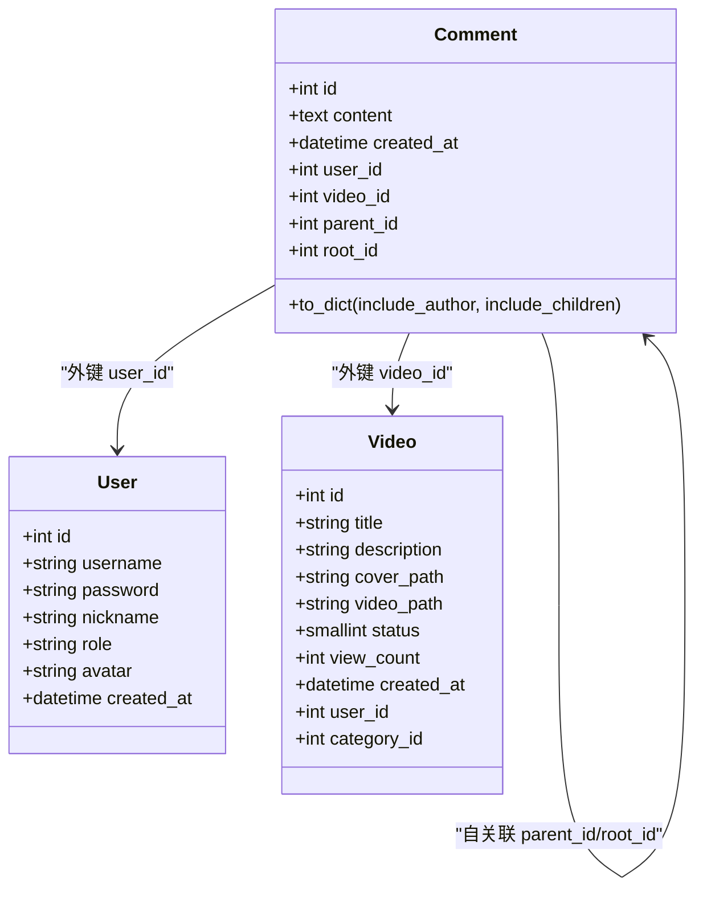
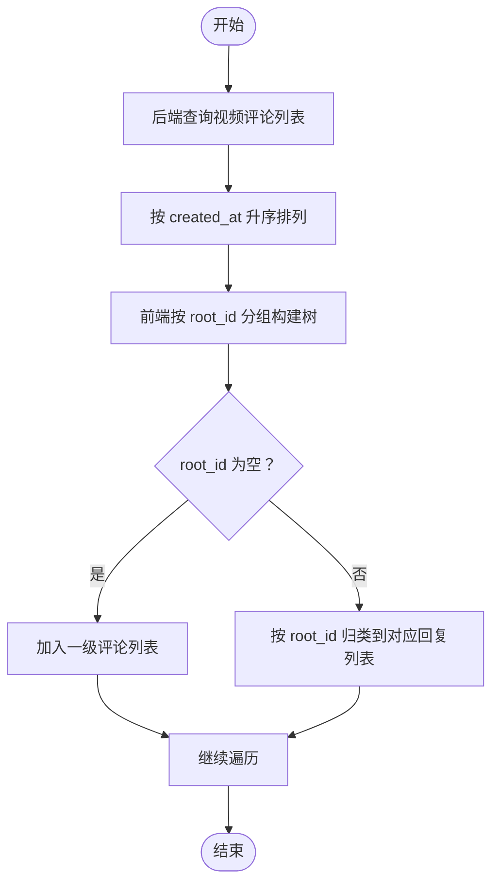

# 评论模型

<cite>
**本文引用的文件**
- [models.py](file://backend/models.py)
- [univideo_db.sql](file://univideo_db.sql)
- [interaction.py](file://backend/routes/interaction.py)
- [VideoDetail.vue](file://frontend/src/views/VideoDetail.vue)
- [软件设计说明书.md](file://文档/软件设计说明书.md)
</cite>

## 目录
1. [简介](#简介)
2. [项目结构](#项目结构)
3. [核心组件](#核心组件)
4. [架构总览](#架构总览)
5. [详细组件分析](#详细组件分析)
6. [依赖分析](#依赖分析)
7. [性能考量](#性能考量)
8. [故障排查指南](#故障排查指南)
9. [结论](#结论)
10. [附录](#附录)

## 简介
本文件围绕评论模型的多级评论架构进行系统化解析，重点阐述以下方面：
- 基础字段 content、created_at 的用途与语义
- parent_id 与 root_id 双自关联字段的设计理念：前者用于直接父子层级关系，后者用于快速聚合“同一楼层”的所有回复
- idx_video_root 联合索引在“某视频下某评论串所有回复”查询中的性能优化作用
- ORM 关系属性 parent、children、root、all_replies 的映射逻辑及其在构建评论树时的应用
- to_dict() 方法中 include_children 递归序列化的使用方式
- comments 表的外键约束与索引结构如何保障数据一致性与完整性

## 项目结构
评论模型位于后端模型层，配合交互路由完成评论的创建与查询；前端视图负责将评论列表转换为树形结构展示。

图表来源
- [models.py](file://backend/models.py#L200-L271)
- [interaction.py](file://backend/routes/interaction.py#L1-L112)
- [univideo_db.sql](file://univideo_db.sql#L40-L55)
- [VideoDetail.vue](file://frontend/src/views/VideoDetail.vue#L74-L104)

章节来源
- [models.py](file://backend/models.py#L200-L271)
- [univideo_db.sql](file://univideo_db.sql#L40-L55)
- [interaction.py](file://backend/routes/interaction.py#L1-L112)
- [VideoDetail.vue](file://frontend/src/views/VideoDetail.vue#L74-L104)

## 核心组件
- 评论模型 Comment：支持多级评论的自关联结构，包含基础字段 content、created_at，以及 parent_id、root_id 两个自关联字段，配合 idx_video_root 联合索引实现高效查询。
- 评论路由 interaction：提供创建评论与查询评论列表的接口，其中创建评论时根据父评论计算 root_id。
- 前端视图 VideoDetail：将后端返回的扁平评论列表转换为树形结构，依据 root_id 进行分组挂载。

章节来源
- [models.py](file://backend/models.py#L200-L271)
- [interaction.py](file://backend/routes/interaction.py#L12-L111)
- [VideoDetail.vue](file://frontend/src/views/VideoDetail.vue#L74-L104)

## 架构总览
评论多级架构由“模型层-路由层-前端视图层”协同完成，数据流如下：
- 前端发起创建评论请求，携带 user_id、content、parent_id（可选）
- 后端校验视频与用户存在性，计算 root_id，写入数据库
- 前端发起查询评论列表，按 created_at 升序返回
- 前端将评论按 root_id 分组，形成树形结构

图表来源
- [interaction.py](file://backend/routes/interaction.py#L12-L111)
- [models.py](file://backend/models.py#L200-L271)
- [VideoDetail.vue](file://frontend/src/views/VideoDetail.vue#L74-L104)

## 详细组件分析

### Comment 模型与字段语义
- 基础字段
  - content：评论内容文本，非空
  - created_at：评论创建时间，默认当前时间
- 外键字段
  - user_id：评论者，关联 users 表，删除时级联
  - video_id：所属视频，关联 videos 表，删除时级联
- 自关联字段
  - parent_id：直接父评论 ID，自关联 comments 表，删除时级联
  - root_id：根评论 ID，自关联 comments 表，删除时级联
- 索引
  - idx_video_root(video_id, root_id)：联合索引，优化“某视频下某楼层的所有回复”查询

章节来源
- [models.py](file://backend/models.py#L200-L271)
- [univideo_db.sql](file://univideo_db.sql#L40-L55)

### parent_id 与 root_id 的设计理念
- parent_id：直接父子层级关系，用于表达“直接回复的对象”。当 parent_id 为某个评论的 id 时，表示当前评论是该评论的直接子评论。
- root_id：用于快速聚合“同一楼层”的所有回复。同一楼层的回复共享相同的 root_id，便于一次性查询该楼层的所有回复，避免逐层遍历带来的复杂度与性能问题。
- 层级关系
  - 一级评论：root_id 通常为自身 id（或空），parent_id 为空
  - 回复评论：root_id 继承自父评论的 root_id；parent_id 指向父评论

章节来源
- [models.py](file://backend/models.py#L200-L271)
- [interaction.py](file://backend/routes/interaction.py#L60-L85)

### idx_video_root 联合索引的作用
- 查询场景：在“某视频下某评论串所有回复”的场景中，联合索引 idx_video_root(video_id, root_id) 能够显著降低查询成本，避免全表扫描。
- 使用建议：查询时应同时包含 video_id 与 root_id，以命中该联合索引，从而提升性能。

章节来源
- [models.py](file://backend/models.py#L227-L230)
- [univideo_db.sql](file://univideo_db.sql#L53-L53)

### ORM 关系属性与评论树构建
- 关系映射
  - parent：访问当前评论的父评论；children：访问当前评论的所有直接子评论
  - root：访问当前评论的根评论；all_replies：访问根评论下的所有回复
- 评论树构建
  - 后端查询返回扁平列表，前端按 root_id 分组，将回复挂载到对应的一级评论下，形成树形结构
  - 该过程与 Comment 的 children/all_replies 关系相辅相成，便于在需要时进行深度序列化或树形遍历

章节来源
- [models.py](file://backend/models.py#L232-L241)
- [VideoDetail.vue](file://frontend/src/views/VideoDetail.vue#L74-L104)

### to_dict() 中 include_children 递归序列化
- include_children=True 时，to_dict() 会递归序列化当前评论的所有直接子评论，形成嵌套的 children 结构
- 使用场景：在需要一次性返回完整评论树时，可通过 include_children 控制序列化深度，减少多次查询的开销

章节来源
- [models.py](file://backend/models.py#L242-L268)

### 数据一致性与完整性保障
- 外键约束
  - comments.user_id 引用 users(id)，删除用户时级联删除其评论
  - comments.video_id 引用 videos(id)，删除视频时级联删除其评论
  - comments.parent_id 引用 comments(id)，删除父评论时级联删除其子评论
  - comments.root_id 引用 comments(id)，删除根评论时级联删除其所有回复
- 索引结构
  - idx_video_root(video_id, root_id)：加速“某视频下某楼层的所有回复”查询
- 业务约束
  - 创建评论时，若 parent_id 存在，需保证父评论属于同一视频，防止跨视频评论串

章节来源
- [univideo_db.sql](file://univideo_db.sql#L40-L55)
- [interaction.py](file://backend/routes/interaction.py#L60-L85)

## 依赖分析
- 模型依赖
  - Comment 依赖 User、Video（外键 user_id、video_id）
  - Comment 自关联 parent_id、root_id
- 路由依赖
  - 交互路由依赖 Comment、User、Video 模型
- 前端依赖
  - VideoDetail 视图依赖后端返回的评论列表，按 root_id 构建树

图表来源
- [models.py](file://backend/models.py#L200-L271)

章节来源
- [models.py](file://backend/models.py#L200-L271)

## 性能考量
- 索引命中：查询“某视频下某楼层的所有回复”时，确保查询条件包含 video_id 与 root_id，以命中 idx_video_root 联合索引
- 序列化深度控制：在需要完整树形结构时，使用 include_children=true，但注意避免过深的递归导致响应体积过大
- 批量查询：前端将扁平列表转换为树形结构，减少后端多次查询的往返次数

[本节为通用性能建议，无需特定文件引用]

## 故障排查指南
- 创建评论失败
  - 检查 user_id、video_id 是否存在且有效
  - 若 parent_id 存在，确认父评论属于同一视频
  - 确认 content 非空
- 查询评论异常
  - 确认 video_id 存在
  - 检查网络与数据库连接状态
- 树形结构不正确
  - 检查前端按 root_id 分组逻辑是否正确
  - 确认后端返回的评论列表顺序与字段是否符合预期

章节来源
- [interaction.py](file://backend/routes/interaction.py#L22-L111)
- [VideoDetail.vue](file://frontend/src/views/VideoDetail.vue#L74-L104)

## 结论
Comment 模型通过 parent_id 与 root_id 的双自关联设计，既满足了直接父子层级的表达，又通过 root_id 提供了高效的楼层聚合能力。配合 idx_video_root 联合索引与外键约束，系统在查询性能与数据完整性之间取得了良好平衡。前端通过 root_id 将扁平列表转换为树形结构，实现了直观的多级评论展示。

[本节为总结性内容，无需特定文件引用]

## 附录
- 评论树构建流程（概念示意）

[本图为概念流程图，不对应具体源码文件]