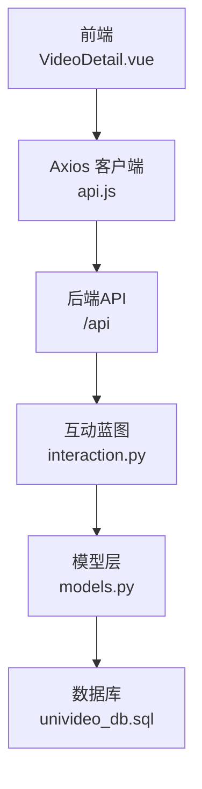
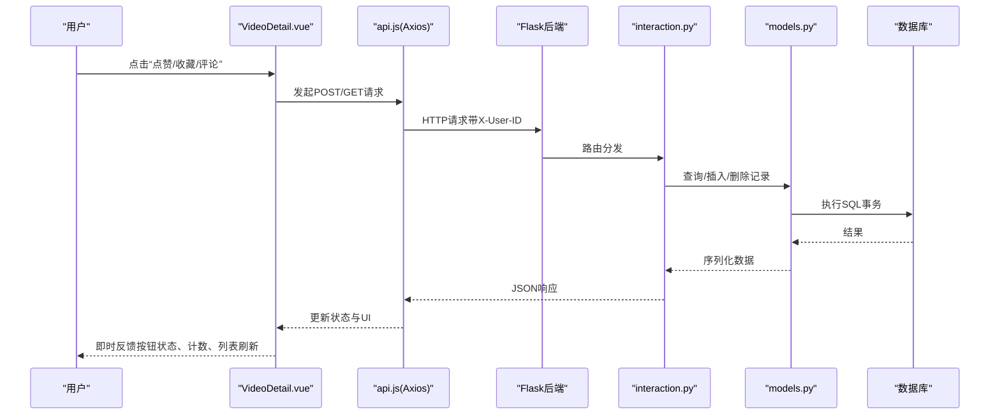
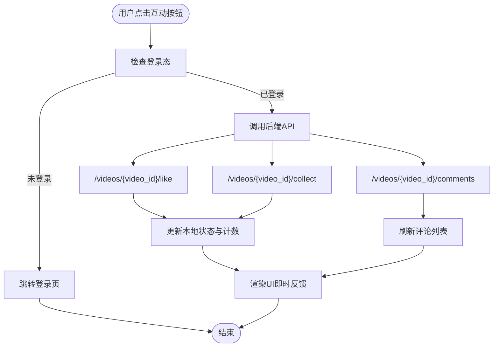
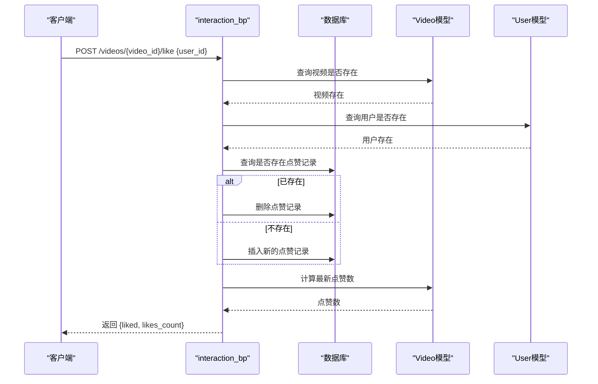
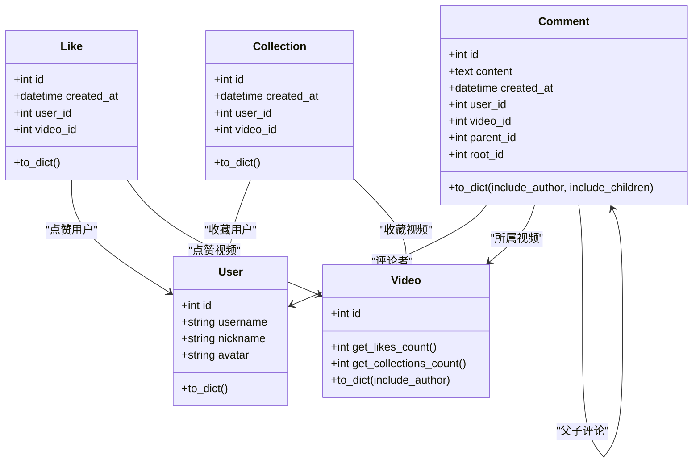
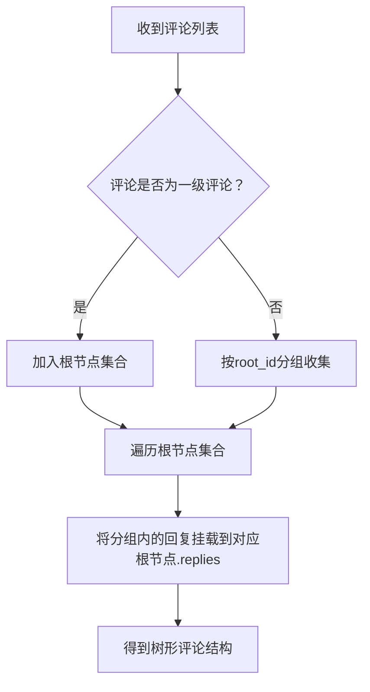
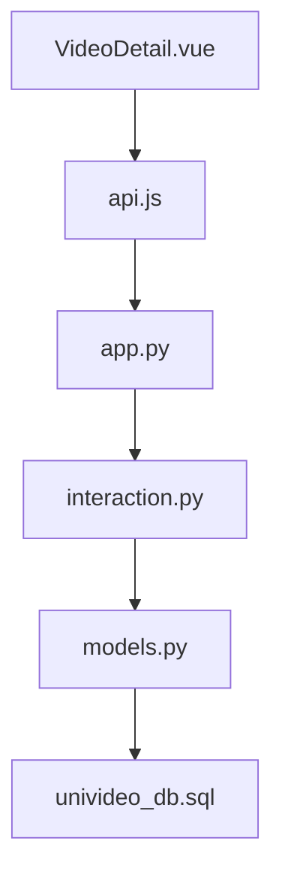

# 互动功能流程

<cite>
**本文引用的文件**
- [VideoDetail.vue](file://frontend/src/views/VideoDetail.vue)
- [api.js](file://frontend/src/api.js)
- [interaction.py](file://backend/routes/interaction.py)
- [models.py](file://backend/models.py)
- [univideo_db.sql](file://univideo_db.sql)
- [app.py](file://backend/app.py)
</cite>

## 目录
1. [引言](#引言)
2. [项目结构](#项目结构)
3. [核心组件](#核心组件)
4. [架构总览](#架构总览)
5. [详细组件分析](#详细组件分析)
6. [依赖分析](#依赖分析)
7. [性能考虑](#性能考虑)
8. [故障排查指南](#故障排查指南)
9. [结论](#结论)

## 引言
本文件围绕UniVideo平台的用户互动功能展开，重点解析VideoDetail.vue组件中的点赞、收藏、评论三大交互能力，从前端Axios调用到后端Flask蓝图处理，再到数据库模型与索引设计，系统性阐述互动行为的即时反馈、数据一致性保障、多级评论的嵌套结构处理，以及边界情况的应对策略（如重复点赞的幂等性、评论内容长度限制等），帮助读者理解社交功能背后的状态同步与用户体验优化技巧。

## 项目结构
- 前端位于 frontend/src/views/VideoDetail.vue，负责视频详情页的UI与交互，包括点赞、收藏、评论与回复。
- 前端通过 frontend/src/api.js 统一发起HTTP请求，基础地址指向后端Flask服务。
- 后端位于 backend/routes/interaction.py，提供评论、点赞、收藏相关API。
- 数据库模型位于 backend/models.py，定义了用户、视频、评论、点赞、收藏等实体及约束。
- 数据库初始化脚本位于 univideo_db.sql，描述表结构与索引。
- 后端应用入口 backend/app.py 注册蓝图，将互动路由挂载到 /api 前缀下。

图表来源
- [VideoDetail.vue](file://frontend/src/views/VideoDetail.vue#L181-L311)
- [api.js](file://frontend/src/api.js#L9-L15)
- [app.py](file://backend/app.py#L51-L53)
- [interaction.py](file://backend/routes/interaction.py#L12-L408)
- [models.py](file://backend/models.py#L200-L343)
- [univideo_db.sql](file://univideo_db.sql#L40-L76)

章节来源
- [VideoDetail.vue](file://frontend/src/views/VideoDetail.vue#L181-L311)
- [api.js](file://frontend/src/api.js#L9-L15)
- [app.py](file://backend/app.py#L51-L53)

## 核心组件
- 前端组件 VideoDetail.vue
  - 状态管理：视频数据、点赞/收藏状态与计数、评论列表与加载状态、回复输入状态。
  - 交互方法：获取视频详情、获取点赞/收藏状态、获取评论列表、点赞/收藏切换、提交主评论与回复。
  - UI即时反馈：按钮禁用态、loading态、计数更新、评论列表刷新。
- 前端Axios客户端 api.js
  - 统一设置baseURL、超时与Content-Type，请求拦截器透传用户ID到请求头。
- 后端蓝图 interaction.py
  - 提供 /videos/{video_id}/comments、/videos/{video_id}/like、/videos/{video_id}/collect、/videos/{video_id}/comments/status、/videos/{video_id}/like/status、/videos/{video_id}/collect/status 等接口。
  - 核心逻辑：状态切换（点赞/收藏）、评论树构建（root_id计算）、数据持久化与事务回滚。
- 数据库模型 models.py
  - 评论模型支持多级回复（parent_id、root_id），并建立联合索引以优化查询。
  - 点赞与收藏模型使用联合唯一约束，保证幂等性。
- 数据库脚本 univideo_db.sql
  - 定义评论、点赞、收藏三张表的结构与索引，支撑互动功能。

章节来源
- [VideoDetail.vue](file://frontend/src/views/VideoDetail.vue#L181-L311)
- [api.js](file://frontend/src/api.js#L9-L15)
- [interaction.py](file://backend/routes/interaction.py#L12-L408)
- [models.py](file://backend/models.py#L200-L343)
- [univideo_db.sql](file://univideo_db.sql#L40-L76)

## 架构总览
前端通过Axios向后端发送REST请求，后端蓝图根据路由分发到具体处理函数，模型层完成数据持久化与一致性校验，数据库层面通过索引与约束保障查询效率与数据完整性。

图表来源
- [VideoDetail.vue](file://frontend/src/views/VideoDetail.vue#L181-L311)
- [api.js](file://frontend/src/api.js#L9-L15)
- [interaction.py](file://backend/routes/interaction.py#L12-L408)
- [models.py](file://backend/models.py#L200-L343)
- [univideo_db.sql](file://univideo_db.sql#L40-L76)

## 详细组件分析

### 前端：VideoDetail.vue 互动流程
- 点赞/收藏
  - 登录态校验：未登录时跳转登录页并中断操作。
  - 状态切换：调用后端 /videos/{video_id}/like 与 /videos/{video_id}/collect，接收后端返回的liked/collected与计数，立即更新本地状态并渲染。
  - 即时反馈：按钮禁用与loading态，避免重复点击；计数实时更新。
- 评论与回复
  - 评论列表：首次进入页面拉取评论，按创建时间升序排列。
  - 评论树：前端将评论列表转换为树形结构，一级评论root_id为空，其余按root_id分组挂载。
  - 主评论：提交时校验内容非空，调用 /videos/{video_id}/comments，成功后刷新评论列表。
  - 回复：打开回复输入框，提交时携带parent_id，成功后刷新评论列表。
  - 边界处理：评论内容最大长度限制，输入为空时提示。

图表来源
- [VideoDetail.vue](file://frontend/src/views/VideoDetail.vue#L181-L311)

章节来源
- [VideoDetail.vue](file://frontend/src/views/VideoDetail.vue#L181-L311)

### 前端：Axios 客户端与请求拦截
- 基础配置：baseURL指向 http://localhost:5001/api，超时10秒，Content-Type为application/json。
- 请求拦截：自动从localStorage读取user_id，注入到请求头 X-User-ID，便于后端鉴权与业务逻辑使用。

章节来源
- [api.js](file://frontend/src/api.js#L9-L15)

### 后端：interaction.py 互动API
- 评论接口 /videos/{video_id}/comments
  - POST：接收user_id、content、parent_id（可选），校验视频与用户存在性，计算root_id（一级评论root_id=None；回复时继承父评论root_id或使用父评论id），创建评论并返回作者信息。
  - GET：按创建时间升序返回该视频全部评论，包含作者信息。
- 点赞接口 /videos/{video_id}/like
  - POST：根据user_id与video_id查询是否存在点赞记录，存在则删除，不存在则新增；返回最新liked状态与点赞计数。
- 收藏接口 /videos/{video_id}/collect
  - POST：根据user_id与video_id查询是否存在收藏记录，存在则删除，不存在则新增；返回最新collected状态与收藏计数。
- 状态查询接口
  - GET /videos/{video_id}/like/status：返回当前用户是否已点赞。
  - GET /videos/{video_id}/collect/status：返回当前用户是否已收藏。
  - GET /videos/{video_id}/comments：返回评论列表（包含作者信息）。

图表来源
- [interaction.py](file://backend/routes/interaction.py#L287-L408)
- [models.py](file://backend/models.py#L113-L198)

章节来源
- [interaction.py](file://backend/routes/interaction.py#L12-L408)
- [models.py](file://backend/models.py#L113-L198)

### 数据模型与索引：多级评论与幂等性
- 评论模型 Comment
  - 字段：content、user_id、video_id、parent_id、root_id、created_at。
  - 关系：parent/children（自关联）、root/all_replies（根评论聚合）。
  - 索引：idx_video_root(video_id, root_id)，用于快速查询某视频下某楼层的所有回复。
- 点赞模型 Like
  - 联合唯一约束(unique_like(user_id, video_id))，保证同一用户对同一视频只能点赞一次，天然实现幂等性。
- 收藏模型 Collection
  - 联合唯一约束(unique_collection(user_id, video_id))，保证同一用户对同一视频只能收藏一次，天然实现幂等性。
- 数据库脚本 univideo_db.sql
  - 定义了comments、likes、collections三张表的结构、外键与索引，支撑互动功能的高效查询与一致存储。

图表来源
- [models.py](file://backend/models.py#L200-L343)
- [univideo_db.sql](file://univideo_db.sql#L40-L76)

章节来源
- [models.py](file://backend/models.py#L200-L343)
- [univideo_db.sql](file://univideo_db.sql#L40-L76)

### 多级评论的嵌套结构处理
- 前端树形构建
  - 一级评论：root_id为空，作为根节点。
  - 回复评论：按root_id分组挂载到对应一级评论的replies数组中。
- 后端评论树形返回
  - 查询时按created_at升序返回，前端再组装为树形结构，便于渲染与交互。
- root_id计算规则
  - 一级评论：root_id=None。
  - 回复评论：若父评论root_id为空（即父评论为一级评论），则root_id=父评论id；否则root_id=父评论的root_id，确保整条对话串共享同一root_id，便于聚合与查询。

图表来源
- [VideoDetail.vue](file://frontend/src/views/VideoDetail.vue#L72-L104)
- [interaction.py](file://backend/routes/interaction.py#L12-L43)

章节来源
- [VideoDetail.vue](file://frontend/src/views/VideoDetail.vue#L72-L104)
- [interaction.py](file://backend/routes/interaction.py#L12-L43)

### 即时反馈与用户体验优化
- 按钮禁用与loading态：点赞/收藏/评论/回复过程中禁用按钮，避免重复提交。
- 计数实时更新：后端返回最新计数，前端立即更新，无需等待刷新。
- 列表刷新：评论提交后重新拉取评论列表，确保顺序与树形结构正确。
- 输入限制：评论与回复输入框设置maxlength，减少无效数据传输与存储压力。

章节来源
- [VideoDetail.vue](file://frontend/src/views/VideoDetail.vue#L181-L311)

### 数据一致性与事务回滚
- 后端在异常情况下统一执行db.session.rollback()，确保事务一致性。
- 点赞/收藏采用联合唯一约束，避免重复记录，天然实现幂等性。
- 评论root_id计算在单次请求内完成，保证评论树结构的正确性。

章节来源
- [interaction.py](file://backend/routes/interaction.py#L105-L112)
- [interaction.py](file://backend/routes/interaction.py#L186-L193)
- [interaction.py](file://backend/routes/interaction.py#L401-L408)
- [models.py](file://backend/models.py#L273-L343)

### 边界情况与安全策略
- 重复点赞/收藏：通过联合唯一约束保证幂等性，后端不再需要额外去重逻辑。
- 评论内容长度：前端设置maxlength，后端同样校验content非空，防止空内容入库。
- 父评论归属校验：回复时校验parent_id存在且属于同一视频，防止跨视频回复。
- 登录态校验：前端未登录时禁止互动操作；后端通过user_id与video_id存在性校验，避免越权与无效数据。

章节来源
- [VideoDetail.vue](file://frontend/src/views/VideoDetail.vue#L231-L311)
- [interaction.py](file://backend/routes/interaction.py#L12-L43)
- [interaction.py](file://backend/routes/interaction.py#L60-L85)

## 依赖分析
- 前端依赖
  - Vue响应式状态与生命周期：onMounted、ref、computed、watch等。
  - Axios：统一请求与拦截器。
- 后端依赖
  - Flask蓝图：将interaction路由注册到 /api 前缀。
  - SQLAlchemy：模型定义与数据库操作。
  - 数据库：通过索引与约束保障查询与一致性。
- 前后端耦合点
  - URL约定：/api/videos/{video_id}/like、/api/videos/{video_id}/collect、/api/videos/{video_id}/comments。
  - 请求体字段：user_id、content、parent_id。
  - 响应体结构：code、msg、data（包含liked、collected、likes_count、collections_count、评论树等）。

图表来源
- [VideoDetail.vue](file://frontend/src/views/VideoDetail.vue#L181-L311)
- [api.js](file://frontend/src/api.js#L9-L15)
- [app.py](file://backend/app.py#L51-L53)
- [interaction.py](file://backend/routes/interaction.py#L12-L408)
- [models.py](file://backend/models.py#L200-L343)
- [univideo_db.sql](file://univideo_db.sql#L40-L76)

章节来源
- [app.py](file://backend/app.py#L51-L53)
- [interaction.py](file://backend/routes/interaction.py#L12-L408)
- [models.py](file://backend/models.py#L200-L343)

## 性能考虑
- 查询优化
  - 评论表 idx_video_root(video_id, root_id) 索引，加速按楼层查询与树形构建。
  - 评论按created_at升序返回，前端再组装树形，避免复杂SQL聚合。
- 写入优化
  - 点赞/收藏采用联合唯一约束，避免重复写入与索引冲突。
  - 事务内批量提交，异常时回滚，保证一致性。
- 前端体验
  - 按钮禁用与loading态减少无效请求。
  - 列表局部刷新，避免全量重绘。

## 故障排查指南
- 常见错误与定位
  - 缺少必填字段：后端返回400，提示缺少user_id或content。
  - 视频/用户不存在：后端返回404，检查video_id与user_id是否有效。
  - 父评论不存在或跨视频：后端返回404或400，检查parent_id与video_id一致性。
  - 服务器错误：后端返回500，查看日志并确认数据库连接与事务回滚是否生效。
- 前端排查
  - 未登录：前端弹窗提示并跳转登录页。
  - 评论为空：前端阻止提交并提示输入内容。
  - 网络超时：Axios设置了10秒超时，检查后端健康状态与网络连通性。

章节来源
- [interaction.py](file://backend/routes/interaction.py#L27-L43)
- [interaction.py](file://backend/routes/interaction.py#L44-L77)
- [interaction.py](file://backend/routes/interaction.py#L105-L112)
- [api.js](file://frontend/src/api.js#L9-L15)

## 结论
UniVideo的互动功能通过前后端协同实现了高可用与良好的用户体验。前端以即时反馈为核心，后端以模型与索引为支撑，确保点赞/收藏的幂等性与评论树的正确性。通过统一的API约定与拦截器透传用户身份，系统在安全性与一致性方面具备坚实基础。建议后续可在评论内容审核、限流与缓存等方面进一步增强，以提升大规模场景下的稳定性与性能。