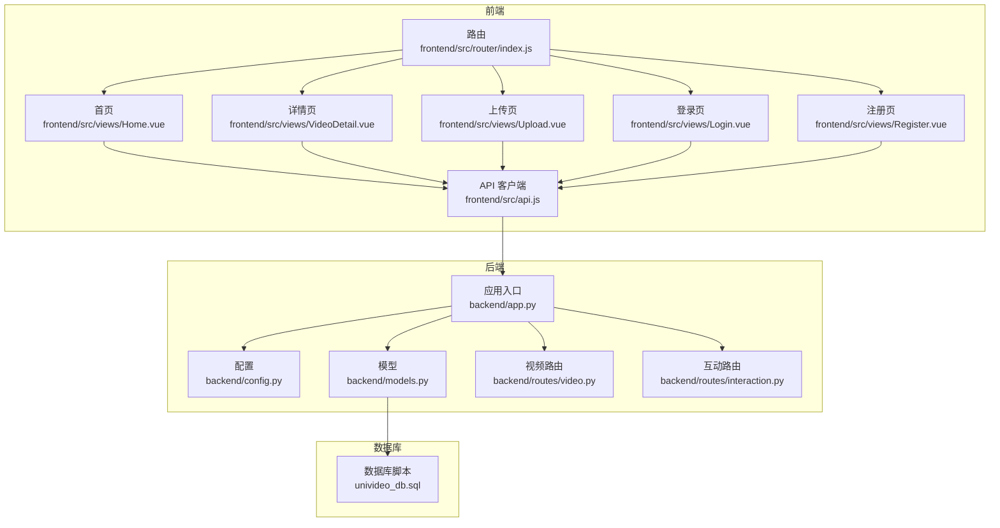
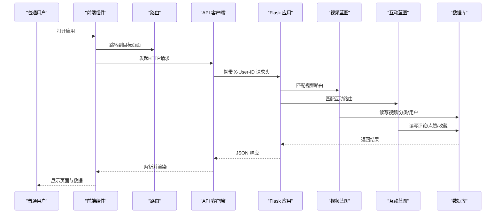
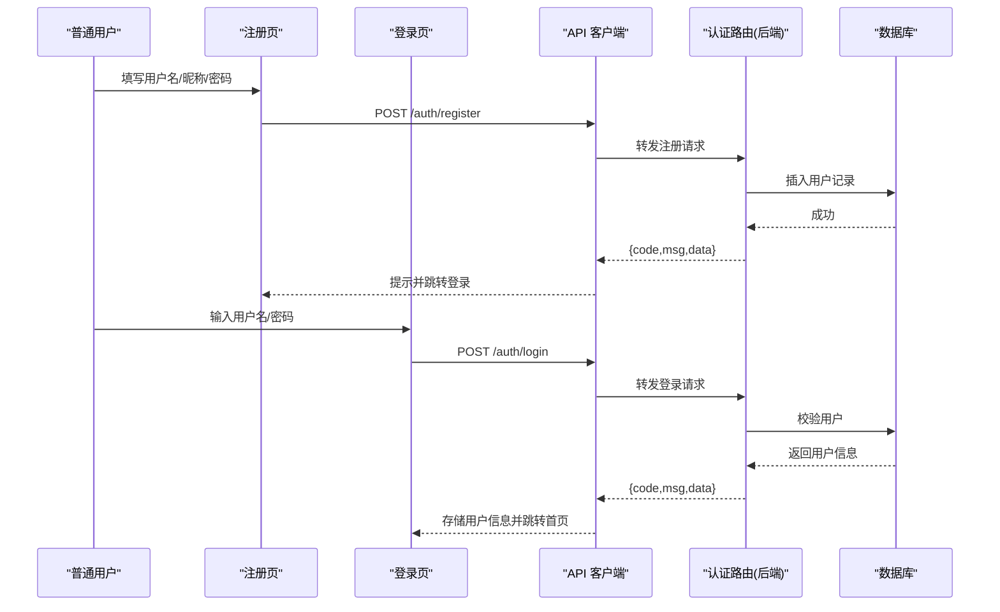
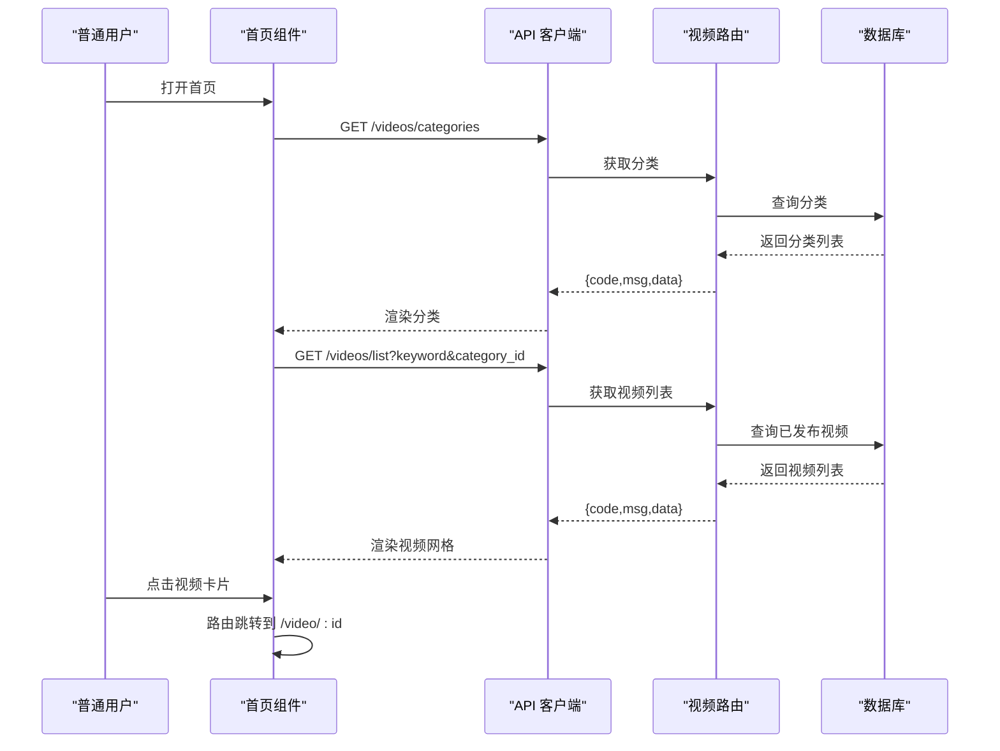
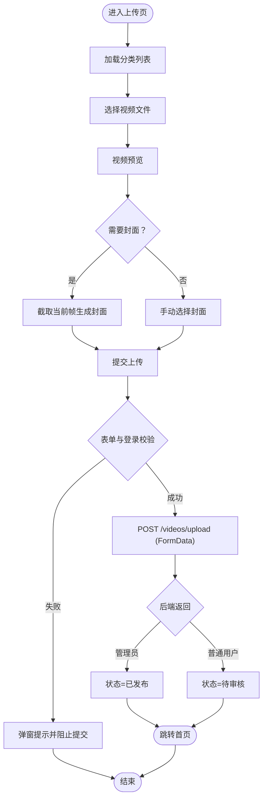
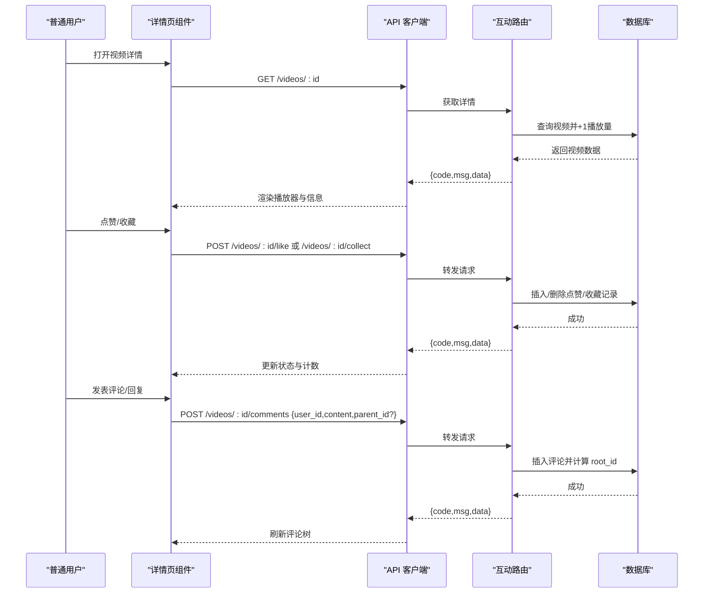
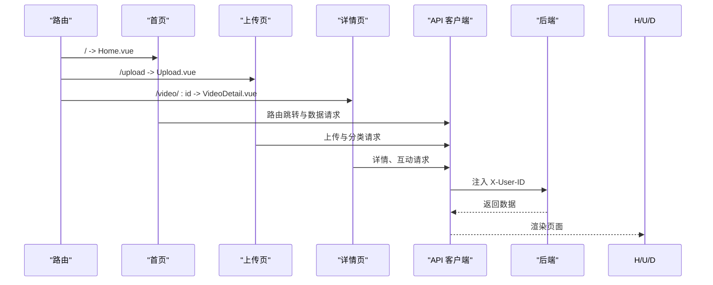
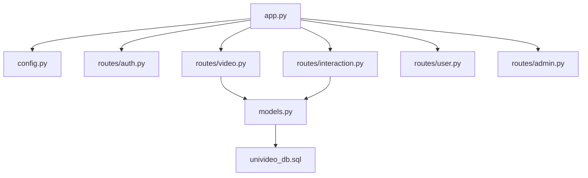

# 普通用户工作流

<cite>
**本文引用的文件**
- [frontend/src/router/index.js](file://frontend/src/router/index.js)
- [frontend/src/views/Home.vue](file://frontend/src/views/Home.vue)
- [frontend/src/views/VideoDetail.vue](file://frontend/src/views/VideoDetail.vue)
- [frontend/src/views/Upload.vue](file://frontend/src/views/Upload.vue)
- [frontend/src/views/Login.vue](file://frontend/src/views/Login.vue)
- [frontend/src/views/Register.vue](file://frontend/src/views/Register.vue)
- [frontend/src/api.js](file://frontend/src/api.js)
- [backend/app.py](file://backend/app.py)
- [backend/config.py](file://backend/config.py)
- [backend/routes/video.py](file://backend/routes/video.py)
- [backend/routes/interaction.py](file://backend/routes/interaction.py)
- [backend/models.py](file://backend/models.py)
- [univideo_db.sql](file://univideo_db.sql)
</cite>

## 目录
1. [简介](#简介)
2. [项目结构](#项目结构)
3. [核心组件](#核心组件)
4. [架构总览](#架构总览)
5. [详细组件分析](#详细组件分析)
6. [依赖分析](#依赖分析)
7. [性能考虑](#性能考虑)
8. [故障排查指南](#故障排查指南)
9. [结论](#结论)

## 简介
本文件面向普通用户在 UniVideo 平台的完整操作流程，涵盖从注册/登录、首页浏览、视频上传、审核状态、播放与互动（点赞、收藏、评论与多级回复）到页面流转与数据传递的全过程。文档同时梳理了关键边界情况（如上传格式不符、网络异常、评论内容违规拦截）下的系统反馈机制，并结合前端 Vue 组件与后端 Flask 路由的状态管理，帮助开发者理解用户体验设计与错误处理策略。

## 项目结构
- 前端采用 Vue 3 + Vite，通过路由模块化组织页面组件，统一通过 API 客户端与后端交互。
- 后端采用 Flask，以蓝图划分功能模块（认证、视频、互动、用户、管理），配合 SQLAlchemy ORM 管理数据库模型。
- 数据库脚本定义了用户、分类、视频、评论、点赞、收藏等核心表及索引。

图表来源
- [frontend/src/router/index.js](file://frontend/src/router/index.js#L1-L56)
- [frontend/src/views/Home.vue](file://frontend/src/views/Home.vue#L1-L130)
- [frontend/src/views/VideoDetail.vue](file://frontend/src/views/VideoDetail.vue#L1-L120)
- [frontend/src/views/Upload.vue](file://frontend/src/views/Upload.vue#L1-L120)
- [frontend/src/views/Login.vue](file://frontend/src/views/Login.vue#L1-L60)
- [frontend/src/views/Register.vue](file://frontend/src/views/Register.vue#L1-L60)
- [frontend/src/api.js](file://frontend/src/api.js#L1-L41)
- [backend/app.py](file://backend/app.py#L1-L60)
- [backend/config.py](file://backend/config.py#L1-L66)
- [backend/routes/video.py](file://backend/routes/video.py#L1-L60)
- [backend/routes/interaction.py](file://backend/routes/interaction.py#L1-L40)
- [univideo_db.sql](file://univideo_db.sql#L1-L76)

章节来源
- [frontend/src/router/index.js](file://frontend/src/router/index.js#L1-L56)
- [backend/app.py](file://backend/app.py#L1-L60)

## 核心组件
- 路由与页面流转：前端路由负责页面跳转与懒加载，首页与详情页承载主要业务逻辑。
- API 客户端：统一封装后端基础地址、超时、请求头透传（X-User-ID）。
- 视频上传：表单校验、文件选择与预览、Canvas 截帧生成封面、FormData 提交。
- 互动功能：点赞/取消点赞、收藏/取消收藏、评论与多级回复树形结构。
- 审核机制：普通用户上传默认状态为“待审核”，仅管理员可直接发布。

章节来源
- [frontend/src/router/index.js](file://frontend/src/router/index.js#L1-L56)
- [frontend/src/api.js](file://frontend/src/api.js#L1-L41)
- [frontend/src/views/Upload.vue](file://frontend/src/views/Upload.vue#L140-L205)
- [frontend/src/views/VideoDetail.vue](file://frontend/src/views/VideoDetail.vue#L180-L319)
- [backend/routes/video.py](file://backend/routes/video.py#L37-L171)
- [backend/models.py](file://backend/models.py#L113-L198)

## 架构总览
前后端通过 RESTful 接口通信，前端通过路由驱动页面流转，API 客户端统一注入用户标识，后端路由按功能模块处理请求并访问数据库模型。

图表来源
- [frontend/src/router/index.js](file://frontend/src/router/index.js#L1-L56)
- [frontend/src/api.js](file://frontend/src/api.js#L1-L41)
- [backend/app.py](file://backend/app.py#L39-L60)
- [backend/routes/video.py](file://backend/routes/video.py#L1-L60)
- [backend/routes/interaction.py](file://backend/routes/interaction.py#L1-L40)
- [backend/models.py](file://backend/models.py#L1-L120)

## 详细组件分析

### 注册与登录流程
- 注册：校验必填项与密码长度，调用后端注册接口，成功后提示并跳转登录页。
- 登录：校验用户名与密码，调用后端登录接口，成功后将用户信息存入本地存储并跳转首页。
- 退出登录：清除本地存储并跳转登录页。

图表来源
- [frontend/src/views/Register.vue](file://frontend/src/views/Register.vue#L1-L60)
- [frontend/src/views/Login.vue](file://frontend/src/views/Login.vue#L1-L60)
- [frontend/src/api.js](file://frontend/src/api.js#L1-L41)
- [backend/app.py](file://backend/app.py#L39-L60)

章节来源
- [frontend/src/views/Register.vue](file://frontend/src/views/Register.vue#L1-L100)
- [frontend/src/views/Login.vue](file://frontend/src/views/Login.vue#L1-L90)
- [frontend/src/api.js](file://frontend/src/api.js#L1-L41)

### 首页浏览与搜索/分类筛选
- 首页加载时获取分类列表与视频列表，支持关键词搜索与分类筛选。
- 点击视频卡片跳转至详情页；未登录用户可浏览但部分互动需登录。
- 退出登录清理本地用户信息并回到登录页。

图表来源
- [frontend/src/views/Home.vue](file://frontend/src/views/Home.vue#L1-L130)
- [frontend/src/router/index.js](file://frontend/src/router/index.js#L1-L56)
- [backend/routes/video.py](file://backend/routes/video.py#L173-L226)
- [backend/models.py](file://backend/models.py#L113-L198)

章节来源
- [frontend/src/views/Home.vue](file://frontend/src/views/Home.vue#L1-L130)
- [backend/routes/video.py](file://backend/routes/video.py#L173-L226)

### 视频上传流程（普通用户）
- 表单字段：标题、简介、分类、视频文件、封面文件。
- 文件选择与预览：支持手动选择封面或从视频预览中截取当前帧生成封面。
- 提交上传：校验必填项与登录态，构造 FormData，调用上传接口。
- 审核状态：普通用户上传默认状态为“待审核”，无法在首页展示；管理员上传直接发布。

图表来源
- [frontend/src/views/Upload.vue](file://frontend/src/views/Upload.vue#L1-L225)
- [backend/routes/video.py](file://backend/routes/video.py#L37-L171)
- [backend/config.py](file://backend/config.py#L1-L66)
- [backend/models.py](file://backend/models.py#L113-L198)

章节来源
- [frontend/src/views/Upload.vue](file://frontend/src/views/Upload.vue#L1-L225)
- [backend/routes/video.py](file://backend/routes/video.py#L37-L171)
- [backend/config.py](file://backend/config.py#L1-L66)

### 视频播放与互动（点赞/收藏/评论与多级回复）
- 播放器：基于 HTML5 video 标签，封面与视频路径由后端拼接完整 URL 返回。
- 点赞/收藏：未登录用户触发交互时提示登录并跳转；已登录用户可切换状态并实时更新计数。
- 评论：支持主评论与回复；回复时携带 parent_id，后端计算 root_id 形成树形结构。
- 评论树：前端将评论列表转换为树，支持在任意一层展开回复输入框。

图表来源
- [frontend/src/views/VideoDetail.vue](file://frontend/src/views/VideoDetail.vue#L1-L320)
- [backend/routes/interaction.py](file://backend/routes/interaction.py#L1-L120)
- [backend/routes/video.py](file://backend/routes/video.py#L228-L282)
- [backend/models.py](file://backend/models.py#L200-L271)

章节来源
- [frontend/src/views/VideoDetail.vue](file://frontend/src/views/VideoDetail.vue#L1-L320)
- [backend/routes/interaction.py](file://backend/routes/interaction.py#L1-L200)

### 页面流转与状态管理（路由与本地存储）
- 路由：首页、登录、注册、上传、详情、管理后台、个人主页。
- 本地存储：用户登录后保存 user_id、nickname、role；退出登录时清除。
- 请求头：API 客户端在请求前注入 X-User-ID，便于后端识别当前用户。

图表来源
- [frontend/src/router/index.js](file://frontend/src/router/index.js#L1-L56)
- [frontend/src/api.js](file://frontend/src/api.js#L1-L41)
- [frontend/src/views/Home.vue](file://frontend/src/views/Home.vue#L1-L130)
- [frontend/src/views/Upload.vue](file://frontend/src/views/Upload.vue#L1-L120)
- [frontend/src/views/VideoDetail.vue](file://frontend/src/views/VideoDetail.vue#L1-L120)

章节来源
- [frontend/src/router/index.js](file://frontend/src/router/index.js#L1-L56)
- [frontend/src/api.js](file://frontend/src/api.js#L1-L41)

## 依赖分析
- 前端组件依赖：
  - 路由：负责页面跳转与懒加载。
  - API 客户端：统一请求头与超时配置。
  - 组件内：通过 axios 实例与后端交互，使用 localStorage 保存用户信息。
- 后端模块依赖：
  - 应用工厂：初始化 CORS、数据库、蓝图注册。
  - 路由蓝图：视频、互动、认证、用户、管理。
  - 模型：用户、分类、视频、评论、点赞、收藏。
  - 配置：上传目录、最大文件大小、允许扩展名、数据库连接。

图表来源
- [backend/app.py](file://backend/app.py#L1-L60)
- [backend/config.py](file://backend/config.py#L1-L66)
- [backend/routes/video.py](file://backend/routes/video.py#L1-L60)
- [backend/routes/interaction.py](file://backend/routes/interaction.py#L1-L40)
- [backend/models.py](file://backend/models.py#L1-L120)
- [univideo_db.sql](file://univideo_db.sql#L1-L76)

章节来源
- [backend/app.py](file://backend/app.py#L1-L60)
- [backend/models.py](file://backend/models.py#L1-L120)

## 性能考虑
- 前端：
  - 预览 URL 使用对象 URL，上传完成后在组件卸载时及时释放，避免内存泄漏。
  - 列表与评论加载时使用条件渲染与骨架屏思路（加载/空状态提示）。
- 后端：
  - 视频列表仅返回已发布状态，减少无效数据传输。
  - 评论查询按时间升序排列，支持树形结构转换，前端一次性渲染。
  - 数据库索引：视频状态索引、评论联合索引，提升查询效率。

章节来源
- [frontend/src/views/Upload.vue](file://frontend/src/views/Upload.vue#L204-L225)
- [backend/routes/video.py](file://backend/routes/video.py#L173-L226)
- [backend/models.py](file://backend/models.py#L200-L271)
- [univideo_db.sql](file://univideo_db.sql#L30-L55)

## 故障排查指南
- 上传格式不符
  - 现象：后端返回不支持的视频/图片格式。
  - 处理：前端限制文件类型与大小，后端严格校验扩展名。
  - 参考
    - [frontend/src/views/Upload.vue](file://frontend/src/views/Upload.vue#L280-L340)
    - [backend/config.py](file://backend/config.py#L1-L66)
    - [backend/routes/video.py](file://backend/routes/video.py#L92-L109)
- 网络中断导致上传失败
  - 现象：请求超时或断开，前端捕获错误并提示重试。
  - 处理：前端设置超时时间，后端统一返回错误码与消息。
  - 参考
    - [frontend/src/api.js](file://frontend/src/api.js#L1-L41)
    - [frontend/src/views/Upload.vue](file://frontend/src/views/Upload.vue#L184-L205)
- 评论内容违规被拦截
  - 现象：后端校验评论内容为空或越权，返回错误信息。
  - 处理：前端在提交前校验内容长度与登录态，后端严格校验父评论归属与 root_id 计算。
  - 参考
    - [frontend/src/views/VideoDetail.vue](file://frontend/src/views/VideoDetail.vue#L232-L319)
    - [backend/routes/interaction.py](file://backend/routes/interaction.py#L12-L112)
- 待审核视频无法在首页展示
  - 现象：普通用户上传后状态为待审核，首页仅展示已发布视频。
  - 处理：后端列表查询过滤 status=1；管理员上传直接发布。
  - 参考
    - [backend/routes/video.py](file://backend/routes/video.py#L173-L226)
    - [backend/models.py](file://backend/models.py#L113-L198)

章节来源
- [frontend/src/views/Upload.vue](file://frontend/src/views/Upload.vue#L280-L340)
- [frontend/src/views/VideoDetail.vue](file://frontend/src/views/VideoDetail.vue#L232-L319)
- [frontend/src/api.js](file://frontend/src/api.js#L1-L41)
- [backend/config.py](file://backend/config.py#L1-L66)
- [backend/routes/video.py](file://backend/routes/video.py#L173-L226)
- [backend/routes/interaction.py](file://backend/routes/interaction.py#L12-L112)
- [backend/models.py](file://backend/models.py#L113-L198)

## 结论
UniVideo 通过清晰的前后端分层与路由驱动，实现了从注册登录到上传审核、播放互动的完整闭环。前端组件以用户体验为中心，后端以数据一致性与安全性为核心，配合严格的文件格式校验与审核机制，保障平台内容质量与稳定性。针对常见边界情况，系统提供了明确的反馈与处理策略，便于开发者快速定位问题并优化交互体验。