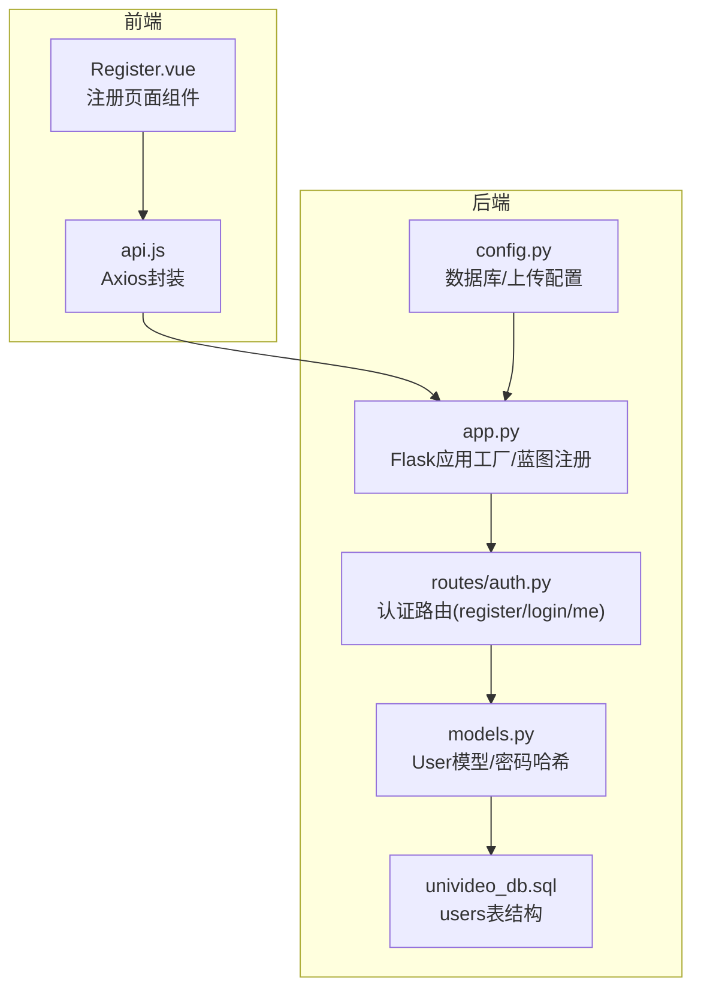
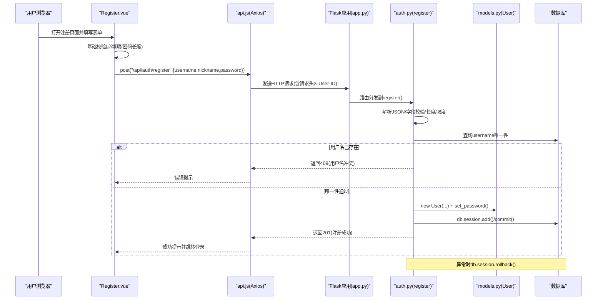
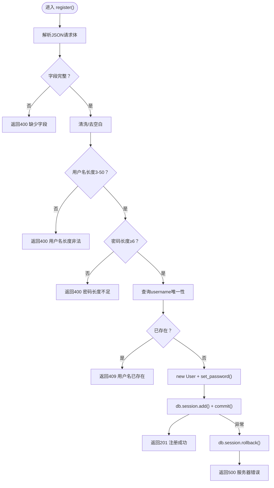
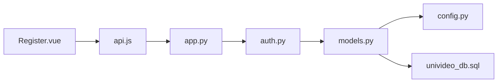

# 注册流程

<cite>
**本文引用的文件**
- [frontend/src/views/Register.vue](file://frontend/src/views/Register.vue)
- [frontend/src/api.js](file://frontend/src/api.js)
- [backend/app.py](file://backend/app.py)
- [backend/routes/auth.py](file://backend/routes/auth.py)
- [backend/models.py](file://backend/models.py)
- [backend/config.py](file://backend/config.py)
- [univideo_db.sql](file://univideo_db.sql)
</cite>

## 目录
1. [简介](#简介)
2. [项目结构](#项目结构)
3. [核心组件](#核心组件)
4. [架构总览](#架构总览)
5. [详细组件分析](#详细组件分析)
6. [依赖分析](#依赖分析)
7. [性能考虑](#性能考虑)
8. [故障排查指南](#故障排查指南)
9. [结论](#结论)
10. [附录](#附录)

## 简介
本文围绕UniVideo平台的用户注册流程展开，从前端Register.vue组件的表单输入与基础校验开始，到前端通过Axios封装调用后端/api/auth/register接口，再到后端auth.py的register()函数完成请求解析、完整性校验、用户名唯一性检查、密码加密存储以及事务回滚等关键步骤，形成完整的前后端数据流。文档还总结了错误码处理策略（如400字段缺失、409用户名冲突、500服务器错误），并结合代码示例说明安全实践（密码哈希），最后指出当前实现中缺少邮箱验证等高级功能，为后续扩展提供指导。

## 项目结构
- 前端采用Vue 3单页应用，注册页面位于frontend/src/views/Register.vue，HTTP客户端封装在frontend/src/api.js。
- 后端基于Flask，应用入口在backend/app.py，认证相关路由集中在backend/routes/auth.py，用户模型在backend/models.py，数据库配置在backend/config.py，数据库初始化脚本在univideo_db.sql。

图表来源
- [frontend/src/views/Register.vue](file://frontend/src/views/Register.vue#L1-L108)
- [frontend/src/api.js](file://frontend/src/api.js#L1-L41)
- [backend/app.py](file://backend/app.py#L1-L60)
- [backend/routes/auth.py](file://backend/routes/auth.py#L1-L87)
- [backend/models.py](file://backend/models.py#L14-L83)
- [backend/config.py](file://backend/config.py#L1-L66)
- [univideo_db.sql](file://univideo_db.sql#L1-L20)

章节来源
- [frontend/src/views/Register.vue](file://frontend/src/views/Register.vue#L1-L108)
- [frontend/src/api.js](file://frontend/src/api.js#L1-L41)
- [backend/app.py](file://backend/app.py#L1-L60)
- [backend/routes/auth.py](file://backend/routes/auth.py#L1-L87)
- [backend/models.py](file://backend/models.py#L14-L83)
- [backend/config.py](file://backend/config.py#L1-L66)
- [univideo_db.sql](file://univideo_db.sql#L1-L20)

## 核心组件
- 前端Register.vue：负责收集用户名、昵称、密码，执行基础校验（必填项、密码长度），调用/api/auth/register接口提交数据，处理成功/失败提示与路由跳转。
- 前端api.js：统一配置Axios实例，设置基础URL、超时、Content-Type，并在请求拦截器中透传用户ID到请求头，便于后续接口鉴权。
- 后端app.py：应用工厂函数，注册认证、视频、管理员、互动、用户等蓝图，设置CORS与上传目录，暴露/api/auth/register等接口。
- 后端routes/auth.py：实现注册接口，进行字段完整性校验、用户名长度与密码强度校验、用户名唯一性检查、密码加密存储、数据库事务提交与异常回滚。
- 后端models.py：User模型提供set_password与check_password方法，使用Werkzeug安全哈希；User表结构由univideo_db.sql定义。
- 后端config.py：数据库连接配置、上传目录与文件大小限制等。
- 数据库脚本univideo_db.sql：定义users表的字段、约束（唯一索引username）及默认值。

章节来源
- [frontend/src/views/Register.vue](file://frontend/src/views/Register.vue#L1-L108)
- [frontend/src/api.js](file://frontend/src/api.js#L1-L41)
- [backend/app.py](file://backend/app.py#L1-L60)
- [backend/routes/auth.py](file://backend/routes/auth.py#L12-L87)
- [backend/models.py](file://backend/models.py#L14-L83)
- [backend/config.py](file://backend/config.py#L1-L66)
- [univideo_db.sql](file://univideo_db.sql#L1-L20)

## 架构总览
注册流程的端到端交互如下图所示，展示了从前端表单到后端接口再到数据库写入的完整链路。

图表来源
- [frontend/src/views/Register.vue](file://frontend/src/views/Register.vue#L22-L54)
- [frontend/src/api.js](file://frontend/src/api.js#L9-L37)
- [backend/app.py](file://backend/app.py#L39-L58)
- [backend/routes/auth.py](file://backend/routes/auth.py#L12-L87)
- [backend/models.py](file://backend/models.py#L42-L58)
- [univideo_db.sql](file://univideo_db.sql#L6-L14)

## 详细组件分析

### 前端组件：Register.vue
- 表单字段：username、nickname、password，配合loading状态控制按钮禁用。
- 基础校验：
  - 必填项检查：任一字段为空则弹窗提示并终止提交。
  - 密码长度校验：前端要求至少6位，与后端一致。
- 提交流程：
  - 调用api.post('/auth/register', payload)提交JSON数据。
  - 成功：弹窗提示“注册成功，请登录”，并路由跳转到/login。
  - 失败：捕获错误，读取error.response.data.msg作为错误消息并提示。
- 安全与可用性：
  - 使用password输入类型，避免明文泄露。
  - loading状态防止重复提交。

章节来源
- [frontend/src/views/Register.vue](file://frontend/src/views/Register.vue#L12-L54)

### 前端HTTP封装：api.js
- Axios实例配置：
  - baseURL指向后端API地址，超时10秒，Content-Type为application/json。
  - 请求拦截器：若localStorage中存在user_id，则在请求头添加X-User-ID，便于后续接口鉴权。
- 作用：
  - 统一网络层配置，减少重复代码。
  - 为后续接口鉴权提供基础。

章节来源
- [frontend/src/api.js](file://frontend/src/api.js#L9-L37)

### 后端应用入口：app.py
- 应用工厂create_app：
  - 加载配置、初始化SQLAlchemy与Flask-Migrate、启用CORS。
  - 确保上传目录存在（videos/covers/avatars）。
  - 注册认证(auth)、视频(video)、管理员(admin)、互动(interaction)、用户(user)蓝图，url前缀分别为/api/auth、/api/videos、/api/admin、/api、/api/users。
- 运行参数：开发模式监听0.0.0.0:5001，开启调试。

章节来源
- [backend/app.py](file://backend/app.py#L15-L60)

### 后端路由：auth.py 的 register()
- 接口定义：POST /api/auth/register
- 请求体字段：username、password、nickname（JSON）
- 校验与处理流程：
  - 字段完整性校验：若缺少任一字段，返回400并提示缺失字段。
  - 清洗与长度校验：去除首尾空白，用户名长度3-50，密码长度≥6。
  - 唯一性检查：按username查询，若存在则返回409。
  - 密码加密：new User(...)后调用User.set_password()进行哈希存储。
  - 数据持久化：db.session.add()与commit()提交。
  - 成功响应：返回201，包含code、msg、data(id/username/nickname)。
  - 异常回滚：捕获异常后db.session.rollback()，返回500。
- 安全实践：
  - 使用Werkzeug安全哈希生成密码散列，不存储明文密码。
  - 唯一性约束通过数据库唯一索引与业务层双重保障。

图表来源
- [backend/routes/auth.py](file://backend/routes/auth.py#L12-L87)
- [backend/models.py](file://backend/models.py#L42-L58)

章节来源
- [backend/routes/auth.py](file://backend/routes/auth.py#L12-L87)

### 后端模型：models.py 的 User
- 字段与约束：
  - username唯一且非空，password非空，nickname非空，role默认'user'。
  - created_at默认当前时间戳。
- 安全方法：
  - set_password(password)：使用generate_password_hash生成哈希并赋值。
  - check_password(password)：使用check_password_hash验证输入密码。
- 序列化：to_dict()用于API响应。

章节来源
- [backend/models.py](file://backend/models.py#L14-L83)
- [univideo_db.sql](file://univideo_db.sql#L6-L14)

### 数据库：univideo_db.sql 的 users 表
- 关键字段：id、username(唯一)、password、nickname、role、avatar、created_at。
- 作用：承载用户注册与登录所需的数据结构，配合后端ORM与路由逻辑。

章节来源
- [univideo_db.sql](file://univideo_db.sql#L6-L14)

### 错误码与响应格式
- 统一响应格式：{code, msg, data?}
- 常见错误码：
  - 400：字段缺失或长度/强度不满足要求。
  - 409：用户名已存在。
  - 500：服务器内部错误（异常回滚）。
- 前端展示：Register.vue在catch分支中读取error.response.data.msg并弹窗提示。

章节来源
- [backend/routes/auth.py](file://backend/routes/auth.py#L24-L54)
- [frontend/src/views/Register.vue](file://frontend/src/views/Register.vue#L47-L51)

### 安全实践与最佳实践
- 密码哈希：后端使用Werkzeug安全哈希，避免明文存储。
- 唯一性保护：数据库唯一索引(username)与业务层查询双重保障。
- 输入清洗：前后端均进行去空白与长度校验，降低异常风险。
- 传输安全：建议在生产环境启用HTTPS，避免中间人攻击。
- 会话与鉴权：当前注册流程不涉及Token，后续可引入JWT或Cookie会话以提升安全性。

章节来源
- [backend/models.py](file://backend/models.py#L42-L58)
- [backend/routes/auth.py](file://backend/routes/auth.py#L48-L54)

## 依赖分析
- 前端到后端：
  - Register.vue依赖api.js发起HTTP请求。
  - api.js依赖Axios与本地存储(user_id)。
  - app.py注册auth蓝图，使/auth/register可访问。
- 后端到数据层：
  - auth.py依赖models.User与db会话。
  - models.User依赖Werkzeug安全哈希。
  - config.py提供数据库连接与上传配置。
  - univideo_db.sql定义users表结构与唯一约束。

图表来源
- [frontend/src/views/Register.vue](file://frontend/src/views/Register.vue#L1-L108)
- [frontend/src/api.js](file://frontend/src/api.js#L1-L41)
- [backend/app.py](file://backend/app.py#L39-L58)
- [backend/routes/auth.py](file://backend/routes/auth.py#L12-L87)
- [backend/models.py](file://backend/models.py#L14-L83)
- [backend/config.py](file://backend/config.py#L26-L30)
- [univideo_db.sql](file://univideo_db.sql#L6-L14)

章节来源
- [frontend/src/views/Register.vue](file://frontend/src/views/Register.vue#L1-L108)
- [frontend/src/api.js](file://frontend/src/api.js#L1-L41)
- [backend/app.py](file://backend/app.py#L39-L58)
- [backend/routes/auth.py](file://backend/routes/auth.py#L12-L87)
- [backend/models.py](file://backend/models.py#L14-L83)
- [backend/config.py](file://backend/config.py#L26-L30)
- [univideo_db.sql](file://univideo_db.sql#L6-L14)

## 性能考虑
- 前端：
  - 表单校验在客户端进行，减少无效请求，提高用户体验。
  - loading状态避免重复提交，降低后端压力。
- 后端：
  - 唯一性查询使用数据库唯一索引与ORM过滤，复杂度受索引影响。
  - 事务提交与异常回滚保证一致性，避免脏数据。
- 建议：
  - 对高频字段建立合适索引（如username）。
  - 控制请求体大小与超时时间，避免资源滥用。
  - 后续可引入缓存（如Redis）加速热点查询（如用户信息）。

[本节为通用建议，无需特定文件引用]

## 故障排查指南
- 常见问题与定位：
  - 400错误：检查请求体是否包含username、password、nickname，确认字段拼写与类型。
  - 409错误：用户名已被占用，提示用户更换。
  - 500错误：后端异常，查看服务日志，确认db.session.rollback()是否执行。
- 前端提示：
  - Register.vue在catch分支中读取error.response.data.msg并弹窗提示，便于快速定位。
- 后端日志：
  - app.py健康检查接口可用于服务状态与数据库连接检测。
- 数据库：
  - 确认users表唯一索引username存在，避免重复注册。

章节来源
- [frontend/src/views/Register.vue](file://frontend/src/views/Register.vue#L47-L51)
- [backend/routes/auth.py](file://backend/routes/auth.py#L24-L54)
- [backend/app.py](file://backend/app.py#L73-L92)
- [univideo_db.sql](file://univideo_db.sql#L6-L14)

## 结论
UniVideo的注册流程在前后端协同下实现了清晰的数据流：前端负责基础校验与请求发起，后端负责完整性校验、唯一性检查与密码哈希存储，并通过统一的响应格式与错误码处理提升了可观测性与可维护性。当前实现已具备基本的安全实践（密码哈希、唯一性约束），但仍缺少邮箱验证、二次确认、图形验证码等高级能力，后续可在保持现有架构稳定性的前提下逐步增强。

[本节为总结，无需特定文件引用]

## 附录
- 当前实现缺少的功能与扩展建议：
  - 邮箱验证：注册后发送邮件验证码，完成绑定后再开放登录权限。
  - 图形验证码：防机器人注册，降低批量注册风险。
  - 密码强度策略：除长度外，增加复杂度要求（字母、数字、特殊字符）。
  - 限流与风控：对同一IP或手机号的注册频率进行限制。
  - 审计日志：记录注册行为，便于追踪与审计。
- 代码片段路径参考：
  - 前端注册调用：[frontend/src/views/Register.vue](file://frontend/src/views/Register.vue#L38-L42)
  - 前端错误处理：[frontend/src/views/Register.vue](file://frontend/src/views/Register.vue#L47-L51)
  - 后端注册接口：[backend/routes/auth.py](file://backend/routes/auth.py#L12-L87)
  - 密码哈希方法：[backend/models.py](file://backend/models.py#L42-L58)
  - 用户表结构：[univideo_db.sql](file://univideo_db.sql#L6-L14)

[本节为补充说明，无需特定文件引用]