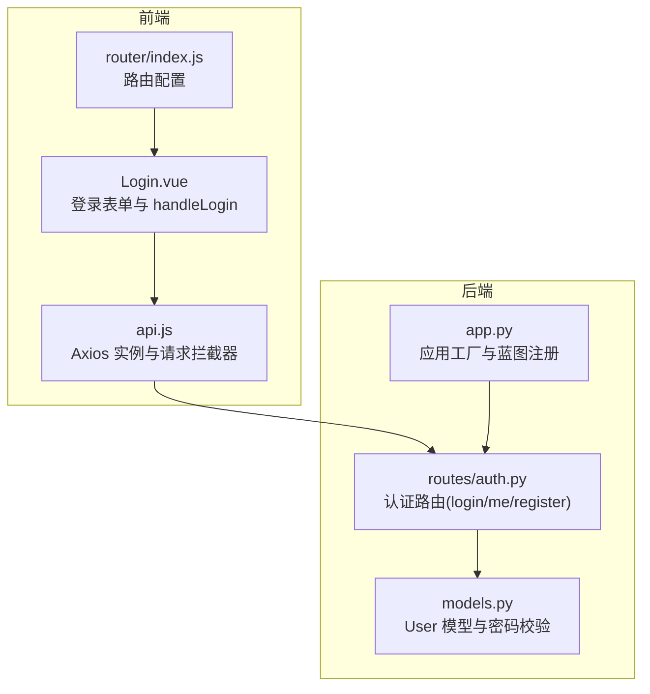
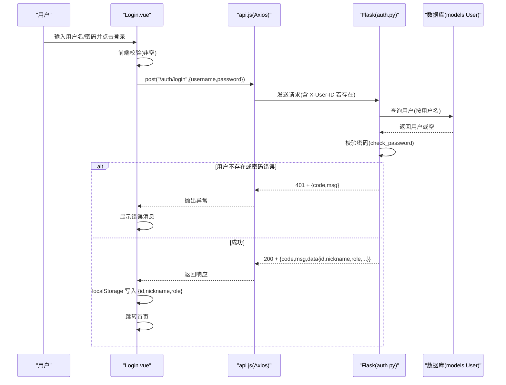
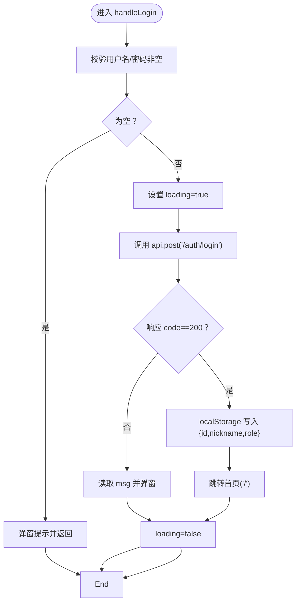
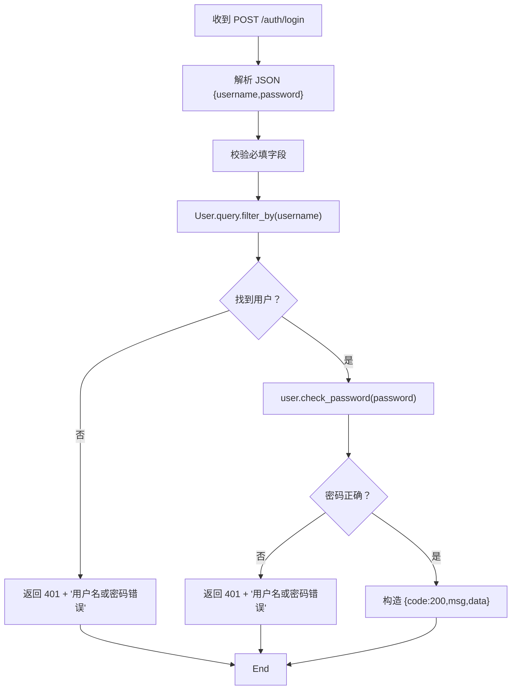
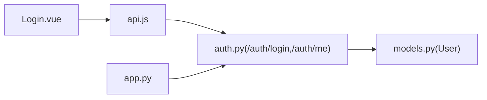

# 登录流程

<cite>
**本文引用的文件**
- [frontend/src/views/Login.vue](file://frontend/src/views/Login.vue)
- [frontend/src/api.js](file://frontend/src/api.js)
- [backend/routes/auth.py](file://backend/routes/auth.py)
- [backend/models.py](file://backend/models.py)
- [backend/app.py](file://backend/app.py)
- [frontend/src/router/index.js](file://frontend/src/router/index.js)
</cite>

## 目录
1. [简介](#简介)
2. [项目结构](#项目结构)
3. [核心组件](#核心组件)
4. [架构总览](#架构总览)
5. [详细组件分析](#详细组件分析)
6. [依赖分析](#依赖分析)
7. [性能考虑](#性能考虑)
8. [故障排查指南](#故障排查指南)
9. [结论](#结论)

## 简介
本文件深入解析 UniVideo 平台的用户登录机制，围绕前端 Login.vue 组件的登录表单与 handleLogin 函数展开，说明其如何收集用户名与密码、执行前端校验、通过 api.post('/auth/login') 发起请求；后端 auth.py 的 login() 函数如何进行用户身份核验（查询数据库匹配用户名、使用 check_password 验证加密密码），成功后返回用户基本信息（id、nickname、role 等），并由前端存储至 localStorage。文档还覆盖认证流程的数据流向、状态管理（loading）、错误处理策略（401 凭证错误、500 服务器异常），并指出当前采用“简易身份透传（X-User-ID）”而非 JWT Token 的安全权衡，最后提供前后端接口定义的对比，帮助开发者理解会话管理设计。

## 项目结构
- 前端位于 frontend/src/views/Login.vue，负责用户输入与登录交互；通过 frontend/src/api.js 统一发起 HTTP 请求，并在请求拦截器中注入 X-User-ID 头。
- 后端位于 backend/routes/auth.py，提供 /auth/register、/auth/login、/auth/me 等认证相关接口；用户模型位于 backend/models.py，使用 Werkzeug 的密码哈希与校验。
- 应用入口 backend/app.py 注册了认证、视频、管理员、互动、用户等蓝图，统一暴露 /api 前缀。

图表来源
- [frontend/src/views/Login.vue](file://frontend/src/views/Login.vue#L1-L52)
- [frontend/src/api.js](file://frontend/src/api.js#L1-L41)
- [frontend/src/router/index.js](file://frontend/src/router/index.js#L1-L56)
- [backend/app.py](file://backend/app.py#L1-L60)
- [backend/routes/auth.py](file://backend/routes/auth.py#L1-L184)
- [backend/models.py](file://backend/models.py#L1-L83)

章节来源
- [frontend/src/views/Login.vue](file://frontend/src/views/Login.vue#L1-L52)
- [frontend/src/api.js](file://frontend/src/api.js#L1-L41)
- [backend/app.py](file://backend/app.py#L1-L60)

## 核心组件
- 前端 Login.vue
  - 状态：username、password、loading
  - 行为：handleLogin 执行表单校验、调用 api.post('/auth/login')、成功后将 {id, nickname, role} 写入 localStorage 并跳转首页
  - 错误处理：捕获异常，读取后端返回的 msg 并提示
- 前端 api.js
  - Axios 实例，baseURL 指向后端 /api
  - 请求拦截器：若 localStorage 中存在 user_id，则在请求头添加 X-User-ID
- 后端 routes/auth.py
  - /auth/login：接收 {username, password}，查询用户并校验密码，成功返回 {code, msg, data:{id, username, nickname, role, avatar}}
  - /auth/me：从请求头 X-User-Id 获取 user_id，查询用户并返回完整用户信息
  - /auth/register：注册接口（用于对比前后端接口风格）
- 后端 models.py
  - User 模型：set_password、check_password、to_dict、is_admin 等
- 后端 app.py
  - 注册认证蓝图，url_prefix 为 /api/auth

章节来源
- [frontend/src/views/Login.vue](file://frontend/src/views/Login.vue#L1-L52)
- [frontend/src/api.js](file://frontend/src/api.js#L1-L41)
- [backend/routes/auth.py](file://backend/routes/auth.py#L89-L145)
- [backend/models.py](file://backend/models.py#L14-L83)
- [backend/app.py](file://backend/app.py#L39-L58)

## 架构总览
登录流程涉及前端表单、Axios 拦截器、后端认证路由与数据库模型之间的协作。整体数据流如下：

图表来源
- [frontend/src/views/Login.vue](file://frontend/src/views/Login.vue#L21-L52)
- [frontend/src/api.js](file://frontend/src/api.js#L17-L37)
- [backend/routes/auth.py](file://backend/routes/auth.py#L89-L145)
- [backend/models.py](file://backend/models.py#L42-L59)

## 详细组件分析

### 前端 Login.vue 组件
- 表单与状态
  - username、password、loading 三个响应式状态
  - handleLogin：非空校验 -> loading=true -> 调用 api.post('/auth/login') -> 成功写入 localStorage -> 跳转首页 -> finally 恢复 loading=false
  - 错误处理：捕获异常，读取 error.response?.data?.msg 或默认提示
- 模板交互
  - 输入框支持 Enter 键触发登录
  - 提交按钮禁用 loading 期间，文案动态切换

图表来源
- [frontend/src/views/Login.vue](file://frontend/src/views/Login.vue#L21-L52)

章节来源
- [frontend/src/views/Login.vue](file://frontend/src/views/Login.vue#L1-L52)

### 前端 api.js 请求拦截器
- Axios 实例：baseURL 指向 http://localhost:5001/api，Content-Type 为 application/json
- 请求拦截器：若 localStorage 中存在 user_id，则在请求头添加 X-User-ID，用于后端识别当前登录用户
- 该拦截器是“简易身份透传”的关键实现，避免每个业务请求手动携带用户标识

章节来源
- [frontend/src/api.js](file://frontend/src/api.js#L1-L41)

### 后端 routes/auth.py 登录与会话
- /auth/login
  - 接收 JSON {username, password}
  - 校验必填字段
  - 查询用户：User.query.filter_by(username=username).first()
  - 校验密码：user.check_password(password)
  - 成功返回 {code:200, msg, data:{id, username, nickname, role, avatar}}
  - 失败返回 401 + {code,msg}（用户名或密码错误）
  - 异常返回 500 + {code,msg}
- /auth/me
  - 从请求头 X-User-Id 获取 user_id
  - 查询用户并返回 user.to_dict()
  - 无头或用户不存在分别返回 401/404
- /auth/register
  - 作为对比：展示后端接口风格（字段校验、冲突检测、密码加密）

图表来源
- [backend/routes/auth.py](file://backend/routes/auth.py#L89-L145)

章节来源
- [backend/routes/auth.py](file://backend/routes/auth.py#L89-L145)

### 后端 models.py 用户模型
- set_password：使用 generate_password_hash 生成哈希并存储
- check_password：使用 check_password_hash 校验
- to_dict：序列化用户信息，供 API 响应使用
- is_admin：判断角色是否为 admin

章节来源
- [backend/models.py](file://backend/models.py#L14-L83)

### 后端 app.py 蓝图注册
- 注册认证蓝图，url_prefix 为 /api/auth
- 使前端 api.js 的 baseURL 与后端路由形成一致的调用路径

章节来源
- [backend/app.py](file://backend/app.py#L39-L58)

### 前后端接口定义对比
- 前端调用
  - 登录：api.post('/auth/login', {username, password})
  - 获取当前用户：api.get('/auth/me')
- 后端接口
  - 登录：POST /api/auth/login，请求体 {username, password}，成功返回 {code, msg, data:{id, username, nickname, role, avatar}}
  - 获取当前用户：GET /api/auth/me，请求头 X-User-Id，成功返回 {code, msg, data:user}

章节来源
- [frontend/src/api.js](file://frontend/src/api.js#L1-L41)
- [backend/routes/auth.py](file://backend/routes/auth.py#L89-L145)
- [backend/app.py](file://backend/app.py#L39-L58)

## 依赖分析
- 前端 Login.vue 依赖 api.js 的 Axios 实例与拦截器
- api.js 依赖浏览器 localStorage 存储 user_id
- 后端 auth.py 依赖 models.User 的数据库查询与密码校验
- app.py 将 auth 蓝图注册到 /api/auth 前缀，保证前后端路径一致

图表来源
- [frontend/src/views/Login.vue](file://frontend/src/views/Login.vue#L1-L52)
- [frontend/src/api.js](file://frontend/src/api.js#L1-L41)
- [backend/routes/auth.py](file://backend/routes/auth.py#L1-L184)
- [backend/models.py](file://backend/models.py#L1-L83)
- [backend/app.py](file://backend/app.py#L39-L58)

章节来源
- [frontend/src/views/Login.vue](file://frontend/src/views/Login.vue#L1-L52)
- [frontend/src/api.js](file://frontend/src/api.js#L1-L41)
- [backend/routes/auth.py](file://backend/routes/auth.py#L1-L184)
- [backend/models.py](file://backend/models.py#L1-L83)
- [backend/app.py](file://backend/app.py#L39-L58)

## 性能考虑
- 前端
  - 登录按钮禁用 loading 期间，减少重复提交
  - Axios 超时设置为 10 秒，避免长时间阻塞
- 后端
  - 用户名查询使用唯一索引列，查询效率较高
  - 密码校验为 O(1)，开销可忽略
- 安全与一致性
  - 当前使用 X-User-ID 简易透传，无需额外令牌签发与解析，部署简单；但不具备标准 JWT 的跨域/多端共享能力与过期控制

[本节为通用建议，不直接分析具体文件]

## 故障排查指南
- 400 缺少必填字段
  - 前端：确认调用时传入 {username, password}
  - 后端：/auth/login 对必填字段进行校验
- 401 用户名或密码错误
  - 前端：显示后端返回的 msg
  - 后端：用户不存在或密码校验失败
- 500 服务器错误
  - 前端：显示“登录失败，请检查用户名和密码”
  - 后端：异常捕获并返回统一格式
- 未登录或登录已过期（/auth/me）
  - 前端：请求头未携带 X-User-Id 或 user_id 无效
  - 后端：返回 401/404

章节来源
- [frontend/src/views/Login.vue](file://frontend/src/views/Login.vue#L45-L52)
- [backend/routes/auth.py](file://backend/routes/auth.py#L101-L144)
- [backend/routes/auth.py](file://backend/routes/auth.py#L154-L177)

## 结论
UniVideo 的登录流程以 Login.vue 为入口，结合 api.js 的请求拦截器与后端 auth.py 的登录逻辑，实现了从表单收集、前端校验、后端核验到会话透传的闭环。当前采用“简易身份透传（X-User-ID）”的设计，简化了部署与实现复杂度，适合小规模或内部场景；若未来需要更强的安全性、跨域/多端共享与过期控制，可考虑引入 JWT Token 并配套刷新与撤销机制。前后端接口定义清晰，便于扩展与维护。