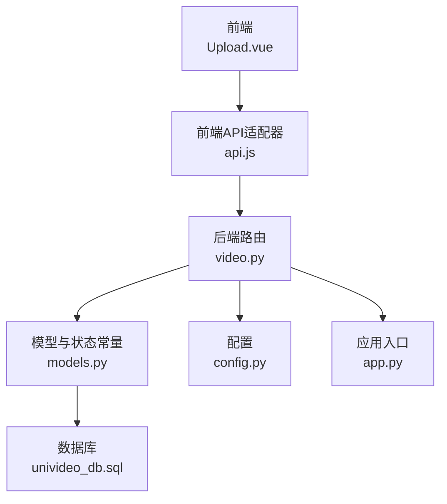
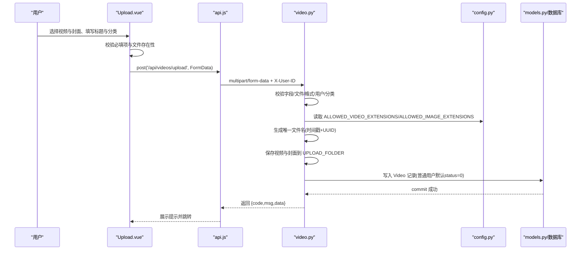
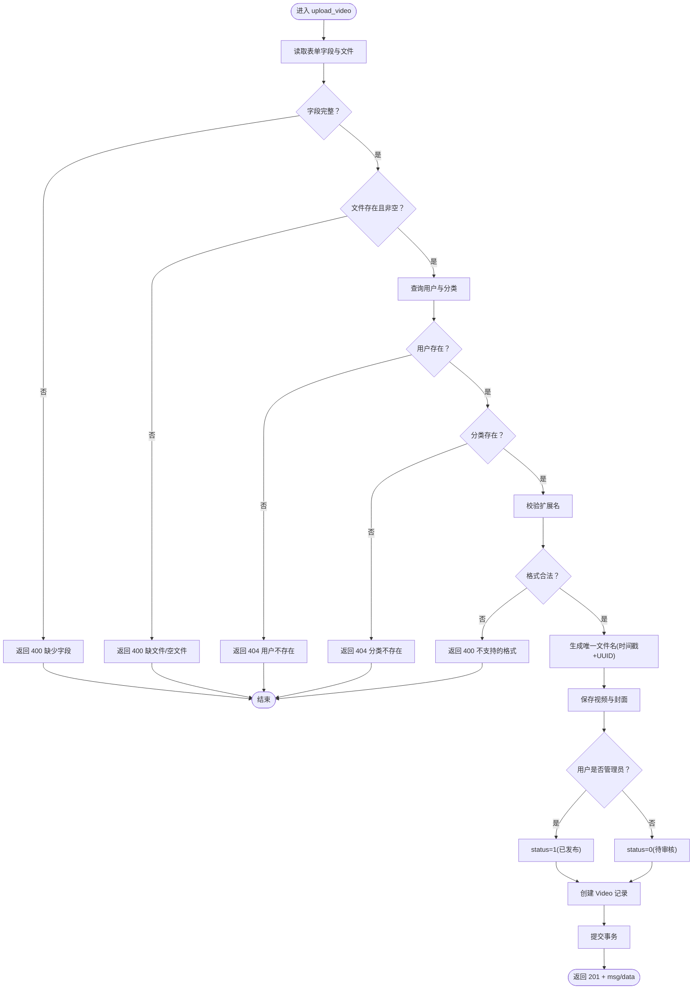
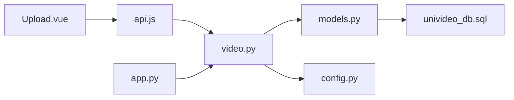

# 视频上传流程

<cite>
**本文引用的文件**
- [frontend/src/views/Upload.vue](file://frontend/src/views/Upload.vue)
- [frontend/src/api.js](file://frontend/src/api.js)
- [backend/routes/video.py](file://backend/routes/video.py)
- [backend/config.py](file://backend/config.py)
- [backend/models.py](file://backend/models.py)
- [backend/app.py](file://backend/app.py)
- [univideo_db.sql](file://univideo_db.sql)
</cite>

## 目录
1. [引言](#引言)
2. [项目结构](#项目结构)
3. [核心组件](#核心组件)
4. [架构总览](#架构总览)
5. [详细组件分析](#详细组件分析)
6. [依赖分析](#依赖分析)
7. [性能考虑](#性能考虑)
8. [故障排查指南](#故障排查指南)
9. [结论](#结论)
10. [附录](#附录)

## 引言
本文面向开发者，系统梳理“普通用户视频上传”的完整流程，从前端 Upload.vue 选择文件、填写标题与分类，到后端 /api/videos/upload 接口的多层校验与入库，重点覆盖：
- 前端如何构造 multipart/form-data 并调用上传接口
- 后端 upload_video() 的字段完整性、文件存在性、格式合法性校验
- 文件保存机制（时间戳 + UUID 生成唯一文件名、路径处理）
- 数据库记录创建与状态流转（普通用户上传后默认状态为“待审核”）
- 异常处理（事务回滚）、安全控制（文件类型限制）
- 未来权限增强建议（待审核视频的访问限制）

## 项目结构
- 前端位于 frontend/src/views/Upload.vue，负责表单与文件选择、预览与提交
- 前端 API 适配器在 frontend/src/api.js，统一注入基础地址与请求头
- 后端路由在 backend/routes/video.py，提供 /api/videos/upload 等接口
- 配置在 backend/config.py，包含上传目录、最大文件大小、允许的扩展名
- 模型在 backend/models.py，定义 Video、User、Category 等实体与状态常量
- 应用入口在 backend/app.py，注册蓝图、初始化目录与 CORS

图表来源
- [frontend/src/views/Upload.vue](file://frontend/src/views/Upload.vue#L145-L202)
- [frontend/src/api.js](file://frontend/src/api.js#L9-L20)
- [backend/routes/video.py](file://backend/routes/video.py#L37-L171)
- [backend/config.py](file://backend/config.py#L11-L30)
- [backend/models.py](file://backend/models.py#L113-L148)
- [backend/app.py](file://backend/app.py#L33-L58)
- [univideo_db.sql](file://univideo_db.sql#L23-L38)

章节来源
- [frontend/src/views/Upload.vue](file://frontend/src/views/Upload.vue#L1-L225)
- [frontend/src/api.js](file://frontend/src/api.js#L1-L41)
- [backend/routes/video.py](file://backend/routes/video.py#L1-L171)
- [backend/config.py](file://backend/config.py#L1-L30)
- [backend/models.py](file://backend/models.py#L113-L148)
- [backend/app.py](file://backend/app.py#L1-L60)
- [univideo_db.sql](file://univideo_db.sql#L1-L38)

## 核心组件
- 前端 Upload.vue
  - 表单字段：标题、简介、分类、视频文件、封面文件
  - 文件选择与预览：视频预览、Canvas 截帧生成封面
  - 提交逻辑：构建 FormData，调用 /api/videos/upload，处理响应与错误
- 后端 video.py
  - /api/videos/upload：接收 multipart/form-data，执行字段、文件、格式、用户与分类校验
  - 文件命名与保存：时间戳 + UUID 生成唯一文件名，分别保存至 videos 与 covers 子目录
  - 数据库写入：创建 Video 记录，普通用户默认 status=0（待审核）
  - 异常处理：捕获异常并回滚事务
- 配置 config.py
  - 上传目录、最大文件大小、允许的视频与图片扩展名
- 模型 models.py
  - Video 状态常量：STATUS_PENDING、STATUS_PUBLISHED、STATUS_REJECTED
- 应用入口 app.py
  - 注册蓝图、初始化上传目录（videos/covers/avatars）

章节来源
- [frontend/src/views/Upload.vue](file://frontend/src/views/Upload.vue#L145-L202)
- [backend/routes/video.py](file://backend/routes/video.py#L37-L171)
- [backend/config.py](file://backend/config.py#L11-L30)
- [backend/models.py](file://backend/models.py#L113-L148)
- [backend/app.py](file://backend/app.py#L33-L58)

## 架构总览
从前端到后端的数据流与控制流如下：

图表来源
- [frontend/src/views/Upload.vue](file://frontend/src/views/Upload.vue#L145-L202)
- [frontend/src/api.js](file://frontend/src/api.js#L9-L20)
- [backend/routes/video.py](file://backend/routes/video.py#L37-L171)
- [backend/config.py](file://backend/config.py#L11-L30)
- [backend/models.py](file://backend/models.py#L113-L148)

## 详细组件分析

### 前端：Upload.vue 表单与上传
- 表单字段与校验
  - 标题、分类、视频文件、封面文件为必填
  - 本地校验：未填写时弹窗提示
- 文件选择与预览
  - 视频文件选择后生成预览 URL
  - 封面文件选择后生成预览 URL
  - Canvas 截帧：从视频当前帧生成封面文件，更新封面预览
- 上传提交
  - 构造 FormData，包含 user_id、title、description、category_id、video_file、cover_file
  - 调用 api.post('/api/videos/upload', formData)，设置 Content-Type 为 multipart/form-data
  - 成功后弹窗提示并跳转首页；失败时弹窗显示后端返回的 msg

章节来源
- [frontend/src/views/Upload.vue](file://frontend/src/views/Upload.vue#L145-L202)
- [frontend/src/views/Upload.vue](file://frontend/src/views/Upload.vue#L280-L341)
- [frontend/src/views/Upload.vue](file://frontend/src/views/Upload.vue#L319-L341)

### 前端：API 适配器 api.js
- 基础地址：http://localhost:5001/api
- 请求拦截器：自动注入 X-User-ID 请求头，便于后端识别当前用户
- 默认 JSON Content-Type，但上传时由前端显式设置 multipart/form-data

章节来源
- [frontend/src/api.js](file://frontend/src/api.js#L9-L20)
- [frontend/src/api.js](file://frontend/src/api.js#L21-L41)

### 后端：video.py /api/videos/upload
- 请求方式：POST，接收 multipart/form-data
- 校验步骤
  - 必填字段：user_id、title、category_id 缺一不可
  - 文件存在性：video_file、cover_file 必须存在
  - 文件非空：文件名不能为空
  - 用户与分类有效性：查询 User 与 Category，不存在则返回 404
  - 文件格式合法性：基于 ALLOWED_VIDEO_EXTENSIONS 与 ALLOWED_IMAGE_EXTENSIONS
- 文件命名与保存
  - 时间戳 + UUID（取前 8 位）拼接唯一文件名
  - 视频保存至 videos 子目录，封面保存至 covers 子目录
  - 数据库存储相对路径：videos/{filename}、covers/{filename}
- 状态与角色
  - 若上传者为管理员：status=1（已发布）
  - 普通用户：status=0（待审核）
- 数据库写入
  - 创建 Video 记录并提交事务
- 异常处理
  - 捕获异常并回滚事务，返回 500

图表来源
- [backend/routes/video.py](file://backend/routes/video.py#L37-L171)

章节来源
- [backend/routes/video.py](file://backend/routes/video.py#L37-L171)

### 配置：config.py
- 上传目录：static（绝对路径）
- 最大上传大小：500MB
- 允许的视频扩展名：mp4、avi、mov、mkv、flv、wmv
- 允许的图片扩展名：jpg、jpeg、png、gif、webp

章节来源
- [backend/config.py](file://backend/config.py#L11-L30)

### 模型：models.py（Video 状态常量）
- 状态常量：STATUS_PENDING=0、STATUS_PUBLISHED=1、STATUS_REJECTED=2
- 字段：title、description、cover_path、video_path、status、view_count、created_at、user_id、category_id

章节来源
- [backend/models.py](file://backend/models.py#L113-L148)

### 应用入口：app.py
- 初始化数据库、Migrate、CORS
- 确保上传目录存在：videos、covers、avatars
- 注册蓝图：/api/videos、/api/admin、/api/users、/api

章节来源
- [backend/app.py](file://backend/app.py#L33-L58)

### 数据库：univideo_db.sql
- videos 表含 status 字段，默认 0（待审核），并建立索引以优化审核查询
- users、categories、comments、likes、collections 表结构

章节来源
- [univideo_db.sql](file://univideo_db.sql#L23-L38)

## 依赖分析
- 前端
  - Upload.vue 依赖 api.js 进行网络请求
- 后端
  - video.py 依赖 models.py 中的 User、Category、Video
  - video.py 依赖 config.py 中的 ALLOWED_VIDEO_EXTENSIONS、ALLOWED_IMAGE_EXTENSIONS、UPLOAD_FOLDER
  - app.py 注册 video 蓝图并初始化上传目录
- 数据库
  - Video 与 users、categories 的外键关系，videos.status 用于“先审后发”

图表来源
- [frontend/src/views/Upload.vue](file://frontend/src/views/Upload.vue#L145-L202)
- [frontend/src/api.js](file://frontend/src/api.js#L9-L20)
- [backend/routes/video.py](file://backend/routes/video.py#L37-L171)
- [backend/models.py](file://backend/models.py#L113-L148)
- [backend/config.py](file://backend/config.py#L11-L30)
- [backend/app.py](file://backend/app.py#L33-L58)
- [univideo_db.sql](file://univideo_db.sql#L23-L38)

章节来源
- [frontend/src/views/Upload.vue](file://frontend/src/views/Upload.vue#L145-L202)
- [frontend/src/api.js](file://frontend/src/api.js#L9-L20)
- [backend/routes/video.py](file://backend/routes/video.py#L37-L171)
- [backend/models.py](file://backend/models.py#L113-L148)
- [backend/config.py](file://backend/config.py#L11-L30)
- [backend/app.py](file://backend/app.py#L33-L58)
- [univideo_db.sql](file://univideo_db.sql#L23-L38)

## 性能考虑
- 文件大小限制：MAX_CONTENT_LENGTH=500MB，避免过大请求导致内存压力
- 目录结构：按类型分目录（videos/covers/avatars），便于维护与清理
- 数据库索引：videos.status 建立索引，提升审核列表查询效率
- 唯一文件名：时间戳 + UUID，降低文件名冲突概率，简化并发场景下的重名问题

章节来源
- [backend/config.py](file://backend/config.py#L11-L30)
- [backend/app.py](file://backend/app.py#L33-L58)
- [univideo_db.sql](file://univideo_db.sql#L33-L38)

## 故障排查指南
- 常见错误与定位
  - 400 缺少字段/文件：确认前端是否正确 append user_id、title、category_id、video_file、cover_file
  - 400 不支持的格式：检查扩展名是否在 ALLOWED_VIDEO_EXTENSIONS 或 ALLOWED_IMAGE_EXTENSIONS
  - 404 用户/分类不存在：确认 user_id 与 category_id 是否有效
  - 500 服务器错误：后端捕获异常并回滚事务，检查日志与磁盘空间、权限
- 前端提示
  - Upload.vue 对必填项与文件存在性进行本地校验，减少无效请求
- 后端健壮性
  - 事务回滚：异常发生时回滚，避免脏数据
  - 目录初始化：app.py 启动时确保上传目录存在

章节来源
- [frontend/src/views/Upload.vue](file://frontend/src/views/Upload.vue#L145-L202)
- [backend/routes/video.py](file://backend/routes/video.py#L37-L171)
- [backend/app.py](file://backend/app.py#L33-L58)

## 结论
本方案以“先审后发”为核心业务规则：普通用户上传后默认 status=0（待审核），管理员可批量审核通过或驳回。前端通过 Upload.vue 与 api.js 构造 multipart/form-data，后端在 video.py 中完成严格的多层校验与安全控制，并采用时间戳 + UUID 生成唯一文件名，确保文件系统与数据库的一致性。未来可在视频详情接口增加权限控制，仅允许上传者与管理员查看待审核视频，进一步完善审核流程的安全性与可控性。

## 附录

### API 定义（上传接口）
- 路径：/api/videos/upload
- 方法：POST
- 内容类型：multipart/form-data
- 请求体字段：
  - user_id: string（必填）
  - title: string（必填）
  - description: string（可选）
  - category_id: string（必填）
  - video_file: file（必填）
  - cover_file: file（必填）
- 响应：
  - code: number（200/400/404/500）
  - msg: string（提示信息）
  - data: object（包含 id、title、status、is_admin）

章节来源
- [frontend/src/views/Upload.vue](file://frontend/src/views/Upload.vue#L174-L199)
- [backend/routes/video.py](file://backend/routes/video.py#L37-L171)

### 安全与合规建议
- 文件类型限制：严格基于 ALLOWED_VIDEO_EXTENSIONS 与 ALLOWED_IMAGE_EXTENSIONS
- 文件大小限制：MAX_CONTENT_LENGTH 控制请求体积
- 访问控制：待审核视频仅允许上传者与管理员查看（建议在视频详情接口增加权限判断）
- 日志审计：记录上传、审核关键操作，便于追踪与复盘

章节来源
- [backend/config.py](file://backend/config.py#L11-L30)
- [backend/routes/video.py](file://backend/routes/video.py#L228-L282)