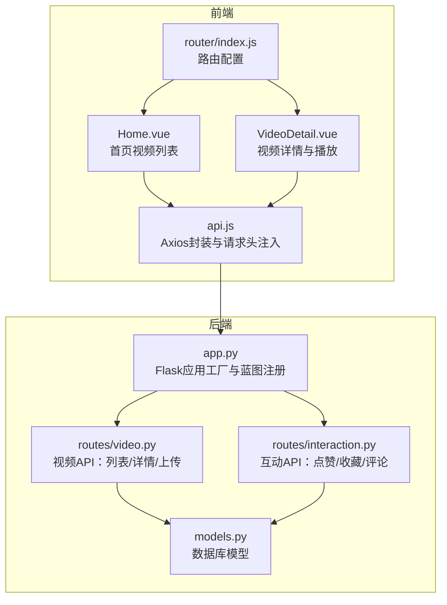

# 视频浏览与播放

<cite>
**本文引用的文件**
- [frontend/src/views/Home.vue](file://frontend/src/views/Home.vue)
- [frontend/src/views/VideoDetail.vue](file://frontend/src/views/VideoDetail.vue)
- [frontend/src/router/index.js](file://frontend/src/router/index.js)
- [frontend/src/api.js](file://frontend/src/api.js)
- [backend/routes/video.py](file://backend/routes/video.py)
- [backend/routes/interaction.py](file://backend/routes/interaction.py)
- [backend/app.py](file://backend/app.py)
- [backend/models.py](file://backend/models.py)
</cite>

## 目录
1. [简介](#简介)
2. [项目结构](#项目结构)
3. [核心组件](#核心组件)
4. [架构总览](#架构总览)
5. [详细组件分析](#详细组件分析)
6. [依赖分析](#依赖分析)
7. [性能考虑](#性能考虑)
8. [故障排查指南](#故障排查指南)
9. [结论](#结论)
10. [附录](#附录)

## 简介
本文件系统化梳理UniVideo平台的视频浏览与播放体验，围绕以下关键流程展开：
- 首页加载推荐视频列表：Home.vue在页面初始化时调用后端接口获取公开视频数据流，并渲染视频网格。
- 视频详情页：用户点击视频卡片后跳转至VideoDetail.vue，通过路由参数携带视频ID，组件发起详情接口调用，后端get_video_detail()返回视频元信息并递增播放量。
- 路由控制：goToUpload等导航方法由Home.vue触发，统一通过vue-router进行页面跳转。
- URL拼接与静态资源访问：VideoDetail.vue对视频URL和封面URL采用“http://localhost:5001/static/”前缀拼接，结合后端蓝图注册与静态文件服务实现资源访问。
- 安全与访问控制：当前后端对未发布视频（待审核）缺少严格的访问控制（存在TODO注释），建议引入基于X-User-ID的鉴权策略，确保仅上传者与管理员可预览未发布内容。

## 项目结构
前端与后端分层清晰，前端负责UI与交互，后端提供REST风格API与静态资源服务。

图表来源
- [frontend/src/views/Home.vue](file://frontend/src/views/Home.vue#L1-L130)
- [frontend/src/views/VideoDetail.vue](file://frontend/src/views/VideoDetail.vue#L1-L120)
- [frontend/src/router/index.js](file://frontend/src/router/index.js#L1-L56)
- [frontend/src/api.js](file://frontend/src/api.js#L1-L41)
- [backend/app.py](file://backend/app.py#L1-L60)
- [backend/routes/video.py](file://backend/routes/video.py#L1-L60)
- [backend/routes/interaction.py](file://backend/routes/interaction.py#L1-L40)
- [backend/models.py](file://backend/models.py#L113-L198)

章节来源
- [frontend/src/views/Home.vue](file://frontend/src/views/Home.vue#L1-L130)
- [frontend/src/views/VideoDetail.vue](file://frontend/src/views/VideoDetail.vue#L1-L120)
- [frontend/src/router/index.js](file://frontend/src/router/index.js#L1-L56)
- [frontend/src/api.js](file://frontend/src/api.js#L1-L41)
- [backend/app.py](file://backend/app.py#L1-L60)

## 核心组件
- 首页组件（Home.vue）
  - 负责分类与视频列表的获取、搜索与筛选、导航跳转（上传、管理后台、个人主页、退出登录）、跳转到视频详情。
  - 初始化时同时获取分类与视频列表，支持关键词与分类筛选。
- 视频详情组件（VideoDetail.vue）
  - 负责视频详情、播放器、点赞/收藏、评论区、返回首页等交互。
  - 使用工具函数对视频与封面URL进行“http://localhost:5001/static/”前缀拼接。
- 路由（router/index.js）
  - 定义首页、登录、注册、上传、视频详情、管理后台、个人主页等路由。
- API封装（api.js）
  - 统一基地址为http://localhost:5001/api，请求拦截器自动注入X-User-ID请求头，便于后端鉴权。

章节来源
- [frontend/src/views/Home.vue](file://frontend/src/views/Home.vue#L1-L130)
- [frontend/src/views/VideoDetail.vue](file://frontend/src/views/VideoDetail.vue#L1-L120)
- [frontend/src/router/index.js](file://frontend/src/router/index.js#L1-L56)
- [frontend/src/api.js](file://frontend/src/api.js#L1-L41)

## 架构总览
从前端到后端的数据流与交互如下：

图表来源
- [frontend/src/views/Home.vue](file://frontend/src/views/Home.vue#L47-L71)
- [frontend/src/router/index.js](file://frontend/src/router/index.js#L28-L39)
- [frontend/src/views/VideoDetail.vue](file://frontend/src/views/VideoDetail.vue#L108-L180)
- [frontend/src/api.js](file://frontend/src/api.js#L1-L41)
- [backend/routes/video.py](file://backend/routes/video.py#L173-L226)
- [backend/routes/interaction.py](file://backend/routes/interaction.py#L195-L239)
- [backend/models.py](file://backend/models.py#L113-L198)

## 详细组件分析

### 首页加载与推荐视频列表
- 初始化流程
  - 首页mounted时分别调用分类与视频列表接口，支持关键词与分类筛选。
  - 视频列表接口仅返回已发布状态的视频，避免未审核内容泄露。
- 关键点
  - 搜索与筛选参数通过GET请求传递至后端。
  - 列表项点击后通过路由跳转至视频详情页。

章节来源
- [frontend/src/views/Home.vue](file://frontend/src/views/Home.vue#L31-L108)
- [frontend/src/router/index.js](file://frontend/src/router/index.js#L28-L39)
- [backend/routes/video.py](file://backend/routes/video.py#L173-L226)

### 视频详情页与播放器
- 详情加载
  - 组件在mounted时调用详情接口，同时异步获取点赞/收藏状态与评论列表。
  - 详情接口每次访问会递增播放量。
- URL拼接与静态资源
  - VideoDetail.vue内部工具函数对视频与封面路径进行“http://localhost:5001/static/”前缀拼接，形成可直接访问的静态URL。
  - 后端在返回数据时也拼接了完整静态URL，前端可直接使用。
- 互动功能
  - 点赞/收藏/评论均通过独立接口完成，均需登录态（前端在未登录时会引导登录）。

章节来源
- [frontend/src/views/VideoDetail.vue](file://frontend/src/views/VideoDetail.vue#L1-L120)
- [frontend/src/views/VideoDetail.vue](file://frontend/src/views/VideoDetail.vue#L108-L180)
- [backend/routes/video.py](file://backend/routes/video.py#L228-L282)
- [backend/routes/interaction.py](file://backend/routes/interaction.py#L195-L239)

### 路由控制与页面跳转
- 首页导航
  - goToUpload/goToAdmin/goToProfile/logout/goToVideo等方法统一通过router.push进行跳转。
- 路由定义
  - 首页、登录、注册、上传、视频详情、管理后台、个人主页均有明确路由映射。

章节来源
- [frontend/src/views/Home.vue](file://frontend/src/views/Home.vue#L88-L125)
- [frontend/src/router/index.js](file://frontend/src/router/index.js#L1-L56)

### 视频URL拼接规则与静态文件访问机制
- 前端拼接
  - VideoDetail.vue内部工具函数对相对路径进行“http://localhost:5001/static/”前缀拼接，形成可访问的视频与封面URL。
- 后端拼接
  - 列表与详情接口在返回数据时，已将cover_path与video_path拼接为完整静态URL，便于前端直接使用。
- 静态文件服务
  - 后端通过蓝图注册与应用工厂启动，提供静态文件服务，使上传的视频与封面可通过上述URL访问。

章节来源
- [frontend/src/views/VideoDetail.vue](file://frontend/src/views/VideoDetail.vue#L46-L54)
- [backend/routes/video.py](file://backend/routes/video.py#L205-L214)
- [backend/app.py](file://backend/app.py#L39-L58)

### 访问控制与安全建议（待审核视频）
- 现状
  - 后端在获取视频详情时，对status=0（待审核）的视频存在TODO注释，尚未实现访问控制逻辑。
  - 前端通过请求拦截器自动注入X-User-ID请求头，但后端未在该接口中读取并校验该头部。
- 风险
  - 未发布的视频可能被任意用户访问，存在内容泄露风险。
- 建议
  - 在后端get_video_detail()中读取X-User-ID，仅允许视频上传者本人或管理员查看status=0的视频。
  - 若用户非上传者且非管理员，返回403禁止访问。
  - 该策略与前端localStorage中存储的user_id一致，便于前后端协同鉴权。

章节来源
- [backend/routes/video.py](file://backend/routes/video.py#L228-L282)
- [frontend/src/api.js](file://frontend/src/api.js#L1-L41)

## 依赖分析
- 前端依赖
  - Home.vue依赖api.js与router/index.js；VideoDetail.vue同样依赖api.js与router/index.js。
  - api.js依赖axios，统一设置baseURL与请求头。
- 后端依赖
  - app.py注册视频与互动蓝图，routes/video.py与routes/interaction.py依赖models.py中的Video/User/Comment/Like/Collection等模型。
- 前后端耦合
  - 前端通过固定baseURL与静态URL前缀与后端API对接；后端通过蓝图前缀与路由路径与前端约定一致。

图表来源
- [frontend/src/api.js](file://frontend/src/api.js#L1-L41)
- [frontend/src/views/Home.vue](file://frontend/src/views/Home.vue#L1-L130)
- [frontend/src/views/VideoDetail.vue](file://frontend/src/views/VideoDetail.vue#L1-L120)
- [backend/app.py](file://backend/app.py#L39-L58)
- [backend/routes/video.py](file://backend/routes/video.py#L1-L60)
- [backend/routes/interaction.py](file://backend/routes/interaction.py#L1-L40)
- [backend/models.py](file://backend/models.py#L113-L198)

章节来源
- [frontend/src/api.js](file://frontend/src/api.js#L1-L41)
- [backend/app.py](file://backend/app.py#L39-L58)
- [backend/routes/video.py](file://backend/routes/video.py#L1-L60)
- [backend/routes/interaction.py](file://backend/routes/interaction.py#L1-L40)
- [backend/models.py](file://backend/models.py#L113-L198)

## 性能考虑
- 列表查询
  - 后端对已发布视频进行过滤与排序，避免未审核内容参与渲染，减少前端无效数据处理。
- 播放量更新
  - 每次详情访问递增播放量，建议在高并发场景下考虑幂等写入与缓存策略，避免重复计数。
- 静态资源
  - 视频与封面通过静态文件服务提供，建议配合CDN与合理的缓存策略提升加载速度。

## 故障排查指南
- 无法加载视频列表
  - 检查前端baseURL与后端蓝图前缀是否一致。
  - 确认后端是否已注册视频蓝图并启动服务。
- 视频播放器无法显示
  - 检查VideoDetail.vue中URL拼接逻辑与后端返回的静态URL是否匹配。
  - 确认静态文件目录存在且文件已上传成功。
- 未发布视频可被访问
  - 按照安全建议在后端实现基于X-User-ID的访问控制，仅允许上传者与管理员查看status=0的视频。
- 互动功能异常
  - 确认前端已登录且localStorage中存在user_id，请求拦截器已注入X-User-ID。
  - 检查后端互动蓝图路由是否正确注册。

章节来源
- [frontend/src/api.js](file://frontend/src/api.js#L1-L41)
- [frontend/src/views/VideoDetail.vue](file://frontend/src/views/VideoDetail.vue#L46-L54)
- [backend/routes/video.py](file://backend/routes/video.py#L228-L282)
- [backend/app.py](file://backend/app.py#L39-L58)

## 结论
UniVideo平台的视频浏览与播放流程清晰：首页通过公开接口加载已发布视频，用户点击后进入详情页并播放视频。前端与后端通过统一的API约定与静态URL前缀协作，实现了稳定的资源访问。当前存在的主要风险是未发布视频缺乏访问控制，建议尽快在后端实现基于X-User-ID的身份鉴权策略，确保仅上传者与管理员可预览未发布内容，从而提升整体安全性与合规性。

## 附录
- 关键接口与行为摘要
  - 首页视频列表：GET /api/videos/list（仅已发布）
  - 视频详情：GET /api/videos/:id（每次访问递增播放量）
  - 互动状态：GET /api/videos/:id/like/status、GET /api/videos/:id/collect/status
  - 评论列表：GET /api/videos/:id/comments
  - URL前缀：http://localhost:5001/static/