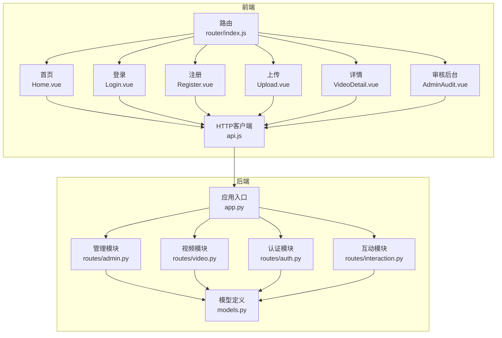
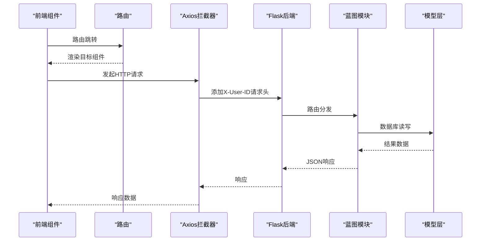
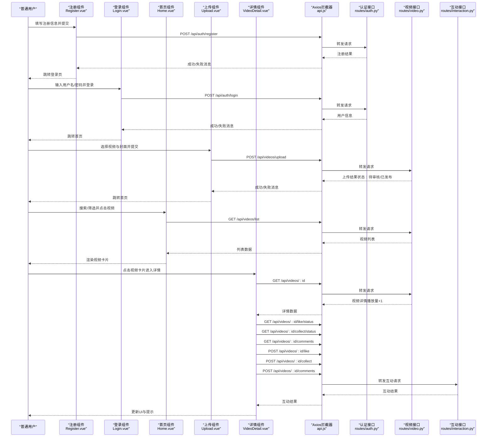
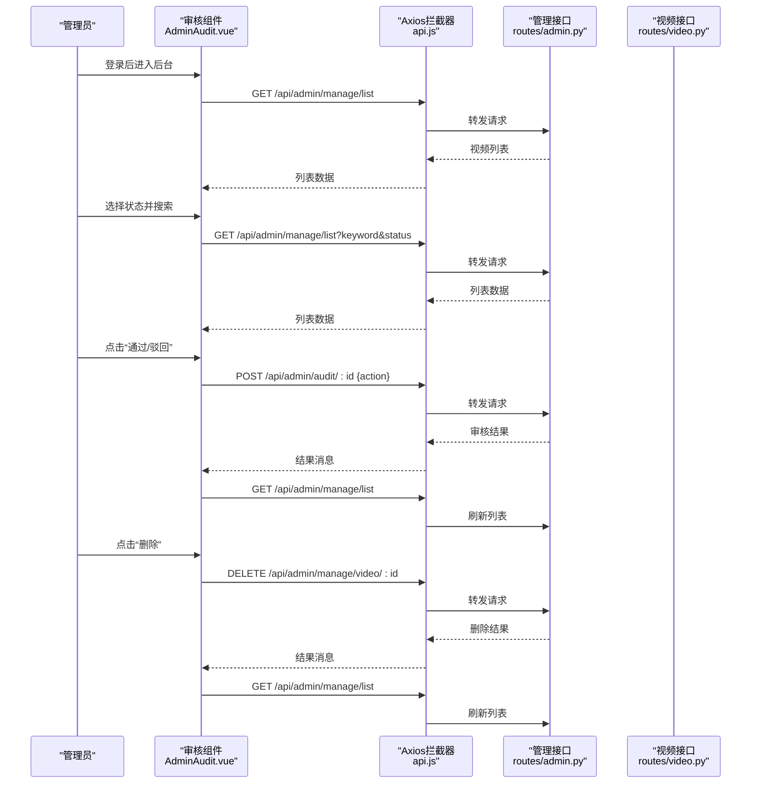
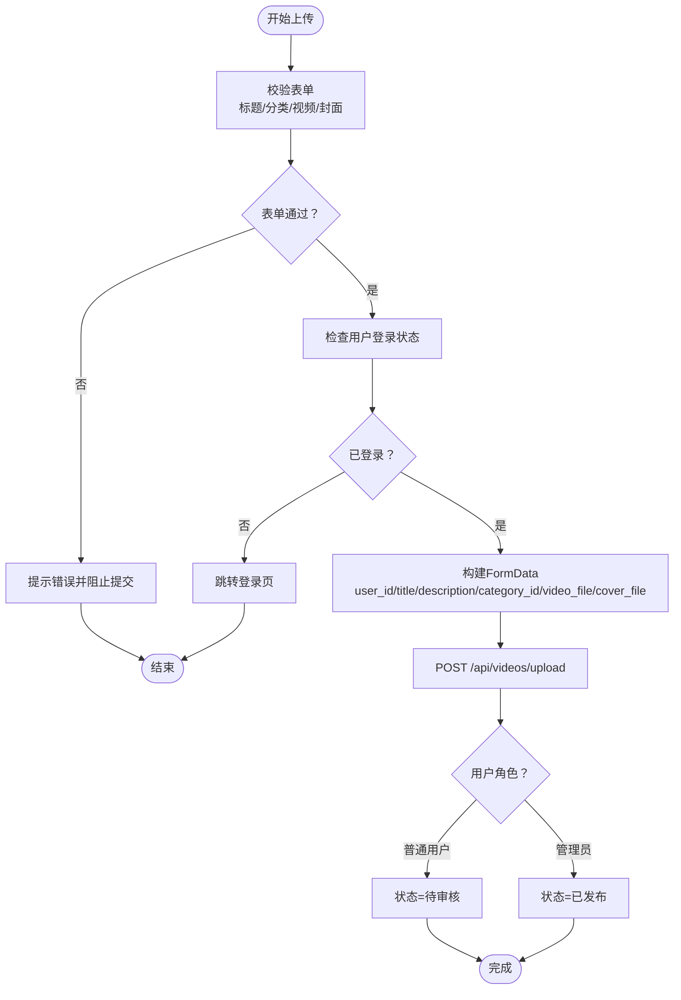
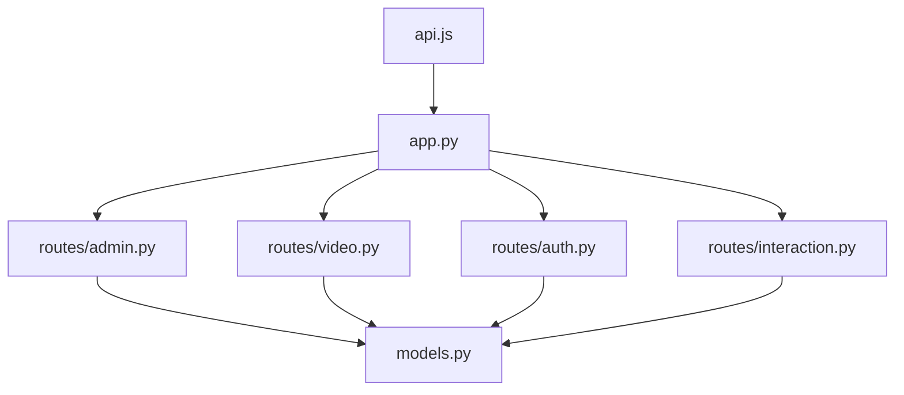

# 用户工作流

<cite>
**本文引用的文件**
- [frontend/src/router/index.js](file://frontend/src/router/index.js)
- [frontend/src/views/Home.vue](file://frontend/src/views/Home.vue)
- [frontend/src/views/Login.vue](file://frontend/src/views/Login.vue)
- [frontend/src/views/Register.vue](file://frontend/src/views/Register.vue)
- [frontend/src/views/Upload.vue](file://frontend/src/views/Upload.vue)
- [frontend/src/views/VideoDetail.vue](file://frontend/src/views/VideoDetail.vue)
- [frontend/src/views/AdminAudit.vue](file://frontend/src/views/AdminAudit.vue)
- [frontend/src/api.js](file://frontend/src/api.js)
- [backend/app.py](file://backend/app.py)
- [backend/routes/auth.py](file://backend/routes/auth.py)
- [backend/routes/video.py](file://backend/routes/video.py)
- [backend/routes/interaction.py](file://backend/routes/interaction.py)
- [backend/routes/admin.py](file://backend/routes/admin.py)
- [backend/models.py](file://backend/models.py)
</cite>

## 目录
1. [引言](#引言)
2. [项目结构](#项目结构)
3. [核心组件](#核心组件)
4. [架构总览](#架构总览)
5. [详细组件分析](#详细组件分析)
6. [依赖分析](#依赖分析)
7. [性能考虑](#性能考虑)
8. [故障排查指南](#故障排查指南)
9. [结论](#结论)
10. [附录](#附录)

## 引言
本文件系统梳理 UniVideo 平台的关键用户操作流程，覆盖普通用户与管理员两类角色的典型使用路径，并结合前端 Vue 组件的跳转逻辑与状态变化，图示化展示各步骤间的页面流转与数据传递。同时，针对上传失败、审核拒绝等边界情况进行说明，并给出系统反馈机制，帮助开发者理解用户体验设计背后的逻辑。

## 项目结构
- 前端采用 Vue 3 + Vite，通过路由驱动页面跳转，组件负责渲染与交互。
- 后端采用 Flask，提供 REST API，蓝图划分认证、视频、互动、管理员等模块。
- 前端通过 Axios 实例统一发起请求，后端通过 X-User-ID 请求头透传用户身份。

图表来源
- [frontend/src/router/index.js](file://frontend/src/router/index.js#L1-L56)
- [frontend/src/views/Home.vue](file://frontend/src/views/Home.vue#L1-L131)
- [frontend/src/views/Login.vue](file://frontend/src/views/Login.vue#L1-L53)
- [frontend/src/views/Register.vue](file://frontend/src/views/Register.vue#L1-L55)
- [frontend/src/views/Upload.vue](file://frontend/src/views/Upload.vue#L1-L225)
- [frontend/src/views/VideoDetail.vue](file://frontend/src/views/VideoDetail.vue#L1-L328)
- [frontend/src/views/AdminAudit.vue](file://frontend/src/views/AdminAudit.vue#L1-L205)
- [frontend/src/api.js](file://frontend/src/api.js#L1-L41)
- [backend/app.py](file://backend/app.py#L1-L60)
- [backend/routes/auth.py](file://backend/routes/auth.py#L1-L184)
- [backend/routes/video.py](file://backend/routes/video.py#L1-L282)
- [backend/routes/interaction.py](file://backend/routes/interaction.py#L1-L408)
- [backend/routes/admin.py](file://backend/routes/admin.py#L1-L245)
- [backend/models.py](file://backend/models.py#L1-L343)

章节来源
- [frontend/src/router/index.js](file://frontend/src/router/index.js#L1-L56)
- [backend/app.py](file://backend/app.py#L1-L60)

## 核心组件
- 路由与页面跳转：前端路由定义了首页、登录、注册、上传、视频详情、管理员后台等页面，组件内部通过 router.push 实现页面跳转。
- 用户认证：登录/注册组件调用后端认证接口，成功后将用户信息写入 localStorage，并跳转首页。
- 视频上传：上传组件负责表单校验、文件选择与预览、封面截取、FormData 提交，后端根据用户角色决定状态（待审核/已发布）。
- 视频浏览与互动：首页组件负责分类与搜索筛选，详情页负责播放、点赞、收藏、评论树形展示。
- 管理后台：管理员后台负责视频列表、搜索筛选、审核（通过/驳回）、删除等操作。

章节来源
- [frontend/src/views/Home.vue](file://frontend/src/views/Home.vue#L1-L131)
- [frontend/src/views/Login.vue](file://frontend/src/views/Login.vue#L1-L53)
- [frontend/src/views/Register.vue](file://frontend/src/views/Register.vue#L1-L55)
- [frontend/src/views/Upload.vue](file://frontend/src/views/Upload.vue#L1-L225)
- [frontend/src/views/VideoDetail.vue](file://frontend/src/views/VideoDetail.vue#L1-L328)
- [frontend/src/views/AdminAudit.vue](file://frontend/src/views/AdminAudit.vue#L1-L205)

## 架构总览
前后端通过 REST API 通信，前端通过拦截器在请求头注入 X-User-ID，后端据此识别当前用户身份，实现“简化版”鉴权。

图表来源
- [frontend/src/api.js](file://frontend/src/api.js#L1-L41)
- [backend/app.py](file://backend/app.py#L1-L60)
- [backend/routes/auth.py](file://backend/routes/auth.py#L1-L184)
- [backend/routes/video.py](file://backend/routes/video.py#L1-L282)
- [backend/routes/interaction.py](file://backend/routes/interaction.py#L1-L408)
- [backend/routes/admin.py](file://backend/routes/admin.py#L1-L245)
- [backend/models.py](file://backend/models.py#L1-L343)

## 详细组件分析

### 普通用户工作流（注册→登录→上传→浏览→播放→互动）
- 注册与登录
  - 注册：前端校验必填与密码长度，调用后端注册接口，成功后提示并跳转登录页。
  - 登录：前端校验表单，调用后端登录接口，成功后将用户信息存入 localStorage 并跳转首页。
- 浏览与搜索
  - 首页加载分类与视频列表，支持关键词与分类筛选，点击视频卡片跳转详情页。
- 上传视频
  - 上传页加载分类，选择视频与封面（支持手动选择或截取当前帧），提交时进行表单校验与用户身份校验，后端根据角色设置状态（普通用户上传默认待审核，管理员直接发布）。
- 播放与互动
  - 详情页加载视频信息、播放量+1、点赞/收藏状态与评论列表；支持发表评论与回复评论；未登录用户在互动时会被引导登录。

图表来源
- [frontend/src/views/Register.vue](file://frontend/src/views/Register.vue#L1-L55)
- [frontend/src/views/Login.vue](file://frontend/src/views/Login.vue#L1-L53)
- [frontend/src/views/Home.vue](file://frontend/src/views/Home.vue#L1-L131)
- [frontend/src/views/Upload.vue](file://frontend/src/views/Upload.vue#L1-L225)
- [frontend/src/views/VideoDetail.vue](file://frontend/src/views/VideoDetail.vue#L1-L328)
- [frontend/src/api.js](file://frontend/src/api.js#L1-L41)
- [backend/routes/auth.py](file://backend/routes/auth.py#L1-L184)
- [backend/routes/video.py](file://backend/routes/video.py#L1-L282)
- [backend/routes/interaction.py](file://backend/routes/interaction.py#L1-L408)

章节来源
- [frontend/src/views/Register.vue](file://frontend/src/views/Register.vue#L1-L55)
- [frontend/src/views/Login.vue](file://frontend/src/views/Login.vue#L1-L53)
- [frontend/src/views/Home.vue](file://frontend/src/views/Home.vue#L1-L131)
- [frontend/src/views/Upload.vue](file://frontend/src/views/Upload.vue#L1-L225)
- [frontend/src/views/VideoDetail.vue](file://frontend/src/views/VideoDetail.vue#L1-L328)
- [frontend/src/api.js](file://frontend/src/api.js#L1-L41)
- [backend/routes/auth.py](file://backend/routes/auth.py#L1-L184)
- [backend/routes/video.py](file://backend/routes/video.py#L1-L282)
- [backend/routes/interaction.py](file://backend/routes/interaction.py#L1-L408)

### 管理员后台工作流（登录→审核→管理已发布视频）
- 登录与权限校验
  - 管理员登录后进入后台，组件在 mounted 中校验角色，非管理员将被提示并返回首页。
- 视频管理
  - 列表加载：支持关键词搜索与状态筛选（待审核/已发布/已驳回）。
  - 审核：对“待审核”视频执行“通过/驳回”，后端更新状态并返回结果。
  - 删除：支持删除视频，后端尝试删除物理文件并清理数据库记录。

图表来源
- [frontend/src/views/AdminAudit.vue](file://frontend/src/views/AdminAudit.vue#L1-L205)
- [frontend/src/api.js](file://frontend/src/api.js#L1-L41)
- [backend/routes/admin.py](file://backend/routes/admin.py#L1-L245)
- [backend/routes/video.py](file://backend/routes/video.py#L1-L282)

章节来源
- [frontend/src/views/AdminAudit.vue](file://frontend/src/views/AdminAudit.vue#L1-L205)
- [frontend/src/api.js](file://frontend/src/api.js#L1-L41)
- [backend/routes/admin.py](file://backend/routes/admin.py#L1-L245)
- [backend/routes/video.py](file://backend/routes/video.py#L1-L282)

### 上传流程细节与边界情况
- 表单校验与文件处理
  - 标题、分类、视频文件、封面文件必填校验；封面可手动选择或从视频截取当前帧。
  - 上传前检查用户登录状态，未登录则跳转登录页。
- 后端状态决策
  - 普通用户上传：默认状态为“待审核”，提示“等待管理员审核”。
  - 管理员上传：默认状态为“已发布”，提示“视频上传成功，已直接发布”。

图表来源
- [frontend/src/views/Upload.vue](file://frontend/src/views/Upload.vue#L1-L225)
- [backend/routes/video.py](file://backend/routes/video.py#L1-L171)

章节来源
- [frontend/src/views/Upload.vue](file://frontend/src/views/Upload.vue#L1-L225)
- [backend/routes/video.py](file://backend/routes/video.py#L1-L171)

### 审核拒绝与系统反馈
- 审核拒绝
  - 管理员在后台对“待审核”视频执行“驳回”，后端将状态更新为“已驳回”，并返回结果。
  - 驳回后，普通用户在首页无法看到该视频（后端仅返回已发布状态的视频列表）。
- 系统反馈
  - 前端通过 alert 显示后端返回的消息；列表刷新后自动反映最新状态。
  - 详情页对未登录用户进行拦截，引导登录后再进行互动。

章节来源
- [frontend/src/views/AdminAudit.vue](file://frontend/src/views/AdminAudit.vue#L1-L205)
- [backend/routes/admin.py](file://backend/routes/admin.py#L1-L173)
- [backend/routes/video.py](file://backend/routes/video.py#L1-L226)
- [frontend/src/views/VideoDetail.vue](file://frontend/src/views/VideoDetail.vue#L1-L328)

## 依赖分析
- 前端依赖
  - 路由依赖：router/index.js 定义页面映射，组件内通过 router.push 跳转。
  - API 依赖：api.js 统一配置 baseURL、超时与请求头注入 X-User-ID。
  - 组件依赖：各页面组件依赖后端接口返回的数据结构，如视频列表、评论树、点赞/收藏状态等。
- 后端依赖
  - 应用入口：app.py 注册蓝图，初始化 CORS、数据库与上传目录。
  - 蓝图依赖：auth、video、interaction、admin 模块各自处理业务逻辑与模型交互。
  - 模型依赖：models.py 定义 User、Category、Video、Comment、Like、Collection 等实体及其关系。

图表来源
- [frontend/src/api.js](file://frontend/src/api.js#L1-L41)
- [backend/app.py](file://backend/app.py#L1-L60)
- [backend/routes/auth.py](file://backend/routes/auth.py#L1-L184)
- [backend/routes/video.py](file://backend/routes/video.py#L1-L282)
- [backend/routes/interaction.py](file://backend/routes/interaction.py#L1-L408)
- [backend/routes/admin.py](file://backend/routes/admin.py#L1-L245)
- [backend/models.py](file://backend/models.py#L1-L343)

章节来源
- [frontend/src/api.js](file://frontend/src/api.js#L1-L41)
- [backend/app.py](file://backend/app.py#L1-L60)
- [backend/models.py](file://backend/models.py#L1-L343)

## 性能考虑
- 前端
  - 首页视频列表与分类加载采用懒加载与空状态提示，减少首屏压力。
  - 上传页在预览与截取封面时注意释放 Object URL，避免内存泄漏。
  - 详情页对评论树进行一次性计算，避免重复渲染。
- 后端
  - 视频列表仅查询已发布状态并按时间倒序，降低查询复杂度。
  - 上传接口对文件类型进行白名单校验，避免非法扩展名导致的存储与解析问题。
  - 审核接口对重复审核进行保护，避免状态异常。

[本节为通用建议，无需列出具体文件来源]

## 故障排查指南
- 登录失败
  - 检查用户名/密码是否为空，确认后端返回的错误消息。
  - 确认前端已将用户信息写入 localStorage 并跳转首页。
- 上传失败
  - 检查必填字段与文件类型是否符合后端要求。
  - 确认用户已登录，且后端根据角色返回了正确的状态提示。
- 审核异常
  - 若视频状态非“待审核”，再次审核将被拒绝，需检查当前状态。
  - 删除视频时若物理文件删除失败，数据库仍会删除记录，需检查文件系统权限。
- 详情页互动
  - 未登录用户进行点赞/收藏/评论会被提示登录。
  - 评论树加载失败时，前端会清空列表并输出错误提示。

章节来源
- [frontend/src/views/Login.vue](file://frontend/src/views/Login.vue#L1-L53)
- [frontend/src/views/Register.vue](file://frontend/src/views/Register.vue#L1-L55)
- [frontend/src/views/Upload.vue](file://frontend/src/views/Upload.vue#L1-L225)
- [frontend/src/views/AdminAudit.vue](file://frontend/src/views/AdminAudit.vue#L1-L205)
- [frontend/src/views/VideoDetail.vue](file://frontend/src/views/VideoDetail.vue#L1-L328)
- [backend/routes/video.py](file://backend/routes/video.py#L1-L171)
- [backend/routes/admin.py](file://backend/routes/admin.py#L1-L173)

## 结论
UniVideo 的用户工作流围绕“先审后发”的策略展开：普通用户通过注册/登录完成身份建立，上传视频后进入“待审核”状态；管理员在后台进行审核与管理；最终普通用户可在首页浏览已发布的视频并进行互动。前后端通过统一的 API 与请求头实现简化的身份透传，组件间通过路由与状态管理完成流畅的页面流转与数据传递。针对上传失败、审核拒绝等边界情况，系统通过明确的错误提示与状态反馈保障用户体验。

[本节为总结性内容，无需列出具体文件来源]

## 附录
- 关键接口与职责
  - 认证：注册、登录、获取当前用户信息。
  - 视频：获取分类、上传视频、获取视频列表、获取视频详情。
  - 互动：发表评论、点赞/取消点赞、收藏/取消收藏、获取评论列表与状态。
  - 管理：获取视频管理列表、获取待审核列表、审核视频、删除视频。

章节来源
- [backend/routes/auth.py](file://backend/routes/auth.py#L1-L184)
- [backend/routes/video.py](file://backend/routes/video.py#L1-L282)
- [backend/routes/interaction.py](file://backend/routes/interaction.py#L1-L408)
- [backend/routes/admin.py](file://backend/routes/admin.py#L1-L245)