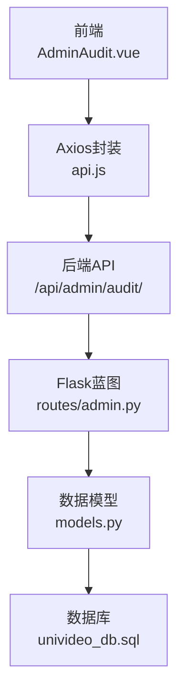
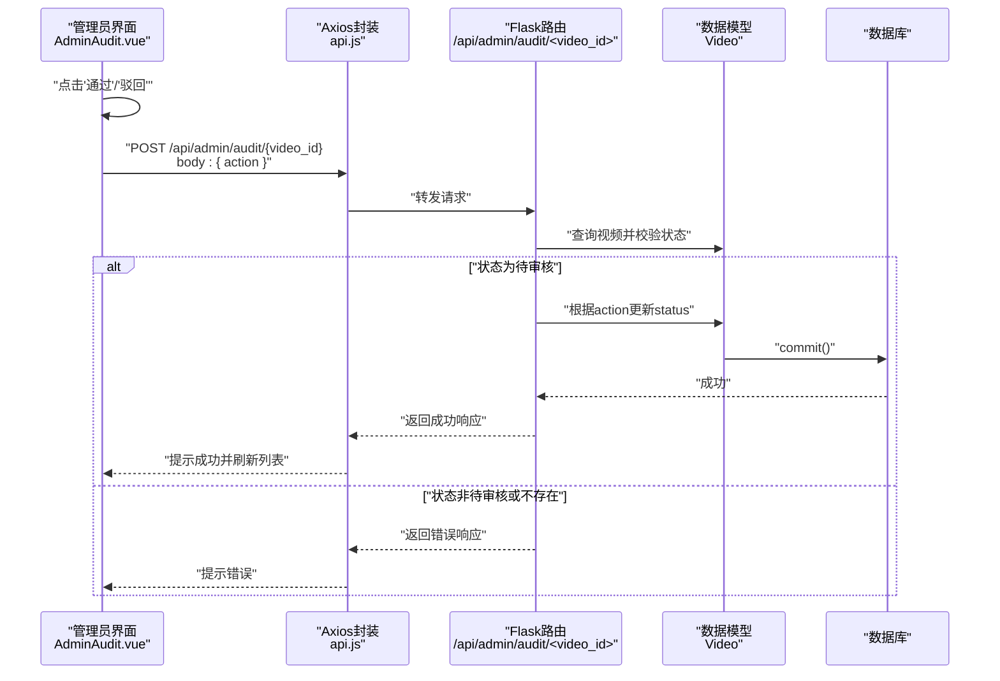
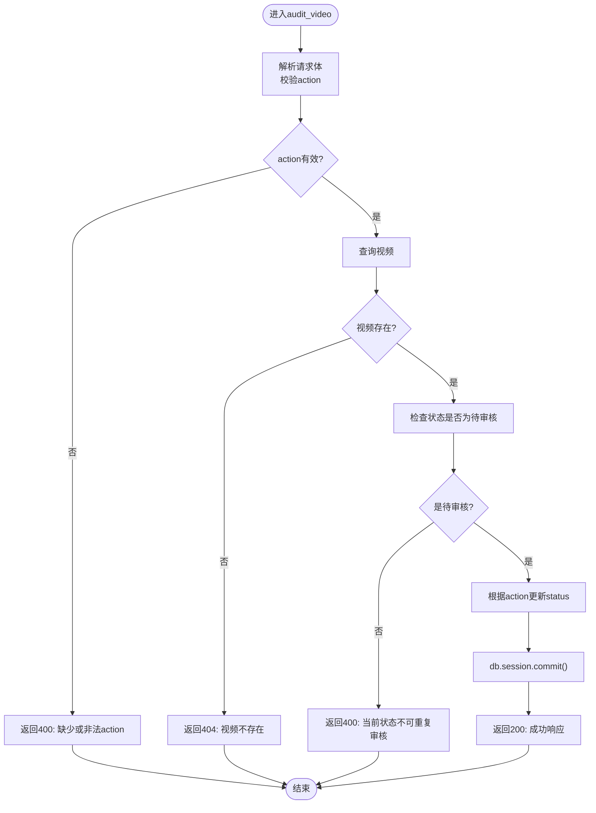
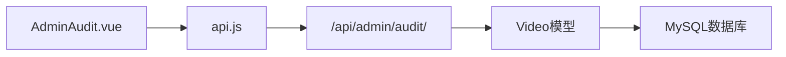

# 审核管理

<cite>
**本文引用的文件**
- [frontend/src/views/AdminAudit.vue](file://frontend/src/views/AdminAudit.vue)
- [frontend/src/api.js](file://frontend/src/api.js)
- [backend/routes/admin.py](file://backend/routes/admin.py)
- [backend/models.py](file://backend/models.py)
- [backend/app.py](file://backend/app.py)
- [backend/config.py](file://backend/config.py)
- [univideo_db.sql](file://univideo_db.sql)
</cite>

## 目录
1. [简介](#简介)
2. [项目结构](#项目结构)
3. [核心组件](#核心组件)
4. [架构总览](#架构总览)
5. [详细组件分析](#详细组件分析)
6. [依赖分析](#依赖分析)
7. [性能考虑](#性能考虑)
8. [故障排查指南](#故障排查指南)
9. [结论](#结论)
10. [附录](#附录)

## 简介
本文件面向管理员，系统性说明UniVideo平台中“视频审核”功能的完整流程，重点覆盖：
- 前端AdminAudit.vue组件如何通过/api/admin/audit/<video_id>接口与后端交互，实现对状态为“待审核”（status=0）的视频进行“通过”或“驳回”操作。
- 结合后端audit_video函数的实现，解释其事务处理机制、状态变更逻辑（status=1或2）以及重复审核的防护策略。
- 提供前端按钮禁用、加载状态反馈和错误提示的用户体验设计细节。
- 给出实际请求示例（如POST /api/admin/audit/123 {"action": "approve"}）及成功/失败响应格式，帮助开发者理解审核功能的前后端协作机制与安全控制。

## 项目结构
- 前端采用Vue 3单页应用，AdminAudit.vue负责管理员后台的视频列表、搜索、筛选、预览与审核操作。
- 后端基于Flask，使用蓝图组织路由；管理员相关接口集中在routes/admin.py中。
- 数据模型由models.py定义，包含Video等核心实体；数据库初始化脚本见univideo_db.sql。
- 应用启动与路由注册在backend/app.py中完成；Axios封装在frontend/src/api.js中。

图表来源
- [frontend/src/views/AdminAudit.vue](file://frontend/src/views/AdminAudit.vue#L1-L200)
- [frontend/src/api.js](file://frontend/src/api.js#L1-L41)
- [backend/routes/admin.py](file://backend/routes/admin.py#L95-L173)
- [backend/models.py](file://backend/models.py#L113-L198)
- [univideo_db.sql](file://univideo_db.sql#L23-L38)

章节来源
- [frontend/src/views/AdminAudit.vue](file://frontend/src/views/AdminAudit.vue#L1-L200)
- [frontend/src/api.js](file://frontend/src/api.js#L1-L41)
- [backend/app.py](file://backend/app.py#L40-L58)

## 核心组件
- 前端AdminAudit.vue
  - 负责渲染视频列表、搜索与筛选、预览、审核与删除操作。
  - 审核操作通过handleAudit(videoId, action)触发，调用api.post('/admin/audit/{video_id}', { action })。
  - 通过operatingId实现按钮禁用与加载反馈，避免重复提交。
- 后端routes/admin.py
  - 提供/api/admin/audit/<video_id>接口，接收action参数（"approve"|"reject"），执行状态变更并返回统一响应。
  - 包含事务处理与异常回滚，防止部分写入导致的数据不一致。
- 数据模型models.py
  - Video模型定义了status字段（0=待审核, 1=已发布, 2=已驳回），并提供to_dict序列化方法。
- 应用入口与路由注册
  - backend/app.py注册/admin蓝图，使/api/admin/*路由生效。

章节来源
- [frontend/src/views/AdminAudit.vue](file://frontend/src/views/AdminAudit.vue#L120-L168)
- [backend/routes/admin.py](file://backend/routes/admin.py#L95-L173)
- [backend/models.py](file://backend/models.py#L113-L198)
- [backend/app.py](file://backend/app.py#L40-L58)

## 架构总览
管理员审核流程的端到端交互如下：

图表来源
- [frontend/src/views/AdminAudit.vue](file://frontend/src/views/AdminAudit.vue#L120-L168)
- [frontend/src/api.js](file://frontend/src/api.js#L1-L41)
- [backend/routes/admin.py](file://backend/routes/admin.py#L95-L173)
- [backend/models.py](file://backend/models.py#L113-L198)

## 详细组件分析

### 前端组件：AdminAudit.vue
- 审核操作入口
  - handleAudit(videoId, action)：弹窗确认后，设置operatingId为当前videoId，调用api.post('/admin/audit/{videoId}', { action })，成功后刷新列表，失败弹出错误提示，最后清除operatingId。
- 用户体验设计
  - 按钮禁用：当operatingId等于当前视频ID时，通过:disabled绑定禁用“通过/驳回/删除”按钮，避免重复提交。
  - 加载反馈：按钮文案在operatingId匹配时显示省略号，直观提示“处理中”。
  - 错误提示：捕获异常，优先展示后端返回的msg，兜底为“操作失败”。
- 列表与筛选
  - 支持按标题关键词与状态筛选；仅当视频状态为0（待审核）时显示“通过/驳回”按钮。
- 预览与二次确认
  - 打开模态框预览视频，预览页内同样仅在待审核状态下显示“通过/驳回”。

章节来源
- [frontend/src/views/AdminAudit.vue](file://frontend/src/views/AdminAudit.vue#L120-L168)
- [frontend/src/views/AdminAudit.vue](file://frontend/src/views/AdminAudit.vue#L299-L331)
- [frontend/src/views/AdminAudit.vue](file://frontend/src/views/AdminAudit.vue#L370-L394)

### 后端接口：audit_video
- 请求与参数
  - 方法：POST
  - 路径：/api/admin/audit/<video_id>
  - 请求体：{ "action": "approve" | "reject" }
- 校验与防护
  - 缺失action或action非法：返回400，提示必填字段与合法值。
  - 视频不存在：返回404。
  - 非待审核状态重复审核：返回400，提示当前状态不可重复审核。
- 状态变更与事务
  - approve：将status置为已发布（1）。
  - reject：将status置为已驳回（2）。
  - 使用db.session.commit()提交事务；异常时db.session.rollback()回滚，保证一致性。
- 响应格式
  - 成功：返回200，包含code、msg、data（video_id、title、new_status）。
  - 失败：返回400/404/500，包含code与msg。

图表来源
- [backend/routes/admin.py](file://backend/routes/admin.py#L95-L173)
- [backend/models.py](file://backend/models.py#L113-L198)

章节来源
- [backend/routes/admin.py](file://backend/routes/admin.py#L95-L173)

### 数据模型：Video
- 关键字段
  - status：0=待审核，1=已发布，2=已驳回。
  - to_dict：序列化视频信息，包含作者与分类信息。
- 索引与约束
  - idx_status：加速审核查询。
  - 外键约束：user_id、category_id。

章节来源
- [backend/models.py](file://backend/models.py#L113-L198)
- [univideo_db.sql](file://univideo_db.sql#L23-L38)

### 应用入口与路由注册
- 蓝图注册：在backend/app.py中注册/admin蓝图，使/api/admin/*路由生效。
- 基础URL：前端api.js配置baseURL=http://localhost:5001/api，与后端端口一致。

章节来源
- [backend/app.py](file://backend/app.py#L40-L58)
- [frontend/src/api.js](file://frontend/src/api.js#L1-L20)

## 依赖分析
- 前端到后端
  - AdminAudit.vue依赖api.js发起HTTP请求，后端通过Flask蓝图routes/admin.py处理。
- 后端到模型
  - routes/admin.py依赖models.py中的Video模型进行状态校验与更新。
- 数据库层
  - univideo_db.sql定义videos表的status字段与索引，支撑审核流程的高效查询与状态控制。

图表来源
- [frontend/src/views/AdminAudit.vue](file://frontend/src/views/AdminAudit.vue#L120-L168)
- [frontend/src/api.js](file://frontend/src/api.js#L1-L41)
- [backend/routes/admin.py](file://backend/routes/admin.py#L95-L173)
- [backend/models.py](file://backend/models.py#L113-L198)
- [univideo_db.sql](file://univideo_db.sql#L23-L38)

章节来源
- [backend/routes/admin.py](file://backend/routes/admin.py#L95-L173)
- [backend/models.py](file://backend/models.py#L113-L198)
- [univideo_db.sql](file://univideo_db.sql#L23-L38)

## 性能考虑
- 索引优化：videos表对status建立索引，提升待审核视频查询效率。
- 事务提交：单次审核操作使用db.session.commit()一次性提交，减少锁竞争与写放大。
- 前端防抖：通过operatingId避免重复提交，降低无效请求压力。
- 超时与并发：前端axios默认超时10秒，建议后端接口尽量短事务，避免长时间阻塞。

章节来源
- [univideo_db.sql](file://univideo_db.sql#L37-L38)
- [backend/routes/admin.py](file://backend/routes/admin.py#L153-L155)
- [frontend/src/api.js](file://frontend/src/api.js#L1-L20)
- [frontend/src/views/AdminAudit.vue](file://frontend/src/views/AdminAudit.vue#L120-L168)

## 故障排查指南
- 常见错误与定位
  - 400 缺少action或action非法：检查前端传递的action是否为"approve"或"reject"。
  - 404 视频不存在：确认video_id是否正确，或视频已被删除。
  - 400 当前状态不可重复审核：确认视频状态确为待审核（0），否则后端会拒绝重复审核。
  - 500 服务器错误：查看后端日志，关注db.session.rollback()是否触发。
- 前端问题
  - 按钮不响应：检查operatingId是否被设置且未及时清理。
  - 无提示：确认catch分支是否执行，alert消息是否被浏览器阻止。
- 后端问题
  - 事务未提交：确认db.session.commit()是否执行，异常时是否执行rollback()。
  - 跨域与路由：确认Flask CORS已启用，蓝图注册路径正确。

章节来源
- [backend/routes/admin.py](file://backend/routes/admin.py#L109-L173)
- [frontend/src/views/AdminAudit.vue](file://frontend/src/views/AdminAudit.vue#L120-L168)
- [backend/app.py](file://backend/app.py#L28-L32)

## 结论
- 审核流程以“待审核”为核心前提，后端通过严格的参数校验与状态检查，配合事务提交与回滚，确保数据一致性与安全性。
- 前端通过operatingId实现按钮禁用与加载反馈，结合统一的错误提示，显著提升用户体验与操作可靠性。
- 建议在生产环境中强化鉴权与审计日志，进一步完善安全与合规能力。

## 附录

### API定义与示例
- 审核接口
  - 方法：POST
  - 路径：/api/admin/audit/{video_id}
  - 请求体：{ "action": "approve" | "reject" }
  - 成功响应：{ "code": 200, "msg": "...", "data": { "video_id": 123, "title": "...", "new_status": 1|2 } }
  - 失败响应：{ "code": 400|404|500, "msg": "..." }

章节来源
- [backend/routes/admin.py](file://backend/routes/admin.py#L95-L173)

### 前端调用与UI行为
- 调用方式：api.post('/admin/audit/{videoId}', { action })
- UI行为：
  - 点击“通过/驳回”：弹窗确认，按钮禁用，显示省略号，完成后刷新列表并提示结果。
  - 错误处理：捕获异常，展示后端返回msg或兜底提示。

章节来源
- [frontend/src/views/AdminAudit.vue](file://frontend/src/views/AdminAudit.vue#L120-L168)