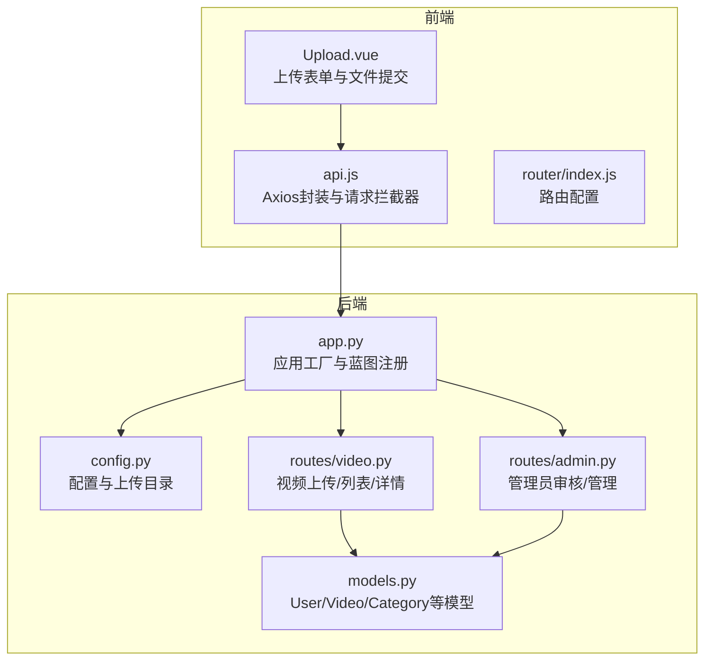
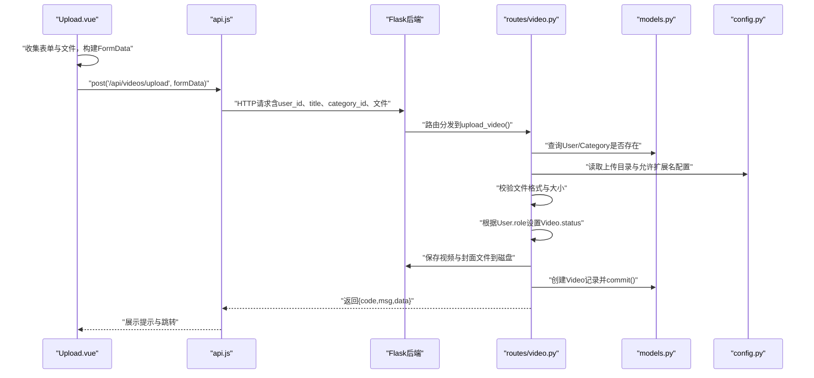
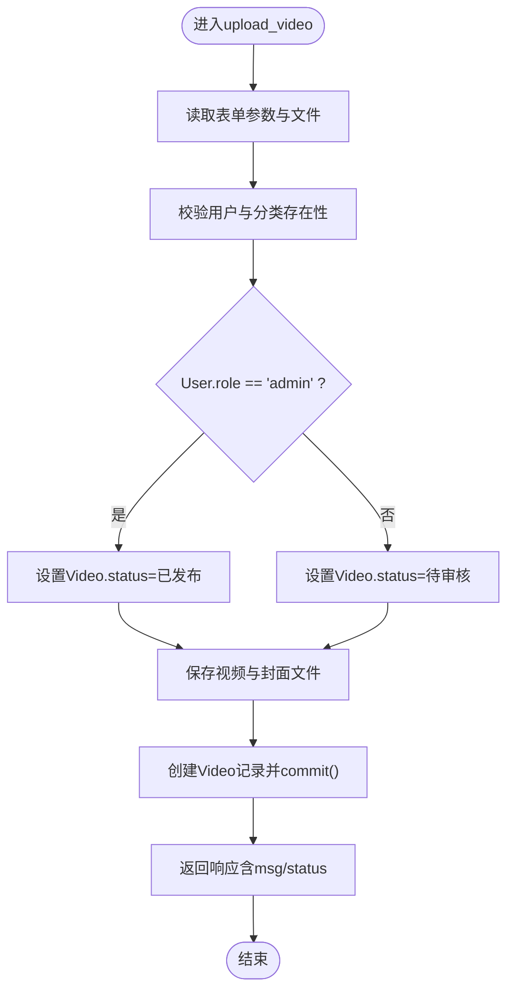
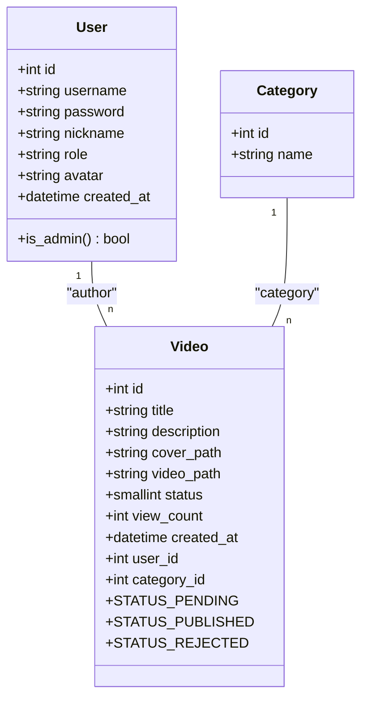
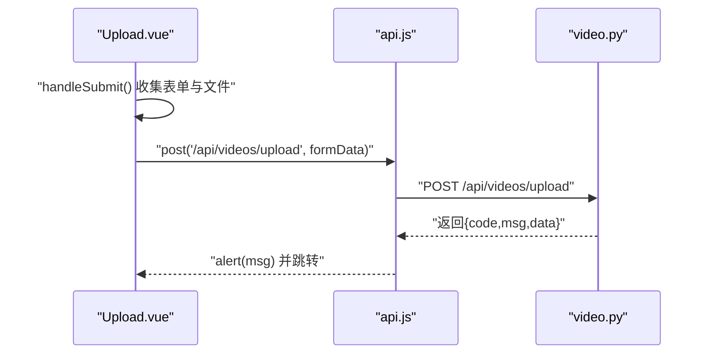
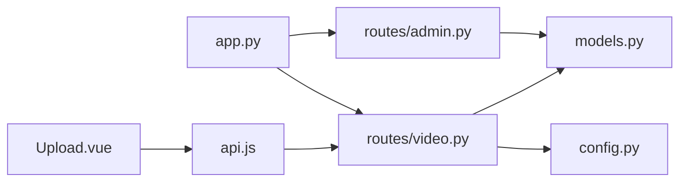

# 特权上传

<cite>
**本文引用的文件**
- [backend/models.py](file://backend/models.py)
- [backend/routes/video.py](file://backend/routes/video.py)
- [backend/routes/admin.py](file://backend/routes/admin.py)
- [backend/app.py](file://backend/app.py)
- [backend/config.py](file://backend/config.py)
- [frontend/src/views/Upload.vue](file://frontend/src/views/Upload.vue)
- [frontend/src/api.js](file://frontend/src/api.js)
- [frontend/src/router/index.js](file://frontend/src/router/index.js)
</cite>

## 目录
1. [引言](#引言)
2. [项目结构](#项目结构)
3. [核心组件](#核心组件)
4. [架构总览](#架构总览)
5. [详细组件分析](#详细组件分析)
6. [依赖分析](#依赖分析)
7. [性能考虑](#性能考虑)
8. [故障排查指南](#故障排查指南)
9. [结论](#结论)
10. [附录](#附录)

## 引言
本文件围绕UniVideo平台的管理员特权上传机制展开，目标是解释当管理员用户（role='admin'）通过前端Upload.vue组件上传视频时，后端如何在视频创建逻辑中自动将视频状态设置为“已发布”（status=1），从而绕过常规的审核流程。文档结合models.py中的User与Video模型，解释角色字段（role）的权限判断逻辑，以及status字段的状态机设计，并提供从前端上传表单提交到后端创建视频记录的完整数据流分析，涵盖文件存储、数据库插入与状态设置的关键实现位置，帮助开发者理解特权功能的实现原理与权限控制细节。

## 项目结构
- 前端采用Vue 3 + Vite，负责上传界面、表单校验、文件选择与预览、以及调用后端API。
- 后端采用Flask，提供视频上传、列表查询、详情获取、分类管理、管理员审核与删除等接口。
- 数据模型位于models.py，包含User、Video、Category、Comment、Like、Collection等实体及状态常量。
- 配置位于config.py，定义上传目录、允许的文件扩展名、数据库连接等。
- 路由模块位于backend/routes，其中video.py处理上传与列表/详情接口，admin.py处理审核与管理接口。

图表来源
- [frontend/src/views/Upload.vue](file://frontend/src/views/Upload.vue#L145-L202)
- [frontend/src/api.js](file://frontend/src/api.js#L1-L41)
- [frontend/src/router/index.js](file://frontend/src/router/index.js#L1-L56)
- [backend/app.py](file://backend/app.py#L1-L101)
- [backend/config.py](file://backend/config.py#L1-L66)
- [backend/routes/video.py](file://backend/routes/video.py#L37-L171)
- [backend/routes/admin.py](file://backend/routes/admin.py#L1-L245)
- [backend/models.py](file://backend/models.py#L14-L198)

章节来源
- [frontend/src/views/Upload.vue](file://frontend/src/views/Upload.vue#L1-L225)
- [frontend/src/api.js](file://frontend/src/api.js#L1-L41)
- [frontend/src/router/index.js](file://frontend/src/router/index.js#L1-L56)
- [backend/app.py](file://backend/app.py#L1-L101)
- [backend/config.py](file://backend/config.py#L1-L66)
- [backend/routes/video.py](file://backend/routes/video.py#L1-L171)
- [backend/routes/admin.py](file://backend/routes/admin.py#L1-L245)
- [backend/models.py](file://backend/models.py#L14-L198)

## 核心组件
- User模型：包含用户基本信息与角色字段role，提供is_admin便捷方法用于权限判断。
- Video模型：包含视频状态常量（待审核、已发布、已驳回），以及to_dict序列化方法。
- 视频上传路由video.py：接收multipart/form-data，校验文件与用户/分类有效性，按用户角色设置status，写入数据库并返回结果。
- 管理员路由admin.py：提供审核列表、审核通过/驳回、删除视频等管理能力。
- 前端Upload.vue：构建FormData并提交上传，接收后端返回的提示信息与状态。

章节来源
- [backend/models.py](file://backend/models.py#L14-L198)
- [backend/routes/video.py](file://backend/routes/video.py#L37-L171)
- [backend/routes/admin.py](file://backend/routes/admin.py#L1-L245)
- [frontend/src/views/Upload.vue](file://frontend/src/views/Upload.vue#L145-L202)

## 架构总览
管理员特权上传的端到端流程如下：
- 前端Upload.vue收集表单数据与文件，构造FormData并通过api.js发起POST请求到后端。
- 后端video.py接收请求，读取表单参数与文件，校验用户与分类存在性、文件格式与大小。
- 根据用户角色role判断是否为管理员：若是，status=已发布；否则status=待审核。
- 将视频文件与封面分别保存到配置的上传目录，数据库中仅存储相对路径。
- 插入Video记录并提交事务，返回包含状态信息的响应。
- 前端根据后端返回msg与status提示用户上传结果。

图表来源
- [frontend/src/views/Upload.vue](file://frontend/src/views/Upload.vue#L145-L202)
- [frontend/src/api.js](file://frontend/src/api.js#L1-L41)
- [backend/routes/video.py](file://backend/routes/video.py#L37-L171)
- [backend/config.py](file://backend/config.py#L1-L66)
- [backend/models.py](file://backend/models.py#L14-L198)

## 详细组件分析

### 管理员特权上传：角色判断与状态设置
- 角色判断逻辑：后端在video.py中通过查询User并比较role字段，若为'admin'则将Video.status设置为已发布；否则设置为待审核。
- 状态常量：Video模型定义了STATUS_PENDING、STATUS_PUBLISHED、STATUS_REJECTED三个常量，用于统一状态语义。
- 数据库写入：创建Video对象后通过db.session.add与commit完成持久化。
- 响应消息：根据角色返回不同的提示信息，便于前端展示。

图表来源
- [backend/routes/video.py](file://backend/routes/video.py#L37-L171)
- [backend/models.py](file://backend/models.py#L113-L198)

章节来源
- [backend/routes/video.py](file://backend/routes/video.py#L129-L162)
- [backend/models.py](file://backend/models.py#L113-L198)

### 数据模型与状态机设计
- User模型：包含id、username、password、nickname、role、avatar、created_at等字段，提供is_admin方法判断管理员。
- Video模型：包含id、title、description、cover_path、video_path、status、view_count、created_at、user_id、category_id等字段；status字段用于实现“先审后发”的状态机。
- 状态常量：STATUS_PENDING=0、STATUS_PUBLISHED=1、STATUS_REJECTED=2，配合列表查询与审核接口形成闭环。

图表来源
- [backend/models.py](file://backend/models.py#L14-L198)

章节来源
- [backend/models.py](file://backend/models.py#L14-L198)

### 前端上传表单提交流程
- 表单数据：title、description、category_id、video_file、cover_file、user_id（来自localStorage）。
- 文件上传：使用FormData，Content-Type为multipart/form-data。
- 成功提示：根据后端返回msg提示“已直接发布”或“等待管理员审核”。

图表来源
- [frontend/src/views/Upload.vue](file://frontend/src/views/Upload.vue#L145-L202)
- [frontend/src/api.js](file://frontend/src/api.js#L1-L41)
- [backend/routes/video.py](file://backend/routes/video.py#L37-L171)

章节来源
- [frontend/src/views/Upload.vue](file://frontend/src/views/Upload.vue#L145-L202)
- [frontend/src/api.js](file://frontend/src/api.js#L1-L41)

### 文件存储与路径策略
- 上传目录：由config.py的UPLOAD_FOLDER指定，静态资源目录位于backend/static。
- 文件命名：使用时间戳+UUID生成唯一文件名，避免冲突。
- 保存路径：视频与封面分别保存到videos/与covers/子目录，数据库中存储相对路径（如videos/xxx.mp4）。
- 前端静态访问：后端在返回列表/详情时拼接完整URL，前端可直接播放与预览。

章节来源
- [backend/config.py](file://backend/config.py#L1-L66)
- [backend/routes/video.py](file://backend/routes/video.py#L110-L128)
- [backend/app.py](file://backend/app.py#L33-L38)

### 列表查询与状态过滤
- 视频列表接口：默认仅查询status=已发布的视频，支持关键词与分类筛选。
- 详情接口：每次访问增加view_count，后续可扩展为仅作者或管理员可见待审核视频。

章节来源
- [backend/routes/video.py](file://backend/routes/video.py#L173-L226)
- [backend/routes/video.py](file://backend/routes/video.py#L228-L282)

### 管理员审核与删除
- 审核列表：查询status=待审核的视频，按上传时间升序排列。
- 审核操作：approve将status置为已发布，reject置为已驳回。
- 删除视频：尝试删除物理文件（视频与封面），再删除数据库记录。

章节来源
- [backend/routes/admin.py](file://backend/routes/admin.py#L13-L58)
- [backend/routes/admin.py](file://backend/routes/admin.py#L60-L93)
- [backend/routes/admin.py](file://backend/routes/admin.py#L95-L173)
- [backend/routes/admin.py](file://backend/routes/admin.py#L175-L245)

## 依赖分析
- 组件耦合与职责分离：
  - routes/video.py依赖models.py中的User、Video、Category，负责上传与列表/详情。
  - routes/admin.py依赖models.py中的Video，负责审核与管理。
  - frontend/src/views/Upload.vue依赖frontend/src/api.js与后端视频接口。
- 外部依赖：
  - Flask、Flask-SQLAlchemy、Flask-CORS、Flask-Migrate、Axios等。
- 配置依赖：
  - config.py提供上传目录、允许扩展名、数据库连接等配置，app.py在启动时初始化并注册蓝图。

图表来源
- [frontend/src/views/Upload.vue](file://frontend/src/views/Upload.vue#L145-L202)
- [frontend/src/api.js](file://frontend/src/api.js#L1-L41)
- [backend/routes/video.py](file://backend/routes/video.py#L37-L171)
- [backend/routes/admin.py](file://backend/routes/admin.py#L1-L245)
- [backend/models.py](file://backend/models.py#L14-L198)
- [backend/config.py](file://backend/config.py#L1-L66)
- [backend/app.py](file://backend/app.py#L1-L101)

章节来源
- [backend/app.py](file://backend/app.py#L1-L101)
- [backend/config.py](file://backend/config.py#L1-L66)
- [backend/routes/video.py](file://backend/routes/video.py#L37-L171)
- [backend/routes/admin.py](file://backend/routes/admin.py#L1-L245)
- [frontend/src/views/Upload.vue](file://frontend/src/views/Upload.vue#L145-L202)
- [frontend/src/api.js](file://frontend/src/api.js#L1-L41)

## 性能考虑
- 文件上传大小限制：MAX_CONTENT_LENGTH为500MB，避免过大文件导致内存压力。
- 数据库索引：Video.status与created_at建立索引，有利于列表查询与排序。
- 静态资源访问：通过静态目录提供视频与封面，减少后端I/O压力。
- 事务与回滚：异常时自动rollback，保证数据一致性。

章节来源
- [backend/config.py](file://backend/config.py#L1-L66)
- [backend/models.py](file://backend/models.py#L113-L198)
- [backend/routes/video.py](file://backend/routes/video.py#L164-L171)

## 故障排查指南
- 上传失败（缺少必填字段）：确认表单包含user_id、title、category_id，且video_file与cover_file存在。
- 不支持的文件格式：检查ALLOWED_VIDEO_EXTENSIONS与ALLOWED_IMAGE_EXTENSIONS配置。
- 用户或分类不存在：确认user_id与category_id有效。
- 服务器错误：查看后端异常捕获与rollback逻辑，定位具体环节。
- 前端提示差异：管理员上传返回“已直接发布”，普通用户返回“等待管理员审核”。

章节来源
- [backend/routes/video.py](file://backend/routes/video.py#L45-L108)
- [backend/routes/video.py](file://backend/routes/video.py#L164-L171)
- [frontend/src/views/Upload.vue](file://frontend/src/views/Upload.vue#L191-L202)

## 结论
管理员特权上传通过“角色判断+状态设置”的简单而清晰的设计，在不引入复杂中间件的前提下实现了差异化上传策略。User与Video模型的角色与状态常量为权限与状态机提供了稳定基础；video.py的上传逻辑将文件落盘与数据库写入解耦，配合config.py的配置与app.py的蓝图注册，形成了高内聚低耦合的模块化架构。该机制既满足了管理员高效发布的需求，又通过status字段与管理员审核接口维持了内容治理的可控性。

## 附录
- 关键实现位置参考（以路径标注代替代码片段）：
  - 角色判断与状态设置：[backend/routes/video.py](file://backend/routes/video.py#L129-L162)
  - 视频模型状态常量与序列化：[backend/models.py](file://backend/models.py#L113-L198)
  - 文件保存与相对路径存储：[backend/routes/video.py](file://backend/routes/video.py#L110-L128)
  - 上传目录与扩展名配置：[backend/config.py](file://backend/config.py#L1-L66)
  - 应用启动与蓝图注册：[backend/app.py](file://backend/app.py#L1-L101)
  - 前端上传表单提交与提示：[frontend/src/views/Upload.vue](file://frontend/src/views/Upload.vue#L145-L202)
  - 前端Axios请求拦截与基础地址：[frontend/src/api.js](file://frontend/src/api.js#L1-L41)
  - 管理员审核与删除接口：[backend/routes/admin.py](file://backend/routes/admin.py#L60-L173)