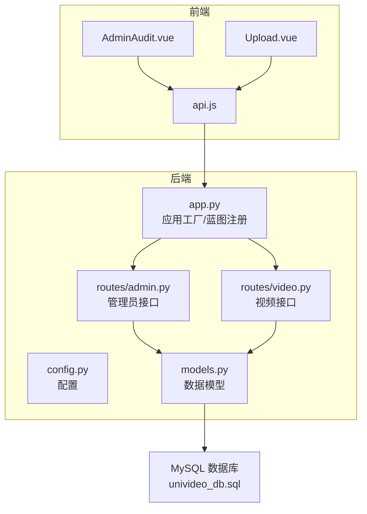
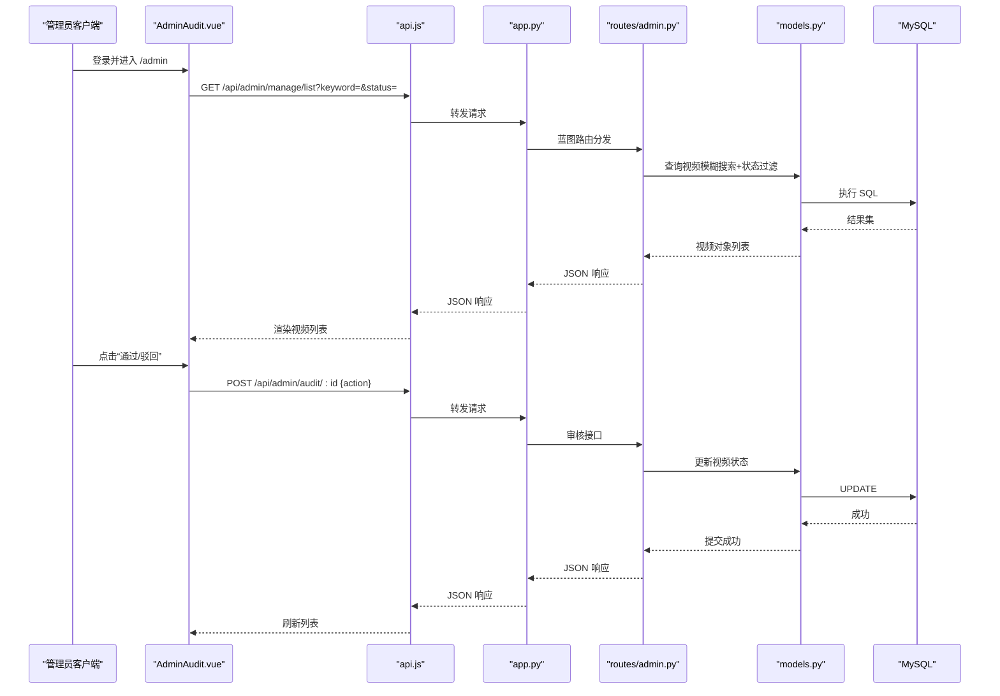
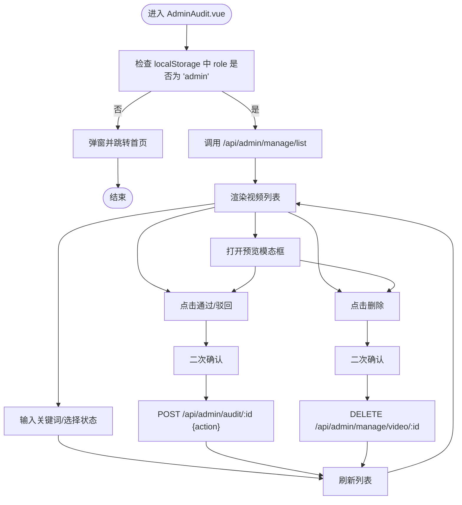
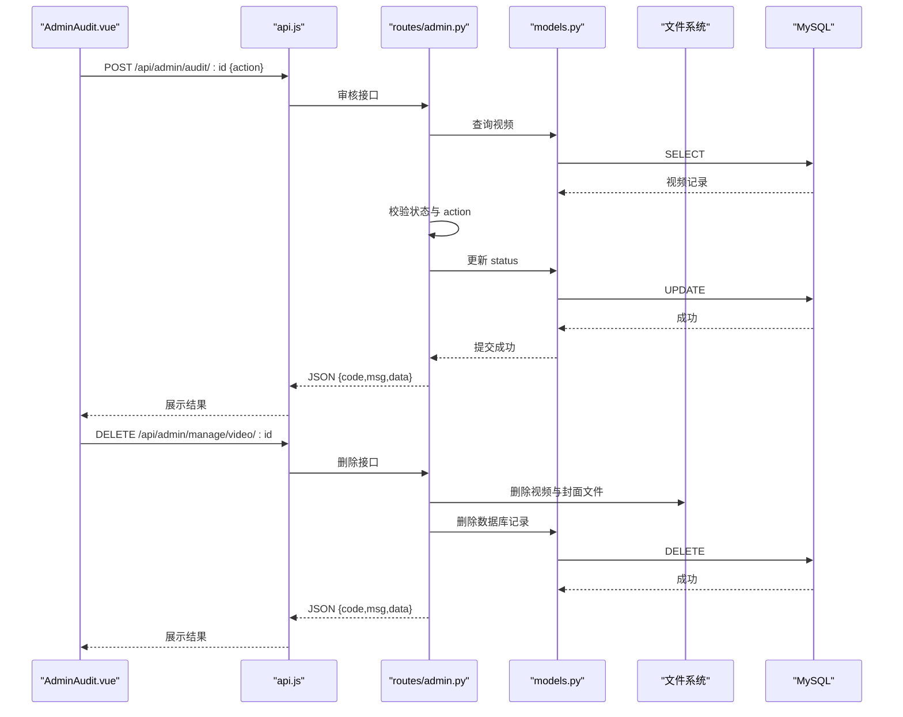
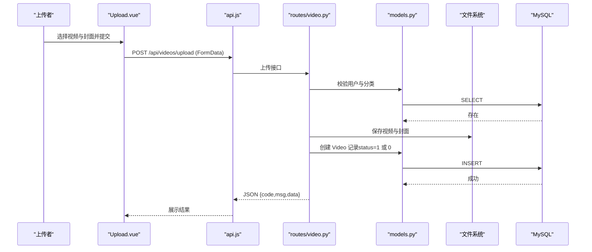
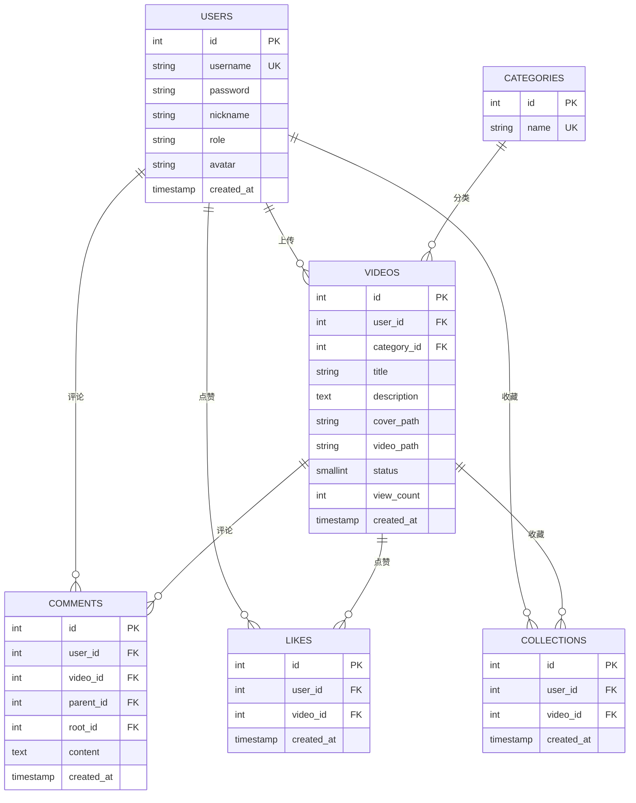
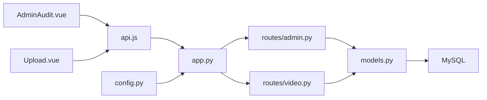

# 管理员工作流

<cite>
**本文引用的文件**
- [backend/app.py](file://backend/app.py)
- [backend/config.py](file://backend/config.py)
- [backend/models.py](file://backend/models.py)
- [backend/routes/admin.py](file://backend/routes/admin.py)
- [backend/routes/video.py](file://backend/routes/video.py)
- [frontend/src/api.js](file://frontend/src/api.js)
- [frontend/src/views/AdminAudit.vue](file://frontend/src/views/AdminAudit.vue)
- [frontend/src/views/Upload.vue](file://frontend/src/views/Upload.vue)
- [univideo_db.sql](file://univideo_db.sql)
</cite>

## 目录
1. [简介](#简介)
2. [项目结构](#项目结构)
3. [核心组件](#核心组件)
4. [架构总览](#架构总览)
5. [详细组件分析](#详细组件分析)
6. [依赖分析](#依赖分析)
7. [性能考虑](#性能考虑)
8. [故障排查指南](#故障排查指南)
9. [结论](#结论)

## 简介
本文件面向管理员用户，系统梳理 UniVideo 平台的专属操作流程：管理员登录后通过 /admin 路由进入“审核后台”页面（AdminAudit.vue），系统自动加载所有待审核视频列表（status=0）。管理员可查看视频详情、点击“通过”按钮将状态更新为“已发布”（status=1）使其在前台可见，或点击“驳回”设为“已驳回”（status=2）并可填写驳回理由。同时说明管理员特有的免审核上传通道：当管理员上传视频时，后端通过 user.role 字段识别身份，自动设置 status=1，实现即时发布。管理员还具备全局管理能力：通过关键词搜索任意视频（无论状态）、查看已发布/已驳回视频，并执行永久删除操作。结合后端 admin.py 中的 audit_video 和 delete_video 接口，解释权限校验机制（确保只有 role='admin' 的用户可调用）及数据库级联删除逻辑，帮助开发者理解后台管理功能的实现原理与安全控制。

## 项目结构
- 后端采用 Flask 蓝图组织路由，分别注册了认证、视频、管理员、互动、用户等蓝图，统一挂载在 /api 前缀下。
- 前端基于 Vue 3 组件化开发，包含管理员审核页、上传页、详情页等视图组件。
- 数据库采用 MySQL，表结构与 models.py 对应，包含用户、视频、分类、评论、点赞、收藏等表。

图表来源
- [backend/app.py](file://backend/app.py#L39-L58)
- [backend/routes/admin.py](file://backend/routes/admin.py#L13-L245)
- [backend/routes/video.py](file://backend/routes/video.py#L37-L171)
- [frontend/src/api.js](file://frontend/src/api.js#L1-L41)
- [frontend/src/views/AdminAudit.vue](file://frontend/src/views/AdminAudit.vue#L195-L204)
- [frontend/src/views/Upload.vue](file://frontend/src/views/Upload.vue#L145-L202)
- [univideo_db.sql](file://univideo_db.sql#L1-L76)

章节来源
- [backend/app.py](file://backend/app.py#L39-L58)
- [backend/config.py](file://backend/config.py#L11-L30)
- [univideo_db.sql](file://univideo_db.sql#L1-L76)

## 核心组件
- 管理员审核后台（AdminAudit.vue）
  - 负责加载视频列表、关键词搜索、状态筛选、预览视频、执行审核与删除。
  - 生命周期中进行本地角色校验，仅管理员可访问。
- 管理员接口（routes/admin.py）
  - /admin/manage/list：支持 keyword 与 status 过滤，返回完整视频列表。
  - /admin/audit/<video_id>：接收 action（approve/reject），更新视频状态。
  - /admin/manage/video/<video_id>：删除视频，尝试删除物理文件并从数据库删除记录。
- 视频上传接口（routes/video.py）
  - /videos/upload：管理员上传自动发布（status=1），普通用户上传进入待审核（status=0）。
- 数据模型（models.py）
  - Video 模型包含状态常量（待审核/已发布/已驳回），外键关联用户与分类，支持级联删除。
- 前端 API（api.js）
  - 统一设置 baseURL 与请求头，透传 X-User-ID 以便后端识别用户身份。

章节来源
- [frontend/src/views/AdminAudit.vue](file://frontend/src/views/AdminAudit.vue#L195-L204)
- [backend/routes/admin.py](file://backend/routes/admin.py#L13-L245)
- [backend/routes/video.py](file://backend/routes/video.py#L37-L171)
- [backend/models.py](file://backend/models.py#L113-L198)
- [frontend/src/api.js](file://frontend/src/api.js#L1-L41)

## 架构总览
管理员工作流涉及从前端到后端再到数据库的完整链路。管理员通过 AdminAudit.vue 发起请求，经由 api.js 统一注入用户 ID，后端 app.py 注册蓝图后由 routes/admin.py 处理管理员业务，最终通过 models.py 的 ORM 操作数据库。

图表来源
- [frontend/src/views/AdminAudit.vue](file://frontend/src/views/AdminAudit.vue#L79-L118)
- [frontend/src/views/AdminAudit.vue](file://frontend/src/views/AdminAudit.vue#L120-L168)
- [frontend/src/api.js](file://frontend/src/api.js#L1-L41)
- [backend/app.py](file://backend/app.py#L39-L58)
- [backend/routes/admin.py](file://backend/routes/admin.py#L13-L173)
- [backend/models.py](file://backend/models.py#L113-L198)
- [univideo_db.sql](file://univideo_db.sql#L24-L38)

## 详细组件分析

### 管理员审核后台（AdminAudit.vue）
- 角色校验：组件挂载时读取本地存储的 role，若非 admin 则弹窗并跳转首页。
- 列表加载：调用 /api/admin/manage/list，支持 keyword 与 status 参数。
- 搜索与筛选：输入框与下拉框联动，触发刷新列表。
- 审核操作：确认后调用 /api/admin/audit/:id，action 为 approve 或 reject。
- 删除操作：确认后调用 /api/admin/manage/video/:id，执行物理文件删除与数据库删除。
- 预览模态框：支持在模态中直接预览与操作。

图表来源
- [frontend/src/views/AdminAudit.vue](file://frontend/src/views/AdminAudit.vue#L195-L204)
- [frontend/src/views/AdminAudit.vue](file://frontend/src/views/AdminAudit.vue#L79-L118)
- [frontend/src/views/AdminAudit.vue](file://frontend/src/views/AdminAudit.vue#L120-L168)

章节来源
- [frontend/src/views/AdminAudit.vue](file://frontend/src/views/AdminAudit.vue#L195-L204)
- [frontend/src/views/AdminAudit.vue](file://frontend/src/views/AdminAudit.vue#L79-L118)
- [frontend/src/views/AdminAudit.vue](file://frontend/src/views/AdminAudit.vue#L120-L168)

### 管理员接口（routes/admin.py）
- /admin/manage/list（GET）
  - 支持 keyword（模糊搜索标题）与 status（0/1/2）筛选，按创建时间倒序返回。
- /admin/audit/<video_id>（POST）
  - 校验 action（approve/reject），检查视频存在性与当前状态（仅待审核可操作），更新状态并提交事务。
- /admin/manage/video/<video_id>（DELETE）
  - 删除物理文件（视频与封面），再删除数据库记录，返回删除文件清单。

图表来源
- [backend/routes/admin.py](file://backend/routes/admin.py#L13-L245)
- [backend/models.py](file://backend/models.py#L113-L198)
- [univideo_db.sql](file://univideo_db.sql#L24-L38)

章节来源
- [backend/routes/admin.py](file://backend/routes/admin.py#L13-L245)

### 视频上传与管理员免审核通道（routes/video.py）
- /videos/upload（POST）
  - 接收 multipart/form-data，校验用户与分类存在性、文件类型与大小。
  - 根据 user.role 决定状态：admin 直接发布（status=1），普通用户进入待审核（status=0）。
  - 保存文件与数据库记录，返回状态消息与是否为管理员标志。

图表来源
- [frontend/src/views/Upload.vue](file://frontend/src/views/Upload.vue#L145-L202)
- [frontend/src/api.js](file://frontend/src/api.js#L1-L41)
- [backend/routes/video.py](file://backend/routes/video.py#L37-L171)
- [backend/models.py](file://backend/models.py#L113-L198)
- [univideo_db.sql](file://univideo_db.sql#L24-L38)

章节来源
- [frontend/src/views/Upload.vue](file://frontend/src/views/Upload.vue#L145-L202)
- [backend/routes/video.py](file://backend/routes/video.py#L37-L171)

### 数据模型与数据库级联删除（models.py, univideo_db.sql）
- Video 模型
  - 状态常量：STATUS_PENDING=0、STATUS_PUBLISHED=1、STATUS_REJECTED=2。
  - 外键 user_id 引用 users.id，ON DELETE CASCADE；category_id 引用 categories.id。
  - to_dict 支持包含作者与分类信息。
- 删除接口的数据库行为
  - 删除视频记录时，由于外键约束，会触发对 comments、likes、collections 的级联删除。
  - 物理文件删除由后端在删除接口中主动尝试，不依赖数据库级联。

图表来源
- [univideo_db.sql](file://univideo_db.sql#L1-L76)
- [backend/models.py](file://backend/models.py#L113-L198)

章节来源
- [backend/models.py](file://backend/models.py#L113-L198)
- [univideo_db.sql](file://univideo_db.sql#L1-L76)

## 依赖分析
- 前端依赖
  - AdminAudit.vue 依赖 api.js 的 baseURL 与请求头透传（X-User-ID），用于后端识别当前用户。
  - 上传页 Upload.vue 通过 FormData 调用 /api/videos/upload，后端据此区分管理员与普通用户。
- 后端依赖
  - app.py 注册各蓝图，统一挂载在 /api 前缀下。
  - admin.py 与 video.py 均依赖 models.py 的 Video/User/Category 模型。
  - config.py 提供上传目录、允许扩展名、数据库连接等配置。
- 数据库依赖
  - 视频表的外键约束保证数据一致性，删除视频时通过 ON DELETE CASCADE 清理互动数据。

图表来源
- [frontend/src/views/AdminAudit.vue](file://frontend/src/views/AdminAudit.vue#L195-L204)
- [frontend/src/views/Upload.vue](file://frontend/src/views/Upload.vue#L145-L202)
- [frontend/src/api.js](file://frontend/src/api.js#L1-L41)
- [backend/app.py](file://backend/app.py#L39-L58)
- [backend/routes/admin.py](file://backend/routes/admin.py#L13-L245)
- [backend/routes/video.py](file://backend/routes/video.py#L37-L171)
- [backend/models.py](file://backend/models.py#L113-L198)
- [backend/config.py](file://backend/config.py#L11-L30)

章节来源
- [frontend/src/api.js](file://frontend/src/api.js#L1-L41)
- [backend/app.py](file://backend/app.py#L39-L58)
- [backend/config.py](file://backend/config.py#L11-L30)

## 性能考虑
- 列表查询
  - /admin/manage/list 支持 keyword 与 status 过滤，建议在数据库层面建立合适索引（如 status 与 created_at）以提升排序与筛选性能。
- 上传与文件存储
  - 上传目录与最大文件大小在 config.py 中集中配置，避免硬编码。
- 审核与删除
  - 审核接口仅允许对待审核状态的视频进行操作，减少不必要的写入。
  - 删除接口先尝试删除物理文件，再删除数据库记录，事务回滚可避免脏数据。

[本节为通用指导，无需列出具体文件来源]

## 故障排查指南
- 无法进入管理员后台
  - 检查 AdminAudit.vue 生命周期中的角色校验逻辑，确认 localStorage 中 role 是否为 admin。
  - 章节来源
    - [frontend/src/views/AdminAudit.vue](file://frontend/src/views/AdminAudit.vue#L195-L204)
- 审核接口报错
  - 确认 action 参数为 approve 或 reject，且视频当前状态为待审核。
  - 章节来源
    - [backend/routes/admin.py](file://backend/routes/admin.py#L95-L173)
- 删除接口失败
  - 检查物理文件是否存在与可删除权限，数据库删除需确保外键约束有效。
  - 章节来源
    - [backend/routes/admin.py](file://backend/routes/admin.py#L175-L245)
- 上传后未立即发布
  - 确认上传者角色为 admin，后端会自动设置 status=1。
  - 章节来源
    - [backend/routes/video.py](file://backend/routes/video.py#L129-L147)

## 结论
管理员在 UniVideo 平台的工作流清晰明确：通过 AdminAudit.vue 实现对全站视频的全局管理，支持搜索、筛选、审核与删除；通过 /admin/manage/list 获取任意状态视频，通过 /admin/audit/<video_id> 实现即时发布或驳回；通过 /admin/manage/video/<video_id> 实现永久删除。管理员上传通道利用 user.role 自动发布，简化了发布流程。后端通过蓝图与模型层清晰分离职责，数据库采用外键与级联删除保障数据一致性。开发者可据此完善权限校验与异常处理，进一步提升系统的安全性与稳定性。