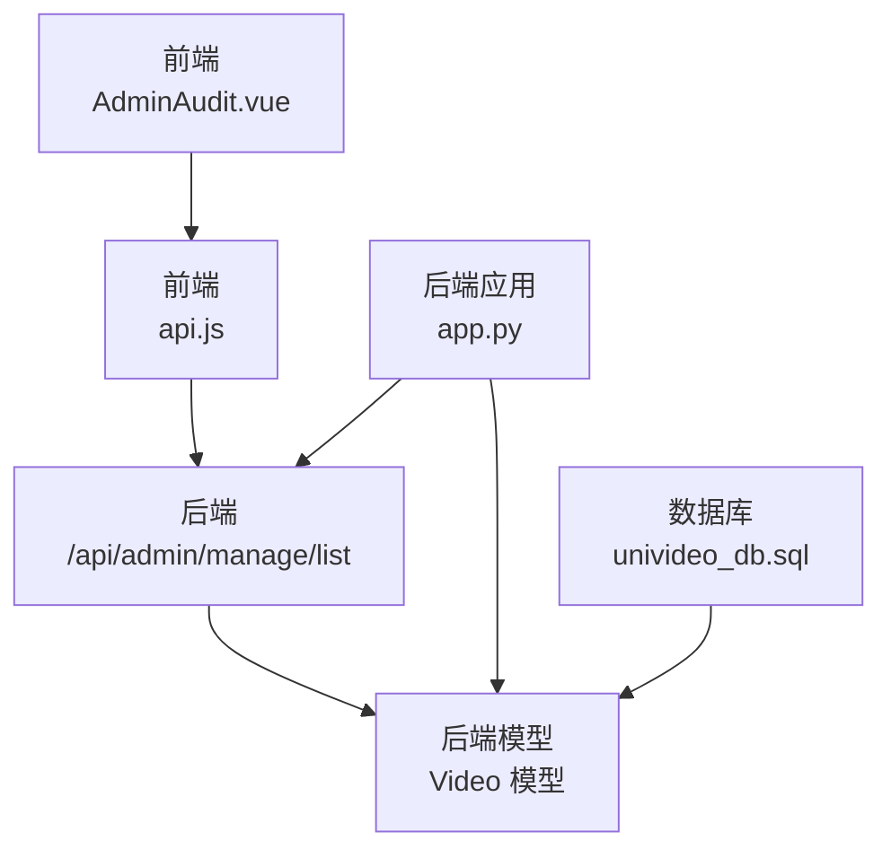
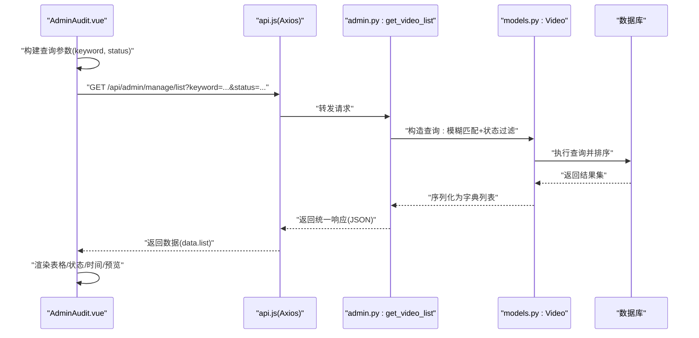
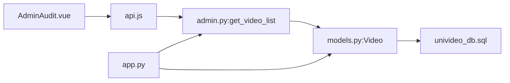
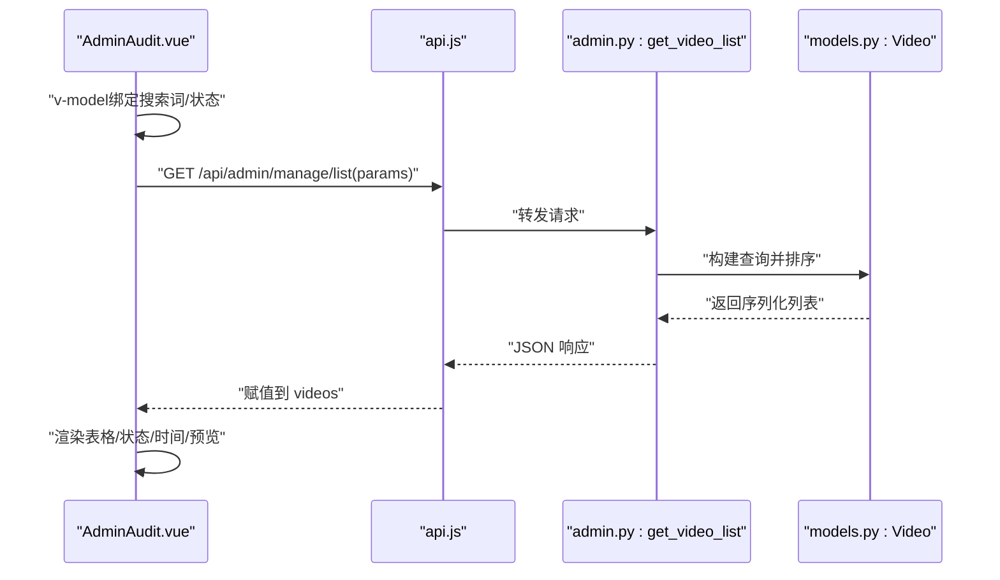

# 视频管理

<cite>
**本文引用的文件**
- [AdminAudit.vue](file://frontend/src/views/AdminAudit.vue)
- [api.js](file://frontend/src/api.js)
- [admin.py](file://backend/routes/admin.py)
- [models.py](file://backend/models.py)
- [app.py](file://backend/app.py)
- [univideo_db.sql](file://univideo_db.sql)
</cite>

## 目录
1. [简介](#简介)
2. [项目结构](#项目结构)
3. [核心组件](#核心组件)
4. [架构总览](#架构总览)
5. [详细组件分析](#详细组件分析)
6. [依赖分析](#依赖分析)
7. [性能考虑](#性能考虑)
8. [故障排查指南](#故障排查指南)
9. [结论](#结论)
10. [附录](#附录)

## 简介
本文件系统性阐述管理员对平台所有视频进行全局管理的操作方式，重点覆盖以下方面：
- 前端 AdminAudit.vue 组件如何调用 /api/admin/manage/list 接口，实现基于关键词搜索和多状态（待审核、已发布、已驳回）筛选的视频列表展示。
- 后端 get_video_list 接口的查询逻辑：模糊匹配、状态过滤、按上传时间倒序排序。
- 前端表格渲染、分页展示与实时刷新机制。
- API 请求参数与响应数据结构示例，便于开发者复现与扩展视频管理功能。

## 项目结构
- 前端采用 Vue 3 单文件组件，AdminAudit.vue 提供管理员视频管理界面；api.js 统一封装 axios 实例及请求拦截器。
- 后端采用 Flask + SQLAlchemy，蓝图组织路由，admin.py 提供管理员相关接口；models.py 定义 Video 模型及其状态常量；app.py 注册蓝图并启动服务。

图表来源
- [AdminAudit.vue](file://frontend/src/views/AdminAudit.vue#L1-L200)
- [api.js](file://frontend/src/api.js#L1-L41)
- [admin.py](file://backend/routes/admin.py#L13-L58)
- [models.py](file://backend/models.py#L113-L198)
- [app.py](file://backend/app.py#L39-L58)
- [univideo_db.sql](file://univideo_db.sql#L23-L38)

章节来源
- [AdminAudit.vue](file://frontend/src/views/AdminAudit.vue#L1-L200)
- [api.js](file://frontend/src/api.js#L1-L41)
- [admin.py](file://backend/routes/admin.py#L13-L58)
- [models.py](file://backend/models.py#L113-L198)
- [app.py](file://backend/app.py#L39-L58)
- [univideo_db.sql](file://univideo_db.sql#L23-L38)

## 核心组件
- 前端 AdminAudit.vue
  - 负责构建查询参数（关键词、状态），调用 /api/admin/manage/list 获取视频列表，渲染表格、状态标签、时间格式化、预览弹窗、审核与删除操作。
  - 使用 api.js 的 axios 实例，自动注入 X-User-ID 请求头。
- 后端 get_video_list 接口
  - 解析 keyword 与 status 查询参数，构造 SQLAlchemy 查询：模糊匹配标题、按状态过滤、按上传时间倒序排序，最终序列化为统一响应结构。
- 数据模型 Video
  - 定义状态常量（待审核、已发布、已驳回），提供 to_dict 序列化方法，包含作者信息与分类信息。

章节来源
- [AdminAudit.vue](file://frontend/src/views/AdminAudit.vue#L77-L120)
- [api.js](file://frontend/src/api.js#L9-L37)
- [admin.py](file://backend/routes/admin.py#L13-L58)
- [models.py](file://backend/models.py#L113-L198)

## 架构总览
管理员全局视频管理的端到端流程如下：

图表来源
- [AdminAudit.vue](file://frontend/src/views/AdminAudit.vue#L77-L120)
- [api.js](file://frontend/src/api.js#L9-L37)
- [admin.py](file://backend/routes/admin.py#L13-L58)
- [models.py](file://backend/models.py#L113-L198)

## 详细组件分析

### 前端 AdminAudit.vue 组件
- 查询与筛选
  - 关键词搜索：当输入框非空时，将 keyword 作为查询参数传递给后端。
  - 状态筛选：通过下拉框选择状态（'' 全部、0 待审核、1 已发布、2 已驳回），变更时触发列表刷新。
- 列表渲染
  - 表格列：封面缩略图、标题与简介、作者昵称、状态标签、上传时间、操作按钮（预览、通过/驳回、删除）。
  - 状态映射：根据状态值映射为“待审核/已发布/已驳回”及对应样式。
  - 时间格式化：将 ISO 时间转换为本地化显示。
- 操作与实时刷新
  - 审核：调用 /api/admin/audit/:id，action 为 approve/reject；成功后刷新列表。
  - 删除：调用 /api/admin/manage/video/:id；成功后刷新列表。
  - 预览：打开模态框，支持在模态内直接操作审核与删除。
- 认证与入口保护
  - 进入页面时读取本地存储中的角色，非 admin 直接跳转首页并提示无权访问。

章节来源
- [AdminAudit.vue](file://frontend/src/views/AdminAudit.vue#L1-L200)
- [AdminAudit.vue](file://frontend/src/views/AdminAudit.vue#L200-L396)

### 前端 API 配置
- 基础地址：http://localhost:5001/api
- 请求拦截器：自动将 X-User-ID 写入请求头，便于后端识别用户身份。
- 错误处理：统一捕获异常，提取 msg 并弹窗提示。

章节来源
- [api.js](file://frontend/src/api.js#L9-L37)

### 后端 get_video_list 接口
- 路由：GET /api/admin/manage/list
- 查询参数
  - keyword：可选，按标题进行模糊匹配。
  - status：可选，按状态过滤（0=待审核、1=已发布、2=已驳回），不传表示不限制。
- 查询逻辑
  - 基于 Video.query 构造链式查询：
    - 若 keyword 存在，使用 title 模糊匹配。
    - 若 status 存在，按状态精确过滤。
    - 最终按 created_at 倒序排序。
  - 将结果集通过 Video.to_dict(include_author=True) 序列化为字典列表。
- 响应结构
  - 成功：code=200，msg=获取成功，data.total=总数，data.list=视频数组。
  - 异常：code=500，msg=服务器错误。

章节来源
- [admin.py](file://backend/routes/admin.py#L13-L58)

### 数据模型与状态常量
- Video 模型
  - 状态常量：STATUS_PENDING=0、STATUS_PUBLISHED=1、STATUS_REJECTED=2。
  - to_dict：默认包含基础字段，当 include_author=True 时附加作者信息与分类信息。
- 数据库表结构
  - videos 表含 status 字段，配合索引 idx_status 优化审核查询。

章节来源
- [models.py](file://backend/models.py#L113-L198)
- [univideo_db.sql](file://univideo_db.sql#L23-L38)

### 后端应用与蓝图注册
- app.py 注册 /api/admin 蓝图，将管理员相关接口挂载到 /api/admin 前缀下。
- 开发模式监听 0.0.0.0:5001，便于前端跨域访问。

章节来源
- [app.py](file://backend/app.py#L39-L58)
- [app.py](file://backend/app.py#L94-L101)

## 依赖分析
- 组件耦合
  - AdminAudit.vue 依赖 api.js 的 axios 实例，间接依赖后端 /api/admin/manage/list。
  - 后端 admin.py 依赖 models.py 的 Video 模型与 db 会话。
- 外部依赖
  - 前端：axios、Vue 3。
  - 后端：Flask、Flask-CORS、Flask-Migrate、SQLAlchemy。
- 潜在循环依赖
  - 当前结构清晰，蓝图按模块划分，无明显循环依赖迹象。

图表来源
- [AdminAudit.vue](file://frontend/src/views/AdminAudit.vue#L77-L120)
- [api.js](file://frontend/src/api.js#L9-L37)
- [admin.py](file://backend/routes/admin.py#L13-L58)
- [models.py](file://backend/models.py#L113-L198)
- [univideo_db.sql](file://univideo_db.sql#L23-L38)
- [app.py](file://backend/app.py#L39-L58)

章节来源
- [AdminAudit.vue](file://frontend/src/views/AdminAudit.vue#L77-L120)
- [admin.py](file://backend/routes/admin.py#L13-L58)
- [models.py](file://backend/models.py#L113-L198)
- [app.py](file://backend/app.py#L39-L58)

## 性能考虑
- 查询优化
  - videos 表对 status 建有索引，有助于按状态过滤与审核查询。
  - created_at 建有索引，支持按上传时间排序。
- 前端渲染
  - 使用 v-for 渲染表格，建议在大数据量场景引入虚拟滚动或分页以提升性能。
- 网络与并发
  - 审核与删除操作期间设置 operatingId 禁用按钮，避免重复提交。
  - 建议在列表刷新时加入防抖策略，减少频繁请求。

章节来源
- [univideo_db.sql](file://univideo_db.sql#L23-L38)
- [AdminAudit.vue](file://frontend/src/views/AdminAudit.vue#L120-L200)

## 故障排查指南
- 前端常见问题
  - 无权限访问：进入页面校验角色，非 admin 直接跳转首页并提示。
  - 网络错误：统一通过拦截器处理，弹窗显示 msg。
  - 图片加载失败：表格与预览中均有兜底占位图。
- 后端常见问题
  - 参数缺失或非法：status 为 None 表示不过滤；action 仅支持 approve/reject。
  - 视频不存在：返回 404。
  - 重复审核：仅待审核状态可审核，其他状态返回 400。
  - 服务器异常：捕获异常并回滚事务，返回 500。

章节来源
- [AdminAudit.vue](file://frontend/src/views/AdminAudit.vue#L193-L204)
- [api.js](file://frontend/src/api.js#L21-L37)
- [admin.py](file://backend/routes/admin.py#L95-L173)

## 结论
本方案通过 AdminAudit.vue 与 /api/admin/manage/list 的协同，实现了管理员对全站视频的全局管理能力：关键词搜索、多状态筛选、按上传时间倒序展示，并提供审核与删除的即时反馈与刷新机制。后端基于 SQLAlchemy 的链式查询保证了灵活性与可维护性，数据库层面的索引设计提升了查询效率。整体架构清晰、职责分离明确，具备良好的扩展性。

## 附录

### API 请求参数与响应示例
- 请求
  - 方法：GET
  - 路径：/api/admin/manage/list
  - 查询参数：
    - keyword：可选，字符串，用于标题模糊匹配。
    - status：可选，整数，0=待审核、1=已发布、2=已驳回。
  - 示例：?keyword=教学&status=1
- 响应
  - 成功示例结构：
    - code: 200
    - msg: "获取成功"
    - data:
      - total: 数字，列表总数
      - list: 数组，每项为视频对象（包含作者与分类信息）
  - 失败示例结构：
    - code: 500
    - msg: "服务器错误: ..."

章节来源
- [admin.py](file://backend/routes/admin.py#L13-L58)

### 前端调用流程（序列图）

图表来源
- [AdminAudit.vue](file://frontend/src/views/AdminAudit.vue#L77-L120)
- [api.js](file://frontend/src/api.js#L9-L37)
- [admin.py](file://backend/routes/admin.py#L13-L58)
- [models.py](file://backend/models.py#L113-L198)