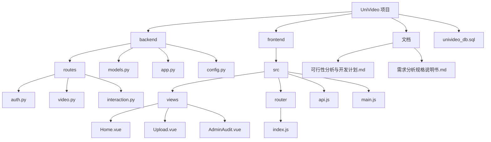
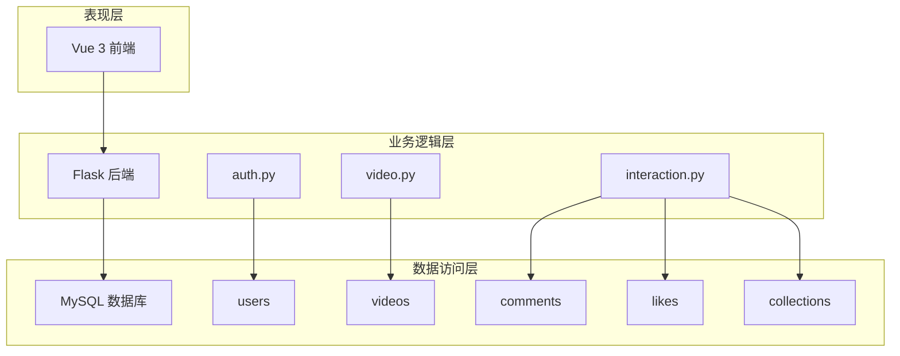
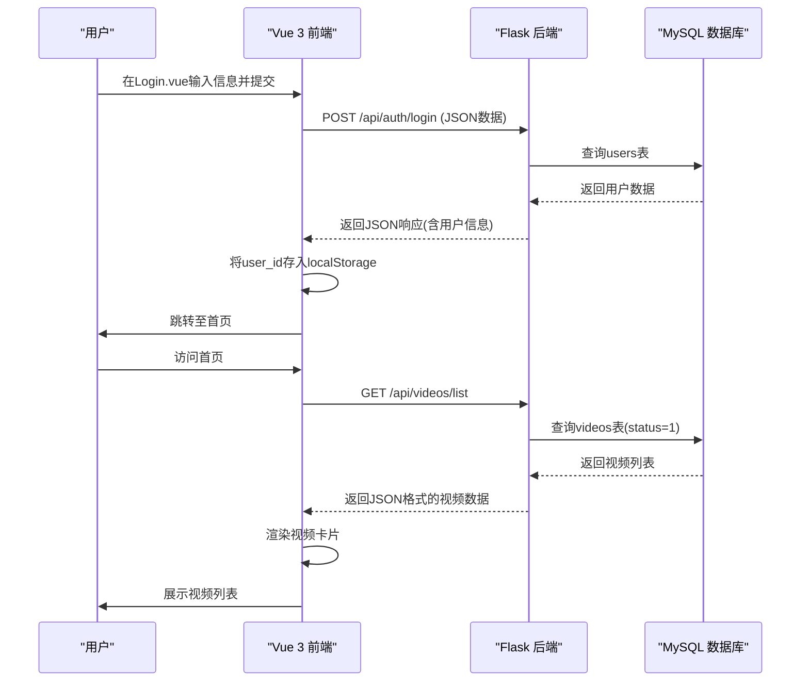
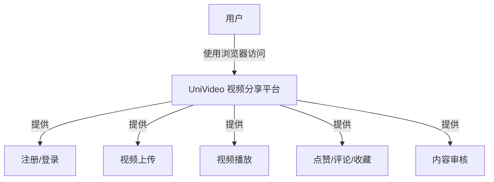

# 系统概述

<cite>
**本文档引用文件**   
- [app.py](file://backend/app.py)
- [models.py](file://backend/models.py)
- [config.py](file://backend/config.py)
- [auth.py](file://backend/routes/auth.py)
- [video.py](file://backend/routes/video.py)
- [interaction.py](file://backend/routes/interaction.py)
- [main.js](file://frontend/src/main.js)
- [api.js](file://frontend/src/api.js)
- [router/index.js](file://frontend/src/router/index.js)
- [Home.vue](file://frontend/src/views/Home.vue)
- [Upload.vue](file://frontend/src/views/Upload.vue)
- [univideo_db.sql](file://univideo_db.sql)
- [可行性分析与开发计划.md](file://文档/可行性分析与开发计划.md)
- [需求分析规格说明书.md](file://文档/需求分析规格说明书.md)
</cite>

## 目录
1. [引言](#引言)
2. [项目结构](#项目结构)
3. [核心目标与业务场景](#核心目标与业务场景)
4. [系统架构设计](#系统架构设计)
5. [前后端分离设计](#前后端分离设计)
6. [关键功能模块分析](#关键功能模块分析)
7. [组件协同工作机制](#组件协同工作机制)
8. [系统上下文图示](#系统上下文图示)
9. [总结](#总结)

## 引言

UniVideo 是一个专为高校环境设计的视频分享平台，旨在为师生提供一个集中化、互动性强的校园视频资源交流社区。该系统通过“先审后发”的内容管理机制，确保了平台内容的合规性与安全性，同时提供了丰富的用户互动功能，如点赞、评论和收藏，极大地提升了用户的参与感和平台的活跃度。系统采用现代化的前后端分离架构，前端基于 Vue 3 构建响应式用户界面，后端使用 Flask 提供 RESTful API 服务，数据持久化则依赖于 MySQL 数据库。本概述文档将深入解析 UniVideo 的核心目标、整体架构、关键特性以及各组件间的协同工作原理，为初学者提供清晰的概念引导，并为高级开发者揭示其技术实现要点。

## 项目结构

UniVideo 项目的目录结构清晰地体现了前后端分离的设计理念。整个项目分为 `backend`（后端）、`frontend`（前端）、`文档` 和数据库脚本四个主要部分。

- **backend/**: 包含 Flask 后端应用的所有代码。`routes/` 目录下按功能模块（如 `auth.py`、`video.py`）组织了 API 路由；`models.py` 定义了与数据库表结构一一对应的 ORM 模型；`app.py` 是应用的主入口，负责初始化 Flask 应用、加载配置和注册蓝图。
- **frontend/**: 包含 Vue 3 前端应用的代码。`src/views/` 目录存放了所有页面组件（如 `Home.vue`、`Upload.vue`）；`src/router/index.js` 配置了前端路由；`src/api.js` 封装了与后端通信的 Axios 实例。
- **文档/**: 存放了项目的设计文档，包括可行性分析、需求规格说明书等，为系统的设计和实现提供了理论依据。
- **univideo_db.sql**: 包含创建数据库和所有数据表的 SQL 脚本，是系统数据模型的源头。

这种结构化的组织方式使得前后端开发可以并行进行，互不干扰，极大地提高了开发效率和项目的可维护性。

**图示来源**
- [项目结构](file://项目结构)

## 核心目标与业务场景

UniVideo 的核心目标是解决校园内视频资源分散、检索困难、互动性差的问题。根据《可行性分析与开发计划》和《需求分析规格说明书》的描述，系统主要服务于以下业务场景：

1.  **内容创作与分享**：学生可以轻松上传课程录像、社团活动视频或校园生活片段。系统支持从视频中截取帧作为封面，简化了上传流程。
2.  **内容审核与管理**：为了维护校园网络环境的健康，系统实现了“先审后发”机制。普通用户上传的视频默认处于“待审核”状态，只有管理员审核通过后才能在首页展示。管理员拥有“免审特权”，其上传的视频可直接发布。
3.  **内容发现与消费**：用户可以通过首页的分类标签（如“校园生活”、“课程学习”）快速浏览视频，也可以通过关键词搜索功能查找特定内容。所有检索结果都经过过滤，仅显示“已发布”状态的视频。
4.  **社区互动**：用户可以对喜欢的视频进行点赞和收藏，也可以发表评论或回复他人的评论，形成一个积极的互动社区。
5.  **个人中心**：用户可以在个人中心查看自己上传的视频（“我的投稿”）和收藏的视频（“我的收藏”），并能修改个人资料。

这些场景共同构成了一个从内容生产、审核、发布到消费和互动的完整闭环，满足了校园视频分享的核心需求。

**本节来源**
- [可行性分析与开发计划.md](file://文档/可行性分析与开发计划.md)
- [需求分析规格说明书.md](file://文档/需求分析规格说明书.md)

## 系统架构设计

UniVideo 采用了典型的三层架构设计，清晰地划分了表现层、业务逻辑层和数据访问层。

- **表现层 (前端)**: 由 Vue 3 框架驱动，负责用户界面的渲染和交互。它通过定义路由（`router/index.js`）来管理不同的视图（如首页、上传页、详情页），并通过 `api.js` 中配置的 Axios 实例向后端发起 HTTP 请求。
- **业务逻辑层 (后端)**: 由 Flask 框架实现，是系统的核心。`app.py` 作为应用工厂，创建并配置 Flask 应用实例。业务逻辑被模块化地组织在 `routes/` 目录下的各个蓝图（Blueprint）中，如 `auth.py` 处理认证，`video.py` 处理视频上传和列表，`interaction.py` 处理点赞、评论和收藏。
- **数据访问层 (数据库)**: 基于 MySQL 数据库，通过 SQLAlchemy ORM（在 `models.py` 中定义）与后端应用进行交互。`univideo_db.sql` 脚本定义了 `users`、`videos`、`comments`、`likes`、`collections` 等核心数据表，确保了数据的持久化和完整性。

这种分层架构使得系统各部分职责分明，降低了耦合度，提高了代码的可读性和可维护性。

**图示来源**
- [app.py](file://backend/app.py)
- [models.py](file://backend/models.py)
- [routes/auth.py](file://backend/routes/auth.py)
- [routes/video.py](file://backend/routes/video.py)
- [routes/interaction.py](file://backend/routes/interaction.py)
- [univideo_db.sql](file://univideo_db.sql)

## 前后端分离设计

UniVideo 严格遵循前后端分离的设计理念，前端和后端作为两个独立的项目进行开发和部署。

- **前端 (Vue 3)**: 前端项目是一个单页应用（SPA）。`main.js` 是入口文件，它创建 Vue 应用实例并挂载到 `index.html` 的 `#app` 元素上。`App.vue` 作为根组件，通过 `<RouterView />` 动态渲染当前路由匹配的视图组件。`api.js` 是前后端通信的关键，它创建了一个 Axios 实例，预设了后端 API 的基础 URL（`http://localhost:5001/api`）和请求头。此外，它还配置了请求拦截器，自动将用户 ID（从 `localStorage` 获取）添加到请求头 `X-User-ID` 中，实现了简单的身份透传。
- **后端 (Flask)**: 后端通过 `app.py` 中的 `CORS(app)` 配置，允许前端跨域访问。后端的 API 接口以 RESTful 风格设计，例如 `/api/auth/login` 用于登录，`/api/videos/list` 用于获取视频列表。后端不关心前端如何渲染，只负责接收请求、处理业务逻辑、操作数据库，并返回 JSON 格式的响应数据。

这种设计模式使得前端团队可以专注于用户体验和界面设计，而后端团队则可以专注于 API 的稳定性和数据安全，两者可以并行开发，通过定义好的 API 接口进行协作。

**本节来源**
- [main.js](file://frontend/src/main.js)
- [App.vue](file://frontend/src/App.vue)
- [api.js](file://frontend/src/api.js)
- [app.py](file://backend/app.py)
- [routes/auth.py](file://backend/routes/auth.py)
- [routes/video.py](file://backend/routes/video.py)

## 关键功能模块分析

### 用户认证模块

用户认证是系统安全的基石。该模块由前端 `Login.vue` 和 `Register.vue` 组件与后端 `auth.py` 路由协同完成。用户提交注册或登录表单后，前端通过 `api.js` 发送请求。后端在 `auth.py` 中处理这些请求：注册时，使用 `generate_password_hash` 对密码进行加密后存入数据库；登录时，使用 `check_password_hash` 验证密码，并返回包含用户信息的 JSON 响应。用户登录成功后，其 ID 和角色信息会被存储在浏览器的 `localStorage` 中，用于后续的身份识别。

**本节来源**
- [Login.vue](file://frontend/src/views/Login.vue)
- [Register.vue](file://frontend/src/views/Register.vue)
- [auth.py](file://backend/routes/auth.py)

### 视频上传与审核模块

视频上传是系统的核心功能之一。前端 `Upload.vue` 组件提供了一个直观的表单，允许用户选择视频文件、输入标题和描述，并通过“截取当前帧”按钮从视频中生成封面。提交后，表单数据被打包成 `FormData` 发送到后端。后端 `video.py` 中的 `upload_video` 接口接收请求，验证数据和文件，然后根据上传者的角色（通过查询 `User` 模型判断）决定视频的初始状态：普通用户上传的视频状态为 `STATUS_PENDING`（待审核），而管理员上传的视频状态为 `STATUS_PUBLISHED`（已发布）。视频文件和封面文件被保存到服务器的 `static` 目录下，文件路径则存入 `videos` 表。

**本节来源**
- [Upload.vue](file://frontend/src/views/Upload.vue)
- [video.py](file://backend/routes/video.py)
- [models.py](file://backend/models.py)

### 互动功能模块

互动功能增强了平台的社区属性。该模块由前端 `VideoDetail.vue` 组件和后端 `interaction.py` 路由共同实现。当用户点击点赞或收藏按钮时，前端调用相应的 API。后端 `interaction.py` 中的 `toggle_like` 和 `toggle_collect` 函数会检查 `likes` 和 `collections` 表，如果记录已存在则删除（取消操作），否则创建新记录（执行操作），从而实现状态的切换。对于评论功能，系统支持多级回复。后端通过 `Comment` 模型中的 `parent_id` 和 `root_id` 字段来维护评论的层级关系，确保评论树的正确构建。

**本节来源**
- [VideoDetail.vue](file://frontend/src/views/VideoDetail.vue)
- [interaction.py](file://backend/routes/interaction.py)
- [models.py](file://backend/models.py)

### 管理员后台管理

管理员后台为内容管理提供了强有力的工具。前端 `AdminAudit.vue` 组件为管理员提供了一个独立的界面，用于查看和管理所有视频。后端 `admin.py` 路由（未在文件中详述，但根据 `app.py` 的注册可知其存在）提供了相应的 API，允许管理员查询所有状态的视频、执行审核（通过/驳回）和删除操作。`Home.vue` 组件会根据用户的角色（`userRole`）动态显示“管理后台”按钮，确保只有管理员才能访问此功能。

**本节来源**
- [AdminAudit.vue](file://frontend/src/views/AdminAudit.vue)
- [app.py](file://backend/app.py#L47-L49)
- [Home.vue](file://frontend/src/views/Home.vue#L29)

## 组件协同工作机制

UniVideo 系统的各个组件通过 HTTP 协议紧密协同工作。一个典型的用户操作流程如下：

1.  **用户登录**：用户在 `Login.vue` 输入信息，前端调用 `api.post('/auth/login')`。
2.  **后端处理**：Flask 接收请求，`auth.py` 中的 `login` 函数查询数据库，验证成功后返回用户信息。
3.  **前端响应**：前端收到响应，将用户 ID 存入 `localStorage`，并跳转到首页 `Home.vue`。
4.  **获取视频列表**：`Home.vue` 加载时，调用 `api.get('/videos/list')`。
5.  **后端查询**：`video.py` 中的 `get_video_list` 函数查询数据库，只返回 `status=1` 的视频，并构建包含完整 URL 的数据列表。
6.  **前端渲染**：`Home.vue` 收到数据，使用 `v-for` 指令将视频列表渲染为卡片网格。

这个流程清晰地展示了前端、后端和数据库之间通过 API 进行数据交换的完整链条。

**图示来源**
- [Login.vue](file://frontend/src/views/Login.vue)
- [Home.vue](file://frontend/src/views/Home.vue)
- [auth.py](file://backend/routes/auth.py)
- [video.py](file://backend/routes/video.py)
- [models.py](file://backend/models.py)

## 系统上下文图示

以下系统上下文图展示了 UniVideo 系统作为一个整体，与外部参与者（用户）之间的交互关系。它抽象了内部复杂的组件，将整个系统视为一个“视频分享平台”，用户通过浏览器与之交互，进行注册、登录、上传、观看和互动等操作。

**图示来源**
- [系统上下文](file://系统上下文)

## 总结

UniVideo 系统是一个功能完整、设计合理的校园视频分享平台。它通过前后端分离的架构，实现了技术栈的解耦和开发效率的提升。系统以“先审后发”为核心，结合管理员特权，构建了一个安全可控的内容生态。丰富的互动功能和个性化的个人中心，极大地增强了用户体验。从前端 Vue 3 的组件化开发，到后端 Flask 的蓝图化路由设计，再到 MySQL 数据库的规范化建模，整个系统展现了良好的软件工程实践。无论是对于初学者理解 Web 应用的全貌，还是对于高级开发者借鉴其模块化设计思想，UniVideo 都是一个极具参考价值的项目。