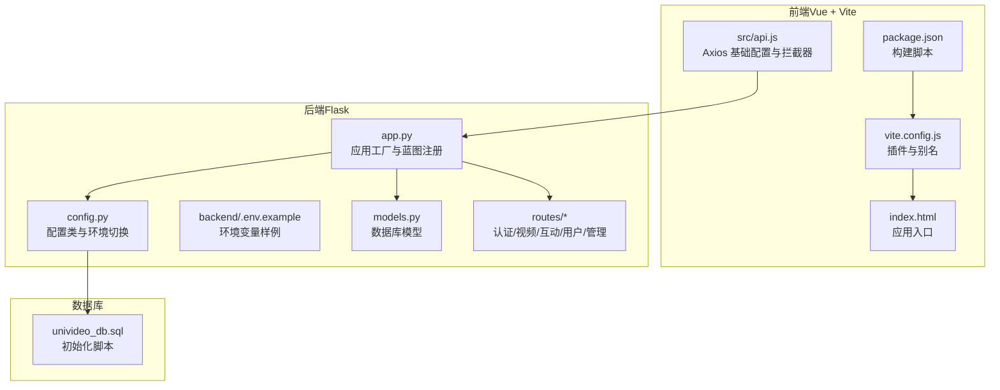
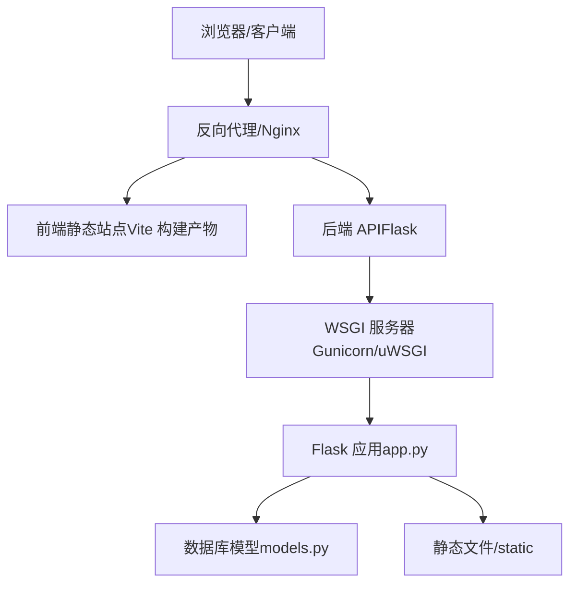
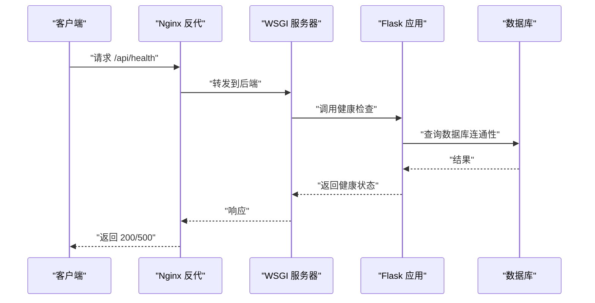
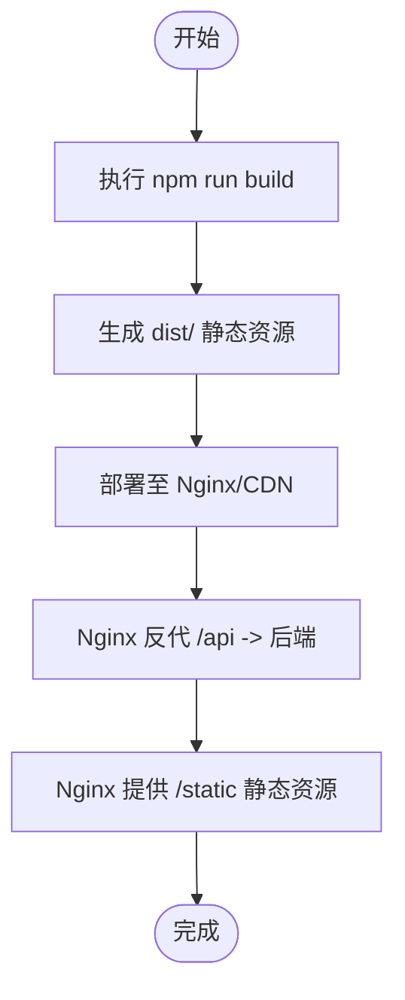
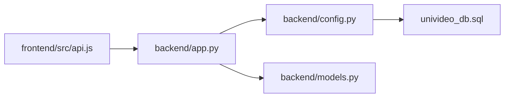

# 部署指南

<cite>
**本文引用的文件**
- [backend/app.py](file://backend/app.py)
- [backend/config.py](file://backend/config.py)
- [backend/.env.example](file://backend/.env.example)
- [backend/routes/auth.py](file://backend/routes/auth.py)
- [backend/models.py](file://backend/models.py)
- [frontend/vite.config.js](file://frontend/vite.config.js)
- [frontend/package.json](file://frontend/package.json)
- [frontend/src/api.js](file://frontend/src/api.js)
- [frontend/index.html](file://frontend/index.html)
- [univideo_db.sql](file://univideo_db.sql)
</cite>

## 目录
1. [引言](#引言)
2. [项目结构](#项目结构)
3. [核心组件](#核心组件)
4. [架构总览](#架构总览)
5. [详细组件分析](#详细组件分析)
6. [依赖关系分析](#依赖关系分析)
7. [性能考虑](#性能考虑)
8. [故障排查指南](#故障排查指南)
9. [结论](#结论)
10. [附录](#附录)

## 引言
本指南面向生产环境部署 UniVideo 系统，提供前后端分离部署的最佳实践。后端采用 Flask，前端采用 Vue（Vite 构建）。部署要点包括：
- 前端构建为静态资源并部署至 Nginx 或 CDN；
- 后端通过 Gunicorn/uWSGI 配合反向代理运行；
- 跨域（CORS）策略、静态文件服务路径（/static）与 API 代理规则；
- 生产环境配置文件管理（数据库连接、密钥等）、日志与错误监控；
- Docker 部署可选方案（Dockerfile 与 docker-compose 示例思路）；
- 安全性配置（HTTPS、敏感信息保护、输入验证）。

## 项目结构
- 后端（Flask）位于 backend/，包含应用工厂、配置、数据库模型与路由模块；
- 前端（Vue + Vite）位于 frontend/，包含构建配置、入口 HTML、API 客户端与页面组件；
- 数据库初始化脚本位于根目录 univideo_db.sql；
- 环境变量样例位于 backend/.env.example。

图表来源
- [frontend/package.json](file://frontend/package.json#L1-L25)
- [frontend/vite.config.js](file://frontend/vite.config.js#L1-L19)
- [frontend/index.html](file://frontend/index.html#L1-L14)
- [frontend/src/api.js](file://frontend/src/api.js#L1-L41)
- [backend/app.py](file://backend/app.py#L1-L101)
- [backend/config.py](file://backend/config.py#L1-L66)
- [backend/.env.example](file://backend/.env.example#L1-L21)
- [backend/models.py](file://backend/models.py#L1-L343)
- [univideo_db.sql](file://univideo_db.sql#L1-L76)

章节来源
- [backend/app.py](file://backend/app.py#L1-L101)
- [backend/config.py](file://backend/config.py#L1-L66)
- [frontend/vite.config.js](file://frontend/vite.config.js#L1-L19)
- [frontend/package.json](file://frontend/package.json#L1-L25)
- [frontend/src/api.js](file://frontend/src/api.js#L1-L41)
- [frontend/index.html](file://frontend/index.html#L1-L14)
- [univideo_db.sql](file://univideo_db.sql#L1-L76)

## 核心组件
- 后端应用工厂与蓝图注册：后端通过应用工厂按环境加载配置并注册认证、视频、互动、用户、管理等蓝图，根路由与健康检查接口便于运维监控。
- 配置管理：支持开发、测试、生产三套配置，生产环境强制从环境变量读取密钥与数据库连接。
- 前端构建与 API 客户端：前端通过 Vite 构建静态资源，Axios 客户端以 /api 前缀访问后端接口，并在请求头注入用户标识。
- 数据库模型与初始化：后端模型与 univideo_db.sql 保持一致，支持用户、视频、分类、评论、点赞、收藏等核心实体。

章节来源
- [backend/app.py](file://backend/app.py#L1-L101)
- [backend/config.py](file://backend/config.py#L1-L66)
- [frontend/src/api.js](file://frontend/src/api.js#L1-L41)
- [univideo_db.sql](file://univideo_db.sql#L1-L76)

## 架构总览
生产部署推荐方案：
- 前端：Vite 构建产物作为静态站点部署至 Nginx 或 CDN；
- 后端：Flask 应用由 Gunicorn/uWSGI 托管并通过反向代理对外暴露；
- 静态资源：后端配置的 /static 路径用于提供上传的视频、封面、头像等文件；
- API 代理：Nginx 将 /api 前缀转发至后端服务，实现跨域与统一入口。

图表来源
- [backend/app.py](file://backend/app.py#L1-L101)
- [backend/config.py](file://backend/config.py#L1-L66)
- [frontend/package.json](file://frontend/package.json#L1-L25)

## 详细组件分析

### 后端部署与运行
- 应用工厂与环境切换：通过环境变量选择配置，生产环境需设置密钥与数据库连接。
- 蓝图注册：认证、视频、互动、用户、管理等蓝图按 /api 前缀注册，便于统一代理。
- 健康检查：根路由与 /api/health 便于容器编排与负载均衡探活。
- 静态文件：上传目录位于后端 static/，通过 /static 提供下载。

图表来源
- [backend/app.py](file://backend/app.py#L65-L92)
- [backend/config.py](file://backend/config.py#L1-L66)

章节来源
- [backend/app.py](file://backend/app.py#L1-L101)
- [backend/config.py](file://backend/config.py#L1-L66)

### 前端构建与静态托管
- 构建命令：使用 npm run build 生成生产构建产物；
- 入口 HTML：index.html 作为 SPA 入口；
- API 基础地址：Axios 客户端以 /api 前缀访问后端；
- 代理规则：Nginx 将 /api 前缀转发至后端，/ 前缀静态资源由 Nginx 提供。

图表来源
- [frontend/package.json](file://frontend/package.json#L1-L25)
- [frontend/index.html](file://frontend/index.html#L1-L14)
- [frontend/src/api.js](file://frontend/src/api.js#L1-L41)

章节来源
- [frontend/package.json](file://frontend/package.json#L1-L25)
- [frontend/index.html](file://frontend/index.html#L1-L14)
- [frontend/src/api.js](file://frontend/src/api.js#L1-L41)

### 跨域（CORS）策略
- 后端已启用 CORS，允许前端跨域访问；
- 生产环境建议在反向代理层明确白名单域名，避免通配符带来的风险；
- 前端 Axios baseURL 与 Nginx 代理需与后端 CORS 配置一致，避免预检失败。

章节来源
- [backend/app.py](file://backend/app.py#L23-L32)

### 静态文件服务路径（/static）
- 后端配置的上传目录为 static/，绝对路径指向后端根目录；
- 健康检查接口可用于验证静态目录与数据库连通性；
- 建议在反代层将 /static 前缀映射到后端静态目录，或由后端直接提供。

章节来源
- [backend/config.py](file://backend/config.py#L11-L30)
- [backend/app.py](file://backend/app.py#L33-L38)

### API 代理规则
- 前端 Axios baseURL 指向 /api，需在 Nginx 中将 /api 转发至后端；
- 反代层需透传必要的头部（如 X-User-ID），以支持后端简化鉴权；
- 建议开启 gzip/缓存与超时控制，提升性能与稳定性。

章节来源
- [frontend/src/api.js](file://frontend/src/api.js#L1-L41)
- [backend/app.py](file://backend/app.py#L1-L101)

### 生产环境配置文件管理
- 环境变量：生产环境需设置 FLASK_ENV=production、SECRET_KEY、DATABASE_URL 等；
- 密钥与数据库：生产环境必须从环境变量读取，禁止硬编码；
- 前端 API 基础地址：生产环境需指向实际域名与端口，避免本地回环。

章节来源
- [backend/.env.example](file://backend/.env.example#L1-L21)
- [backend/config.py](file://backend/config.py#L1-L66)
- [frontend/src/api.js](file://frontend/src/api.js#L1-L41)

### 日志记录与错误监控
- 建议在反向代理层开启访问与错误日志；
- 后端可通过 WSGI 服务器（Gunicorn/uWSGI）输出应用日志；
- 前端错误可通过浏览器控制台与网络面板定位，结合后端错误码与消息排查。

章节来源
- [backend/app.py](file://backend/app.py#L65-L92)

### Docker 部署（可选方案）
- 建议分容器部署：前端静态站点容器 + 后端容器 + 数据库容器；
- Dockerfile 思路：
  - 前端：基于 Node 构建产物，使用 Nginx 镜像提供静态服务；
  - 后端：基于 Python 运行时，安装依赖并以 Gunicorn/uWSGI 启动；
- docker-compose.yml 思路：
  - 定义前端、后端、数据库三个服务，设置网络与卷挂载；
  - 将后端静态目录映射到 Nginx，或由后端直接提供 /static；
  - 将反向代理置于独立容器，统一管理 API 与静态资源。

[本小节为部署建议，不涉及具体代码文件分析，故无章节来源]

### 安全性配置
- HTTPS：在反向代理层启用 TLS，使用证书与强密码套件；
- 敏感信息保护：生产环境密钥与数据库凭据仅通过环境变量注入；
- 输入验证：后端路由对必填字段、长度与格式进行校验，前端提交前亦应做基础校验；
- 文件上传：限制扩展名与大小，避免恶意文件上传；
- 鉴权：后端通过请求头中的用户标识进行简化鉴权，建议结合令牌机制完善。

章节来源
- [backend/config.py](file://backend/config.py#L11-L30)
- [backend/routes/auth.py](file://backend/routes/auth.py#L1-L184)
- [frontend/src/api.js](file://frontend/src/api.js#L1-L41)

## 依赖关系分析
- 前端依赖 Vue 与路由，Axios 与后端 API 通信；
- 后端依赖 Flask、SQLAlchemy、CORS、Migrate；
- 数据库模型与初始化脚本保持一致，支持用户、视频、评论、点赞、收藏等实体。

图表来源
- [frontend/src/api.js](file://frontend/src/api.js#L1-L41)
- [backend/app.py](file://backend/app.py#L1-L101)
- [backend/config.py](file://backend/config.py#L1-L66)
- [backend/models.py](file://backend/models.py#L1-L343)
- [univideo_db.sql](file://univideo_db.sql#L1-L76)

章节来源
- [frontend/src/api.js](file://frontend/src/api.js#L1-L41)
- [backend/app.py](file://backend/app.py#L1-L101)
- [backend/config.py](file://backend/config.py#L1-L66)
- [backend/models.py](file://backend/models.py#L1-L343)
- [univideo_db.sql](file://univideo_db.sql#L1-L76)

## 性能考虑
- 反向代理层启用 gzip、缓存与超时控制；
- 后端数据库连接池与索引优化（如视频状态、评论树索引）；
- 前端静态资源开启长期缓存与版本化，减少带宽消耗；
- 上传文件分目录存储（视频/封面/头像），便于清理与备份。

[本节为通用性能建议，不涉及具体代码文件分析，故无章节来源]

## 故障排查指南
- 健康检查失败：检查数据库连接字符串与网络连通性；
- CORS 错误：确认反代层白名单与后端 CORS 配置一致；
- 静态资源 404：确认 /static 路径映射与后端上传目录配置；
- API 401/404：检查前端请求头（X-User-ID）与后端用户标识逻辑；
- 上传失败：检查文件类型、大小限制与磁盘权限。

章节来源
- [backend/app.py](file://backend/app.py#L65-L92)
- [backend/config.py](file://backend/config.py#L11-L30)
- [frontend/src/api.js](file://frontend/src/api.js#L1-L41)

## 结论
本指南提供了 UniVideo 生产环境部署的完整路径：前端静态化、后端 WSGI 托管、反向代理统一入口、跨域与静态资源路径配置、生产环境配置与安全加固。按此方案可快速上线并稳定运行系统。

[本节为总结性内容，不涉及具体代码文件分析，故无章节来源]

## 附录
- 数据库初始化：使用 univideo_db.sql 创建数据库与表结构；
- 前端构建：npm run build 生成静态资源；
- 后端运行：通过 Gunicorn/uWSGI 启动 Flask 应用；
- 反向代理：Nginx 将 /api 转发至后端，/static 提供静态文件。

章节来源
- [univideo_db.sql](file://univideo_db.sql#L1-L76)
- [frontend/package.json](file://frontend/package.json#L1-L25)
- [backend/app.py](file://backend/app.py#L1-L101)